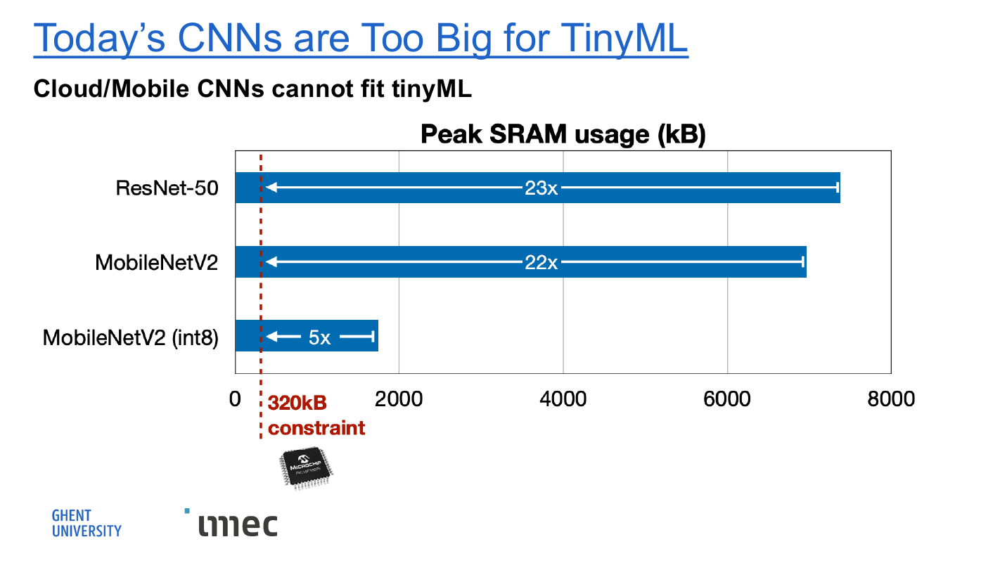

# 🎯 Examen H2 — Overview of Embedded Systems & ML/DL Overflow

> Uitgewerkte antwoorden op de kernvragen van H2 (Lecture 02). Alle info komt **uitsluitend uit de H2-slides/samenvatting**. Volgorde volgt grofweg de slides.
> Vak: Embedded Machine Learning (E061380) — Prof. Adnan Shahid.

---

## 1. Wat is een embedded systeem en hoe werkt het? (3 bouwblokken)

Een embedded systeem is een toestel dat **gespecialiseerd is voor één taak** en bestaat uit **drie bouwblokken in een keten**:

1. **sense (input)** — *analoog*: sensoren meten de fysische wereld (geluid, beeld, beweging, temperatuur…).
2. **process** — *digitaal*: de microcontroller (MCU) verwerkt de gemeten data.
3. **actuate (output)** — *analoog*: het systeem stuurt iets aan (luidspreker, motor, scherm…).

Er is een **terugkoppeling** ("phenomenon"): de actuatie verandert de fysische wereld, die opnieuw gemeten wordt → een **gesloten lus**.

**Voorbeeld — Amazon Echo Dot:** een gewoon consumentenproduct is eigenlijk een embedded systeem:
- sense = de **microfoons**
- process = de **processor-chip** op de PCB
- actuate = de **luidspreker**

**Echt vs. developer embedded systeem:** een *real* embedded system is een op maat ontworpen PCB (geoptimaliseerd voor één product); een *developer* embedded system is een ontwikkelbord zoals de **Arduino Nano 33 BLE Sense** (om te leren/prototypen — dat gebruik je in de labs).

---

## 2. ARM: Cortex-profielen, de M-instructieset, en waarom de M4

**ARM Cortex-profielen** (drie families, geplaatst volgens **vermogen** verticaal en **pipeline-complexiteit** horizontaal):

- **Cortex-A** (Applications) — krachtigst, draait een volledig OS → smartphones/laptops (A5, A9).
- **Cortex-R** (Real-time) — real-time toepassingen (R4, R5, R7).
- **Cortex-M** (Microcontrollers) — laagste vermogen, embedded/TinyML (M0+, M0, M3, M4). **Dit is de relevante familie voor dit vak.**

**De Cortex-M ISA is genest** — elke duurdere core kan alles van de goedkopere, plus extra:
- **M0+/M0** — I/O control + general data processing (basis).
- **M3** — voegt advanced data processing + bit field manipulations toe.
- **M4** — voegt **DSP (SIMD, Fast MAC)** én een **FPU** (floating point unit) toe.

**Waarom is de M4 ideaal voor TinyML?** Een neuron berekenen is een reeks **MAC-operaties** (multiply-accumulate: `a·b + c`, idealiter in 1 klokslag). Matrixvermenigvuldigingen in een NN bestaan volledig uit MAC's, dus een core met een **snelle hardware-MAC** (de M4) draait NN-inferentie veel efficiënter. Daarom gebruikt de **Arduino Nano 33 BLE Sense een Cortex-M4**.

---

## 3. De tech stack (software-lagen op de Nano 33 BLE Sense)

Tussen je ML-code en de chip zitten **meerdere abstractielagen**. Van hoog (applicatie) naar laag (hardware):

| # | Laag | Wat doet ze | Voorbeeld |
|---|---|---|---|
| 1 | **Applicatie** | jouw code die het ML-model gebruikt | "TF Micro Application" |
| 2 | **ML Framework** | library om NN's uit te voeren | TensorFlow Lite Micro (LiteRT Micro) |
| 3 | **Programming framework** | hoge-niveau libs voor sensoren/I/O | **Arduino** |
| 4 | **OS + HAL** | drivers, timing, hardware-abstractie | **mbed OS** (incl. CMSIS-Core, HAL) |
| 5 | **Hardware** | de fysieke chip | Nano 33 BLE Sense (**Cortex-M4**) |

Kort per laag:
- **mbed OS** → embedded OS: drivers, timing, I/O en hardware-abstractie. De **Mbed OS API** geeft gestandaardiseerde functies zodat je app **niet rechtstreeks met registers** hoeft te praten (intern: Mbed OS API → Bare Metal → Drivers HAL → MCU SDK → CMSIS-Core → HW). Naast mbed OS bestaat ook **FreeRTOS**.
- **Arduino** → programmeerlaag met libs om snel hardware aan te sturen.
- **TF Micro Application** → voert de ML-inferentie uit op de microcontroller.

**Waarom zoveel lagen?** Op een MCU heb je **geen Linux/Windows** en **geen luxe** zoals automatische memory management of een filesystem. De stack moet **lichtgewicht en hardware-dicht** zijn — fundamenteel anders dan ML op een PC/cloud.

---

## 4. Waarom moet je resource aware zijn?

Op een MCU is **geheugen het kritische budget**. Het RAM-gebruik tijdens inferentie wordt opgedeeld in blokken (van onder naar boven): **Application Code → LiteRT/TFLite Micro runtime → Model → Working Memory → Audio Buffer.**

Twee inzichten:
- Het **model is maar één deel** van het totale geheugen.
- De **inputdata (audio buffer)** is vaak het **grootste blok** — méér dan het model zelf.

**Resource aware ontwerpen** betekent dus:
- **optimaliseren op meerdere niveaus** — minder compute, minder geheugen, **quantization** gebruiken;
- je ML-systeem **rond de geheugenlimieten** ontwerpen, **niet rond maximale accuracy**.

Extra besparing naast quantization: **onnodige OS-modules verwijderen** (bv. `features/frameworks` bevat test-tools die in elke binary meekomen, 1K RAM + 8K flash). Zo ging mbed OS 5 van 57K → 49K flash en 13K → 12K RAM.

---

## 5. Belangrijkste formules van een neuraal netwerk

**(a) Eén neuron** — neem inputs a₁…a_K, vermenigvuldig met **gewichten** w₁…w_K, tel **bias** b op, en stuur door een **activatiefunctie** σ:

$$z = a_1 w_1 + a_2 w_2 + \dots + a_K w_K + b \quad\Rightarrow\quad a = \sigma(z)$$

(Dit is een **MAC**-operatie — vandaar het belang van de Cortex-M4.)

**(b) Activatiefuncties** — voegen **niet-lineariteit** toe (zonder zou het hele netwerk samenvallen tot één lineaire functie). Gangbaar: **sigmoid** σ(z)=1/(1+e⁻ᶻ), **tanh**, **ReLU** = max(0, z) (standaard in moderne netten), softplus, unit step, sign, (piece-wise) linear.

**(c) Het hele netwerk in matrixvorm** — één geneste functie van matrixvermenigvuldigingen (→ versnelbaar met GPU/DSP):

$$y = f(x) = \sigma\big(W^L \dots \sigma(W^2\,\sigma(W^1 x + b^1) + b^2)\dots + b^L\big)$$

**(d) Softmax (output-laag)** — zet scores z om naar **kansen**:

$$y_i = \frac{e^{z_i}}{\sum_j e^{z_j}}, \qquad \text{met } 0 < y_i < 1 \text{ en } \sum_i y_i = 1$$

Bv. z = [3, 1, −3] → y ≈ [0.88, 0.12, ≈0].

**(e) Cost & total cost (training)** — hoe vind je de parameters θ = {W¹,b¹,…,Wᴸ,bᴸ}?
- **cost per voorbeeld:** L(θ) = fout tussen output en target (Euclidische afstand of cross-entropy).
- **total cost:** $C(\theta) = \sum_r L^r(\theta)$ — hoe slecht presteren de parameters θ op de hele dataset.
- Zoek **θ\*** die C(θ) **minimaliseert** via **gradient descent** (stapsgewijs naar het minimum rollen) + **backpropagation** (forward pass berekent output, backward pass propageert de fout terug → gradiënten). Let op: gradient descent kan in een **lokaal minimum** blijven steken i.p.v. het globale.

---

## 6. De 4 kenmerken van TinyML (waarom is het aantrekkelijk?)

Gekoppeld aan de miljarden IoT-toestellen:

1. **Ubiquitous** — miljarden MCU-gebaseerde IoT-toestellen wereldwijd (groei richting ~50 miljard units).
2. **Low-cost** ($0.1 – $10) — ook lage inkomens krijgen toegang → **democratisering van AI**.
3. **Low-power** (mW) — **green AI**, minder CO₂.
4. **Various applications** — Smart Home, Smart Manufacturing, Personalized Healthcare, Precision Agriculture.

(Plus: lokale inferentie → betere **privacy** en lagere **latency**, want de data verlaat het toestel niet.)

---

## 7. Waarom passen CNN's niet op edge devices / microcontrollers?

**Kernpunt:** standaard CNN's passen niet op een MCU door de **enorme beperking in hardwaremiddelen** — vooral **geheugen (SRAM)** en **opslag (Flash)**, maar ook **compute/energie**.

*Even kort — wat is een CNN?* Input → (**Convolution** + ReLU → Pooling)×meermaals → Flatten → Fully Connected → Softmax → output. De kernoperatie is de **convolutie**: een **input activation** wordt met een **kernel (filter)** geconvolueerd (`*`) → **output activation**. Die activations moeten in het werkgeheugen passen — en net daar wringt het.

**De redenen, op een rij:**

- **① Geheugentekort (SRAM)** — het werkgeheugen voor de **activaties** tijdens inferentie.
  - Een MCU heeft maar ~**320 kB** SRAM → het **activatiegeheugen is 13.000× kleiner dan mobile** en **100.000× kleiner dan cloud**.
  - De **peak SRAM** van gewone netwerken overschrijdt die 320 kB ruim: **ResNet-50 23×**, **MobileNetV2 22×**, en zelfs **MobileNetV2 (int8) nog 5×** te groot.

- **② Beperkte opslag (Flash)** — niet-vluchtig, **statisch**; bevat de **gewichten (weights)**.
  - Een MCU heeft vaak maar ~**1 MB** Flash (cloud gebruikt ~TB/PB), en het **volledige model** moet daarin passen.

- **③ Te grote activatiegrootte** — enkel de modelgrootte verkleinen volstaat *niet*.
  - Veel mobiele optimalisaties verkleinen **alleen de weights**, niet de **activaties**.
  - **MobileNetV2** verkleint wél de model size, maar de **peak activations blijven te groot** voor de SRAM van een MCU.
  - Je moet dus **zowel de weights (→ Flash) als de activations (→ SRAM)** verkleinen.

- **④ Rekenkracht & energie** — CNN's vragen veel compute en energie, terwijl MCU's net ontworpen zijn voor **extreem laag vermogen (milliwatts)**.
  - Een onbewerkt, complex model draaien is onmogelijk zonder technieken zoals **quantization** (32-bit float → 8-bit int, ~4× kleiner).

**De oplossing (TinyML):** gespecialiseerde technieken die **zowel de gewichten als de activaties** verminderen. Voorbeeld: **MCUNet** verkleint béide (6.1× minder parameters **én** 3.4× minder peak activation t.o.v. ResNet-18) → past wél op een MCU, bij **>70% ImageNet top-1**.

> Het detail over het verschil **Flash vs SRAM** staat in de volgende sectie.

---

## 8. Flash vs SRAM

Twee soorten geheugen op een MCU bij het draaien van een netwerk:

| | **Flash** | **SRAM** |
|---|---|---|
| Type | niet-vluchtig, **statisch** | vluchtig, **dynamisch** |
| Bevat | het **model (weights)** | de **activations** (input + output feature maps) |
| Eigenschap | moet het **volledige model** bevatten; ligt vast | verschilt **per laag**; gewichten staan hier *niet* in |
| Waar kijk je naar | totale modelgrootte | de **peak** (max op één moment) |

- **Flash** is statisch: bv. 1 MB flash beschikbaar, model = 900 kB → past.
- **SRAM** is werkgeheugen tijdens inferentie. Je houdt de **input- en output-activations** bij (de feature map die binnenkomt + de nieuwe die berekend wordt). Omdat op één moment maar één laag actief is, kijk je naar het **maximum (peak SRAM)**, **niet** naar de som over alle lagen.

---

## 9. Visual Wake Words (VWW) & Keyword Spotting

**Visual Wake Words (VWW)** — de visuele tegenhanger van "Hey Siri / OK Google":
- een **klein, energiezuinig model** dat enkel detecteert **of er een persoon in beeld is**;
- pas **als** er een persoon gedetecteerd wordt, wordt de **veel grotere** face-recognition-pijplijn geactiveerd;
- omdat de meeste frames "geen persoon" zijn → die blijven idle → **veel energiebesparing**.

**Keyword Spotting** (audio deep learning) — pijplijn:
1. ruw spraaksignaal → opgedeeld in **overlappende frames** (lengte *l*, stride *s*);
2. **feature extraction**: tijdsdomein → **frequentiedomein** (spectrogram / coëfficiënten);
3. **neuraal netwerk** → kansen per klasse ("Yes" 0.91, "No" 0.02, …).

**Waarom feature-extractie?** Ruwe audio is **te groot en niet ideaal** als directe NN-input; de frequentie-representatie is compacter en informatiever.

---

## 10. Anomaly Detection met een autoencoder

**Wat is een autoencoder?** Een NN dat **zijn eigen input reconstrueert** (ideaal: x' = x), via **Encoder → Code vector → Decoder**. De encoder perst de input samen tot een compacte code, de decoder bouwt ze weer op.

**Werkwijze (train vs inference):**
- **Training:** minimaliseer de **reconstruction error** op **normale** data (het netwerk leert normale data goed reconstrueren).
- **Inference:** voer live data in en bereken de reconstructiefout; **als (error > threshold) → anomaly** (abnormale data wordt slecht gereconstrueerd, want het netwerk heeft die nooit goed leren reconstrueren).

**3 eigenschappen van een autoencoder:**
1. **Unsupervised** — geen labels nodig (je traint enkel op normale data).
2. **Data-specific** — werkt enkel op data gelijkaardig aan de trainingset.
3. **Lossy** — de output is nooit exact gelijk aan de input.

**3 gangbare approaches voor anomaliedetectie:** **K-means**, **Autoencoders**, **GMMs** (Gaussian Mixture Models).

**Toepassingsdomeinen:** video surveillance, health care, fraude/aanvallen voorkomen, industriële defecten (bv. dataset **MVTec**). Voorbeeld uit het vak: defecte **ventilator** detecteren met de Arduino Nano 33 BLE Sense.

---

## 11. AI-infrastructuur (de 4 lagen)

De volledige ML-keten rust op **AI Infrastructure**, opgebouwd uit vier lagen:

1. **Data Engineering**
2. **Model Engineering**
3. **Model Deployment**
4. **Product Analytics**

De inputkant zijn **sensoren**, ingedeeld in: **Acoustic** (Ultrasonic, Microphones, Geophones, Vibrometers), **Image** (Thermal, Image), **Motion** (Gyroscope, Radar, Accelerometer).

Belangrijk inzicht: de **eigenlijke ML-code is maar een klein onderdeel** — eromheen zit veel infrastructuur (data collection/preprocessing/verification, feature engineering, configuration, automation, debugging, optimization, model analysis, process & resource management, serving, monitoring, metadata management).

*(Stappen per laag, voor de volledigheid:* Data Engineering = requirements → collect → label → clean → prepare → augment → more data; Model Engineering = train → speed → target metrics → evaluate → optimize → SOTA; Model Deployment = conversion → performance → energy-aware → security/privacy → inference APIs → on-device fine-tuning; Product Analysis = dashboards → field data evaluation → value-added → improvements.*)*

---

## 12. Welk framework/tool waar? (TensorFlow → LiteRT → LiteRT Micro)

Verschillende frameworks dekken verschillende stappen van de workflow:

- **TensorFlow:** Collect Data → Preprocess → Design → **Train**.
- **LiteRT:** Evaluate/Optimize → Convert → Deploy.
- **LiteRT Micro:** **Make Inferences** (op de MCU).

**Het proces (de pijplijn):**

$$\textbf{TF model} \;\rightarrow\; \textbf{.tflite} \;\rightarrow\; \textbf{C-array} \;\rightarrow\; \textbf{MCU}$$

1. **Training** in **TensorFlow**.
2. **Conversion** → een **`.tflite`**-bestand (LiteRT-formaat).
3. **Array modeling** → het `.tflite`-model wordt omgezet naar een **C-array** en op de **MCU** (Arduino) geplaatst, die dan **inference/learning op real-time data** doet.

➡️ **"Micro" staat enkel bij de inferentiestap**: de microcontroller is **enkel bij inferentie** betrokken — alles ervóór (data verzamelen, trainen, converteren, deployen) gebeurt op een krachtigere machine.

**Wat hebben ze gemeen?** Alle drie (1) geoptimaliseerd voor de **resource-constraints** van embedded toestellen, (2) **importeren modellen** uit een apart trainings-framework, (3) gebruiken **C of C++**.

**Vergelijkingstabellen (de trend richting TinyML):**

| | TensorFlow | LiteRT | LiteRT Micro |
|---|---|---|---|
| Training / Inference | train + inferentie | deploy + efficiënte inferentie | **enkel inferentie** |
| **#Ops** | ~1400 | ~130 | **~50** |
| **Needs an OS** | Yes | Yes | **No** (bare metal) |
| **Base binary** | 3 MB+ | 100 KB | **~10 KB** |
| **Footprint** | ~5 MB | 300 KB | **20 KB** |
| **Quantization tooling** | No | Yes | Yes |
| **Geoptimaliseerd voor** | x86 / TPU / GPU | Arm Cortex-A / x86 | **Arm Cortex-M / DSP / MCU** |

Trend: **minder ondersteunde operatoren**, maar **efficiëntere inferentie**, **kleinere footprint**, ingebouwde **quantization** en **geen OS** nodig.

---

## 13. ML Lifecycle

De volledige levenscyclus is een **lus, geen rechte lijn**:

**Data Collection → Data Ingestion → Data Analysis/Curation → Data Labelling → Data Validation → Data Preparation → Model Training → Model Evaluation → ML System Validation → ML System Deployment →** (online performance/data feeds terug naar Data Collection).

Twee **terugkoppellussen** bovenaan:
- **DATA FIXES** — problemen in de bestaande data corrigeren.
- **DATA NEEDS** — nieuwe data verzamelen daar waar het model tekortschiet.

Waarom een lus? Na deployment voeden de **live data en prestaties terug** naar het begin → het systeem **verbetert continu**.

> **Let op het verschil met de ML *workflow* (§8):** de **workflow** is de min of meer lineaire reeks stappen + welk framework wat doet; de **lifecycle** benadrukt dat het geheel een **cyclische, zelf-verbeterende lus** is met data-terugkoppeling.

---

# ➕ Extra kernpunten die je lijst niet expliciet noemt (maar examen-waardig zijn)

**A. De geheugenhiërarchie Cloud → Mobile → Tiny.** Dé centrale tabel van het hoofdstuk:

| | Cloud AI | Mobile AI | Tiny AI |
|---|---|---|---|
| Memory (Activation) | 32 GB | 4 GB | **320 kB** |
| Storage (Weights) | ~TB/PB | 256 GB | **1 MB** |

Tiny AI = **13.000× kleiner dan mobile** en **100.000× kleiner dan cloud** qua activatiegeheugen → daarom moet je **zowel weights als activations** verkleinen.

**B. TinyML-constraints verschillen van Mobile AI.** Mobile heeft een **latency-** en **energy-constraint**; TinyML heeft die óók, maar **bovenop een harde memory-constraint**. Dat extra, bindende knelpunt maakt TinyML **wezenlijk moeilijker** dan mobiele AI. (Zie aparte vraag: *"Waarom is TinyML challenging?"*)

**C. Quantization** = getallen met hoge precisie omzetten naar lagere precisie (**32-bit float → 8-bit int**) → model én activaties ~**4×** kleiner. Met **int4** haal je zelfs ImageNet-niveau op een MCU. Dé centrale truc om binnen het geheugenbudget te blijven.

**D. MCUNet vs MobileNetV2** (komt overal terug — ken dit goed):
- **MobileNetV2** verkleint **enkel de model size** → peak activation blijft te groot (int8 nog 5× te groot).
- **MCUNet** verkleint **model én peak activation** (6.1× minder params, 3.4× minder peak activation t.o.v. ResNet-18) → **eerste >70% ImageNet op commerciële MCU** (70.7% op STM32H743, +17% t.o.v. MobileNetV2+CMSIS-NN).

**E. "Today's AI is too Big".** Modellen groeien exponentieel: Transformer (0.05B) → BERT (0.34B) → GPT-2 (1.5B) → **GPT-3 (175B params, 355 GPU-jaren, ~$4.6M)**. AlphaGo: 1920 CPU's + 280 GPU's. → motivatie voor **TinyML & Green AI**.

---

> ⚠️ **Disclaimer examen:** het exacte examenformat staat **niet** in de slides. Wat wél bekend is (uit Lecture 01): **theorie 75% / labs 25%**, en *"sommige labo-oefeningen kunnen direct examenstof zijn"*. Verifieer bij twijfel bij de lesgever.
