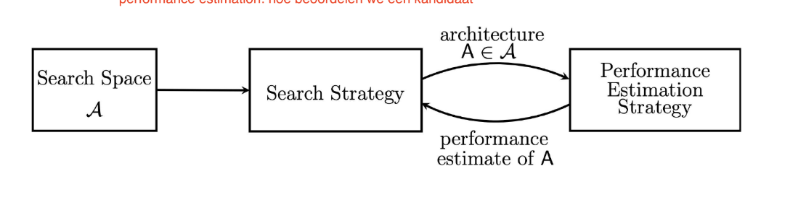

# 🎯 Examen H7 — Neural Architecture Search (NAS)

> Examen-oefenbestand voor H7 (de slides heten "Lecture – 06", in de bestandsnummering H7). Alle info komt **uitsluitend uit de H7-slides/samenvatting**.
> **Opzet:** per onderwerp (= de titel) een kort, gestructureerd antwoord om van te leren. Volgorde volgt jouw lijst.
> Vak: Embedded Machine Learning (E061380) — Prof. Adnan Shahid.

---

## 1. Rekenkost van een convolutie (formule)

**Antwoord:** Met `c_o` = output channels, `cᵢ` = input channels, `k_h·k_w` = kernelgrootte, `h_o·w_o` = output-resolutie:

$$\text{MACs} = c_o \cdot c_i \cdot k_h \cdot k_w \cdot h_o \cdot w_o$$

- c_0 = aantal filters
- c_i = input channels
- k_h = kernel height
- k_w = kernel width
- h_o = output height
- w_o = output width

Lees het als **"aantal output-waarden × kost per output-waarde"**:
- `h_o · w_o` = aantal output-posities (elke pixel van de output).
- `c_o · cᵢ · k_h · k_w` = kost per positie: voor elk van de `c_o` output channels een dot-product over `cᵢ` input channels × `k_h·k_w` kernel-pixels.

Een conv is dus een fully-connected laag (`c_o·cᵢ`) die je herhaalt over elke output-pixel (`h_o·w_o`) en uitbreidt met een ruimtelijk venster (`k_h·k_w`). *(Op deze formule komt de rest van het hoofdstuk steeds terug.)*

---

## 2. De verschillende lagen/convoluties en hun kost

**Antwoord:**

| Laag | MACs | Wat het doet |
|---|---|---|
| **Fully-connected / linear** | `c_o · cᵢ` | elke input met elke output verbinden (één matrix-vector-product) |
| **Gewone convolutie** | `c_o · cᵢ · k_h · k_w · h_o · w_o` | spatial filtering **én** channel mixing tegelijk → duurst |
| **Grouped convolutie** | `c_o · cᵢ · k_h · k_w · h_o · w_o / g` | channels in `g` groepen die enkel binnen hun groep werken → **kost ÷ g** |
| **Depthwise convolutie** | `c_o · k_h · k_w · h_o · w_o` | uiterste grouped (`g = cᵢ = c_o`): één filter per channel → **factor `cᵢ` verdwijnt** |
| **1×1 (pointwise) conv** | `c_o · cᵢ · h_o · w_o` | `k_h=k_w=1`: kijkt niet ruimtelijk, mixt enkel channels per pixel |

**Toelichting:**
- **Grouped:** per groep `c_o/g` outputs die maar naar `cᵢ/g` inputs kijken; `g` groepen → de `g` valt netto één keer weg → `/g`. Meer groepen = goedkoper, maar minder channel-menging.
- **Depthwise:** vul `g = cᵢ` in de grouped-formule → de hele `cᵢ`-factor schrapt. Elke input channel krijgt eigen kernel + eigen output channel. **Spatial filtering, geen channel mixing.**
- **1×1:** kernel = 1 pixel → geen ruimtelijke context, enkel een fully-connected mix over channels. Dé manier om channels te **reduceren / uitbreiden / mengen**.

---

## 3. Waarom zijn de efficiënte blokken goedkoper? (de kernconclusie)

**Antwoord:** Een gewone conv combineert tegelijk:
1. **Spatial filtering** — kijken naar de ruimtelijke buurt (de `k_h·k_w`-factor).
2. **Channel mixing** — alle input channels combineren (de `cᵢ`-factor).

Die twee samen (`cᵢ · k_h · k_w` per output) maken ze duur. **Het trucje: ontkoppel ruimte en channels** over twee goedkopere operaties:
- **Depthwise conv** doet *alleen* spatial filtering (mist `cᵢ`).
- **1×1 conv** doet *alleen* channel mixing (mist `k_h·k_w`).

Eerst depthwise, dan 1×1 → samen benader je een gewone conv tegen een fractie van de kost. Dat inzicht — "ontkoppel ruimte en channels" — keert in élk efficiënt blok terug.

---

## 4. Het ResNet-blok + de skip-verbinding

**Antwoord:** Dit is het **(ResNet-)bottleneck-blok**. Het idee: **goedkoop knijpen → duur werk klein doen → terug uitbreiden**:
1. **1×1 conv reduce** — channels ÷4 (2048 → 512).
2. **3×3 conv** op het gereduceerde kanaal (512 → 512) — hier gebeurt de ruimtelijke filtering, maar op 4× minder channels.
3. **1×1 conv expand** — terug naar 2048 zodat het blok past.

**Reductiefactor** (× H·W telkens weggelaten):
- Bottleneck-som: `2048·512·1` (reduce) + `512·512·9` (3×3) + `2048·512·1` (expand)
- Met `2048 = 4·512` → `512·512·(4 + 9 + 4) = 512·512·17`
- Naïeve 3×3 conv 2048→2048: `2048·2048·9 = 512·512·144`
- Verhouding: `144 / 17 ≈ `**`8.5× minder MACs`** (accuracy blijft behouden of stijgt licht)

**De extra verbinding = de residual (skip) connection** (input wordt bij de output opgeteld, de `+`):
- Het blok hoeft enkel het **verschil (residu)** t.o.v. de input te leren i.p.v. de volledige transformatie.
- → **heel diepe netwerken worden traineerbaar** (geen vanishing-gradient-instorting): de gradiënt stroomt via de skip ongehinderd terug.

---

## 5. Het depthwise-separable blok

**Antwoord:** Het **depthwise-separable blok** (MobileNet). Het past de "ontkoppel ruimte en channels"-truc letterlijk toe:
1. **3×3 depthwise conv** → **spatial filtering** per channel (lokale patronen binnen elk kanaal, geen menging).
2. **1×1 pointwise conv** → **channel mixing** (informatie uitwisselen tussen channels).

**Hoeveel goedkoper?**
- Gewone 3×3 conv: `c_o·cᵢ·9·HW`
- Separable: `cᵢ·9·HW` (depthwise) + `c_o·cᵢ·HW` (1×1) = `cᵢ·HW·(9 + c_o)`
- Verhouding nadert `1/9 + 1/c_o` → bij grote `c_o` **~8–9× minder rekenwerk** voor bijna dezelfde functie.

---

## 6. Het inverted-bottleneck blok

**Antwoord:** Het **inverted-bottleneck blok** (MobileNetV2) — letterlijk de omgekeerde volgorde van ResNet (eerst breder i.p.v. smaller):
1. **1×1 expand** (N → N·6) — tijdelijk veel méér channels.
2. **3×3 depthwise conv** op dat brede kanaal — ruimtelijke filtering met veel "werkruimte".
3. **1×1 project** (N·6 → N) — terug naar smal.

**Waarom expanden mag:** de depthwise-kost groeit maar **lineair** (MAC) met het aantal channels (geen `cᵢ`-factor!), dus het is betaalbaar om de depthwise breed te doen. Zo krijgt het goedkope depthwise-deel toch genoeg capaciteit.

**Het nadeel (belangrijk examenpunt):** door tijdelijk naar N·6 channels te expanden ontstaan **grote tussenliggende activation-tensors** (moeten in het geheugen blijven, zeker bij training voor de backward pass):
- → **compute-efficient maar niet memory-efficient**.
- MobileNetV2: ~4× minder *parameters* dan ResNet, maar ~1.8× **grotere peak activation**.
- Les: **weinig parameters ≠ weinig geheugen** — op microcontrollers is net die peak activation vaak de echte bottleneck.

---

## 7. Het shuffle-blok

**Antwoord:** Dit is **ShuffleNet**. Het vervangt de dure 1×1 conv door een **1×1 group conv** (kost ÷ g).

**Het nieuwe probleem:** als élke laag in groepen werkt, praten de groepen nooit met elkaar — informatie blijft in zijn eigen "koker" en het netwerk verliest representatiekracht.

**De oplossing = channel shuffle:** na de eerste group conv worden de channels **herschikt (door elkaar gehusseld)**, zodat de volgende group conv inputs uit *alle* vorige groepen ziet. Zo herstel je de informatie-uitwisseling tussen groepen, zonder de kost van een volle 1×1 conv.

---

## 8. De evolutie van de bouwblokken (het "proces")

**Antwoord:** elke stap fixt het pijnpunt van de vorige.

1. **Gewone 3×3 conv** — peperduur op brede channels (`cᵢ·k·k` per output).

2. **Bottleneck (ResNet)**
   - *fix:* 1×1 reduce → 3×3 → 1×1 expand → dure 3×3 op smal kanaal (~8.5×).

3. **Grouped bottleneck (ResNeXt)**
   - *probleem:* de middelste 3×3 blijft het duurste stuk.
   - *fix:* maak de 3×3 een **grouped conv** → nog eens ÷g goedkoper.
   - *(grouped conv ≡ **multi-path blok**; aantal parallelle paden = **cardinality**, een knop naast diepte/breedte.)*

4. **Depthwise-separable (MobileNet)**
   - *probleem:* grouped is half werk, elke groep ziet nog meerdere channels.
   - *fix:* trek door tot het extreme (`g = #channels`) → depthwise (1 filter/channel); geen channel-mixing meer → voeg **1×1 pointwise** toe.
   - *resultaat:* depthwise = spatial, 1×1 = channel mixing.

5. **Inverted bottleneck (MobileNetV2)**
   - *probleem:* depthwise heeft lage capaciteit.
   - *fix:* eerst **expanden** (kan, want depthwise-kost is lineair): 1×1 expand → 3×3 depthwise → 1×1 project.
   - *("inverted" = omgekeerd van ResNet.)*

6. **Group 1×1 + channel shuffle (ShuffleNet)**
   - *probleem:* de 1×1 convs zijn nu het duurst → *fix 1:* maak ook de 1×1 een group conv (÷g).
   - *probleem 2:* groepen praten niet → *fix 2:* **channel shuffle**.

**Rode draad:** elke stap ontkoppelt of splitst spatial filtering en channel mixing verder.

---

## 9. Wat is NAS en hoe werkt het?

**Antwoord:** **Neural Architecture Search (NAS)** = **automatisch zoeken naar een goede netwerk-architectuur in een vooraf gedefinieerde zoekruimte**, die de objective (accuracy, efficiency, of een combinatie) maximaliseert. Drie componenten **in een lus**:

- **Search space** — welke architecturen *mogelijk* zijn.
- **Search strategy** — *hoe* je door die ruimte zoekt (welke kandidaat kies je).
- **Performance estimation strategy** — *hoe* je een kandidaat beoordeelt (accuracy, en bij hardware-aware NAS ook latency).

De strategy kiest een kandidaat, de estimation scoort die, en de score stuurt de volgende keuze → zo "leert" de zoekmachine waar de goede architecturen zitten. Elk van de drie is een ontwerpkeuze op zich.

---

## 10. De zoekruimte: netwerk-niveau (5 dimensies) en cel-niveau

**Antwoord:**

**Netwerk-niveau** — varieer dimensies van de volledige structuur. De **5 knoppen**:
1. **Depth** (aantal blokken per stage) — dieper = meer capaciteit, maar trager.
2. **Resolution** (inputgrootte) — meer detail/accuracy, maar kost groeit **kwadratisch** (`h_o·w_o`).
3. **Width** (aantal channels per stage) — meer capaciteit, maar kost groeit **kwadratisch** (`c_o·cᵢ`).
4. **Kernel size** (bv. 3×3/5×5/7×7) — grotere receptieve buurt (meer context), maar duurder (`k_h·k_w`).
5. **Topology / connecties** — waar je downsample/upsample, welke skip connections, welke resolutiepaden (bekende handontwerpen zoals U-Net/DeepLab blijken specifieke paden te zijn).

**Cel-niveau** — zoek niet het hele netwerk, maar één klein herbruikbaar **blok (cel)** dat je daarna **N keer stapelt** in een vast skelet (afwisselend Normal Cells die de resolutie behouden en Reduction Cells die downsamplen). 
*Hoe gegenereerd:* een **RNN-controller** bouwt de cel stap voor stap (B keer): 
(1) kies twee inputs, 
(2) kies voor elk een operatie (conv/pooling/identity), 
(3) kies hoe je ze combineert (bv. add). *Voordeel:* veel kleinere zoekruimte (één cel i.p.v. honderden lagen) en schaalbaar (meer cellen = groter netwerk).

---

## 11. De zoekruimte zelf ontwerpen (TinyNAS): 2 stappen + FLOPs/geheugen

**Antwoord:** Dit is **TinyNAS (uit MCUNet)**. Een slecht gekozen ruimte bevat domweg geen goede modellen, hoe goed je ook zoekt. Twee fasen:
1. **Automated search space optimization** — eerst automatisch *afbakenen* welk deel van de gigantische ruimte de moeite waard is voor jouw constraint.
2. **Resource-constrained model specialization** — *daarna* binnen die afbakening het beste concrete model zoeken.

→ Je optimaliseert dus eerst *waar* je zoekt, dan *wat* je kiest.

**Waarom geheugen bijzonder is:**
- Op mobiel: vooral **latency** en **energy** (trade-offs).
- Op een MCU komt **memory** erbij als **harde ja/nee-grens** — het model past er gewoon niet in.
- Ordes van grootte:
  - SRAM: 16 GB (cloud) → 4 GB (telefoon) → **320 kB** (MCU) — ~3100× kleiner
  - Flash: TB~PB → >64 GB → **1 MB** — ~64000× kleiner
- Zelfs MobileNetV2-int8 (1.7 MB) past niet → ontwerp van bij het begin binnen de grens.

**Hoe weet je of een ruimte goed is? → de FLOPs-verdeling.**
- Redenering: **meer FLOPs → meer capaciteit → wellicht hogere accuracy**, maar enkel onder de geheugengrens.
- Kies de configuratie waarvan de cumulatieve FLOPs-curve het **verst naar rechts** ligt (de "rijkste" modellen die nog passen).
- Meetbaar: geoptimaliseerde ruimte **78.7%** vs. willekeurige 74.7% vs. te grote 77.0%.
- Conclusie: **betere search space → betere accuracy**, nog vóór je zoekt.

---

## 12. De vijf zoekstrategieën (+ voor/nadelen)

**Antwoord:**

| Strategie | Hoe | Voordeel | Nadeel |
|---|---|---|---|
| **Grid search** | rooster over alle keuzes, test **alle** combinaties | volledig/grondig | **combinatorische explosie** (`kᵈ`) → snel onhaalbaar |
| **Random search** | willekeurige kandidaten trekken | verrassend sterke **baseline**, simpel | geen sturing; "stom" |
| **Reinforcement learning** | RNN-controller bouwt architectuur stap voor stap, accuracy = **reward** | leert gerichte keuzes | **extreem duur** (elk model trainen → 1000en GPU-dagen) |
| **Gradient descent (DARTS)** | maakt discrete keuze differentieerbaar via **continue gewichten α** (mix van alle ops) | veel sneller (1× trainen i.p.v. 1000en) | hoog **geheugen/rekengebruik** tijdens search (alle ops tegelijk) |
| **Evolutionary search** | populatie evolueert via **fitness + mutation + crossover** | flexibel, constraints makkelijk in fitness | veel evaluaties nodig |

**Extra info die vermeld werd:**
- **Grid → EfficientNet (compound scaling):** schaal **depth, width én resolution samen** in een vaste verhouding (i.p.v. één dimensie maximaliseren). De verhouding zoek je één keer; concreet: "maak het model 2× duurder qua FLOPs en verdeel die extra rekenkracht optimaal over de drie".
- **Random:** dé baseline — als je fancy methode random niet verslaat, doet ze niets nuttigs.
- **RL:** zie architectuurbouw als reeks beslissingen → RNN-controller.
- **DARTS:** kies op het einde per plek de operatie met het hoogste gewicht; kan **latency-aware** gemaakt worden (latency-term in de loss → ProxylessNAS).
- **Evolutionary:** **mutation** = kleine wijziging aan één architectuur (stage dieper/ondieper, kernel 3×3→5×5, andere expansion ratio); **crossover** = twee parents combineren (per laag operator van parent 1 of 2); **fitness function** = accuracy + efficiency/latency + constraints → stuurt de evolutie richting efficiënte modellen.

---

## 13. Waarom het aantal MACs niet de echte efficiëntie is

**Antwoord:** **MACs ≠ echte hardware-efficiëntie.** MACs tellen enkel vermenigvuldigingen, maar de echte latency hangt ook af van **geheugentoegang, parallellisme, en hoe goed een operatie op de chip "mapt"**.
- **Voorbeeld:** NASNet-A / AmoebaNet-A hebben gelijkaardige MACs als MobileNetV2 maar **veel hogere latency** ("fewer MACs, but higher latency!").
- **Hardware-afhankelijk:** bij gelijke FLOPs geeft *hidden-dimension scaling* een andere latency-curve dan *layer-number scaling*. Concreet: hidden-dimension opschalen maakt een **Raspberry Pi (ARM CPU) veel trager**, terwijl een **Nvidia GPU er nauwelijks last van heeft** (genoeg parallellisme om het te verbergen).

→ Gevolg: een algemene MAC-/FLOP-telling "liegt"; je moet de **echte latency** in de zoeklus brengen en **per hardware** optimaliseren.

---

## 14. Hardware-feedback: latency in de zoeklus brengen

Dit valt uiteen in drie deelvragen.

### 14a. Waarom is "gewoon meten" niet de juiste aanpak?

**Antwoord:** De voor de hand liggende manier is **latency echt meten op het device**. Dat geeft de waarheid, maar is **traag** (elke kandidaat moet je echt timen) en **duur** (je hebt veel fysieke devices nodig, en moet duizenden architecturen meten). In een zoeklus met miljoenen kandidaten is dat onhaalbaar.

### 14b. Hoe los je dat op?

**Antwoord:** **Latency *voorspellen*.** Meet *één keer* een hoop architecturen op het echte device → dat is je **latency-dataset** → train daarmee een goedkoop model dat latency voorspelt. In de NAS-lus gebruik je voortaan die **predicted latency** (snel en goedkoop).

### 14c. Layer-wise vs. network-wise voorspelling

**Antwoord:**
- **(a) Layer-wise → latency lookup table.** Meet de latency van elke individuele operatie en zet ze in een tabel `{Op1: latency, Op2: latency, …}`. De latency van een hele architectuur ≈ de **som** van de laag-latencies. *Voordeel:* simpel en snel; voorspeld vs. echt ligt netjes op de **y = x**-lijn. *Beperking:* puur additief — vat geen overhead/geheugengedrag.
- **(b) Network-wise → latency prediction model.** Een klein NN'tje dat architectuur-kenmerken (kernel size, width, resolution, …) als input neemt en direct de **volledige predicted latency** teruggeeft. *Voordeel:* kan ook **niet-additieve effecten** (overhead, geheugengedrag) leren.

*(Resultaat van direct + latency-aware zoeken — ProxylessNAS: een per-hardware gespecialiseerd model is ~**1.83× sneller**; geen enkel model is optimaal op álle hardware, want een GPU-model is traag op CPU en omgekeerd → specialiseer per target.)*

---

## 15. Once-for-All (OFA): motivatie + 3 pijlers + schaal

**Antwoord:** **Once-for-All (OFA).**

**Motivatie:** elke kandidaat vanaf nul trainen ≈ 1 dag/model × 1000 kandidaten × elke nieuwe hardware → onbetaalbaar én slechte CO₂-footprint. OFA vervangt dit door **één keer** een groot "once-for-all"-netwerk te trainen, waarna je er **sub-netwerken uit sampelt** die al getraind zijn (evalueren duurt **seconden**, geen hertraining).

**De drie pijlers (kerngedachte):**
1. **Train once, get many** — één groot supernet bevat heel veel **child networks die de gewichten delen**; samen (joint) getraind.
2. **Reduce design cost** — de dure trainingskost wordt geamortiseerd over al die child nets; per nieuwe hardware doe je enkel nog de goedkope sample-stap.
3. **Fit diverse hardware constraints** — de **gewichten zijn hardware-agnostisch** (gewoon getallen); wat hardware-specifiek is, is **welk sub-netwerk** (depth/width/kernel) je eruit haalt, afgestemd op de latency-constraint van die chip.

**De schaal:** één OFA-netwerk bevat in de praktijk **~10¹⁹ child networks** tegelijk (gedeelde gewichten, joint getraind).

**Extra:** uit één getraind OFA-net haal je zonder hertrainen gespecialiseerde sub-nets voor GPU's (H100/4090/Jetson), MCU's met verschillend geheugen (512/320/256 kB), telefoons — en zelfs verschillende **batterijtoestanden** van hetzelfde toestel (runtime een kleiner sub-net kiezen als de batterij leegloopt).

---

## 16. Progressive shrinking (hoe OFA getraind wordt)

**Antwoord:** De techniek heet **progressive shrinking**. *Waarom niet alles tegelijk:* grote en kleine varianten "vechten" om dezelfde gewichten → slechte training. Daarom train je eerst het **volledige, grootste** netwerk goed, en sta je *daarna geleidelijk* steeds kleinere varianten toe (telkens vertrekkend van de al-getrainde grote).

**De volgorde (4 stappen):** **Elastic Resolution → Elastic Kernel Size → Elastic Depth → Elastic Width** (telkens van "Full" naar "Partial"):
1. **Elastic resolution** — laat het netwerk met **meerdere inputresoluties** werken (random sample van de inputgrootte per batch).
2. **Elastic kernel size** — een kleinere kernel (5×5, 3×3) neemt de **gecentreerde gewichten** van de grote (7×7) over via een geleerde **transformatie-matrix** die de centrale gewichten herweegt (i.p.v. de rand zomaar weg te knippen).
3. **Elastic depth** — laat toe dat de **laatste lagen van een unit overgeslagen** worden; het ondiepe sub-net deelt de eerste lagen met het diepe.
4. **Elastic width** — krimp de breedte maar **behoud de belangrijkste channels** via **channel sorting** (importance-score → sorteren → bovenste behouden).

---

## 17. Roofline-analyse

**Antwoord:** De **roofline-analyse** ("computation is cheap; memory is expensive"). Ze zet **performance (GOPS/s)** uit tegen **arithmetic intensity (Ops/Byte)** = hoeveel rekenwerk je doet per byte geheugentoegang.
- Modellen **links** = *memory-bound* (geheugen is de flessenhals); **rechts** = *compute-bound*.
- Een model met **hogere arithmetic intensity** is **minder memory-bound** → haalt **hogere utilization en performance op dezelfde hardware**.

Het OFA-model heeft een hogere arithmetic intensity → bv. op een Xilinx ZU3EG FPGA **76 vs. 48 GOPS/s** voor MobileNetV2, zonder de RTL te wijzigen. Het generaliseert: op alle geteste platforms ligt de OFA accuracy-vs-latency-curve **boven** die van MobileNetV2/V3.

---

# ➕ Extra vragen — zaken die je lijst niet expliciet noemt (maar examen-waardig zijn)

**V-A. De vier conflicterende doelen van embedded ML.**

**Antwoord:** De vierhoek **Storage ↔ Latency ↔ Energy ↔ Accuracy** (ze trekken aan elkaar):
- Hogere accuracy → meestal groter netwerk → meer storage, hogere latency, meer energie.
- Lagere latency/energie → kleiner/simpeler → meestal wat accuracy-verlies.
- Geen gratis lunch: je kiest een punt op de trade-off-curve.
- **Rol van NAS:** gegeven jouw constraints (bv. "max 100 ms op deze chip") automatisch het beste haalbare accuracy-punt zoeken.

**V-B. Proxy task & ProxylessNAS.**

**Antwoord:**
- **Proxy task** = goedkopere surrogaattaak (CIFAR-10, ingekort netwerk); men hoopt dat het resultaat overdraagt.
- **Probleem:** een winnaar op de proxy is **niet noodzakelijk** een winnaar op de echte taak/hardware.
- **ProxylessNAS:** schrapt de proxy → zoekt **direct op de echte target task + hardware**.
- **Hoe betaalbaar:** bouwt voort op DARTS (alle ops tegelijk) maar **binariseert de paden** → per stap maar **één** pad actief → geheugen **O(N) → O(1)**.

**V-C. Case study als brug (interference cancellation).**

**Antwoord:** **Interference cancellation** (signaalscheiding van overlappende radiosignalen). Eigen modellen (U-Net met LSTM = M1; volledig convolutioneel = M2) halen MSE ~43–44 met ~124–132M MACs, terwijl WaveNet maar 25.45 haalt met **16 miljard** MACs (~130× meer rekenwerk, slechter resultaat). De `(Dw)`-varianten (depthwise) halveren de MACs nog eens, de `(Q)`-varianten (quantized) drukken de grootte (3.78 → 1.90 MB). **Les:** een slim ontworpen klein netwerk verslaat een log groot netwerk op álle assen — en dat is net wat NAS automatiseert.

---

> ⚠️ **Disclaimer examen:** het exacte examenformat staat **niet** in de slides. Wat wél bekend is (uit Lecture 01): **theorie 75% / labs 25%**, en *"sommige labo-oefeningen kunnen direct examenstof zijn"*. Verifieer bij twijfel bij de lesgever.
