# Hoofdstuk 1 — Introduction (Embedded Machine Learning, E061380)

> Vak: **Embedded Machine Learning** (E061380), Semester 2, 2025–2026 — Prof. Adnan Shahid (UGent / imec, IDLAB).
> Deze samenvatting volgt de volgorde van de slides. Materiaal gebaseerd op MIT 6.5940 (Han Lab, efficientml.ai), Harvard TinyMLedu en mlsysbook.ai.

---

## 1. Waar gaat het vak over?

De **centrale vraag** van het vak: deep learning werkt fantastisch, maar de modellen zijn **rekenkundig duur**. Hoe maak je ze **klein, licht en snel** genoeg om op beperkte hardware (telefoons, microcontrollers, edge devices) te draaien — zonder veel nauwkeurigheid te verliezen?

Het vak zit op het kruispunt van **Algorithm ↔ System** en **Computer Science ↔ Electronics Engineering**, en bestaat uit twee delen:

- **Part A — Efficient Inference:** pruning, quantization, neural architecture search (NAS), knowledge distillation.
- **Part B — Efficient Training:** distributed training, on-device training, federated learning.

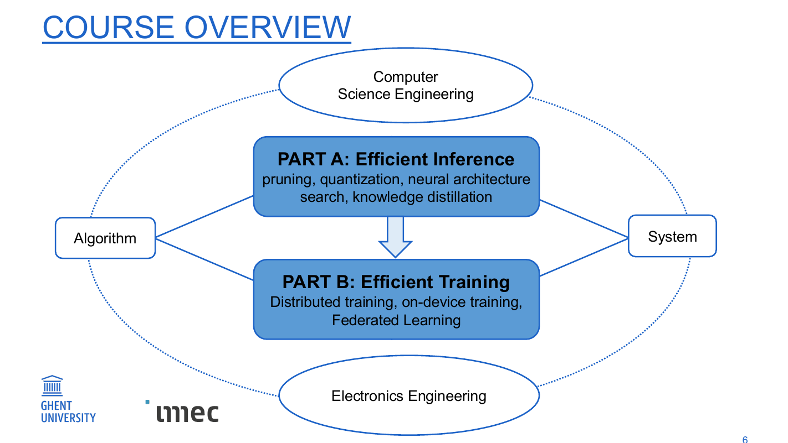

### Lesplan en evaluatie

De theorielessen wisselen af met labsessies. Pruning/quantization en het lab op de **Arduino Nano 33 BLE** zijn kern-onderdelen.

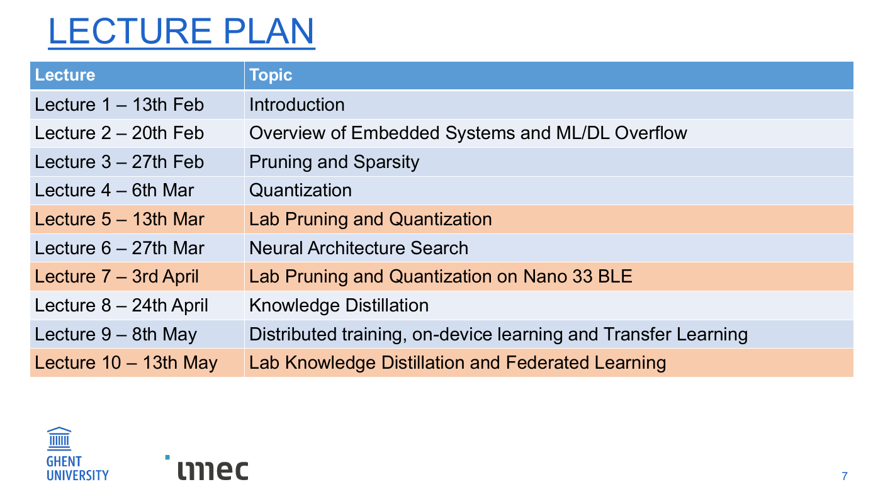

**Weging:** Theorie **75%**, Labs **25%**. Het wordt sterk aangeraden om zowel lessen (er worden oefeningen in de les gemaakt) als labs (sommige labo-oefeningen zijn direct examenstof) te volgen. De regels voor het labwerk worden uitgelegd in Lecture 5 (13 maart).

---

## 2. Het kernprobleem: Model Compression & Efficient AI

De **modelgrootte groeit exponentieel** (van Transformer 0.05B → GPT-3 175B → MT-NLG 530B parameters), maar het **geheugen van accelerators** (GPU's/TPU's) groeit veel trager. Daardoor ontstaat er een steeds grotere **"gap"** tussen wat modellen vragen en wat hardware aankan.

➡️ **Model compression overbrugt die kloof** tussen vraag en aanbod van AI-rekenkracht.

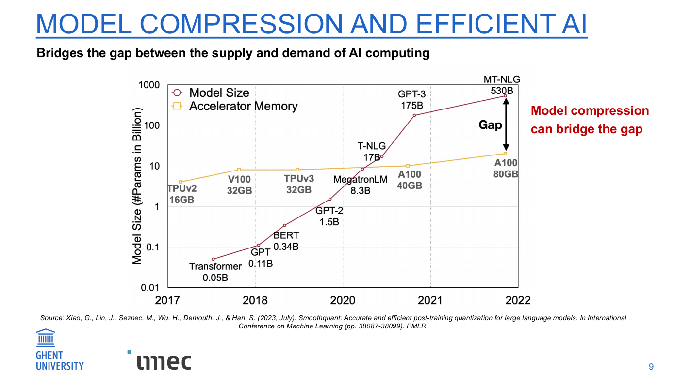

Concreet voeg je tussen **training** en **inference** een extra stap toe: **model compression** (pruning, sparsity, quantization, …). Je traint één keer een groot model en comprimeert het dan tot iets dat efficiënt kan inferen.

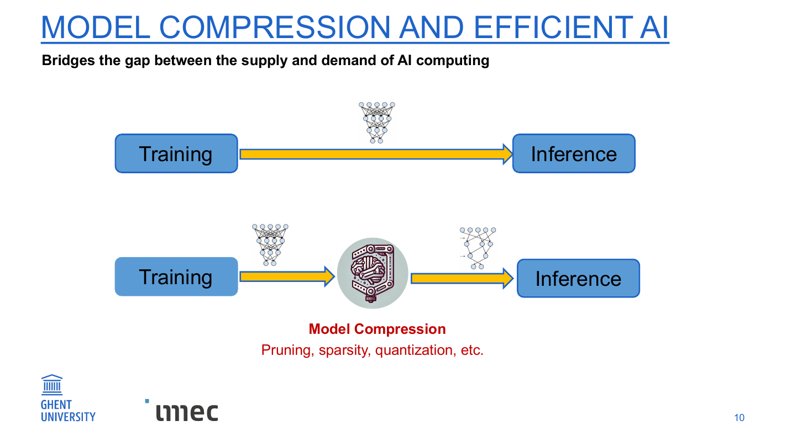

**Waarom nu?** Het aantal publicaties over pruning en sparse neural networks explodeert sinds ~2015. Mijlpalen: *Optimal Brain Damage* (1989), *Deep Compression* en *EIE* (2015–2016). Dit heeft zelfs het hardware-ontwerp beïnvloed (bv. de **NVIDIA Ampere Sparse Tensor Core**, 2× effectieve versnelling).

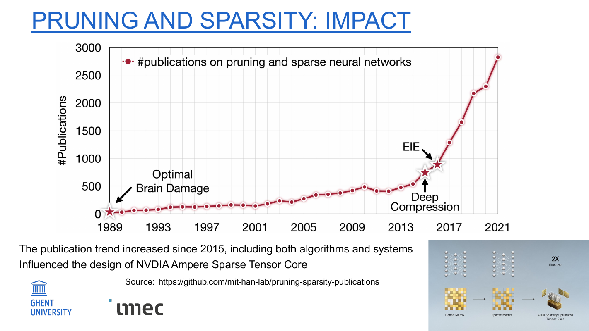

---

## 3. Deep learning is overal (maar duur)

De rode draad in de rest van het hoofdstuk: voor élk toepassingsdomein (vision, taal, multimodaal) geldt dezelfde boodschap — *het werkt, maar het is computationeel duur, dus we hebben efficiënte/lichte versies nodig.* De prof loopt domein per domein af.

### 3.1 Computer Vision — Beeldclassificatie

DNN's halen **bovenmenselijke** nauwkeurigheid op ImageNet. De top-5 foutgraad daalde van 28.2% (2010) naar 2.3% (SENet, 2017), terwijl de mens op ~5.1% zit. De grote sprong begon in 2012 met **AlexNet** (deep learning).

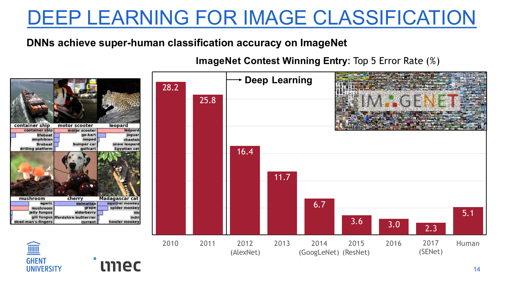

Maar: **hogere nauwkeurigheid kost meer rekenwerk** (MACs) en grotere modellen. **Neural Architecture Search** (bv. *Once-for-All*, EfficientNet) vindt architecturen die dezelfde nauwkeurigheid halen met **tot 14× minder rekenwerk**. In de grafiek: linksboven = weinig MACs + hoge accuracy = beste.

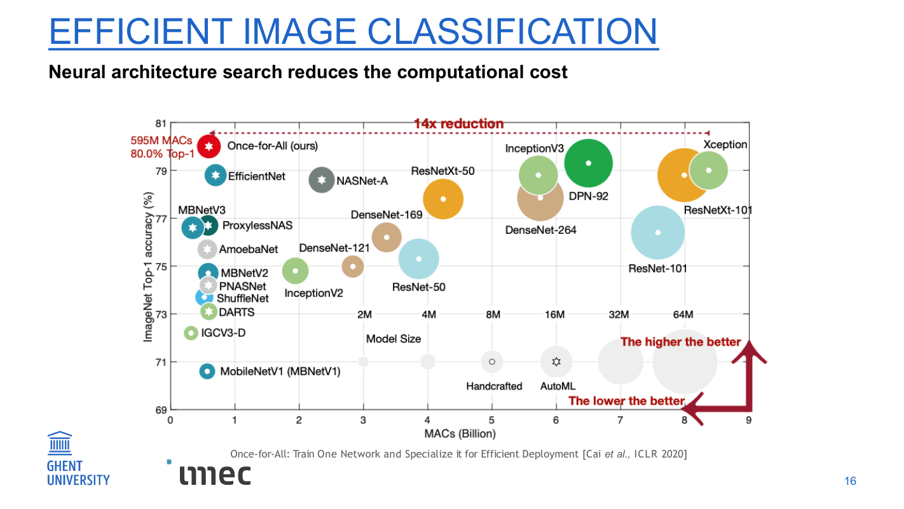

Beeldherkenning draait intussen niet enkel in de cloud, maar ook **on-device**: foto-tags en mensenherkenning op iPhone, on-device pose estimation (MediaPipe BlazePose), en zelfs **beeldclassificatie op een microcontroller** (XIAO ESP32S3 Sense: Xtensa LX7 dual-core @240 MHz, 8 MB RAM/flash — herkent appel/banaan/aardappel in ~300 ms).

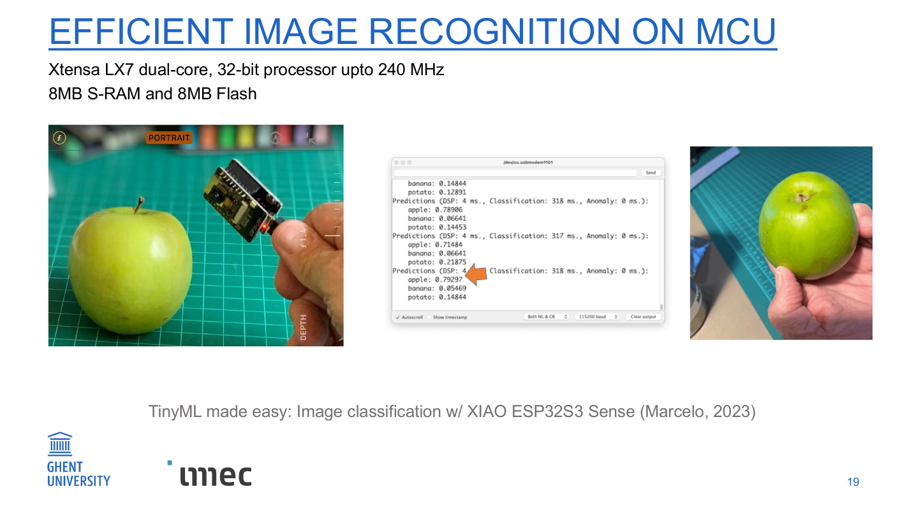

### 3.2 On-device training op de edge

Niet alleen inference, ook **trainen op het toestel zelf** is belangrijk. Reden: nieuwe en **gevoelige data** mag soms niet naar de cloud (privacy).

- **Voordelen on-device learning:** betere privacy, lagere kost, personalisatie, life-long learning.
- **Uitdaging:** training is véél duurder dan inference en past moeilijk op edge hardware (beperkt geheugen). Bv. on-device training onder **256 KB geheugen** (MCUNet-backbone) is mogelijk met de juiste optimalisaties (quantization-aware scaling).

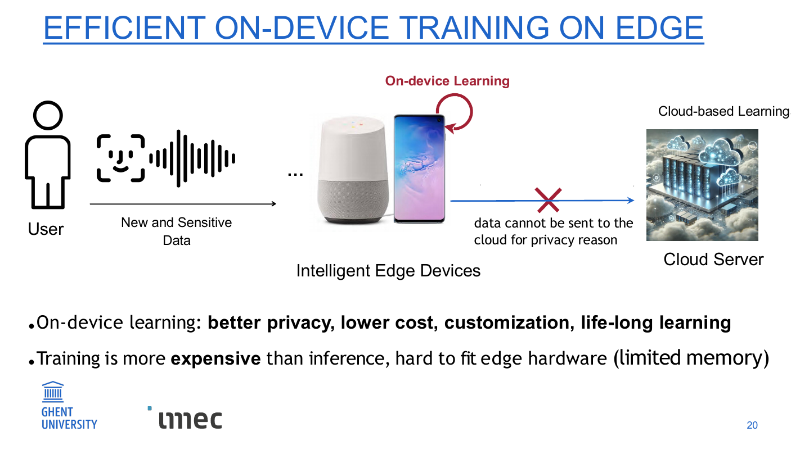

### 3.3 Segmentatie — efficiëntie maakt het bruikbaar

Het **Segment Anything Model (SAM)** doet promptbare zero-shot segmentatie, maar draait op slechts **12 beelden/s** (zware ViT-Huge). **EfficientViT** versnelt SAM **~70×** tot **842 beelden/s** — pas dan wordt het praktisch realtime bruikbaar.

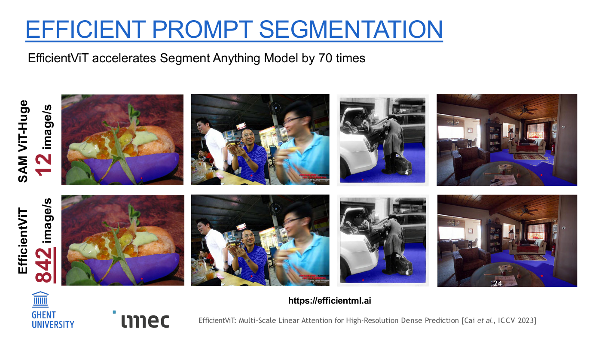

### 3.4 Van discriminatieve naar generatieve modellen

Generatie (diffusion models maken realistische beelden uit tekst) is nóg duurder: **Stable Diffusion trainen kost ~$600.000** (256 A100's, 150k uur).

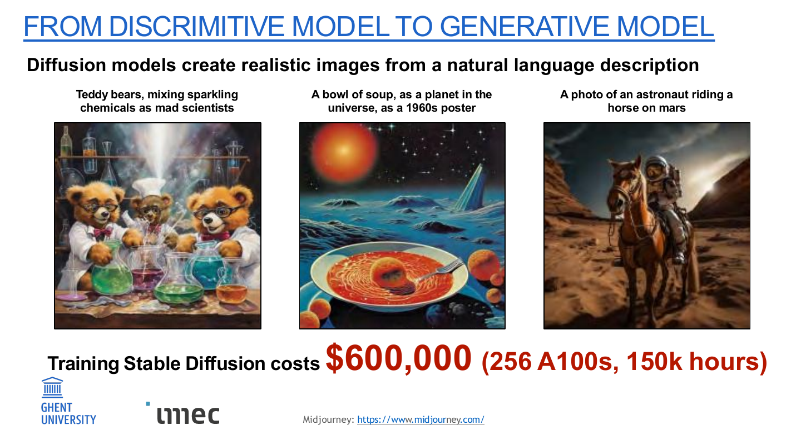

**Hoe werken diffusion models?** (1) Schone trainingsdata → (2) **forward diffusion**: stapsgewijs ruis toevoegen → (3) een NN leert elke ruis-stap **terug te draaien** → (4) **reverse diffusion**: nieuwe beelden genereren vanuit ruis → (5) output is een synthetisch beeld dat de trainingsverdeling volgt.

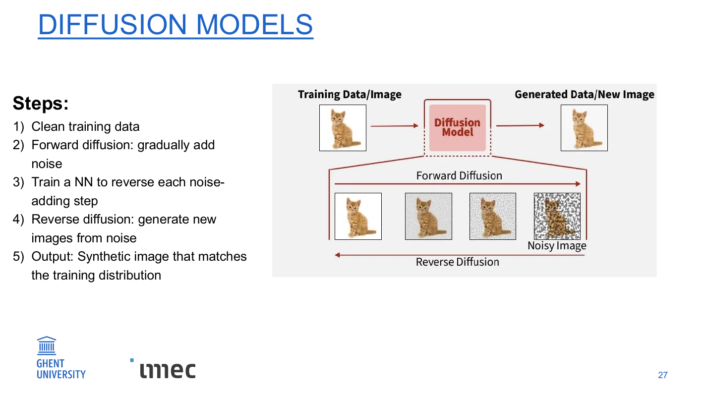

Efficiëntie-technieken voor generatie: **GAN Compression** verlaagt het rekenwerk **9–21×** via pruning (bv. CycleGAN horse→zebra), AnycostGAN (interactief editen op laptop), SIGE (>4× sneller via spatial sparsity), FastComposer (tuning-free multi-subject generatie).

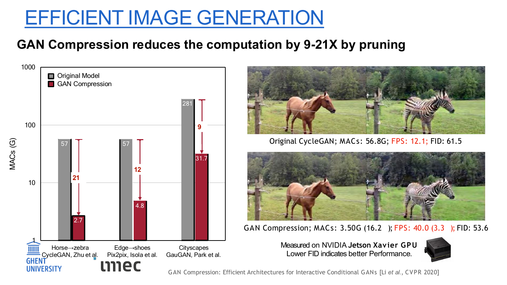

> Ook **3D-objectgeneratie** (DreamFusion) en **videogeneratie** (Imagen Video, "performance nog niet verzadigd bij 5.6B parameters") vallen onder dezelfde "krachtig maar duur"-boodschap. In **3D-perceptie** (zelfrijdende auto's) draait Waymo nog op een hele kofferbak vol workstations; **Fast-LiDARNet** (47 fps, realtime) en **BEVFusion** tonen hoe algorithm/system co-design dit efficiënt maakt.

---

## 4. Taal (Language)

### 4.1 Toepassingen

- **ChatGPT / LLM's**: mensachtige tekst op basis van eerdere conversatie.
- **Code generation**: GitHub Copilot stelt code voor.
- **Neural machine translation**: Google Translate, conversatievertaling op de telefoon.

### 4.2 Efficiënte vertaling & wat is een Transformer?

**Lite Transformer** verkleint het model via pruning + quantization: tot onder de "mobile constraint" (<10M params), met een totale **18.2× modelreductie** en sterk lagere CO₂-uitstoot, terwijl de BLEU-score (vertaalkwaliteit) nagenoeg gelijk blijft.

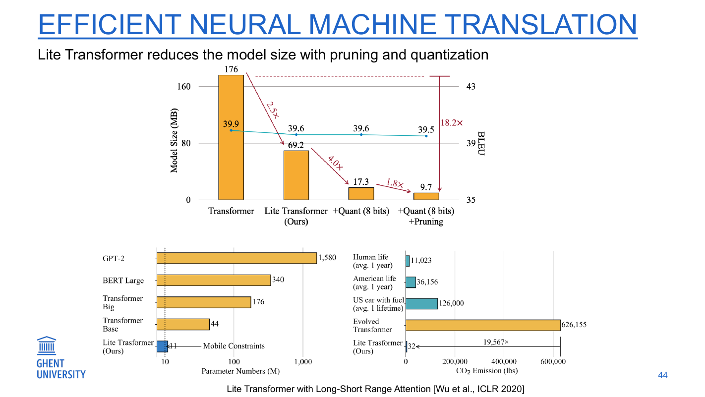

De **Transformer** ("Attention Is All You Need", Vaswani et al. 2017) is de basisarchitectuur. Hij bestaat uit een **encoder** en een **decoder**, elk met **multi-head attention** + **feed-forward** lagen (en residual "Add & Norm"). Recurrence/convolutie zijn volledig vervangen door **attention**.

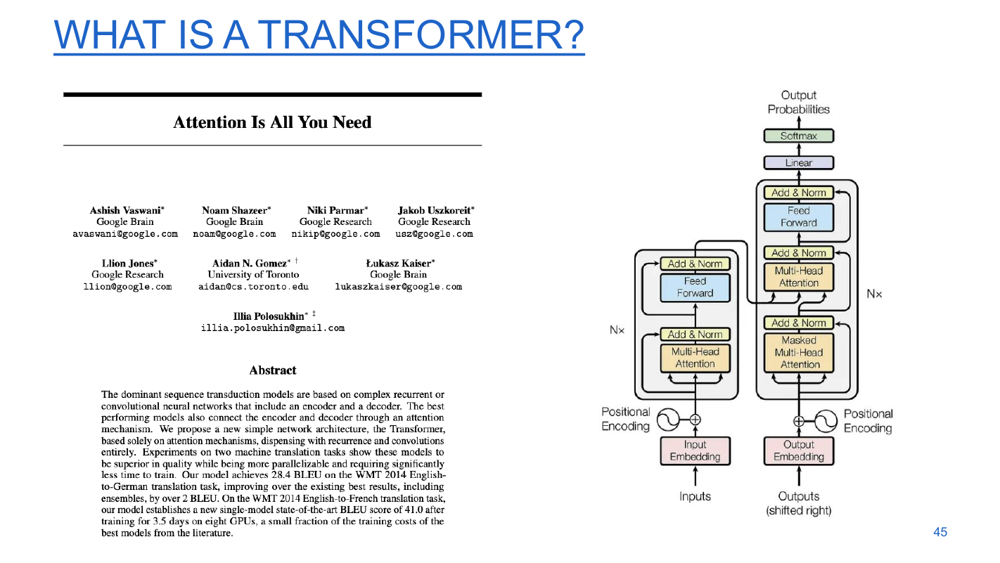

**Het input-blok** van een Transformer kent drie stappen — handig om visueel te onthouden:

1. **Tokenization** — tekst opsplitsen in tokens ("How are you" → How / are / you).
2. **Text vectorization (Embedding)** — elk token wordt een vector (bv. 512-dim).
3. **Positional Encoding** — positie-informatie wordt opgeteld bij de embedding (want attention is volgorde-blind).

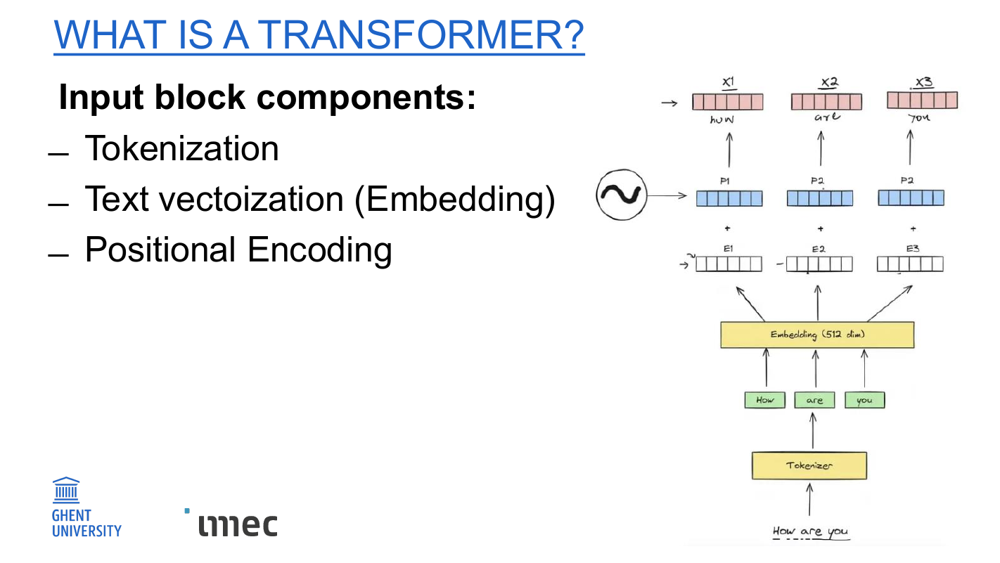

### 4.3 Large Language Models: gedrag & kost

LLM's vertonen **emergent gedrag**: **zero-shot / one-shot / few-shot learning** — ze lossen een taak op met enkel een beschrijving (zero), één voorbeeld (one) of enkele voorbeelden (few), **zonder** gewichtsupdates.

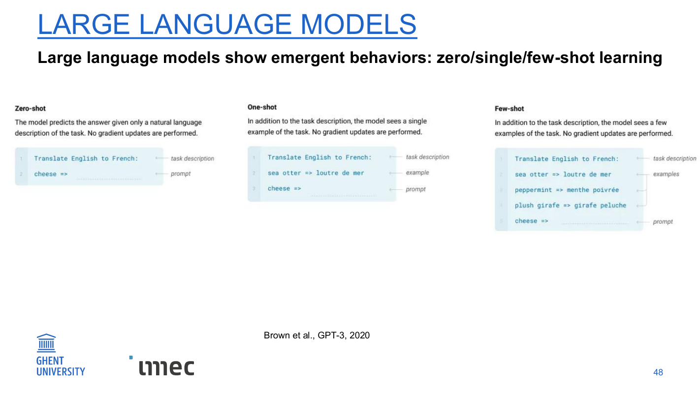

**Chain-of-Thought prompting**: door het model te laten "stap voor stap redeneren" stijgt de juistheid bij redeneertaken sterk (rechts goed, standaard-prompting links fout). Dit werkt vooral bij **grote** modellen.

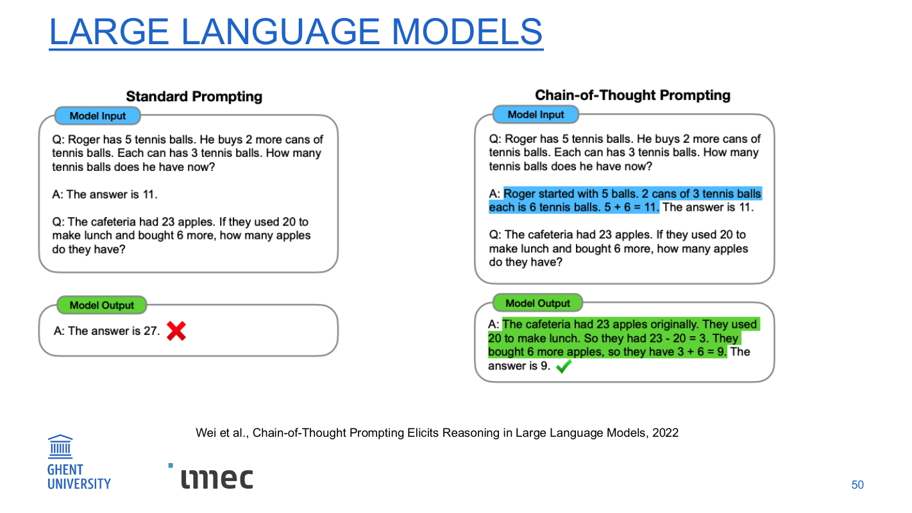

Maar dit alles **kost een exponentieel groeiende modelgrootte** — en het GPU-geheugen volgt niet (dezelfde gap als in deel 2). Vandaar de nood aan **Efficient LLMs** (bv. **SpAtten**: redundante tokens wegsnoeien; **AWQ**: 4-bit quantization). LLM's op de edge draaien is belangrijk voor copilot-diensten, lage latentie, offline werking en **dataprivacy**.

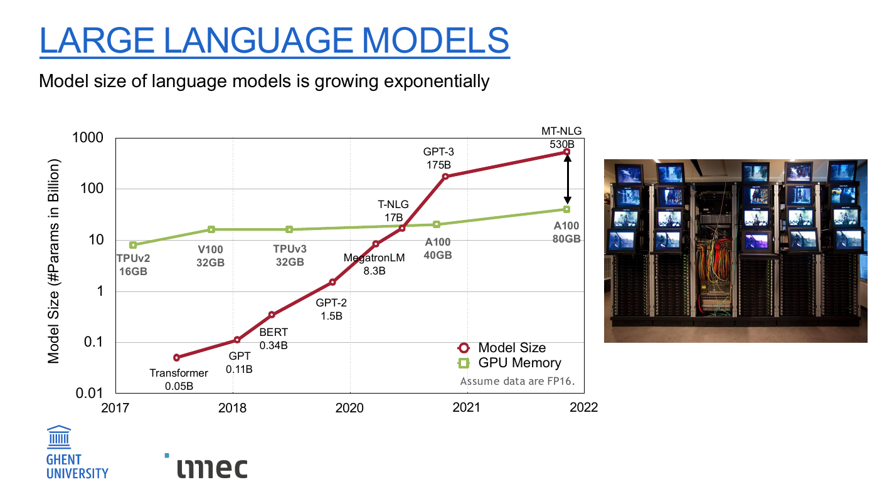

---

## 5. Multimodale modellen

### 5.1 Vision-Language Models

**LLaVA** combineert beeld + taal voor algemene visuele/talige understanding (gebruikt een 13B LLaMA). **AWQ** quantiseert zulke modellen naar **4 bit** met behoud van kwaliteit.

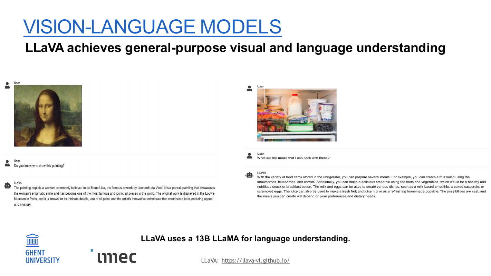

### 5.2 Vision-Language-Action Models

**Robotics transformers (RT-1)** sturen robots aan op basis van taalinstructies ("Bring me the rice chips from the drawer"). Probleem: draait op slechts **3 Hz** door hoge rekenkost + netwerklatentie → opnieuw een efficiëntie-uitdaging.

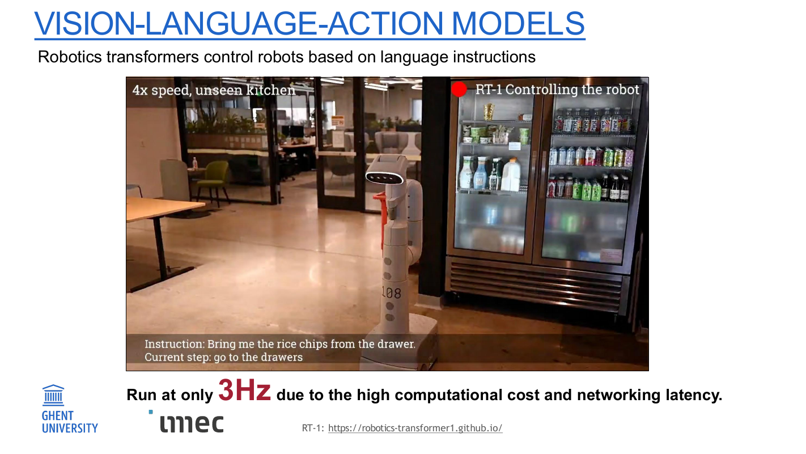

---

## 6. Spel & wetenschap: kracht = kost

- **AlphaGo** (Nature 2016) verslaat Lee Sedol (4-1) met DNN's + tree search — maar met **1920 CPU's + 280 GPU's** en **~$3000 elektriciteit per spel**.
- **AlphaFold** (Nature 2021) voorspelt eiwitstructuren — maar met **16 TPUv3's (128 cores) gedurende weken**.

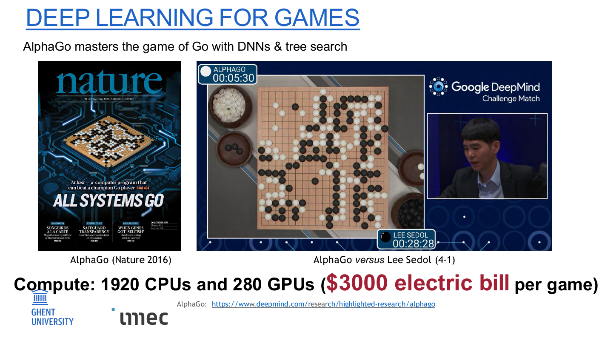
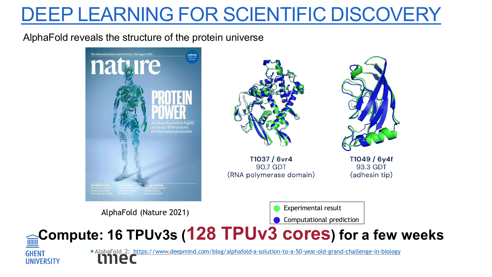

> Boodschap: telkens indrukwekkende doorbraken, telkens enorme rekenkost → efficiëntie is geen luxe.

---

## 7. De drie pijlers van deep learning

Deep learning rust op drie pijlers: **Algorithm** (bv. AlexNet-paper), **Hardware** (bv. RTX 3090), **Data** (bv. ImageNet). Vooruitgang in alle drie samen maakte de huidige AI mogelijk.

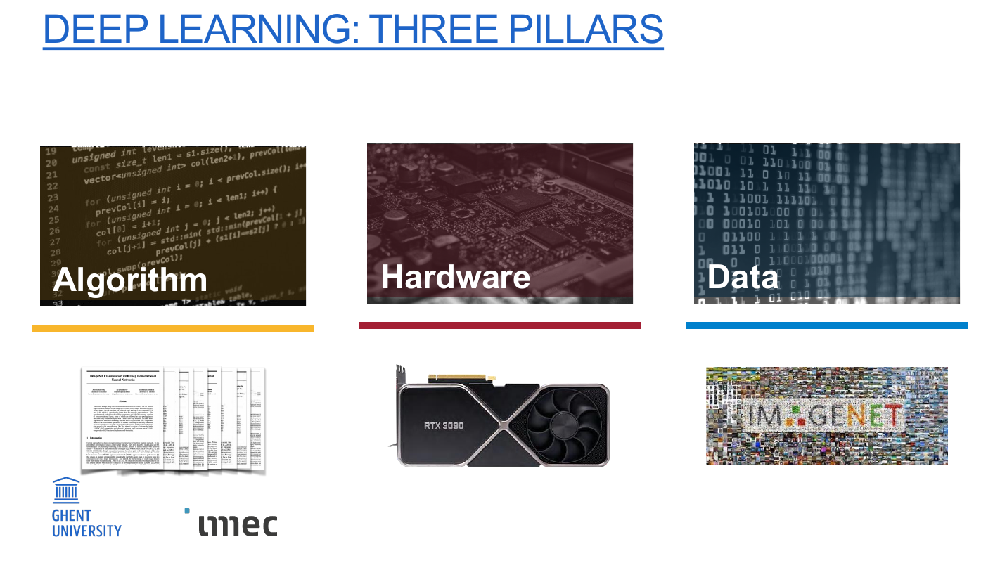

**Hardware-ondersteuning** voor quantization/pruning (**FP32 → FP16 → Int8; dense → sparse**) levert enorme winst: single-chip inference-prestatie **317× in 8 jaar** (K20X → A100 met structured sparsity).

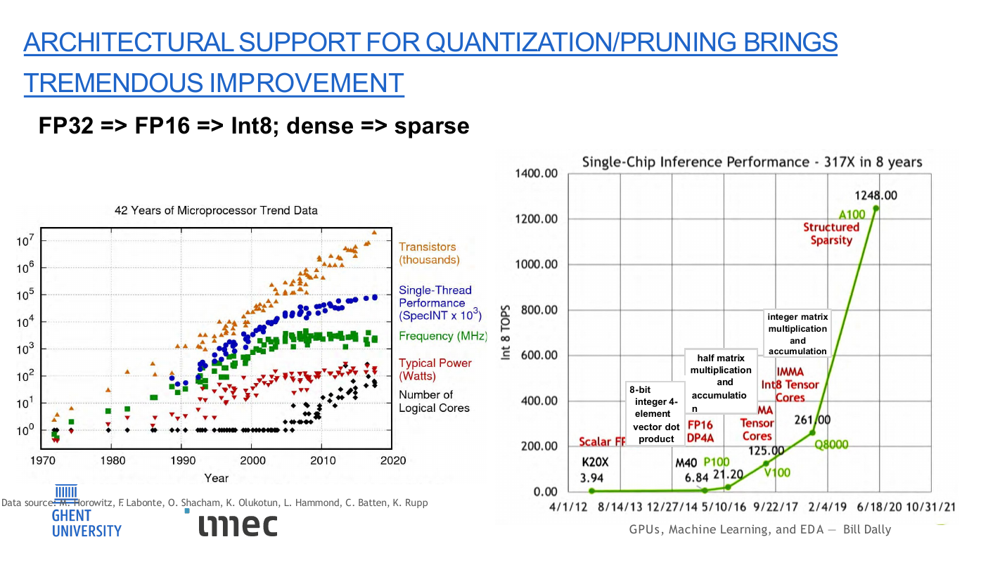

### Hardware-landschap

- **Cloud AI** (NVIDIA P100 → B100): performance, geheugenbandbreedte, vermogen en geheugen groeien sterk per generatie.
- **Edge AI**: Qualcomm Hexagon DSP, Apple Neural Engine (ANE), NVIDIA Jetson (SoM), Google Edge TPU (ASIC), FPGA-accelerators, en **microcontrollers (MCU)**.

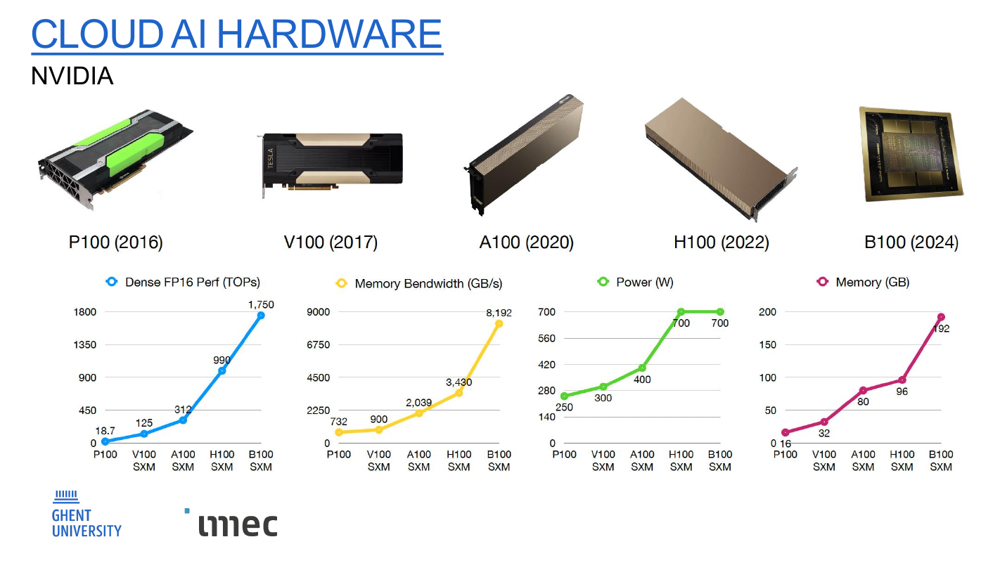

**De kloof tussen cloud en edge blijft enorm** — dit is precies waarom efficiënte modellen nodig zijn:

| | Cloud AI | Mobile AI | Tiny AI |
|---|---|---|---|
| **Geheugen (activatie)** | 80 GB | 4 GB | **320 kB** |
| **Opslag (gewichten)** | ~TB/PB | 256 GB | **1 MB** |

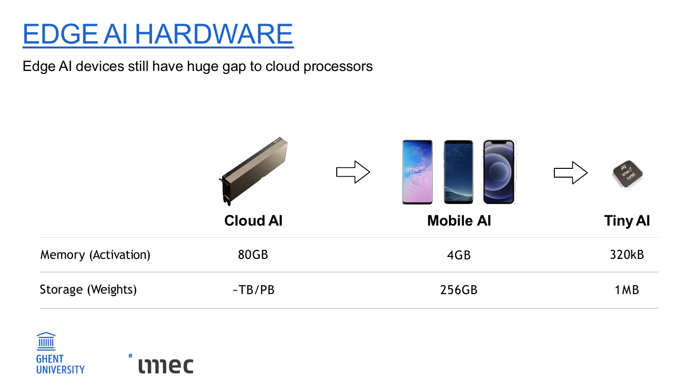

---

## 8. Conclusie: van "Big" naar "Tiny" Deep Learning

**Huidig landschap:** deep learning vraagt **veel rekenkracht (veel CO₂), veel engineers en veel data**.

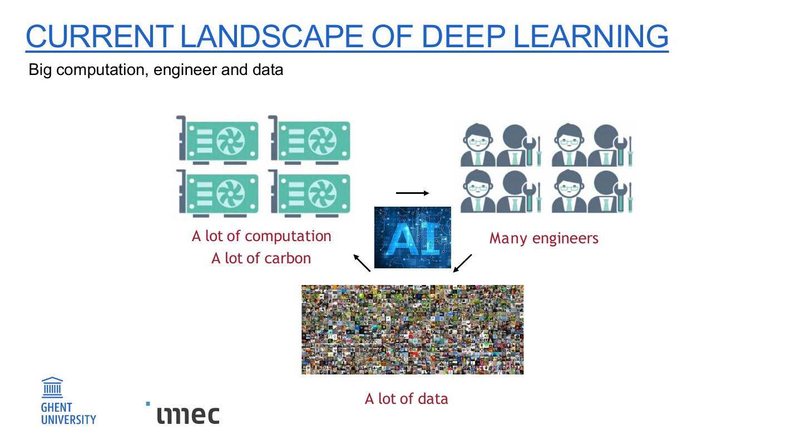

**Doel van het vak — Tiny Deep Learning (TinyML):** hetzelfde bereiken met **minder rekenkracht (minder CO₂), minder engineers en minder data**.

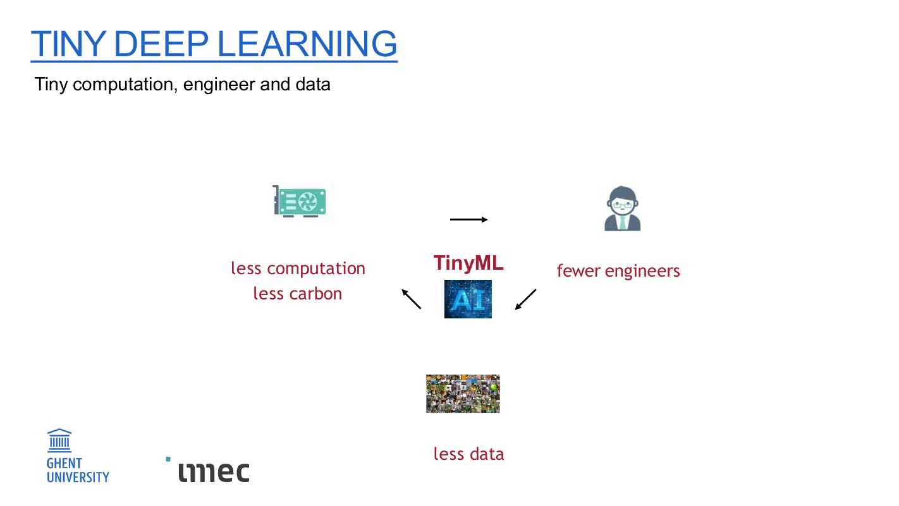

---

### Kernpunten om te onthouden

1. Het vak draait rond **efficiënte inference** (pruning, quantization, NAS, knowledge distillation) en **efficiënte training** (distributed, on-device, federated).
2. Modellen groeien sneller dan hardware → **model compression overbrugt de gap**.
3. In élk domein (vision, generatie, taal, multimodaal, games, wetenschap): **krachtig maar duur** → efficiëntie nodig.
4. **Transformer** = encoder/decoder + attention; input-blok = tokenization → embedding → positional encoding.
5. LLM's: zero/one/few-shot + chain-of-thought, maar exponentieel groeiende modelgrootte.
6. Drie pijlers: **algorithm, hardware, data**; hardware-trend FP32→Int8 en dense→sparse geeft enorme winst.
7. De **cloud→mobile→tiny kloof** (80 GB → 320 kB geheugen) is de reden van bestaan voor TinyML.
