# Samenvatting H2 — Overview of Embedded Systems and ML/DL Overflow

> **Vak:** Embedded Machine Learning (E061380) — UGent / imec, Prof. Adnan Shahid
> **College:** Lecture 02 (20 feb)
> Deze samenvatting volgt de structuur van de slides. Eigen aantekeningen (rood/gekleurd op de slides) zijn als **📝 jouw notitie** verwerkt.

## Inhoud (lecture outline)

Het college doorloopt elf onderdelen, in deze volgorde:

1. Embedded Systems Overview
2. Embedded Computer Hardware
3. Embedded Systems Software
4. Brief Overview of Neural Networks
5. What is TinyML?
6. Understanding the Challenges of TinyML
7. TinyML Applications
8. ML workflow
9. ML Lifecycle
10. ML Frameworks
11. Inference Engines: TensorFlow en LiteRT (Micro)

---

# 1. Embedded Systems Overview

## Wat is een embedded systeem?

Elk embedded systeem bestaat uit drie bouwblokken in een keten:

- **sense (input)** — analoog: sensoren meten de fysische wereld (geluid, beeld, beweging…).
- **process** — digitaal: de microcontroller verwerkt de gemeten data.
- **actuate (output)** — analoog: het systeem stuurt iets aan (luidspreker, motor, scherm…).

De gestippelde terugkoppeling ("phenomenon") betekent dat de actuatie de fysische wereld verandert, die op haar beurt opnieuw gemeten wordt — een gesloten lus.

## Voorbeeld: Amazon Echo Dot

Een gewoon consumentenproduct is eigenlijk een embedded systeem. De Echo Dot uit elkaar gehaald:

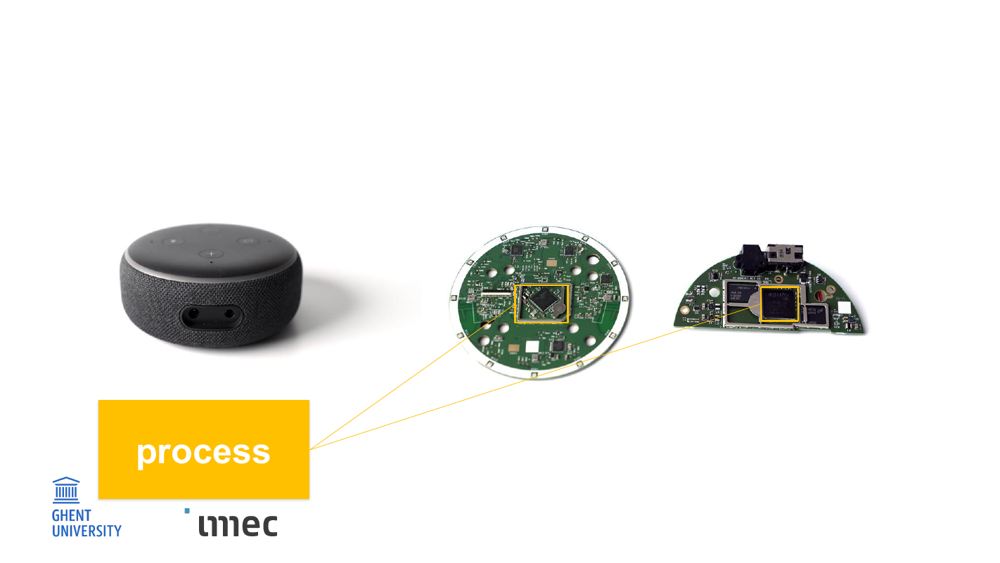

De drie elementen zijn fysiek terug te vinden: de **microfoons** (sense), de **processor-chip** op de PCB (process) en de **luidspreker** (actuate).

## Echt vs. ontwikkelaars-embedded systeem

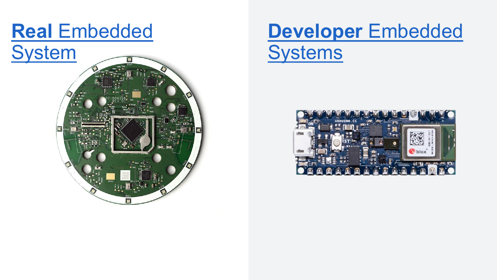

- **Real embedded system** — een op maat ontworpen PCB (bv. de ronde Echo-print met MediaTek 7658CSN: Wi-Fi + ARM Cortex-R4). Geoptimaliseerd voor één product.
- **Developer embedded system** — een ontwikkelbord zoals de Arduino Nano 33 BLE Sense, waarmee je leert en prototypet. Dit gebruik je in de labs.

## Het Arduino Nano 33 BLE Sense-bord

Het ontwikkelbord van dit vak heeft sensoren én rekenkracht op één klein bordje:

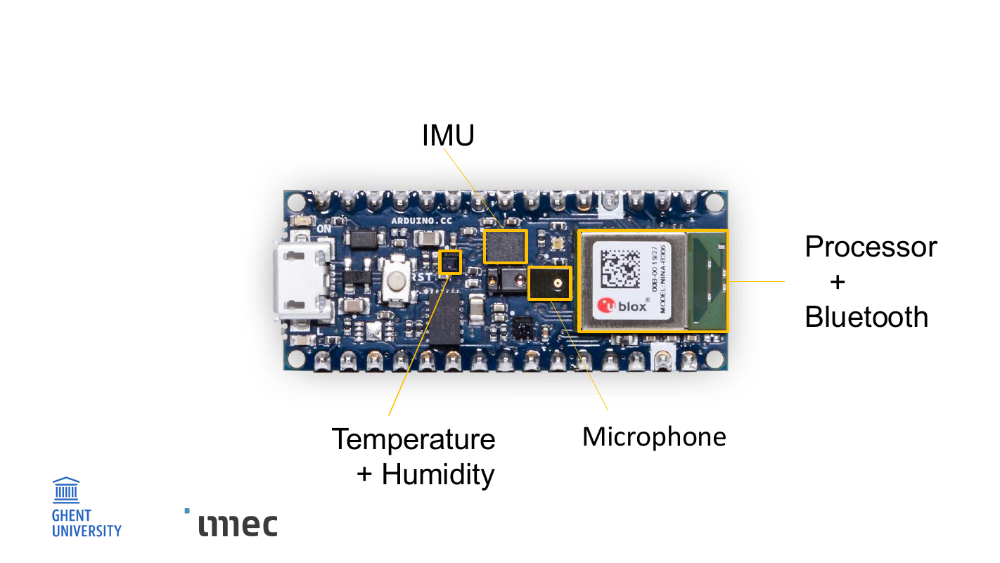

- **Processor + Bluetooth** (u-blox NINA-B306 module, nRF52840)
- **Microphone** — geluid
- **IMU** — beweging (accelerometer/gyroscope)
- **Temperature + Humidity** — omgeving
- **I/O (USB)** — voeding + programmeren

## Vier veelgebruikte embedded boards

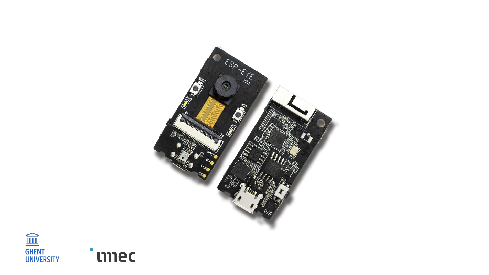

In dit vak komen vier representatieve borden voor. De volledige vergelijking:

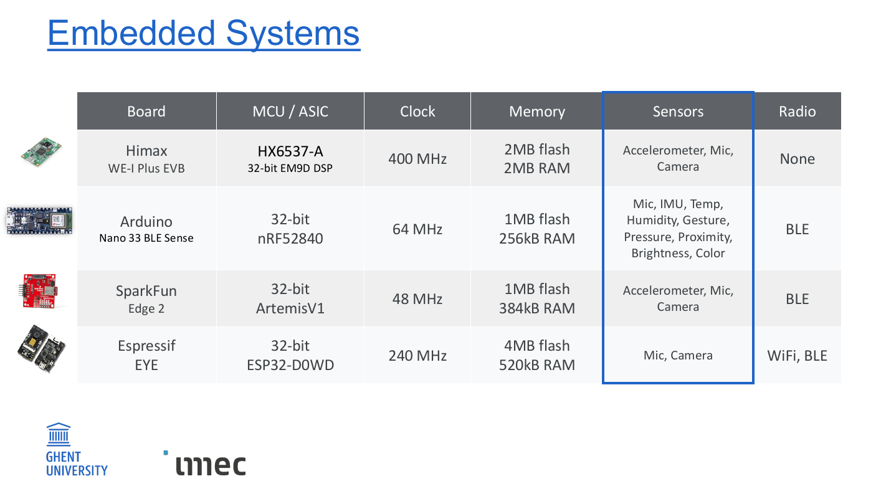

| Board | MCU / ASIC | Clock | Memory | Sensors | Radio |
|---|---|---|---|---|---|
| **Himax** WE-I Plus EVB | HX6537-A (32-bit EM9D **DSP**) | 400 MHz | 2MB flash / 2MB RAM | Accelerometer, Mic, Camera | None |
| **Arduino** Nano 33 BLE Sense | 32-bit nRF52840 | 64 MHz | 1MB flash / **256kB RAM** | Mic, IMU, Temp, Humidity, Gesture, Pressure, Proximity, Brightness, Color | BLE |
| **SparkFun** Edge 2 | 32-bit ArtemisV1 | 48 MHz | 1MB flash / 384kB RAM | Accelerometer, Mic, Camera | BLE |
| **Espressif** EYE | 32-bit ESP32-D0WD | 240 MHz | 4MB flash / 520kB RAM | Mic, Camera | WiFi, BLE |

Belangrijk: dit zijn allemaal 32-bit chips, maar met **kB tot enkele MB geheugen** — minuscuul vergeleken met een PC. De Himax gebruikt een **DSP** (digital signal processor) i.p.v. een gewone MCU; ASIC's en DSP's zijn alternatieven voor een MCU wanneer je meer signaalverwerking nodig hebt.

---

# 2. Embedded Computer Hardware

## ARM Cortex-processorprofielen

ARM verdeelt zijn Cortex-cores in drie families, geplaatst volgens **vermogen** (Power, verticaal) en **pipeline-complexiteit** (horizontaal):

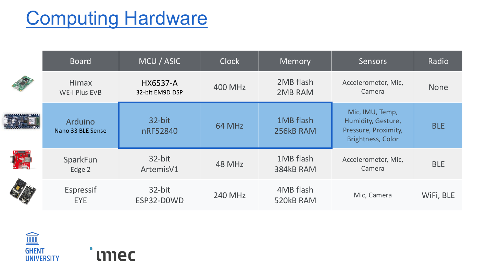

- **Cortex-A** (Applications) — krachtigst, voor smartphones/laptops (A5, A9). Draaien een volledige OS.
- **Cortex-R** (Real-time) — voor real-time toepassingen (R4, R5, R7).
- **Cortex-M** (Microcontrollers) — laagste vermogen, voor embedded/TinyML (M0+, M0, M3, M4). **Dit is de relevante familie voor dit vak.**

## ARM Cortex-M instructieset (ISA)

De Cortex-M-cores zijn een **genest** systeem: elke duurdere core kan alles van de goedkopere, plus extra:

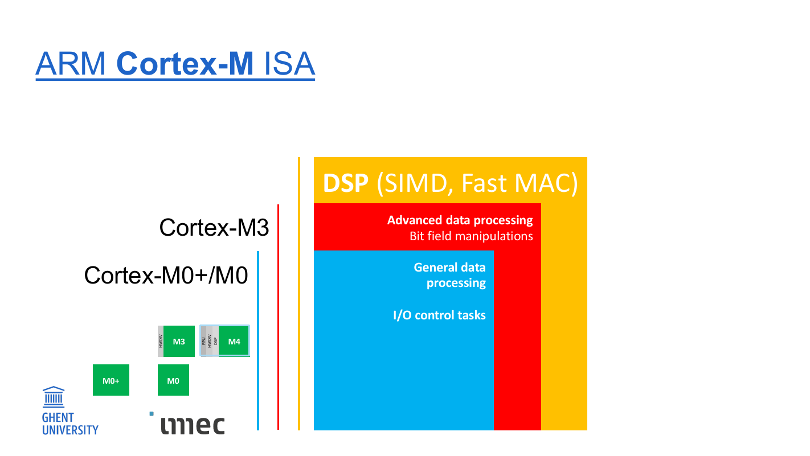

- **Cortex-M0+/M0** — I/O control tasks + general data processing (basis).
- **Cortex-M3** — voegt advanced data processing + bit field manipulations toe.
- **Cortex-M4** — voegt **DSP (SIMD, Fast MAC)** én een **FPU** (floating point unit) toe.

> **📝 jouw notitie:** *mac = multiply accumulate: a · b + c in 1 klokslag → matrix-bewerkingen in NN's.* Dit is dé sleuteloperatie voor neurale netwerken: matrixvermenigvuldigingen bestaan volledig uit MAC's, dus een core met snelle MAC (zoals de M4) draait NN-inferentie veel efficiënter. De Arduino Nano gebruikt een **Cortex-M4** — net daarom geschikt voor TinyML.

---

# 3. Embedded Systems Software

## De softwarestack

Software draait altijd bovenop hardware, en is intern gelaagd:

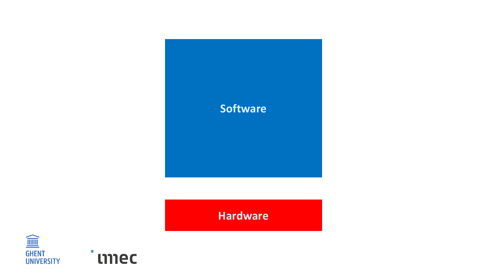

- **Operating System** (onderaan) — beheert de hardware.
- **Libraries** — herbruikbare functies.
- **Applications** (bovenaan) — jouw eigenlijke programma.

## Operating systems: desktop/mobile vs. embedded

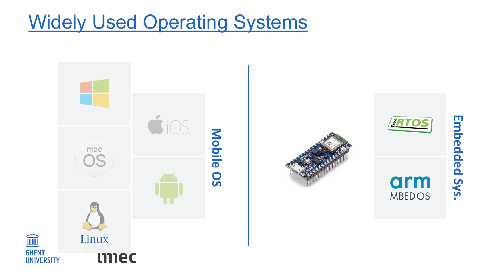

Naast desktop-OS'en (Windows, macOS, Linux) en mobiele OS'en (iOS, Android) bestaan er **embedded OS'en** voor microcontrollers, zoals **FreeRTOS** en **ARM mbed OS**. Die zijn veel lichter en real-time gericht.

## De volledige stack op de Nano 33 BLE Sense

Op het Arduino-bord stapelen de softwarelagen zo (van onder naar boven): mbed OS → Arduino → TF Micro Application, bovenop de hardware. De rechterkant toont de interne structuur van mbed OS:

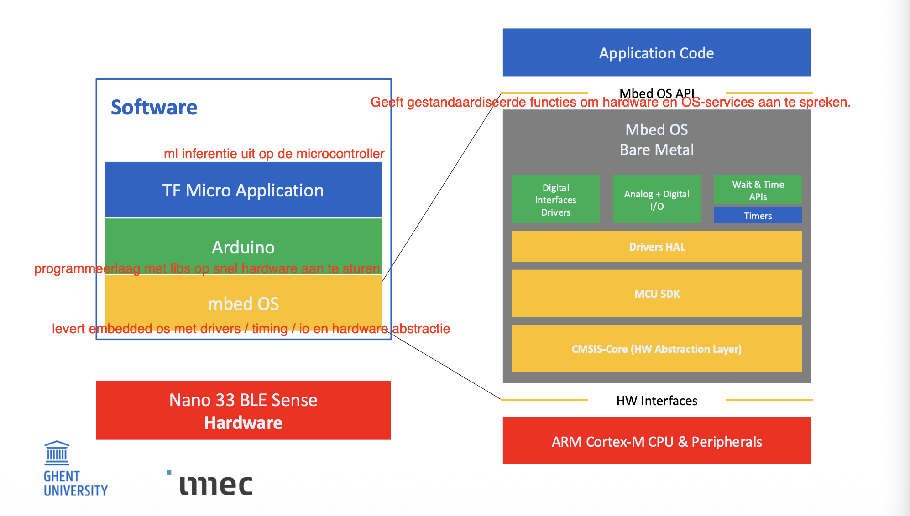

> **📝 jouw notities op de drie lagen:**
> - **mbed OS** → *levert embedded OS met drivers / timing / I/O en hardware-abstractie.* Intern: Application Code → **Mbed OS API** → Mbed OS Bare Metal (Digital Interfaces Drivers, Analog+Digital I/O, Wait & Time APIs, Timers) → **Drivers HAL** → **MCU SDK** → **CMSIS-Core (HW Abstraction Layer)** → HW Interfaces → ARM Cortex-M CPU & Peripherals.
> - **Arduino** → *programmeerlaag met libs om snel hardware aan te sturen.*
> - **TF Micro Application** → *voert ML-inferentie uit op de microcontroller.*
> - De **Mbed OS API** *geeft gestandaardiseerde functies om hardware en OS-services aan te spreken* — zodat je app niet rechtstreeks met registers hoeft te praten.

**Het hoofdidee: software-stack van hoog naar laag**

Het verhaal is dat er **meerdere abstractielagen** tussen je ML-code en de hardware zitten. Van boven naar beneden:

| # | Laag | Wat | Voorbeeld op de slide |
|---|---|---|---|
| 1 | **Applicatie** | Jouw eigen code die het ML-model gebruikt | "TF Micro Application" |
| 2 | **ML Framework** | Library om neurale netwerken uit te voeren | TensorFlow Lite Micro (TF Micro) |
| 3 | **Programming framework** | Hoge-niveau libs voor sensoren, I/O, etc. | Arduino |
| 4 | **OS + HAL** | Drivers, timing, hardware abstractie | Mbed OS (incl. CMSIS, HAL) |
| 5 | **Hardware** | De fysieke chip | Nano 33 BLE Sense (Cortex-M4) |

Je rode notities vatten dit perfect samen — dat niveau van begrip is voldoende.

**Waarom is dit relevant?**
Op een microcontroller heb je geen Linux/Windows. Je hebt **geen luxe** zoals automatische memory management of een file system. De stack moet **lichtgewicht** zijn en hardware-dicht. Dit is fundamenteel anders dan ML op een PC of cloud.

## Geheugengebruik: resource aware zijn

Op een MCU is geheugen het kritische budget. De totale RAM (hier 128 KB) wordt opgedeeld in lagen:

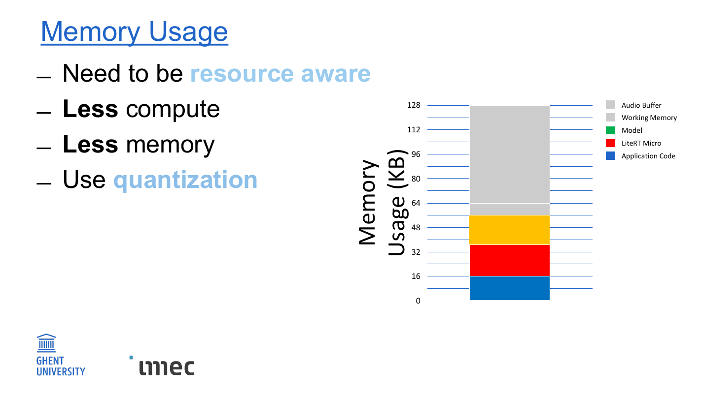

De stapel (van onder naar boven): **Application Code → LiteRT/TFLite Micro runtime → Model → Working Memory → Audio Buffer.**

geheugne opgesplitst in appl code / tflite micro runtime / model / working memory / audio buffer
-> model is maar 1 deel van dat geheel

buffer -> grootste blok -> input data meer geheugen dan het model zelf

-> optimaliseren op meerdere niveaus -> minder compute / minder geheugen / quantization gebruiken
-> microcontrollers ontwerp je ml systemen rond geheugen limieten niet rond max accuracy

**Quantization** is de centrale truc:

> **📝 jouw notitie:** *quantization = getallen met hoge precisie omzetten naar getallen met lagere precisie: 32-bit floats → 8-bit ints.* Dit verkleint zowel model als activaties met ~4×.

## Modules verwijderen om geheugen te besparen

Het embedded OS bevat veel modules die je niet altijd nodig hebt:

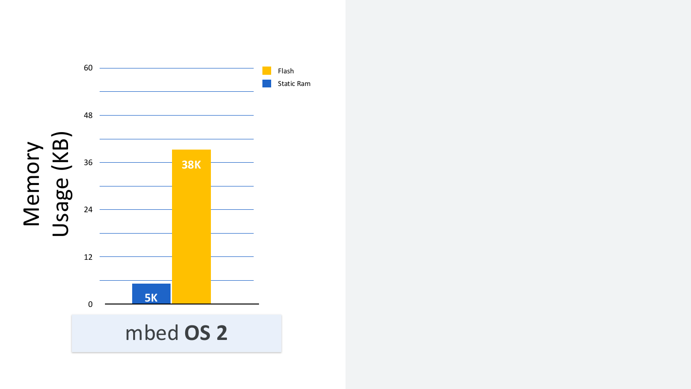

De `features/frameworks`-module bevat bijvoorbeeld **veel onnodige test-tools die in elke binary worden meegebouwd** (1K RAM + 8K Flash). Door zulke modules te **elimineren bespaar je** flash en RAM. Het effect op mbed OS 5: van 57K → 49K flash en 13K → 12K RAM.

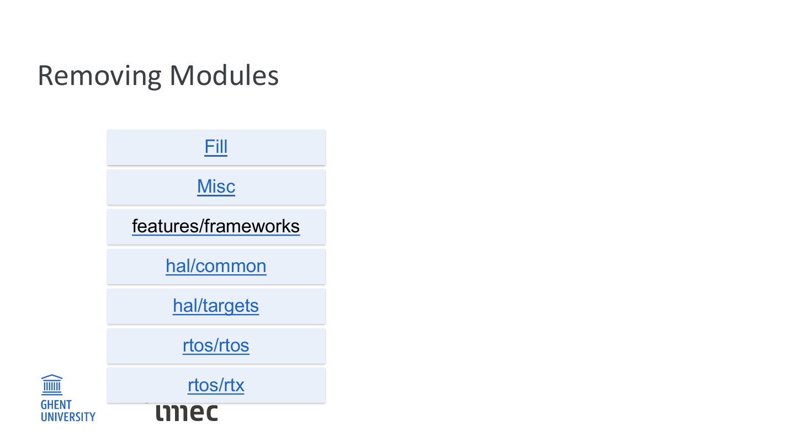

---

# 4. Brief Overview of Neural Networks (recap)

## Voorbeeld: handgeschreven cijferherkenning

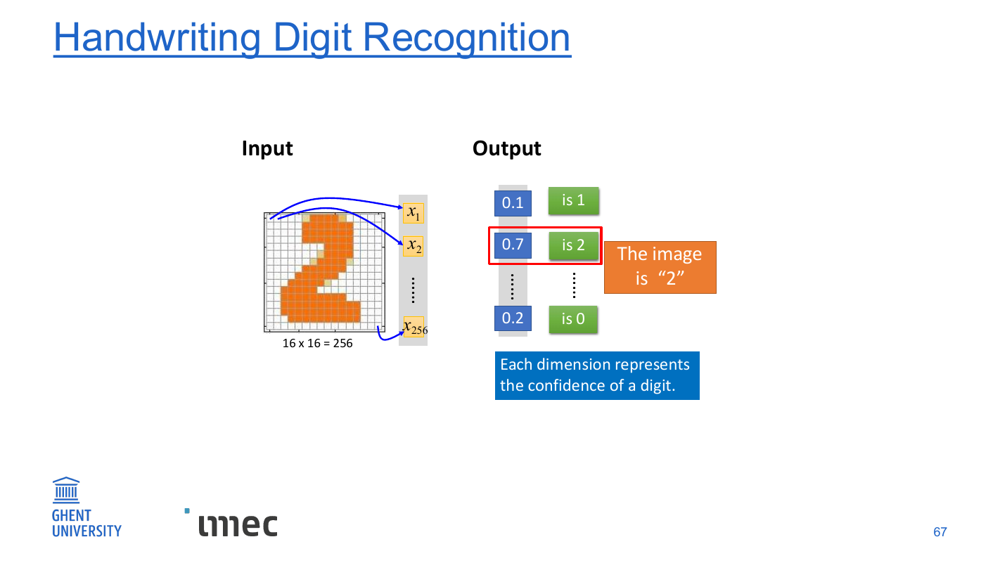

Een 16×16-pixelbeeld (= **256 inputs** x₁…x₂₅₆) gaat in een "machine" en eruit komen **10 outputs**, elk een waarde tussen 0 en 1: de **confidence** per cijfer. De hoogste (hier 0.7 bij "is 2") wint. De machine is dus een functie **f: R²⁵⁶ → R¹⁰**, en in deep learning is die functie f een **neuraal netwerk**.

## Bouwsteen: het neuron

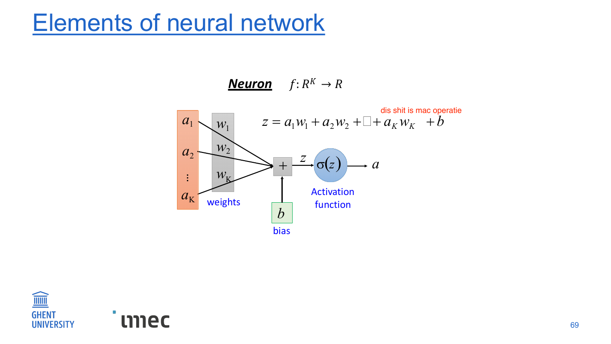

Eén neuron: neem inputs a₁…a_K, vermenigvuldig met **gewichten** w₁…w_K, tel op met een **bias** b:

**z = a₁w₁ + a₂w₂ + … + a_Kw_K + b**

en stuur z door een **activatiefunctie** σ(z) → output a.

> **📝 jouw notitie:** *dit is een MAC-operatie* — exact de "multiply-accumulate" waarvoor de Cortex-M4 hardware-versnelling heeft (zie §2). Een neuron berekenen = een reeks MAC's.

## Het volledige netwerk

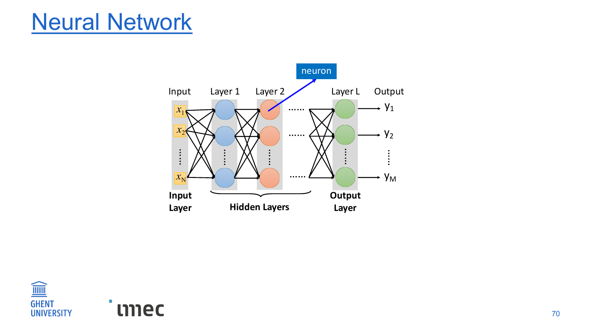

Neuronen worden in **lagen** gestapeld: Input Layer → Hidden Layers (Layer 1, 2, … L) → Output Layer. Elk bolletje is een neuron.

## Concreet rekenvoorbeeld + activatiefuncties

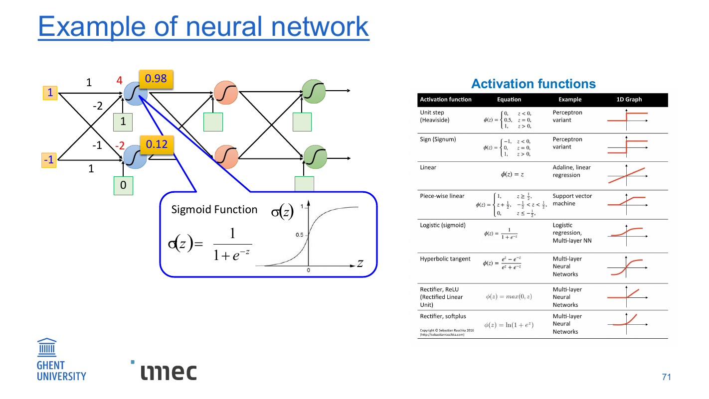

Met inputs [1, −1], gewichten en biases reken je per neuron z uit en pas je de **sigmoid** toe: σ(z) = 1 / (1 + e^(−z)). Bv. z = 4 → σ(4) = 0.98.

De tabel rechts toont de gangbare activatiefuncties: **Unit step, Sign, Linear, Piece-wise linear, Logistic (sigmoid), Hyperbolic tangent (tanh), ReLU, Softplus.** ReLU = max(0, z) is de standaard in moderne multi-layer netwerken.

Verschillende parameters → verschillende functie. Bv. f([1,−1]) = [0.62, 0.83] maar f([0,0]) = [0.51, 0.85].

## Matrixvorm

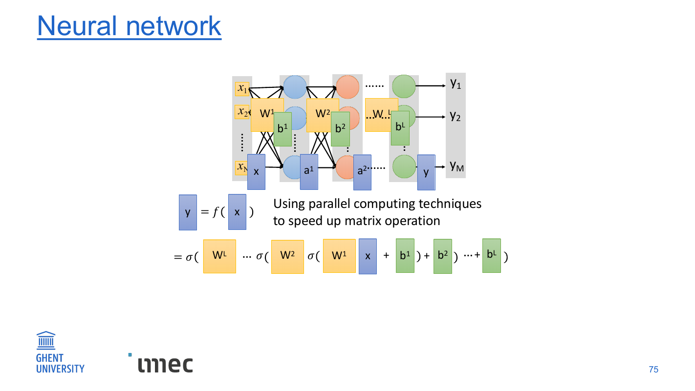

Het hele netwerk is één geneste functie:

**y = f(x) = σ(W^L … σ(W² σ(W¹x + b¹) + b²) … + b^L)**

Omdat dit puur matrixvermenigvuldigingen zijn, kun je **parallel computing** (GPU/DSP) gebruiken om het te versnellen — opnieuw: MAC's.

## Softmax als output-laag

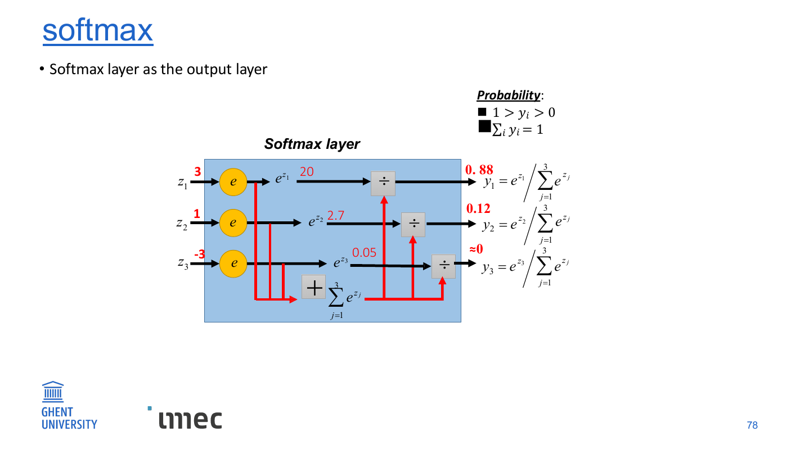

Een gewone output kan elke waarde zijn en is moeilijk te interpreteren. De **softmax-laag** zet de outputs z om naar **kansen**: yᵢ = e^(zᵢ) / Σⱼ e^(zⱼ).

Eigenschappen: elke **0 < yᵢ < 1** en **Σ yᵢ = 1**. Voorbeeld: z = [3, 1, −3] → y ≈ [0.88, 0.12, ≈0]. Zo wordt de output een echte waarschijnlijkheidsverdeling over de klassen.

## Training: cost en total cost

Hoe vind je de juiste parameters θ = {W¹, b¹, …, W^L, b^L}? Door de **fout** te minimaliseren.

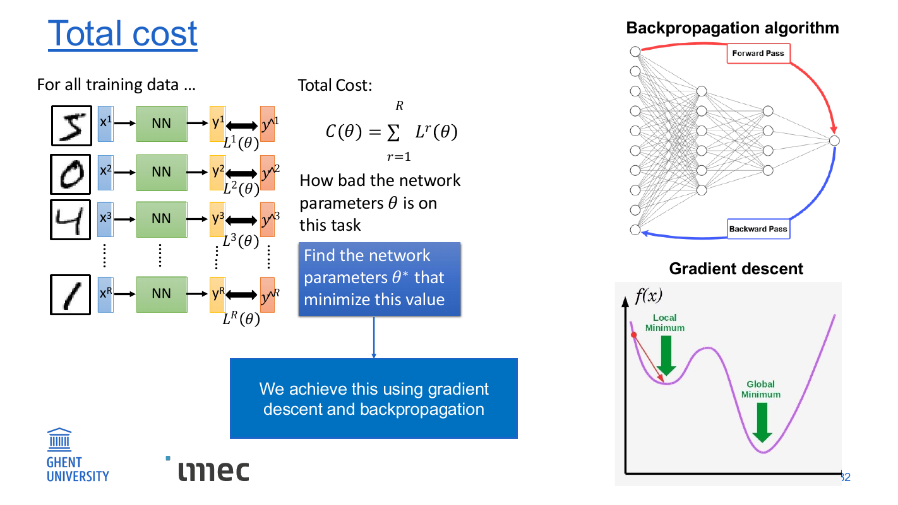

- Per voorbeeld is er een **cost** L(θ): het verschil tussen output en target (Euclidische afstand of cross-entropy).
- De **total cost** sommeert over alle trainingsdata: **C(θ) = Σ L^r(θ)** — "hoe slecht presteren de parameters θ op deze taak".
- Je zoekt de θ* die C(θ) **minimaliseert**, via **gradient descent** (rol naar het minimum van de cost-functie) + **backpropagation** (forward pass berekent output, backward pass propageert de fout terug om de gradiënten te bepalen).

Let op het verschil **local minimum** vs **global minimum**: gradient descent kan in een lokaal minimum blijven steken.

---

# 5. What is TinyML?

## De AI van vandaag is te groot

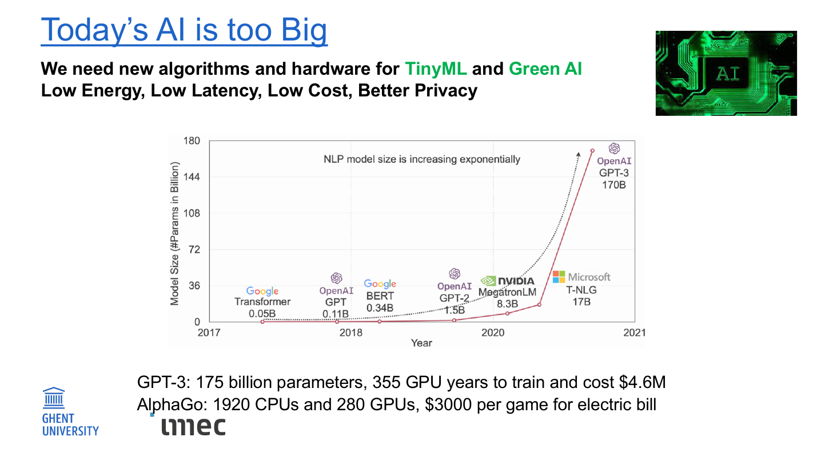

NLP-modellen groeien exponentieel: Transformer (0.05B) → BERT (0.34B) → GPT-2 (1.5B) → GPT-3 (**170B parameters**). Cijfers:

- **GPT-3:** 175 miljard parameters, 355 GPU-jaren om te trainen, kost ~$4.6M.
- **AlphaGo:** 1920 CPU's + 280 GPU's, $3000 elektriciteit per spel.

Daarom is er nood aan nieuwe algoritmes en hardware voor **TinyML** en **Green AI**: lage energie, lage latency, lage kost, betere privacy.

## Cloud → Mobile → Tiny

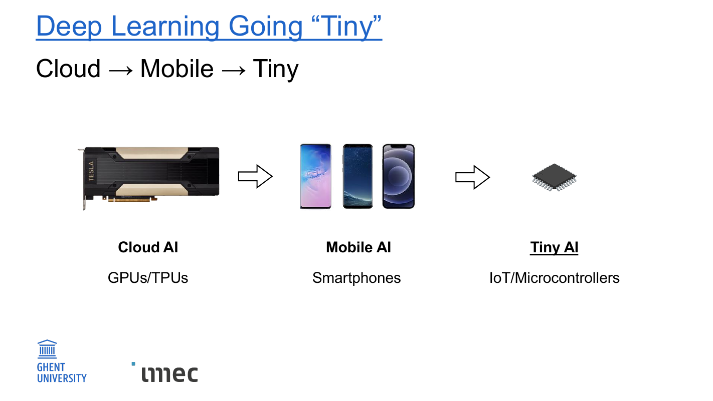

De evolutie van waar AI draait:

- **Cloud AI** — GPU's/TPU's. Data wordt geüpload naar de cloud voor inferentie (nadeel: latency, energie, **privacy** — je data verlaat het toestel).
- **Mobile AI** — smartphones.
- **Tiny AI** — IoT / microcontrollers. Inferentie gebeurt lokaal op het toestel.

## Waarom TinyML? Miljarden IoT-toestellen

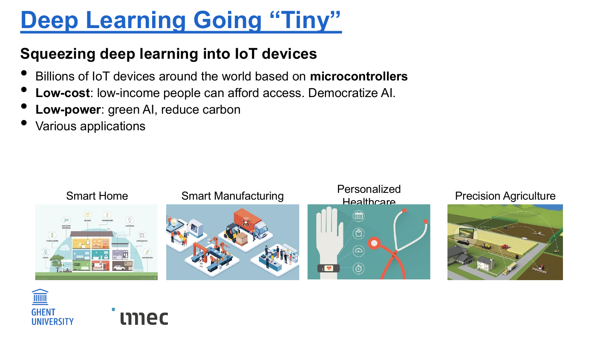

- **Ubiquitous** — miljarden IoT-toestellen wereldwijd, gebaseerd op microcontrollers (groeicurve naar ~50 miljard units).
- **Low-cost** ($0.1 – $10) — ook mensen met laag inkomen krijgen toegang → **democratisering van AI**.
- **Low-power** (mW) — green AI, minder CO₂.
- **Various applications** — Smart Home, Smart Manufacturing, Personalized Healthcare, Precision Agriculture.

---

# 6. Understanding the Challenges of TinyML

## Geheugen is te klein voor DNN's

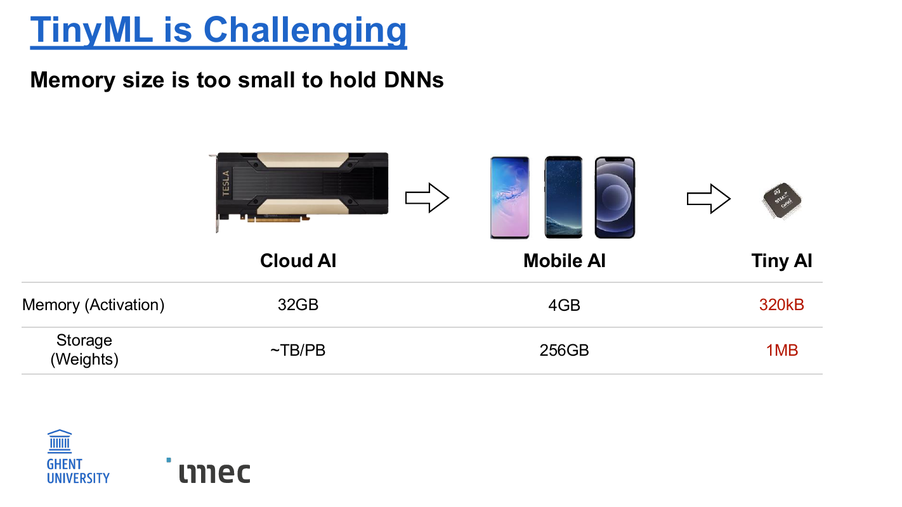

> **📝 jouw notitie:** *DNN = deep neural network.*

| | Cloud AI | Mobile AI | Tiny AI |
|---|---|---|---|
| **Memory (Activation)** | 32 GB | 4 GB | **320 kB** |
| **Storage (Weights)** | ~TB/PB | 256 GB | **1 MB** |

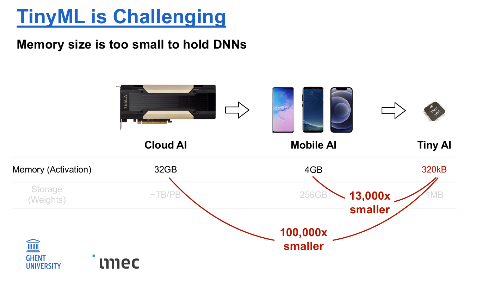

Het activatiegeheugen van Tiny AI is **13.000× kleiner** dan mobile en **100.000× kleiner** dan cloud. Daarom: **je moet zowel de weights als de activations verkleinen** om DNN's op een MCU te laten passen.

## TinyML-constraints verschillen van Mobile AI

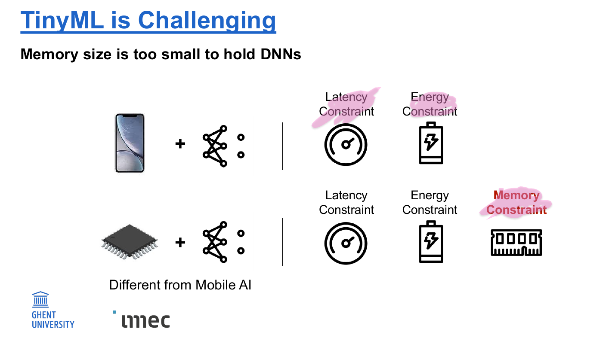

Mobile AI heeft een **latency-** en **energy-constraint**. TinyML heeft die óók, maar daar bovenop een harde **memory-constraint** (gemarkeerd) — dit maakt TinyML wezenlijk moeilijker dan mobiele AI.

## CNN's op microcontrollers draaien

Een typische CNN: Input → (Convolution + ReLU → Pooling)×meermaals → Flatten → Fully Connected → Softmax → output (bv. Horse/Zebra/Dog).

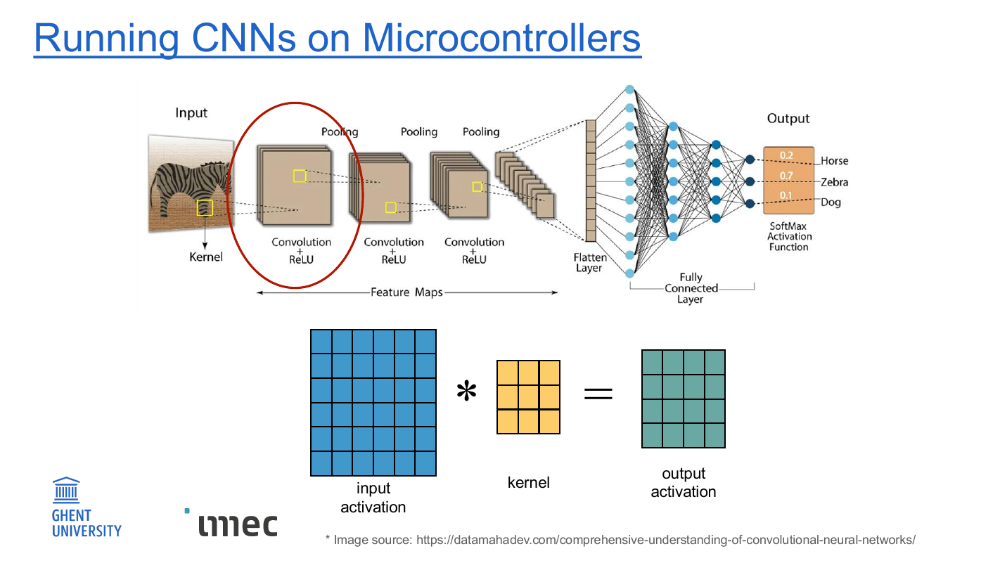

De kernoperatie is de **convolutie**: een **input activation** wordt met een **kernel** (filter) geconvolueerd (`*`) tot een **output activation**.

### Waar staat wat in het geheugen?

**Flash-gebruik (= modelgrootte):**

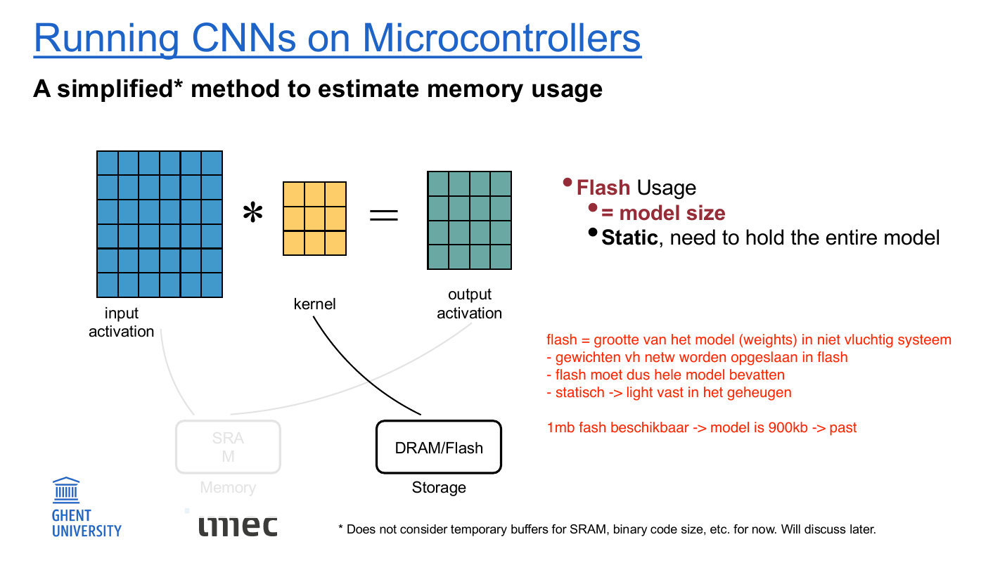

> **📝 jouw notitie:** *flash = grootte van het model (weights) in niet-vluchtig systeem. De gewichten van het netwerk worden opgeslagen in flash. Flash moet dus het hele model bevatten. Statisch → ligt vast in het geheugen. Bv. 1MB flash beschikbaar → model is 900kB → past.*
Flash is **statisch**: het moet het volledige model bevatten.

**SRAM-gebruik (= werkgeheugen):**

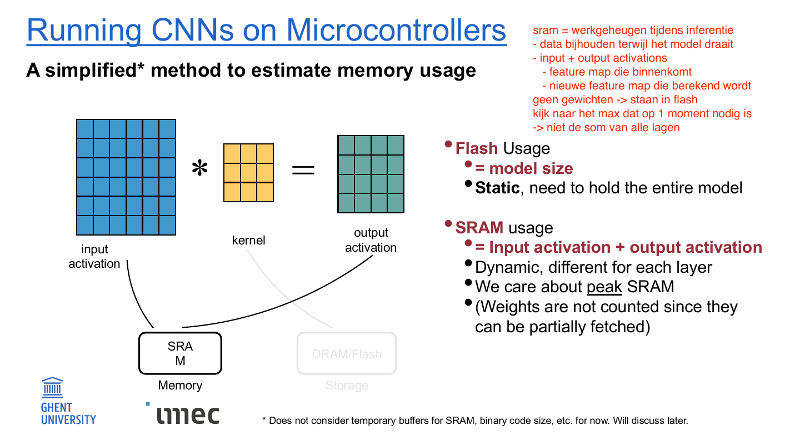

> **📝 jouw notitie:** *SRAM = werkgeheugen tijdens inferentie. Data bijhouden terwijl het model draait: input + output activations (de feature map die binnenkomt + de nieuwe feature map die berekend wordt). Geen gewichten → die staan in flash. Kijk naar het **max** dat op 1 moment nodig is → niet de som van alle lagen.*
SRAM is **dynamisch** en verschilt per laag = Input activation + Output activation. We geven om de **peak SRAM**. Gewichten tellen hier niet mee (worden gedeeltelijk uit flash gehaald).

## Cloud/Mobile-CNN's passen niet

Tegenover de **320 kB-constraint** (de rode stippellijn): ResNet-50 gebruikt 23× te veel, MobileNetV2 22×, en zelfs MobileNetV2 (int8) nog 5× te veel peak SRAM.

## We moeten niet alleen het model, maar ook de activaties verkleinen

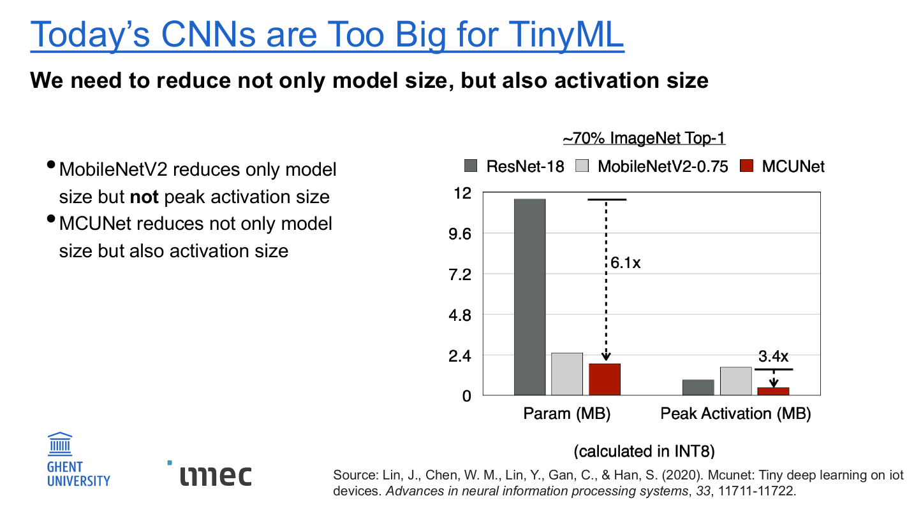

MobileNetV2 verkleint alleen de **model size**, niet de **peak activation size**. **MCUNet** verkleint béide (6.1× minder parameters, 3.4× minder peak activation t.o.v. ResNet-18) bij ~70% ImageNet top-1.

> **📝 jouw notitie:** *MCUNet optimaliseert het model óók op activatiegrootte, MobileNetV2 doet dat niet.*

---

# 7. TinyML Applications

## Tiny Image Classification

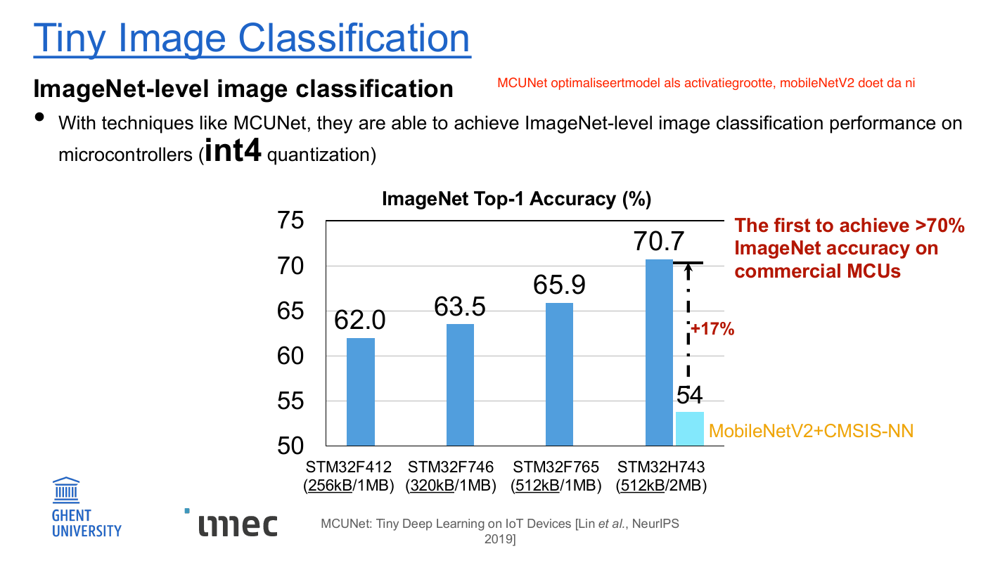

Met technieken zoals MCUNet en **int4-quantization** haal je ImageNet-niveau beeldherkenning op een MCU. MCUNet is het eerste dat **>70% ImageNet-accuracy op commerciële MCU's** behaalt (70.7% op STM32H743), +17% t.o.v. MobileNetV2+CMSIS-NN.

## Visual Wake Words (VWW)

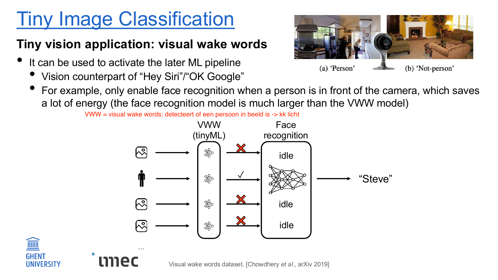

> **📝 jouw notitie:** *VWW = visual wake words: detecteert of er een persoon in beeld is → heel licht model.*

VWW is de visuele tegenhanger van "Hey Siri"/"OK Google": een **klein, energiezuinig model** dat enkel detecteert of er een persoon is. Pas als er een persoon wordt gedetecteerd, wordt de **veel grotere** face-recognition-pijplijn geactiveerd. Zo bespaar je veel energie (de meeste frames zijn "geen persoon" → idle).

## Audio Deep Learning — Keyword Spotting

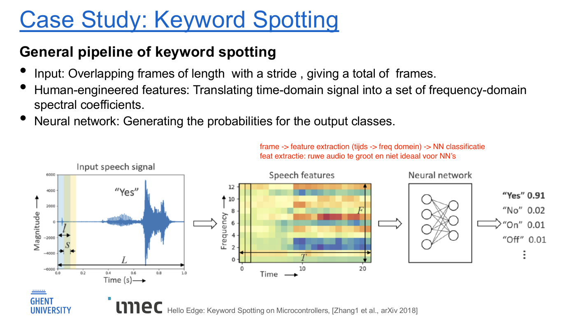

Pijplijn: ruw spraaksignaal → **feature extraction** → neuraal netwerk → kansen per klasse ("Yes" 0.91, "No" 0.02, …).

> **📝 jouw notitie:** *frame → feature extraction (tijdsdomein → frequentiedomein) → NN-classificatie. Feature-extractie nodig omdat ruwe audio te groot en niet ideaal is voor NN's.*

Concreet: overlappende frames van lengte *l* met stride *s* → tijdsdomeinsignaal wordt vertaald naar frequentiedomein-coëfficiënten (spectrogram), en het NN genereert de output-kansen.

## Anomaly Detection

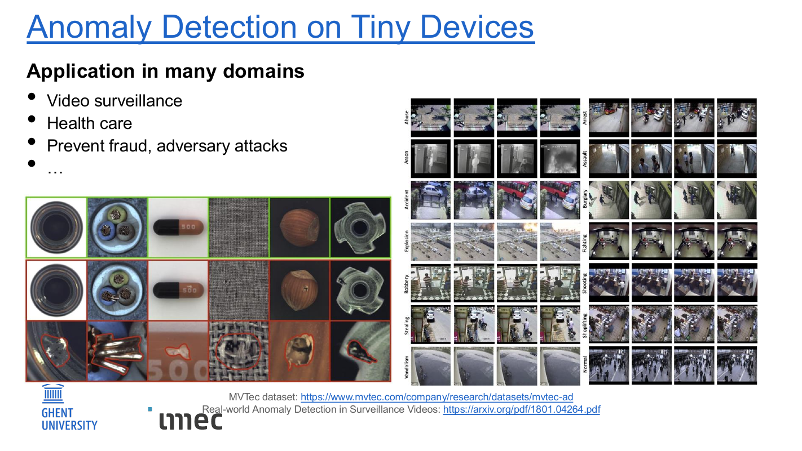

Toepassingen in vele domeinen: video surveillance, health care, fraude/aanvallen voorkomen. (Voorbeelddatasets: MVTec voor industriële defecten, surveillancevideo's voor abnormaal gedrag.)

### Anomaliedetectie met autoencoders

Een **autoencoder** is een NN dat zijn eigen **input voorspelt** (ideaal: x' = x), via Encoder → Code vector → Decoder.

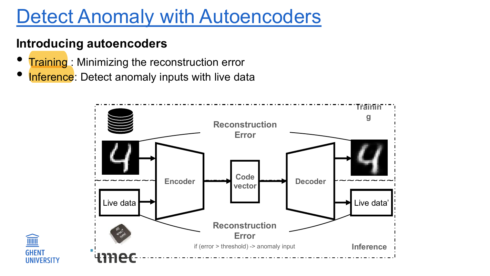

- **Training:** minimaliseer de **reconstruction error** op normale data.
- **Inference:** voer live data in; **als (error > threshold) → anomaly input** (het netwerk kan abnormale data slecht reconstrueren).
- Eigenschappen: **Unsupervised** (geen labels nodig), **Data-specific** (werkt enkel op data gelijkaardig aan de trainingset), **Lossy** (output ≠ exact de input).

### Voorbeeld: ventilator-anomaliedetectie

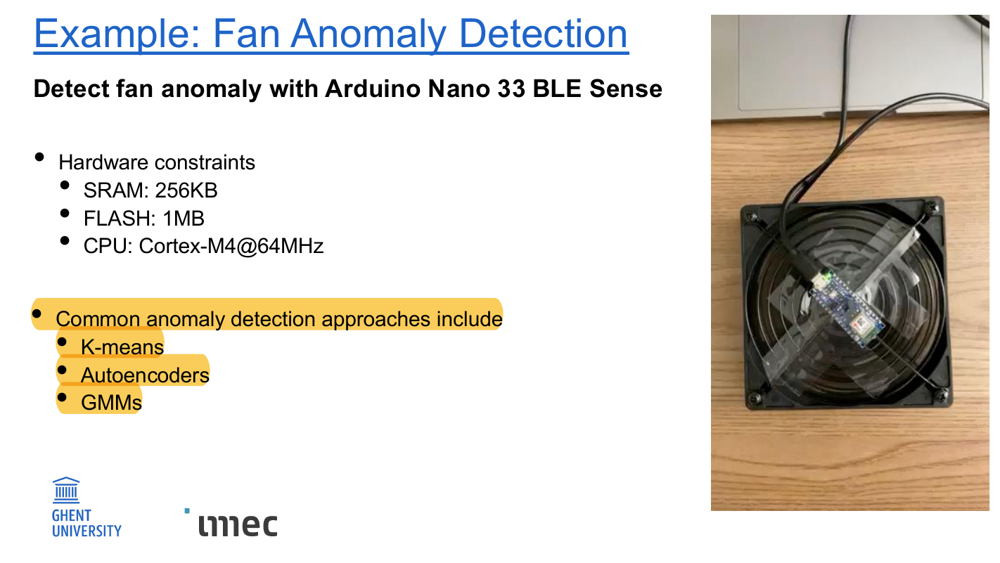

Detecteer een defecte ventilator met de Arduino Nano 33 BLE Sense (SRAM 256KB, Flash 1MB, Cortex-M4 @ 64MHz). Gangbare aanpakken: **K-means, Autoencoders, GMMs** (Gaussian Mixture Models).

---

# 8. ML workflow

## AI-infrastructuur en sensoren

De volledige ML-keten rust op **AI Infrastructure**, opgebouwd uit vier lagen: **Data Engineering → Model Engineering → Model Deployment → Product Analytics.** De inputkant zijn sensoren:

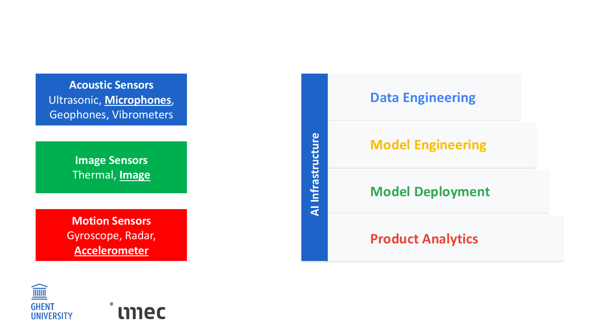

Sensortypes: **Acoustic** (Ultrasonic, Microphones, Geophones, Vibrometers), **Image** (Thermal, Image), **Motion** (Gyroscope, Radar, Accelerometer).

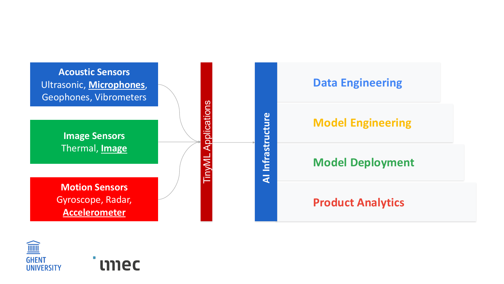

## Welke tool waar? TensorFlow vs LiteRT vs LiteRT Micro

De ML-workflow heeft 8 stappen, en verschillende frameworks dekken verschillende stappen:

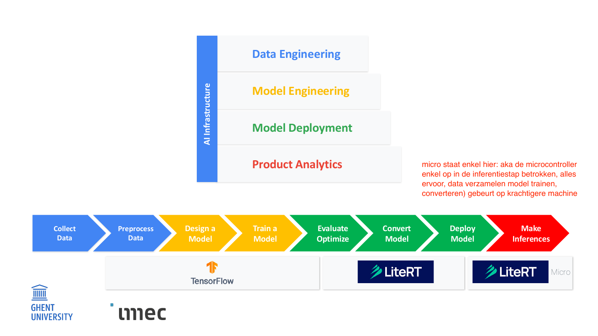

- **TensorFlow:** Collect Data → Preprocess → Design → **Train**.
- **LiteRT:** Evaluate/Optimize → Convert → Deploy.
- **LiteRT Micro:** Make Inferences.

> **📝 jouw notitie:** *"micro" staat enkel hier: de microcontroller is enkel bij de inferentiestap betrokken. Alles ervóór (data verzamelen, model trainen, converteren) gebeurt op een krachtigere machine.*

## Wat zit er in elke laag?

Rond de centrale "ML Code" zit veel meer infrastructuur dan enkel het model:

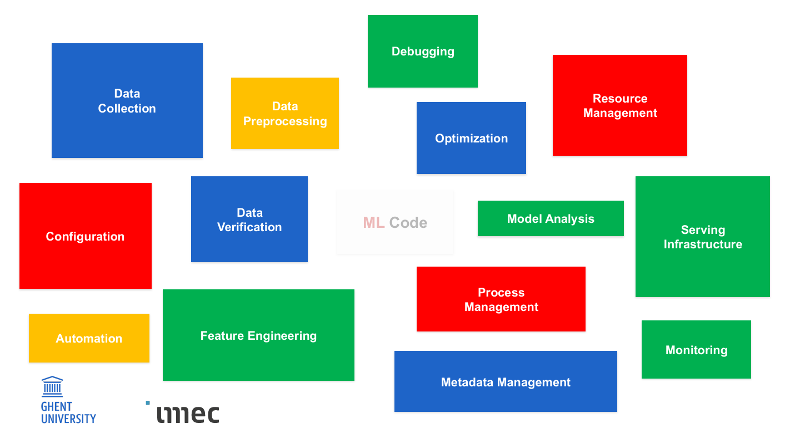

Data Collection, Data Preprocessing, Data Verification, Feature Engineering, Configuration, Automation, Debugging, Optimization, Model Analysis, Process Management, Resource Management, Serving Infrastructure, Monitoring, Metadata Management… — de eigenlijke ML-code is maar een klein onderdeel van een productiesysteem.

### Data Engineering (de 7 stappen)

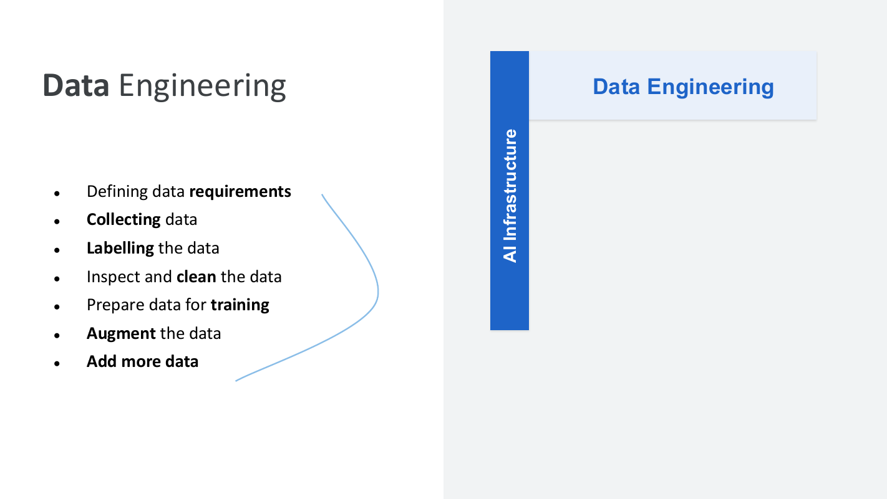

1. Defining data **requirements**
2. **Collecting** data
3. **Labelling** the data
4. Inspect and **clean** the data
5. Prepare data for **training**
6. **Augment** the data
7. Add **more data**

### Model Engineering (de stappen)

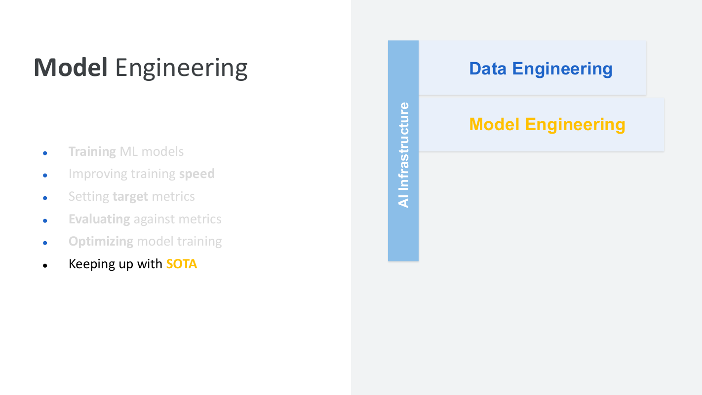

1. **Training** ML models
2. Improving training **speed**
3. Setting **target** metrics
4. **Evaluating** against metrics
5. **Optimizing** model training
6. Keeping up with **SOTA** (state-of-the-art)

### Model Deployment (de stappen)

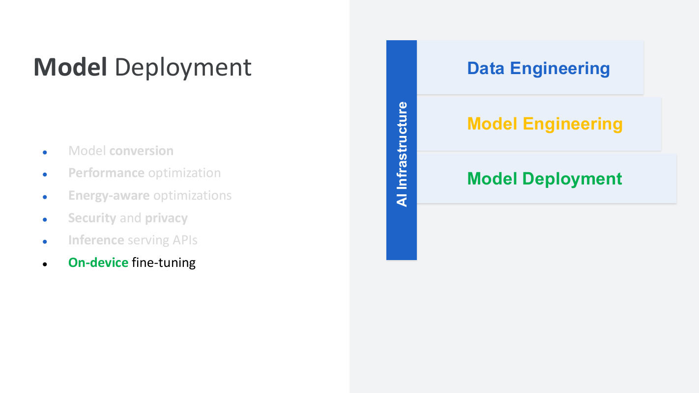

1. Model **conversion**
2. **Performance** optimization
3. **Energy-aware** optimizations
4. **Security** and **privacy**
5. **Inference** serving APIs
6. **On-device** fine-tuning

### Product Analysis (de stappen)

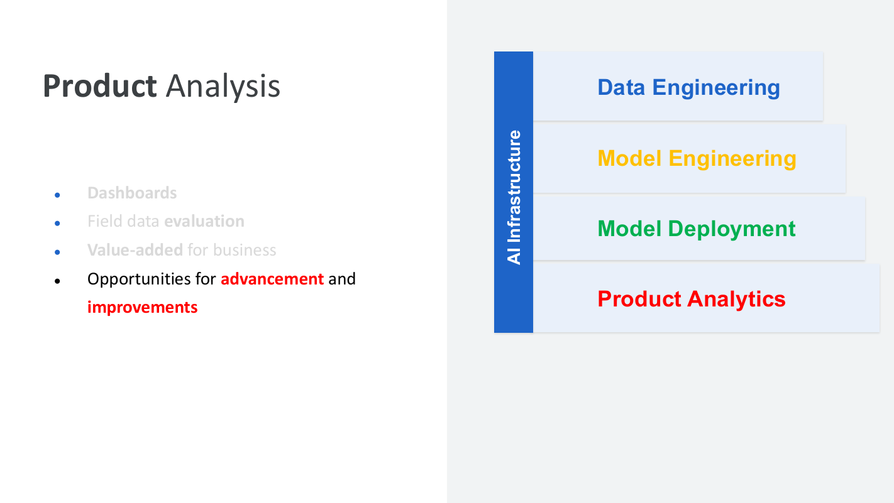

1. **Dashboards**
2. Field data **evaluation**
3. **Value-added** for business
4. Opportunities for **advancement** and **improvements**

---

# 9. ML Lifecycle

De volledige levenscyclus is een **lus** (geen rechte lijn):

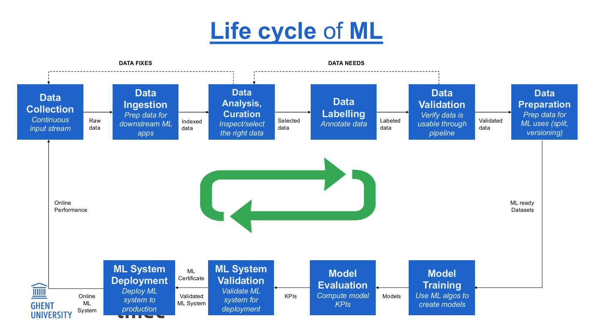

**Data Collection** → Data Ingestion → Data Analysis/Curation → Data Labelling → Data Validation → Data Preparation → **Model Training** → Model Evaluation → ML System Validation → **ML System Deployment** → (online performance/data feeds terug naar Data Collection).

Twee terugkoppellussen bovenaan: **DATA FIXES** (problemen in de data corrigeren) en **DATA NEEDS** (nieuwe data verzamelen waar het model tekortschiet). Korte beschrijving per stap:

- **Data Collection** — continue input stream → ruwe data
- **Data Ingestion** — data klaarmaken voor downstream ML-apps → geïndexeerde data
- **Data Analysis/Curation** — de juiste data inspecteren/selecteren
- **Data Labelling** — data annoteren
- **Data Validation** — verifiëren dat data bruikbaar is doorheen de pijplijn
- **Data Preparation** — data klaarmaken (split, versioning) → ML-ready datasets
- **Model Training** — ML-algoritmes gebruiken om modellen te maken
- **Model Evaluation** — model-KPI's berekenen
- **ML System Validation** — ML-systeem valideren voor deployment
- **ML System Deployment** — ML-systeem in productie zetten

---

# 10. ML Frameworks

## De frameworks in de workflow

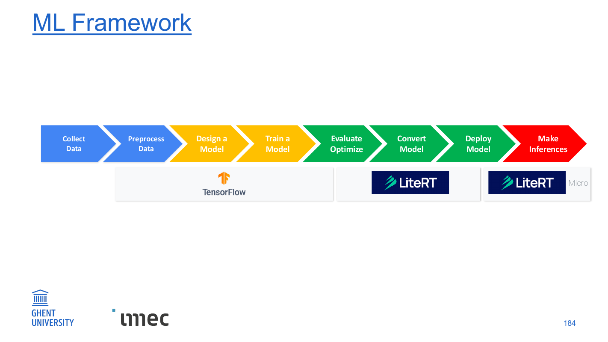

Zelfde plaatje als §8: **TensorFlow** (data → training), **LiteRT** (evaluate → deploy), **LiteRT Micro** (inference op MCU).

## Wat hebben ze gemeen?

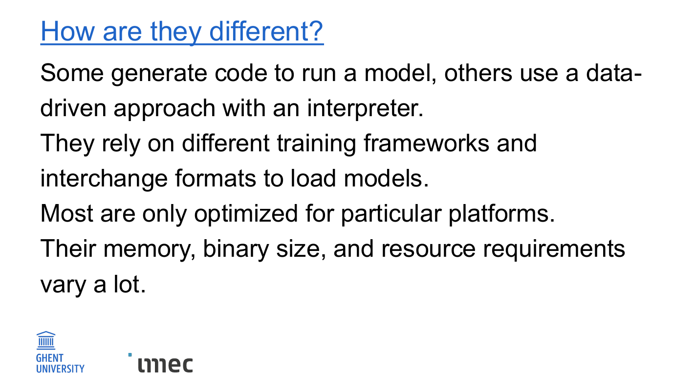

- Allemaal geoptimaliseerd voor de **resource-constraints** van embedded toestellen (geheugen, compute).
- Allemaal **importeren modellen** uit een apart trainings-framework.
- Allemaal gebruiken **C of C++**.

**Hoe verschillen ze?** Sommige genereren code om een model te draaien, andere gebruiken een data-driven aanpak met een **interpreter**. Ze steunen op verschillende trainings-frameworks en uitwisselformaten, zijn vaak voor specifieke platformen geoptimaliseerd, en hun geheugen/binary-grootte/resource-eisen lopen sterk uiteen.

**Hoe kies je er één?** Afhankelijk van je toepassing: welke frameworks ondersteunen jouw hardware/IDE? Welk trainings-framework gebruik je en waarnaar kun je exporteren? Documentatie en voorbeeldcode? Compute/geheugen-constraints? Bestaande ervaring?

---

# 11. Inference Engines: TensorFlow, LiteRT en LiteRT Micro

## De volledige pijplijn: van TF-model tot MCU

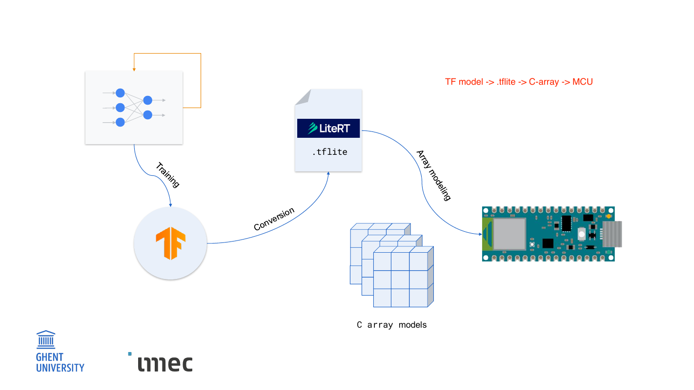

> **📝 jouw notitie:** *TF model → .tflite → C-array → MCU.*

De stappen:
1. **Training** in **TensorFlow** (het netwerk wordt getraind).
2. **Conversion** → een **`.tflite`**-bestand (LiteRT-formaat).
3. **Array modeling** → het `.tflite`-model wordt omgezet naar een **C-array** en op de **MCU** (Arduino) geplaatst.

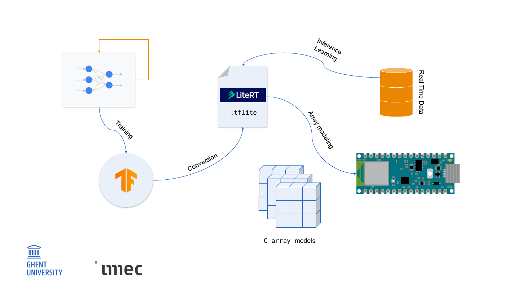

Op het toestel doet de MCU **inference/learning** op **real-time data**.

## Vergelijkingstabel — Model

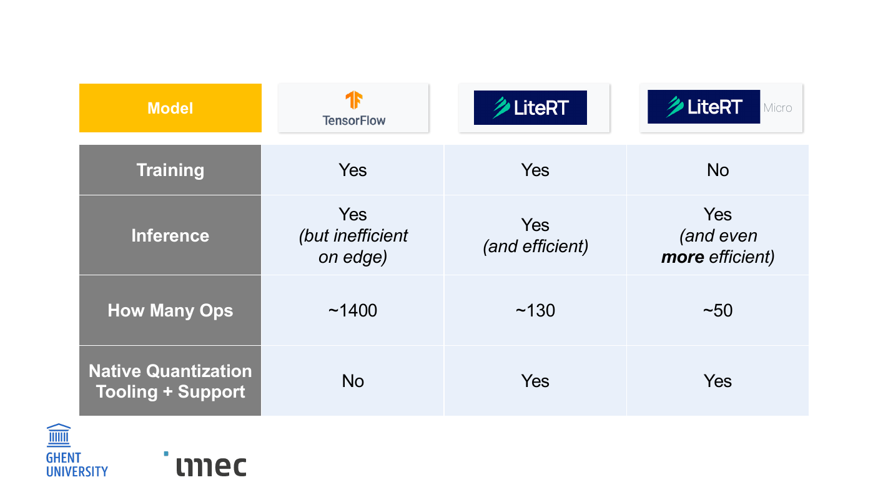

| | TensorFlow | LiteRT | LiteRT Micro |
|---|---|---|---|
| **Training** | Yes | Yes | **No** |
| **Inference** | Yes (maar inefficiënt op edge) | Yes (en efficiënt) | Yes (en **nóg** efficiënter) |
| **How Many Ops** | ~1400 | ~130 | **~50** |
| **Native Quantization Tooling + Support** | No | Yes | Yes |

Naarmate je naar TinyML beweegt: minder operatoren ondersteund, maar veel efficiëntere inferentie en ingebouwde quantization.

## Vergelijkingstabel — Software

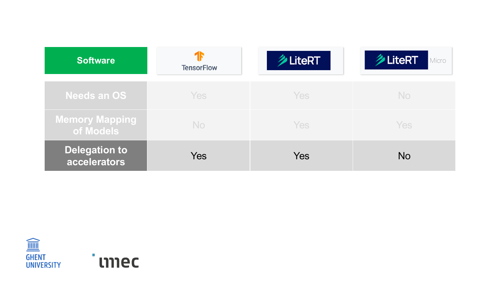

| | TensorFlow | LiteRT | LiteRT Micro |
|---|---|---|---|
| **Needs an OS** | Yes | Yes | **No** |
| **Memory Mapping of Models** | No | Yes | Yes |
| **Delegation to accelerators** | Yes | Yes | **No** |

LiteRT Micro draait **bare metal** (geen OS nodig) — essentieel voor de kleinste MCU's.

## Vergelijkingstabel — Hardware

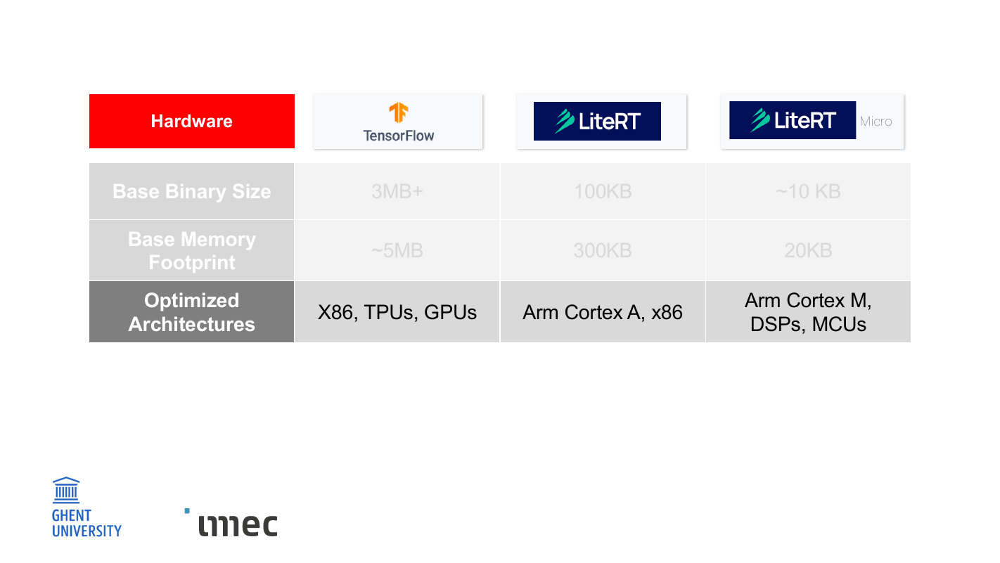

| | TensorFlow | LiteRT | LiteRT Micro |
|---|---|---|---|
| **Base Binary Size** | 3MB+ | 100KB | **~10 KB** |
| **Base Memory Footprint** | ~5MB | 300KB | **20KB** |
| **Optimized Architectures** | X86, TPUs, GPUs | Arm Cortex-A, x86 | **Arm Cortex-M, DSPs, MCUs** |

LiteRT Micro is ~300× kleiner in binary dan TensorFlow en is specifiek geoptimaliseerd voor de **Cortex-M / DSP / MCU**-hardware uit §1–2.

---

# Kernpunten om te onthouden

1. **Embedded systeem = sense → process → actuate** met terugkoppeling. Ontwikkelbord van dit vak = Arduino Nano 33 BLE Sense (Cortex-M4, 256kB RAM, 1MB flash).
2. **Cortex-M-familie** is genest; de **M4 heeft DSP+FPU met snelle MAC** → ideaal voor NN's, want neuronen = MAC-operaties (a·b+c).
3. **Softwarestack op MCU:** mbed OS (HW-abstractie/drivers) → Arduino (libs) → TF Micro (inferentie). Geheugen is het knelpunt; modules verwijderen + **quantization (32-bit float → 8-bit int)** besparen flash/RAM.
4. **NN-recap:** neuron (weights+bias+activatie) → lagen → matrixvorm → softmax (kansen, Σ=1). Trainen = total cost minimaliseren via **gradient descent + backpropagation**.
5. **TinyML:** Cloud → Mobile → **Tiny** (IoT/MCU). Voordelen: ubiquitous, low-cost, low-power, privacy. Modellen van vandaag (GPT-3: 170B) zijn veel te groot.
6. **Uitdaging:** Tiny AI heeft maar **320kB RAM / 1MB flash** = 13.000–100.000× kleiner. Je moet **zowel weights (→ flash, statisch) als activations (→ SRAM, dynamisch, kijk naar peak)** verkleinen. Memory-constraint is dé extra moeilijkheid t.o.v. mobile.
7. **MCUNet** verkleint model **én** peak activation (MobileNetV2 enkel het model) → >70% ImageNet op een MCU.
8. **Toepassingen:** image classification, visual wake words (lichte trigger voor zwaardere pijplijn), keyword spotting (feature-extractie naar frequentiedomein), anomaliedetectie met autoencoders (reconstruction error > threshold → anomalie).
9. **ML-workflow/lifecycle:** veel meer dan modelcode — data engineering, model engineering, deployment, product analytics; lifecycle is een lus met DATA FIXES/NEEDS-terugkoppeling. **De MCU is enkel betrokken bij inferentie.**
10. **Frameworks:** **TF model → .tflite → C-array → MCU.** TensorFlow (train, ~1400 ops, 3MB+) → LiteRT (deploy, efficiënt) → **LiteRT Micro** (inferentie op MCU, ~50 ops, ~10KB binary, geen OS, voor Cortex-M/DSP).

---

# 📝 Oefenvragen

*Probeer eerst zelf te antwoorden; de uitwerking staat telkens eronder.*

### Begripsvragen

> **V1.** Wat zijn de drie bouwblokken van elk embedded systeem, en geef per blok een voorbeeld uit de Amazon Echo Dot.

Antwoord

**sense → process → actuate**, met terugkoppeling via de fysische wereld.
- sense = de **microfoons**
- process = de **processor-chip** op de PCB
- actuate = de **luidspreker**

> **V2.** Waarom is de ARM Cortex-M4 bijzonder geschikt voor TinyML, in vergelijking met een M0/M3?

Antwoord

De M-cores zijn genest: de M4 kan alles van de M0/M3, plus hij voegt een **DSP (SIMD, Fast MAC)** en een **FPU** toe. Neuronen berekenen = MAC-operaties (a·b+c); een snelle hardware-MAC versnelt matrixvermenigvuldigingen, dus NN-inferentie. Daarom gebruikt de Arduino Nano 33 BLE Sense een Cortex-M4.

> **V3.** Wat is quantization en met welke factor verkleint 32-bit float → 8-bit int een model ongeveer?

Antwoord

Quantization = getallen met hoge precisie omzetten naar lagere precisie (32-bit floats → 8-bit ints). Dat is 4× minder bits per getal → model én activaties worden ~**4×** kleiner.

> **V4.** Bij het geheugengebruik van een TinyML-toepassing bleek de **audio buffer** het grootste blok te zijn. Welke les trek je daaruit?

Antwoord

Het **model is maar één deel** van het geheugen — de **inputdata** (audio buffer) kan zelfs méér innemen dan het model. Je moet dus op meerdere niveaus optimaliseren (minder compute / minder geheugen / quantization) en ML-systemen op een MCU ontwerpen rond **geheugenlimieten**, niet rond maximale accuracy.

> **V5.** Leg het verschil uit tussen **flash** en **SRAM** bij het draaien van een CNN op een MCU. Waarom kijk je bij SRAM naar de *peak* en niet de som?

Antwoord

- **Flash** = niet-vluchtig, **statisch** → bevat het volledige **model (weights)**. Bv. 1MB flash, model 900kB → past.
- **SRAM** = **dynamisch** werkgeheugen tijdens inferentie → houdt de **input + output activations** bij (niet de gewichten, die staan in flash).
SRAM verschilt per laag; op één moment is maar één laag actief, dus je kijkt naar het **maximum (peak)** dat op één moment nodig is, niet naar de som over alle lagen.

>**V6.** Wat doet MCUNet beter dan MobileNetV2, en waarom is dat belangrijk voor TinyML?

Antwoord

MobileNetV2 verkleint enkel de **model size**. MCUNet verkleint **zowel model size als peak activation size**. Omdat de **memory-constraint** (320kB RAM) dé extra moeilijkheid van TinyML is, moet je net de activaties óók verkleinen → daardoor haalt MCUNet >70% ImageNet-accuracy op een commerciële MCU.

>**V7.** Hoe werkt anomaliedetectie met een autoencoder (training vs inference)? Noem de drie eigenschappen van een autoencoder.

Antwoord

- **Training:** minimaliseer de **reconstruction error** op normale data (Encoder → Code → Decoder, ideaal x'=x).
- **Inference:** voer live data in; als **error > threshold** → **anomalie** (abnormale data wordt slecht gereconstrueerd).
- Eigenschappen: **Unsupervised** (geen labels), **Data-specific** (enkel data gelijkaardig aan trainingset), **Lossy** (output ≠ exact de input).

> **V8.** In de keten **TensorFlow → LiteRT → LiteRT Micro**: bij welke stap is de microcontroller betrokken, en waarom heet het "Micro"?

Antwoord

De MCU is **enkel bij de inferentie-stap** ("Make Inferences") betrokken. Alles ervóór — data verzamelen, model trainen (TensorFlow), evalueren/converteren/deployen (LiteRT) — gebeurt op een krachtigere machine. "Micro" staat enkel bij de laatste stap omdat dat het deel is dat op de microcontroller draait.

### Vergelijkings-/inzichtvragen

> **V9.** Vul de orde van grootte in: het activatiegeheugen van Tiny AI is ongeveer ___× kleiner dan Mobile en ___× kleiner dan Cloud. Wat is het concrete RAM/flash-budget van Tiny AI?

Antwoord

**13.000×** kleiner dan mobile, **100.000×** kleiner dan cloud. Tiny AI ≈ **320 kB** activatiegeheugen (RAM) en **1 MB** opslag (flash) voor de weights.

> **V10.** Waarom kan TensorFlow zelf niet zomaar op een MCU draaien, maar LiteRT Micro wel? Noem twee redenen uit de vergelijkingstabellen.

Antwoord

TensorFlow heeft een **base binary ~3MB+** en **footprint ~5MB**, ondersteunt ~1400 ops en **vereist een OS**. LiteRT Micro heeft een binary van **~10KB**, footprint **~20KB**, ~50 ops, **geen OS nodig** (draait bare metal) en is geoptimaliseerd voor Cortex-M/DSP/MCU. De MCU-budgetten (kB-MB) zijn veel te klein voor TensorFlow.

### 🎯 Kernonderwerpen — één gerichte vraag per belangrijk slide-onderwerp

*In de volgorde van de slides (§1 → §11). Probeer eerst zelf; de uitwerking staat eronder.*

> **E1 — Embedded hardware: MCU vs DSP vs ASIC (§1).** Wat is het verschil tussen een MCU, een DSP en een ASIC? Wat valt op aan de woordbreedte en het geheugen van de vier embedded boards uit het vak?

Antwoord

- **MCU** — general-purpose microcontroller (CPU + geheugen + I/O op één chip).
- **DSP** — Digital Signal Processor, geoptimaliseerd voor signaalverwerking (de **Himax WE-I Plus** gebruikt een DSP i.p.v. een MCU).
- **ASIC** — chip op maat van één toepassing.

Alle vier de borden (Himax, **Arduino Nano 33 BLE Sense**, SparkFun Edge 2, Espressif EYE) zijn **32-bit**, met klok 48–400 MHz en slechts **kB tot enkele MB geheugen** (bv. Arduino: 1MB flash / 256kB RAM) — minuscuul vergeleken met een PC. DSP/ASIC zijn alternatieven voor een MCU wanneer je meer signaalverwerking nodig hebt.

> **E2 — ARM Cortex-profielen (§2).** ARM verdeelt zijn Cortex-cores in drie families. Welke, waarvoor dienen ze, en welke is relevant voor TinyML?

Antwoord

- **Cortex-A (Applications)** — krachtigst, draait een volledig OS; smartphones/laptops.
- **Cortex-R (Real-time)** — real-time toepassingen.
- **Cortex-M (Microcontrollers)** — laagste vermogen; embedded/TinyML → **de relevante familie** (de Nano gebruikt een **Cortex-M4**).

Ze worden geplaatst volgens **vermogen** (verticaal) en **pipeline-complexiteit** (horizontaal). De M-cores zijn genest: de M4 voegt **DSP (SIMD, Fast MAC) + FPU** toe.

> **E3 — De volledige stack op de Nano 33 BLE Sense (§3).** Som de softwarelagen op het Arduino-bord op, van hardware tot applicatie, en zeg wat elke laag doet. Waarom zitten er zoveel lagen tussen je ML-code en de chip?

Antwoord

De lagen staan op de foto (onder = hardware, boven = applicatie). Kort wat elke laag doet:
- **mbed OS** — embedded OS: drivers, timing, I/O en hardware-abstractie (intern via CMSIS-Core / Drivers HAL / MCU SDK). De **Mbed OS API** geeft gestandaardiseerde functies zodat je app niet rechtstreeks met registers praat.
- **Arduino** — programmeerlaag met libs om snel hardware aan te sturen.
- **TF Micro Application** — voert de ML-inferentie uit op de microcontroller.

Waarom zoveel lagen: er zitten **meerdere abstractielagen** tussen ML-code en hardware. Op een MCU heb je geen Linux/Windows en geen luxe zoals automatische memory management of een filesystem → de stack moet **lichtgewicht en hardware-dicht** zijn. Fundamenteel anders dan ML op PC/cloud.

> **E4 — Geheugengebruik: resource aware zijn (§3).** Uit welke blokken bestaat het RAM-gebruik tijdens inferentie? Welk blok is vaak het grootst, en wat betekent "resource aware" ontwerpen op een MCU?

Antwoord

De blokken staan op de foto (Application Code, runtime, Model, Working Memory, Audio Buffer). Het **model is maar één deel** van het geheugen; de **audio buffer (inputdata)** is vaak het **grootste blok** — méér dan het model zelf. Resource aware = **optimaliseren op meerdere niveaus** (minder compute / minder geheugen / quantization) en je ML-systeem ontwerpen **rond de geheugenlimieten**, niet rond maximale accuracy.

> **E5 — Modules verwijderen om geheugen te besparen (§3).** Naast quantization: hoe kan je nog flash en RAM besparen op een embedded OS? Geef het voorbeeld uit de slides.

Antwoord

Door **onnodige modules te verwijderen** uit de OS-build. Een embedded OS bevat modules die je niet altijd nodig hebt — bv. `features/frameworks` bevat **test-tools die in elke binary worden meegebouwd** (1K RAM + 8K flash). Door zulke modules te elimineren bespaar je flash en RAM: mbed OS 5 ging van **57K → 49K flash** en **13K → 12K RAM**.

> **E6 — Het neuron en activatiefuncties (§4).** Hoe berekent één neuron zijn output? En waarom heb je een activatiefunctie nodig — noem er enkele.

Antwoord

Een neuron neemt inputs a₁…a_K, vermenigvuldigt ze met **gewichten** w₁…w_K en telt een **bias** b op: **z = Σ aᵢwᵢ + b** (= een **MAC**-operatie). Daarna gaat z door een **activatiefunctie** σ(z) → output a. De activatie voegt **niet-lineariteit** toe — zonder zou het hele netwerk samenvallen tot één lineaire functie. Gangbare functies: **sigmoid** (1/(1+e⁻ᶻ)), **tanh**, **ReLU** (max(0,z), de standaard in moderne netten), softplus, unit step, sign, (piece-wise) linear.

> **E7 — Matrixvorm en softmax (§4).** Schrijf het hele netwerk in matrixvorm. Wat doet de softmax-laag en welke twee eigenschappen heeft zijn output?

Antwoord

Matrixvorm: **y = f(x) = σ(Wᴸ … σ(W²σ(W¹x + b¹) + b²) … + bᴸ)** — puur matrixvermenigvuldigingen, dus versnelbaar met **parallel computing** (GPU/DSP, opnieuw MAC's). De **softmax** zet de output-scores z om naar **kansen**: yᵢ = e^(zᵢ)/Σⱼe^(zⱼ). Eigenschappen: elke **0 < yᵢ < 1** en **Σ yᵢ = 1** → een echte waarschijnlijkheidsverdeling over de klassen. Bv. z=[3,1,−3] → y≈[0.88, 0.12, ≈0].

> **E8 — Training: cost en total cost (§4).** Wat is het verschil tussen *cost* en *total cost*, en hoe vind je de optimale parameters θ*?

Antwoord

- **Cost** L(θ) = fout **per voorbeeld** (Euclidische afstand of cross-entropy tussen output en target).
- **Total cost** C(θ) = **Σ L^r(θ)** over álle trainingsdata = "hoe slecht presteren de parameters θ op deze taak".

Je zoekt **θ\*** die C(θ) **minimaliseert** via **gradient descent** (stapsgewijs naar het minimum rollen) + **backpropagation** (forward pass berekent output, backward pass propageert de fout terug → gradiënten). Let op: gradient descent kan in een **local minimum** blijven steken i.p.v. het global minimum.

> **E9 — De AI van vandaag is te groot (§5).** Waarom is "de AI van vandaag te groot" voor embedded? Geef cijfers van GPT-3.

Antwoord

NLP-modellen groeien exponentieel: Transformer (0.05B) → BERT (0.34B) → GPT-2 (1.5B) → **GPT-3 (175B parameters)**. GPT-3: **355 GPU-jaren** training, kost **~$4.6M**. AlphaGo: 1920 CPU's + 280 GPU's, ~$3000 elektriciteit per spel. → nood aan nieuwe algoritmes/hardware voor **TinyML & Green AI**: lage energie, lage latency, lage kost, betere privacy.

> **E10 — Waarom TinyML? Miljarden IoT-toestellen (§5).** Geef de vier argumenten waarom TinyML aantrekkelijk is, gekoppeld aan de miljarden IoT-toestellen.

Antwoord

- **Ubiquitous** — miljarden MCU-gebaseerde IoT-toestellen wereldwijd (groei richting ~50 miljard units).
- **Low-cost** ($0.1–$10) — ook mensen met laag inkomen krijgen toegang → **democratisering van AI**.
- **Low-power** (mW) — green AI, minder CO₂.
- **Various applications** — Smart Home, Smart Manufacturing, Personalized Healthcare, Precision Agriculture.

(Plus: lokale inferentie → betere **privacy** en lagere latency.)

> **E11 — TinyML-constraints verschillen van Mobile AI (§6).** Welke constraint heeft TinyML *bovenop* die van Mobile AI, en waarom maakt dat het wezenlijk moeilijker?

Antwoord

Mobile AI heeft een **latency-** en **energy-constraint**. TinyML heeft die óók, maar **daar bovenop een harde memory-constraint** (~320 kB RAM). Geheugen is het **bindende knelpunt** → daarom is TinyML wezenlijk moeilijker dan mobiele AI: je moet je hele ontwerp rond dat geheugenbudget bouwen.

> **E12 — Convolutie en waarom CNN's niet passen (§6).** Wat is de kernoperatie van een CNN, en waarom passen cloud/mobile-CNN's niet op een MCU?

Antwoord

De kernoperatie is de **convolutie**: een **input activation** wordt met een **kernel (filter)** geconvolueerd (`*`) → **output activation**. Een typische CNN: Input → (Conv + ReLU → Pooling)× → Flatten → Fully Connected → Softmax. Ze passen niet omdat de **peak SRAM** de **320 kB-constraint** ver overschrijdt: **ResNet-50 23×**, **MobileNetV2 22×**, en zelfs **MobileNetV2 (int8) nog 5×** te groot.

> **E13 — Niet alleen het model, ook de activaties verkleinen (§6).** Waarom volstaat het niet om enkel de modelgrootte te verkleinen? Illustreer met MobileNetV2 vs MCUNet.

Antwoord

De **peak activation (SRAM)** is vaak het bindende knelpunt, niet de modelgrootte (flash). **MobileNetV2** verkleint enkel de **model size** — zelfs in int8 is de **peak SRAM nog ~5× te groot** t.o.v. de 320 kB-constraint. **MCUNet** verkleint **beide**: 6.1× minder parameters **én** 3.4× minder peak activation t.o.v. ResNet-18 → past wél op een MCU, bij ~70% ImageNet top-1.

> **E14 — Visual Wake Words + Keyword Spotting (§7).** Hoe bespaart VWW energie? En uit welke stappen bestaat de keyword-spotting-pijplijn — waarom is feature-extractie nodig?

Antwoord

**VWW** = een **klein, energiezuinig model** dat enkel detecteert of er een **persoon in beeld** is. Pas bij detectie wordt de **veel grotere** face-recognition-pijplijn geactiveerd. De meeste frames zijn "geen persoon" → blijven idle → **veel energiebesparing**.

**Keyword spotting:** ruw spraaksignaal → **overlappende frames** (lengte *l*, stride *s*) → **feature extraction** (tijdsdomein → frequentiedomein / spectrogram) → **neuraal netwerk** → kansen per klasse ("Yes" 0.91, "No" 0.02, …). Feature-extractie is nodig omdat **ruwe audio te groot en niet ideaal** is als directe NN-input.

> **E15 — ML workflow (§8).** De ML-workflow heeft 8 stappen, verdeeld over drie frameworks. Welke stappen horen bij welk framework? En hoe groot is de eigenlijke ML-code t.o.v. de rest van het systeem?

Antwoord

De foto toont welk framework welke stappen dekt: **TensorFlow** doet alles t.e.m. trainen, **LiteRT** het evalueren/optimaliseren/converteren/deployen, en **LiteRT Micro** enkel de inferentie → **de MCU is dus enkel bij de inferentiestap betrokken.**

De **eigenlijke ML-code is maar een klein onderdeel**: eromheen zit veel infrastructuur — data collection/preprocessing/verification, feature engineering, configuration, automation, debugging, optimization, model analysis, process & resource management, serving infrastructure, monitoring, metadata management.

> **E16 — ML Lifecycle (§9).** Waarom is de ML-lifecycle een **lus** en geen rechte lijn? Wat betekenen de terugkoppellussen **DATA FIXES** en **DATA NEEDS**?

Antwoord

Het is een **lus, geen rechte lijn**: na deployment voeden de **online performance / data feeds** terug naar Data Collection → het systeem verbetert continu. De volledige keten van stappen staat op de foto hierboven.

- **DATA FIXES** — problemen in de bestaande data corrigeren.
- **DATA NEEDS** — nieuwe data verzamelen daar waar het model tekortschiet.

> **E17 — Wat hebben ze gemeen? (§10).** Wat hebben TensorFlow, LiteRT en LiteRT Micro gemeen, waarin verschillen ze, en hoe kies je er één?

Antwoord

**Gemeen:** alle drie (1) geoptimaliseerd voor de **resource-constraints** van embedded toestellen (geheugen, compute), (2) **importeren modellen** uit een apart trainings-framework, (3) gebruiken **C of C++**.

**Verschillen:** sommige **genereren code** om een model te draaien, andere gebruiken een **data-driven aanpak met een interpreter**; ze steunen op verschillende trainings-frameworks/uitwisselformaten; zijn vaak voor specifieke platformen geoptimaliseerd; en hun geheugen/binary-grootte/resource-eisen lopen sterk uiteen.

**Kiezen:** hangt af van je toepassing — ondersteunt het je **hardware/IDE**? welk **trainings-framework** gebruik je en waarnaar kun je exporteren? **documentatie/voorbeeldcode**? **compute/geheugen-constraints**? bestaande **ervaring**?

> **E18 — Vergelijkingstabellen TF vs LiteRT vs LiteRT Micro (§11).** Vergelijk de drie op aantal ops, "needs an OS" en binary size. Wat is de algemene trend richting TinyML?

Antwoord

- **#Ops:** ~1400 / ~130 / **~50**.
- **Needs an OS:** Yes / Yes / **No** (LiteRT Micro draait **bare metal**).
- **Base binary size:** 3MB+ / 100KB / **~10KB**; footprint ~5MB / 300KB / **20KB**.
- **Geoptimaliseerd voor:** x86/TPU/GPU → Cortex-A/x86 → **Cortex-M / DSP / MCU**.

Trend richting TinyML: **minder ondersteunde operatoren**, maar veel **efficiëntere inferentie**, **kleinere footprint**, ingebouwde **quantization**, en **geen OS** nodig.

---

# 📖 Begrippenlijst

| Begrip | Betekenis |
|---|---|
| **Embedded systeem** | Een toestel met sense → process → actuate; gespecialiseerd voor één taak (bv. Echo Dot). |
| **sense / process / actuate** | Meten (sensor) → verwerken (MCU) → aansturen (actuator), met terugkoppeling via de fysische wereld. |
| **MCU** | Microcontroller: kleine chip met CPU + geheugen + I/O op één stukje silicium. |
| **DSP** | Digital Signal Processor: chip geoptimaliseerd voor signaalverwerking (bv. de Himax). |
| **ASIC** | Application-Specific Integrated Circuit: chip op maat van één toepassing. |
| **ARM Cortex-A/R/M** | ARM-coreprofielen: A = Applications (krachtig), R = Real-time, M = Microcontroller (laag vermogen, TinyML). |
| **Cortex-M4** | M-core met **DSP (SIMD, Fast MAC) + FPU**; gebruikt in de Arduino Nano 33 BLE Sense. |
| **MAC** | Multiply-Accumulate: `a·b + c` in (idealiter) 1 klokslag; de kernoperatie van NN's. |
| **FPU** | Floating Point Unit: hardware voor floating-point berekeningen. |
| **ISA** | Instruction Set Architecture: de set instructies die een core ondersteunt (genest bij Cortex-M). |
| **mbed OS / FreeRTOS** | Lichte, real-time embedded operating systems voor microcontrollers. |
| **HAL / CMSIS-Core** | Hardware Abstraction Layer: standaardlaag tussen software en de CPU/peripherals. |
| **Flash** | Niet-vluchtig, **statisch** geheugen; bevat het **model (weights)**. |
| **SRAM** | Vluchtig, **dynamisch** werkgeheugen tijdens inferentie; bevat **activations**. Kijk naar **peak**. |
| **Peak SRAM** | Het maximale werkgeheugen dat op één moment (één laag) nodig is — de bindende constraint. |
| **Quantization** | Hoge precisie → lagere precisie (32-bit float → 8-bit int) → ~4× kleiner. |
| **Neuron** | z = Σ(aᵢ·wᵢ) + b, daarna een activatiefunctie σ(z); één neuron = een reeks MAC's. |
| **Weight / bias** | Geleerde parameters: gewicht per verbinding, bias per neuron. |
| **Activatiefunctie** | Niet-lineaire functie σ (sigmoid, tanh, **ReLU**, softplus…) op de neuron-output. |
| **ReLU** | max(0, z); standaard-activatie in moderne netwerken. |
| **Softmax** | Output-laag die scores omzet naar kansen: yᵢ = e^(zᵢ)/Σe^(zⱼ), met Σyᵢ = 1. |
| **Cost / total cost** | Fout per voorbeeld (L) resp. gesommeerd over alle data (C(θ)); te minimaliseren bij training. |
| **Gradient descent** | Optimalisatie: stapsgewijs naar het minimum van de cost-functie (let op local vs global minimum). |
| **Backpropagation** | Forward pass berekent output, backward pass propageert de fout terug → gradiënten. |
| **TinyML** | Machine learning op microcontrollers (mW-vermogen, kB-geheugen). |
| **Cloud / Mobile / Tiny AI** | Waar AI draait: datacenter (GPU/TPU) → smartphone → IoT/MCU (lokale inferentie, privacy). |
| **DNN** | Deep Neural Network. |
| **CNN** | Convolutioneel netwerk: (Conv + ReLU → Pooling)× → Flatten → FC → Softmax. |
| **Convolutie** | Input activation `*` kernel (filter) → output activation; kernoperatie van een CNN. |
| **MCUNet** | Netwerk dat **model én peak activation** verkleint → >70% ImageNet op een MCU. |
| **Visual Wake Words (VWW)** | Licht model dat enkel detecteert of er een persoon in beeld is → triggert een zwaardere pijplijn. |
| **Keyword spotting** | Audio → feature-extractie (tijd → frequentie) → NN-classificatie ("Yes"/"No"). |
| **Autoencoder** | NN dat zijn eigen input reconstrueert (Encoder → Code → Decoder); error > threshold → anomalie. |
| **TensorFlow / LiteRT / LiteRT Micro** | Train (~1400 ops, 3MB+) → deploy (efficiënt) → inferentie op MCU (~50 ops, ~10KB, geen OS). |
| **.tflite** | Het LiteRT-modelformaat; wordt omgezet naar een C-array voor de MCU. |
| **ML lifecycle** | De volledige lus van data → training → deployment, met DATA FIXES/NEEDS-terugkoppeling. |
