# Hoofdstuk 3 — Pruning and Sparsity

**Vak:** Embedded Machine Learning (E061380) — UGent / imec (IDLAB)
**College:** Lecture 03 — *Pruning and Sparsity*
**Docent:** Prof. Adnan Shahid

> Deze samenvatting volgt de PDF **structureel, in volgorde van de slides**. Belangrijke zaken worden met een foto erbij uitgelegd. Waar jij iets in het rood op de slide had geschreven, staat dat als **📝 jouw notitie**. Bij de slides staat hier en daar wat **extra context** die je anders zou moeten opzoeken — maar zonder het wiel opnieuw uit te vinden.

---

## 0. Waar past dit college in het vak?

Dit is het derde college. Pruning en sparsity zijn — samen met quantization (Lect04) — de twee belangrijkste technieken om een neuraal netwerk **kleiner en sneller** te maken zodat het op embedded hardware draait.

| Lecture | Onderwerp |
|---|---|
| 1 | Introduction |
| 2 | Overview of Embedded Systems en ML/DL Overflow |
| **3** | **Pruning and Sparsity** ← dit college |
| 4 | Quantization |
| 5 | Lab Pruning and Quantization |
| 6 | Neural Architecture Search |
| 7 | Lab Pruning and Quantization op Nano 33 BLE |
| 8 | Knowledge Distillation |
| 9 | Distributed training, on-device learning & Transfer Learning |
| 10 | Lab Knowledge Distillation & Federated Learning |

**Rode draad van het college (de 5 vragen die pruning beantwoordt):**
1. **Motivatie** — waarom efficiënte ML?
2. **Granularity** — *in welk patroon* prunen we?
3. **Criterion** — *welke* synapsen/neuronen gooien we weg?
4. **Pruning ratio** — *hoeveel* sparsity per laag?
5. **Fine-tune** — hoe herstellen we de accuracy na het prunen?

---

# DEEL 1 — Motivatie voor efficiënte ML

## 1.1 "Today's AI is too BIG"

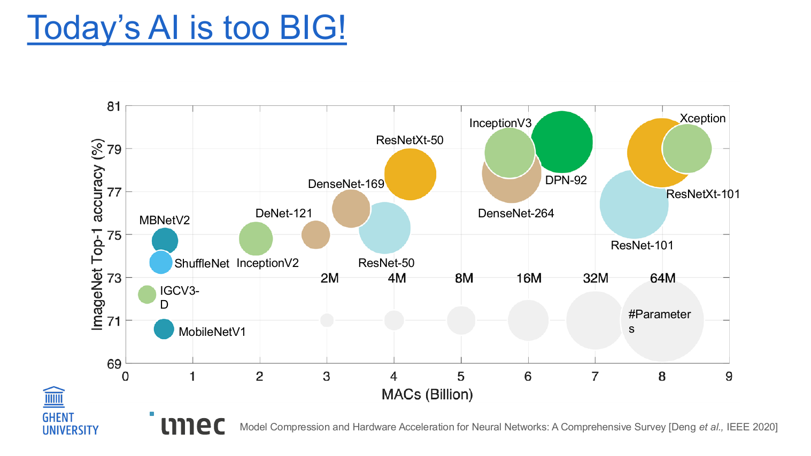

De bubble chart zet drie zaken tegen elkaar:
- **x-as:** MACs (Billion) = rekenwerk (Multiply-Accumulate operaties)
- **y-as:** ImageNet Top-1 accuracy
- **bubbelgrootte:** aantal parameters (#Parameters)

**Kernidee:** om iets meer accuracy te halen betaal je een *enorme* prijs in rekenwerk én geheugen. Grote modellen (ResNetXt-101, Xception) zitten rechtsboven met dikke bubbels; efficiënte modellen (MobileNet, ShuffleNet) zitten linksonder met kleine bubbels. Voor embedded toestellen wil je net naar die linkerhoek.

> **Extra context:** een **MAC** is één keer "vermenigvuldigen en optellen" (`a·b + c`). Het is de basisbewerking in elke convolutie en dense laag, daarom is het de standaardmaat voor rekencomplexiteit.

## 1.2 Efficiënte Deep Learning is essentieel — "bridge the gap"

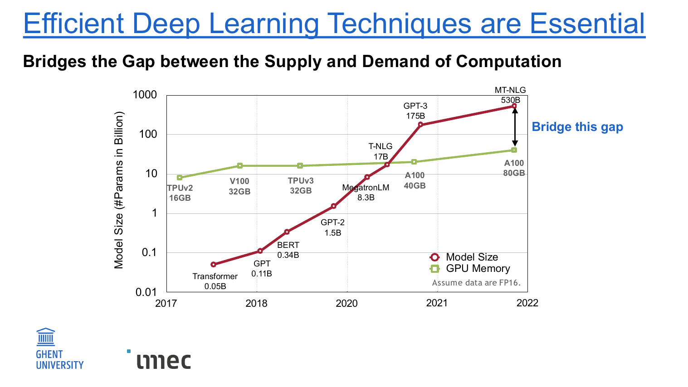

De **modelgrootte (rode lijn)** groeit veel sneller dan het **GPU-geheugen (groene lijn)**:
- Transformer (0.05B) → BERT (0.34B) → GPT-2 (1.5B) → GPT-3 (175B) → MT-NLG (530B)
- GPU's: V100 32GB → A100 40GB → A100 80GB

De modellen groeien exponentieel, het geheugen lineair → er ontstaat een **gat ("Bridge this gap")**. Efficiënte technieken zoals pruning moeten dat gat dichten.

## 1.3 MLPerf — Closed vs Open Division

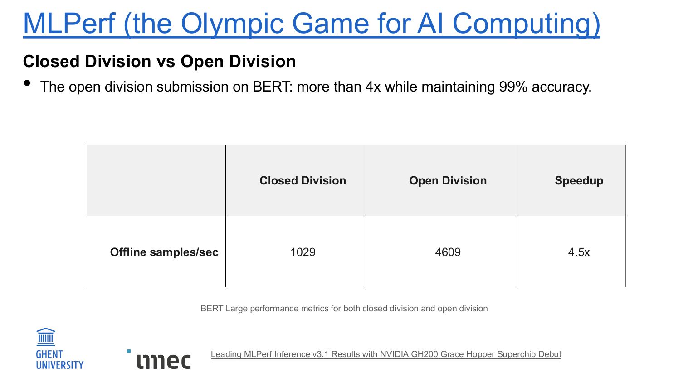

MLPerf is dé benchmark-"olympische spelen" voor AI-hardware. Er zijn twee divisies:
- **Closed Division:** je mag het model *niet* aanpassen → eerlijke hardware-vergelijking (1029 samples/sec).
- **Open Division:** je *mag* het model optimaliseren (prunen, distilleren, quantizeren) → 4609 samples/sec.

→ **4.5× speedup** terwijl 99% van de accuracy behouden blijft.

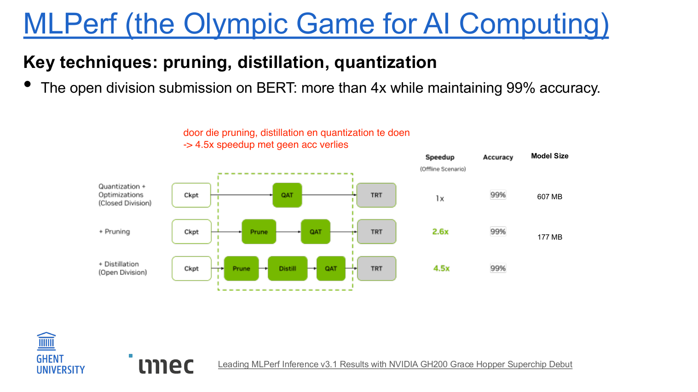

De optimalisatieketen die dat oplevert (op BERT-Large):
- Quantization alleen (QAT) → 1×, 607 MB
- \+ Pruning → 2.6×, 177 MB
- \+ Distillation → 4.5×, ~177 MB, telkens 99% accuracy

> **📝 jouw notitie:** *door die pruning, distillation en quantization te doen → 4.5x speedup met geen acc verlies.*

## 1.4 Geheugen is duur (energie!)

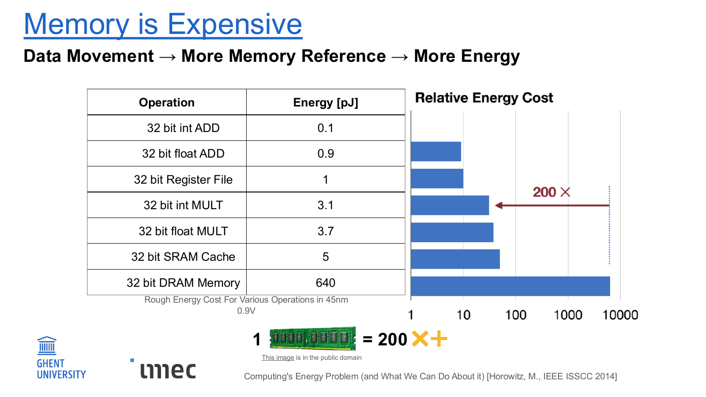

Dit is een van de belangrijkste slides van het vak: **data verplaatsen kost veel meer energie dan rekenen.**
-> data verplaatsen kost veel mee renergie dan ermee rekenen
- data verplaatsen = data uit DRAM halen is 200 keer duurder dan een vemenigvuldiging uitvoeren
voor elke `a * b + c` moet je
  - weight uit gehuegen halen (b) + activation uit geheugen halen (a, c) -> **duur**
  - vermigvuldigen + optellen -> **cheap**
  - result terug naar geheugen -> **duur**

| Operatie | Energie [pJ] |
|---|---|
| 32-bit int ADD | 0.1 |
| 32-bit float ADD | 0.9 |
| 32-bit Register File | 1 |
| 32-bit int MULT | 3.1 |
| 32-bit float MULT | 3.7 |
| 32-bit SRAM Cache | 5 |
| **32-bit DRAM Memory** | **640** |

Eén toegang tot **DRAM kost ~200× zoveel** als een vermenigvuldiging/optelling. Daarom is minder gewichten (pruning) niet enkel goed voor de opslag, maar vooral voor het **energieverbruik**: minder gewichten = minder data uit DRAM halen = minder energie. Cruciaal voor batterij-gevoede embedded toestellen.

> **Extra context:** de energiehiërarchie loopt van goedkoop (rekenen in registers/SRAM, dicht bij de ALU) naar duur (DRAM, ver weg). "Memory wall" is precies dit probleem.

Dit ene slide motiveert **alle compression-technieken**:

| Techniek | Hoe het helpt tegen het memory-probleem |
|---|---|
| **Pruning** (L3) | Minder weights → minder DRAM-accesses → minder energie |
| **Quantization** (L4) | int8 ipv float32 → 4× minder data te bewegen → 4× minder DRAM-energie |
| **Knowledge Distillation** (L8) | Kleiner model → past in SRAM ipv DRAM → 128× minder energie per access |
| **NAS** (L7) | Zoek architecturen die memory-efficient zijn |
| **TinyML in het algemeen** | Model klein genoeg om volledig in SRAM/flash te houden → vermijd DRAM compleet |

Dit zijn de cijfers/feiten die je écht moet onthouden:

1. **DRAM access ≈ 200× duurder dan een MAC** (de "200×" pijl op de slide)
2. **Memory hiërarchie**: register < SRAM < DRAM, met grote sprongen ertussen
3. **De kernboodschap**: "Data movement is the bottleneck, not computation"
4. **Implicatie voor design**: minimaliseer geheugen-toegang, vooral naar DRAM

---

# DEEL 2 — Introduction to pruning

## 2.1 Pruning gebeurt ook in het menselijk brein

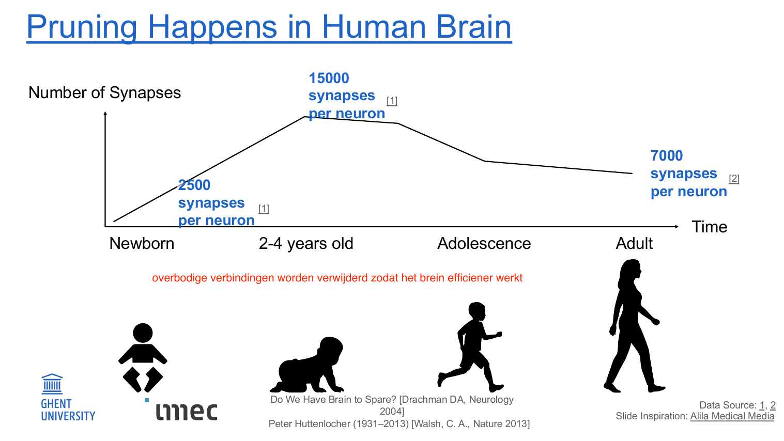

Biologische analogie voor het aantal synapsen per neuron:
- Newborn: ~2 500
- 2–4 jaar: piek op ~15 000 (synapsen per neuron)
- Adolescentie → daling
- Volwassen: ~7 000

Het brein bouwt eerst véél verbindingen op en **snoeit** dan de overbodige weg → efficiënter.

> **📝 jouw notitie:** *overbodige verbindingen worden verwijderd zodat het brein efficiënter werkt.*

## 2.2 Wat is Neural Network Pruning?

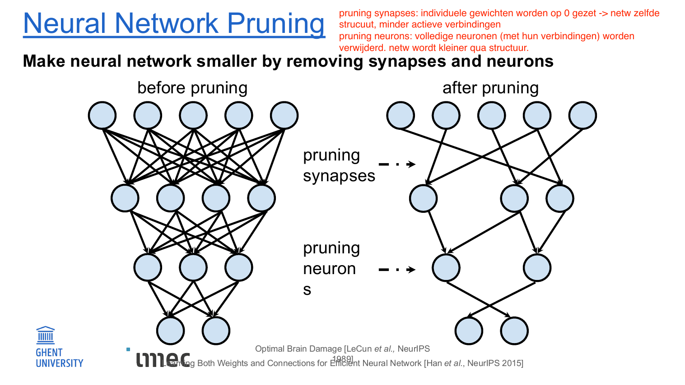

Pruning = het netwerk kleiner maken door **synapsen** (gewichten) en **neuronen** te verwijderen. Twee niveaus:

> **📝 jouw notitie:**
> - *pruning synapses: individuele gewichten worden op 0 gezet → netwerk zelfde structuur, minder actieve verbindingen.*
> - *pruning neurons: volledige neuronen (met hun verbindingen) worden verwijderd → netwerk wordt kleiner qua structuur.*

Dit onderscheid (fijn vs grof) komt verderop terug als **fine-grained vs structured pruning**.

## 2.3 De pruning-workflow (Han et al., NeurIPS 2015)

De klassieke 3-stappen-pijplijn: **Train Connectivity → Prune Connections → Train Weights.**

**Stap 1 — Train Connectivity:**

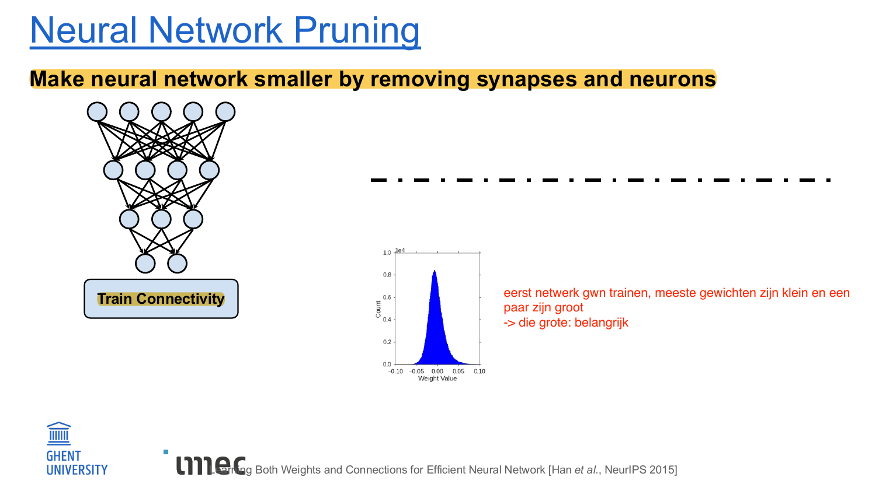

Eerst train je het netwerk gewoon volledig. Kijk dan naar de **gewichtsverdeling** (histogram): de meeste gewichten liggen dicht bij 0 (klein), slechts een paar zijn groot.

> **📝 jouw notitie:** *eerst netwerk gwn trainen, meeste gewichten zijn klein en een paar zijn groot → die grote: belangrijk.*

**Stap 2 — Prune Connections:** gooi de kleine (onbelangrijke) gewichten weg → het histogram krijgt een "gat" rond 0.

**Stap 3 — Train Weights (fine-tune):** hertrain de overgebleven gewichten zodat de accuracy herstelt.

**Iteratief is het beste:**

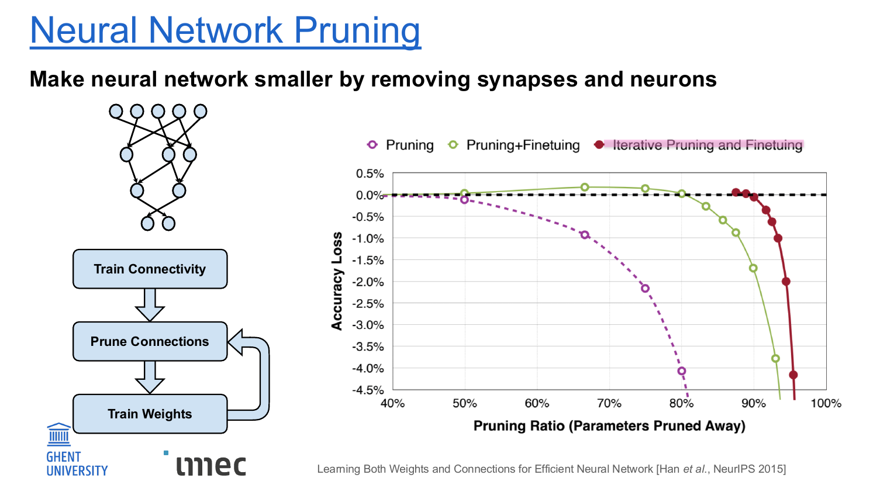

De grafiek (accuracy loss vs pruning ratio) toont drie curves:
- **Pruning alleen** (paars, gestreept): accuracy stort al snel in.
- **Pruning + Finetuning** (groen): veel beter, blijft lang vlak.
- **Iterative Pruning + Finetuning** (rood): het best — je kan tot ~90%+ van de gewichten weggooien met nauwelijks accuracy-verlies.

## 2.4 Parameter-reductie ≠ MAC-reductie

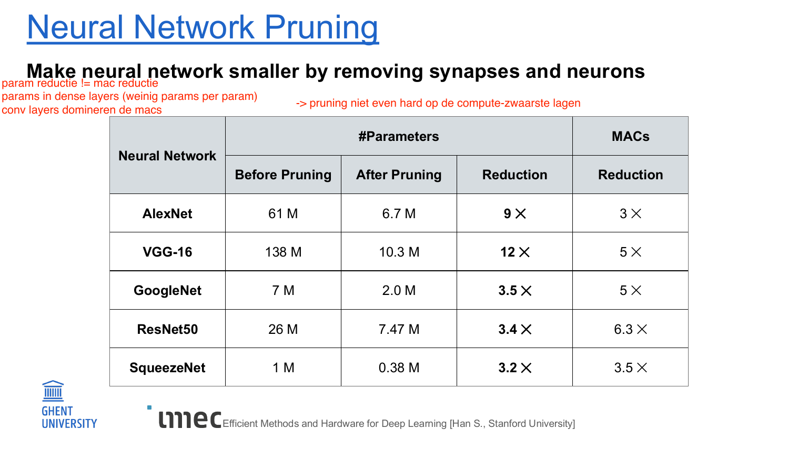

| Netwerk | Params voor | Params na | #Param reductie | MAC reductie |
|---|---|---|---|---|
| AlexNet | 61 M | 6.7 M | **9×** | 3× |
| VGG-16 | 138 M | 10.3 M | **12×** | 5× |
| GoogleNet | 7 M | 2.0 M | **3.5×** | 5× |
| ResNet50 | 26 M | 7.47 M | **3.4×** | 6.3× |
| SqueezeNet | 1 M | 0.38 M | **3.2×** | 3.5× |

Belangrijke nuance: het aantal weggesnoeide *parameters* is **niet** gelijk aan de weggesnoeide *rekenkost (MACs)*.

> **📝 jouw notitie:** *param reductie ≠ mac reductie / params in dense layers (weinig params per param) / conv layers domineren de macs / → pruning niet even hard op de compute-zwaarste lagen.*

> **Extra context:** dense (fully-connected) lagen bevatten de méeste *parameters*, maar convolutielagen verbruiken de meeste *MACs* (omdat elke filter over het hele beeld schuift). Wil je vooral snélheid winnen, dan moet je dus de conv-lagen aanpakken; wil je vooral geheugen winnen, de dense lagen.

---

# DEEL 3 — MAC's en model parameters berekenen

Tussendoor leert de prof je expliciet de formules. Dit is examenstof-achtig rekenwerk.

## 3.1 Eenvoudig (enkel dense lagen)

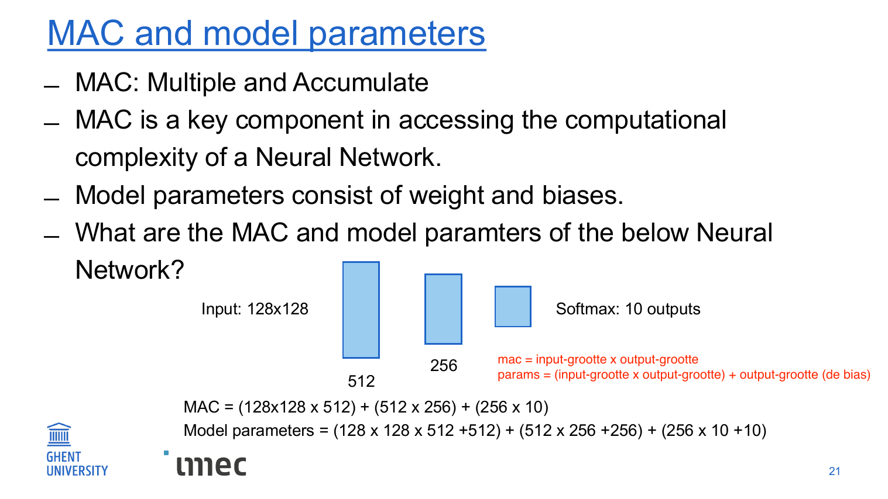

Netwerk: Input 128×128 → 512 → 256 → Softmax 10.

> **📝 jouw notitie:**
> - `mac = input-grootte × output-grootte`
> - `params = (input-grootte × output-grootte) + output-grootte` (de **+ output-grootte** is de **bias**, één per neuron).

- **MAC** = (128×128 × 512) + (512 × 256) + (256 × 10)
- **Model parameters** = (128×128×512 + 512) + (512×256 + 256) + (256×10 + 10)

## 3.2 Met een convolutielaag erbij

Netwerk: Input 128×128×1 → Conv (64 filters, 3×3, stride 1, padding 0) → 512 → 256 → Softmax 10.

> **📝 jouw notitie:** *zie markdown file* — hieronder de volledige uitwerking ↓

**MAC's per laag** (slide 23):

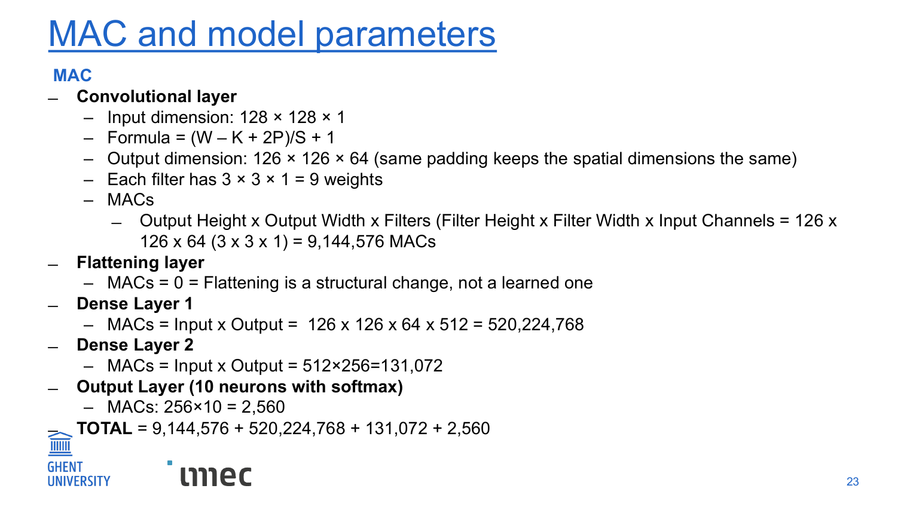

- **Conv-laag:**
  - Output-dimensie via `(W − K + 2P)/S + 1` = (128 − 3 + 0)/1 + 1 = **126** → output 126×126×64
  - Elke filter heeft 3×3×1 = 9 gewichten
  - MACs = OutH × OutW × Filters × (FilterH × FilterW × InChannels) = 126 × 126 × 64 × (3×3×1) = **9 144 576**
- **Flattening:** MACs = **0** (enkel reshape, geen geleerde bewerking)
- **Dense 1:** 126×126×64 × 512 = **520 224 768**
- **Dense 2:** 512 × 256 = **131 072**
- **Output:** 256 × 10 = **2 560**
- **TOTAAL** = 9 144 576 + 520 224 768 + 131 072 + 2 560

<!--  -->

**Parameters per laag** (slide 24):

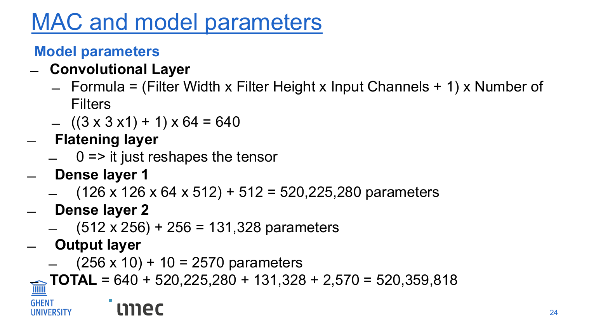

- **Conv-laag:** `(FilterW × FilterH × InChannels + 1) × #Filters` = ((3×3×1) + 1) × 64 = **640** (de +1 is de bias per filter)
- **Flattening:** **0**
- **Dense 1:** (126×126×64 × 512) + 512 = **520 225 280**
- **Dense 2:** (512 × 256) + 256 = **131 328**
- **Output:** (256 × 10) + 10 = **2 570**
- **TOTAAL** = 640 + 520 225 280 + 131 328 + 2 570 = **520 359 818**

> **Let op de formule-asymmetrie:** bij MAC tel je geen bias mee (een bias is enkel een optelling, geen multiply-accumulate over een input); bij parameters tel je de bias wél (het is een geleerd getal).

---

# DEEL 4 — Pruning is hot + hardware-ondersteuning

## 4.1 Aantal publicaties explodeert

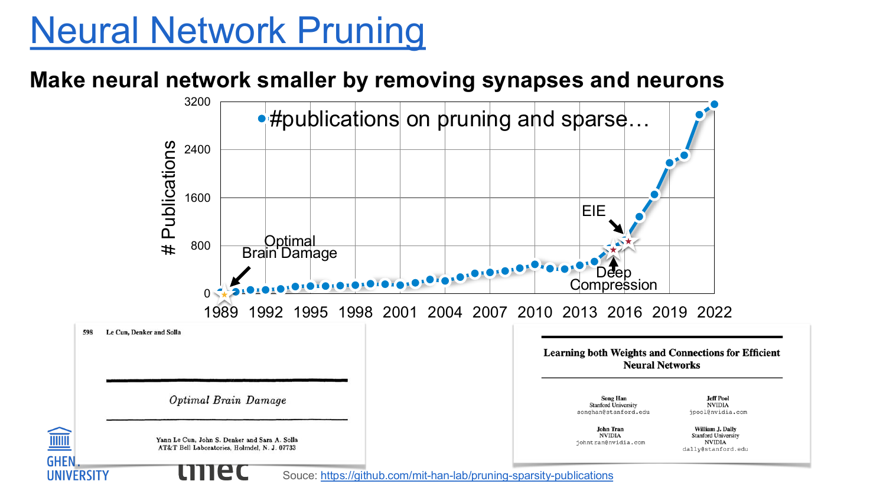

Van *Optimal Brain Damage* (LeCun, 1989) over *Deep Compression* / *EIE* (Han, 2015–2016) tot >3000 publicaties per jaar in 2022. Pruning is een zeer actief onderzoeksdomein.

## 4.2 Hardware-ondersteuning voor sparsity

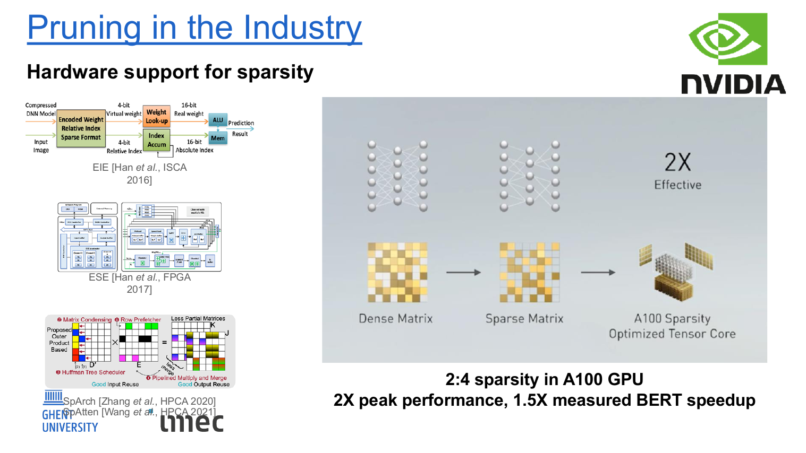

**NVIDIA** ondersteunt **2:4 sparsity** in de A100 (Ampere) tensor cores → tot **2× peak performance**, ~1.5× gemeten BERT-speedup. Custom accelerators zoals **EIE**, **ESE**, **SpArch** en **SpAtten** (Han et al.) zijn speciaal ontworpen voor sparse netwerken.

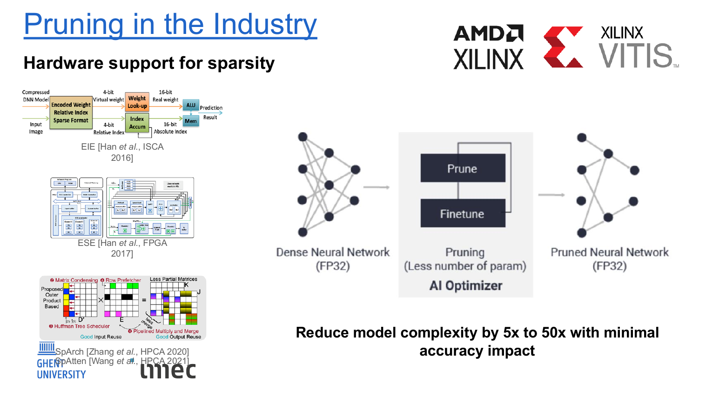

**AMD/Xilinx Vitis AI Optimizer** doet automatisch `Prune → Finetune` op een dense FP32-netwerk → een kleiner FP32-netwerk. Reduceert modelcomplexiteit **5× tot 50×** met minimale accuracy-impact.

---

# DEEL 5 — Granularity: in welk patroon prunen we?

## 5.1 Het uitgangspunt

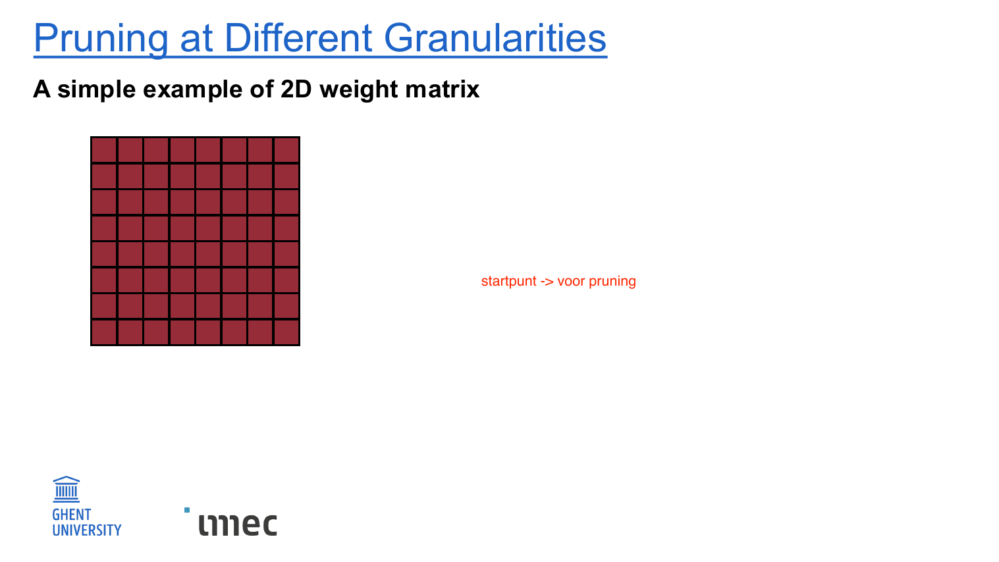

Beschouw een eenvoudige 2D-gewichtsmatrix (alles "preserved", rood).

> **📝 jouw notitie:** *startpunt → vóór pruning.*

## 5.2 Fine-grained / Unstructured

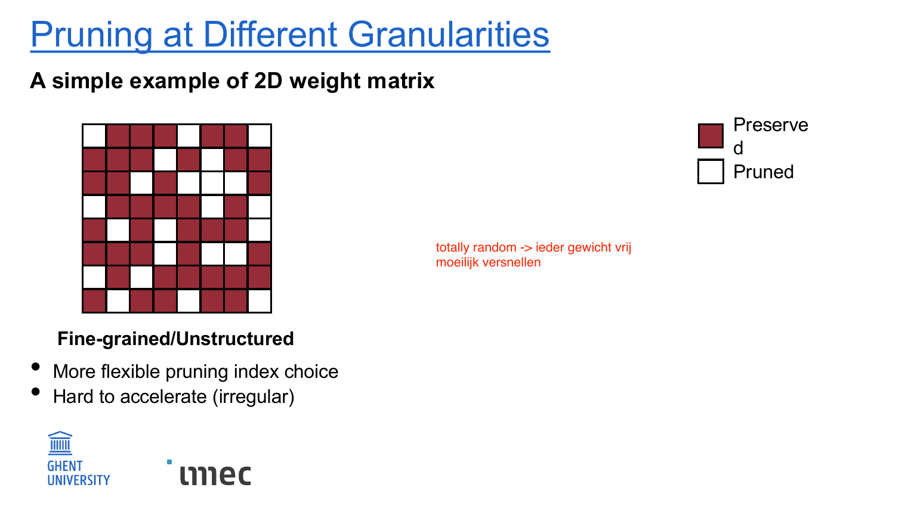

Je mag **elk individueel gewicht** vrij wegknippen (wit = pruned).
- ➕ Heel flexibel (grote keuzevrijheid welke gewichten weg) → hoge compressie.
- ➖ Moeilijk te versnellen: het onregelmatige patroon ligt slecht op gewone hardware.

> **📝 jouw notitie:** *totally random → ieder gewicht vrij, moeilijk versnellen.*

## 5.3 Fine-grained vs Coarse-grained

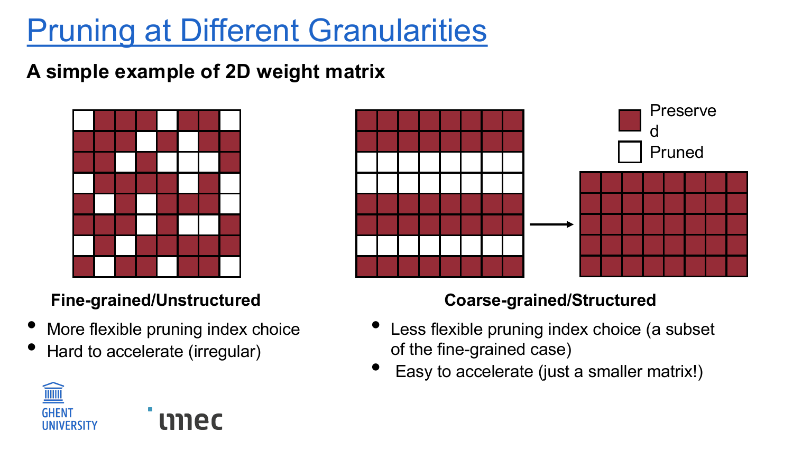

- **Fine-grained / Unstructured:** flexibel maar onregelmatig → moeilijk te versnellen.
- **Coarse-grained / Structured:** prune hele rijen/kolommen → minder flexibel (een deelverzameling van de fine-grained keuzes), maar **makkelijk te versnellen** want het resultaat is gewoon een kleinere, dense matrix.

> Dit is de centrale trade-off van het hele granularity-verhaal: **flexibiliteit ↔ versnelbaarheid.**

## 5.4 Het geval van convolutielagen (4 dimensies)

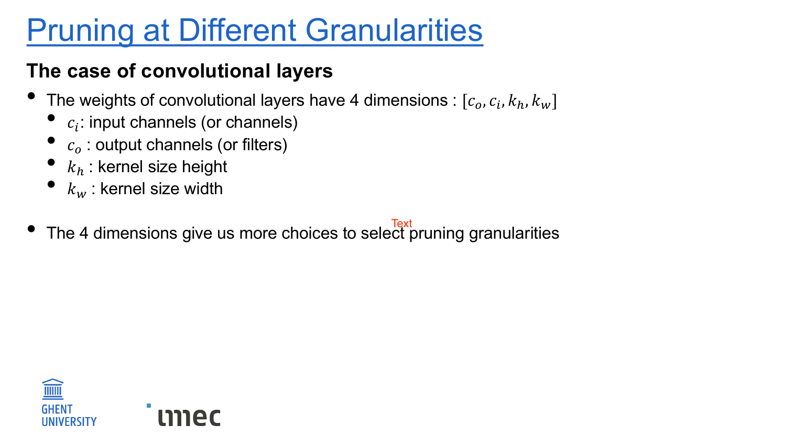

Conv-gewichten hebben **4 dimensies** `[c_o, c_i, k_h, k_w]`:
- `c_i` = input channels
- `c_o` = output channels (filters)
- `k_h`, `k_w` = kernel-hoogte en -breedte

Die 4 dimensies geven extra keuzes om "in welk patroon" te prunen.

## 5.5 Het spectrum van granulariteiten

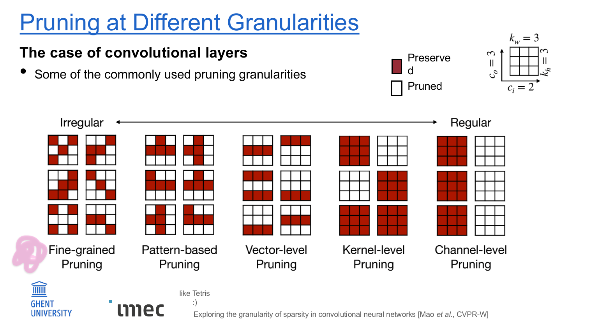

Van **irregular (links) → regular (rechts)**:

| Granularity | Wat wordt gepruned | Flexibel? | Versnelbaar? |
|---|---|---|---|
| Fine-grained | losse gewichten | zeer | slecht |
| Pattern-based | vaste patronen (bv. N:M) | gemiddeld | met HW-support |
| Vector-level | rijen binnen kernel | minder | beter |
| Kernel-level | hele kernels | weinig | goed |
| Channel-level | hele channels | weinig | zeer goed |

> **📝 jouw notitie:** *like Tetris :)* — de patronen lijken op Tetris-blokjes.

## 5.6 Fine-grained pruning — voor- en nadelen

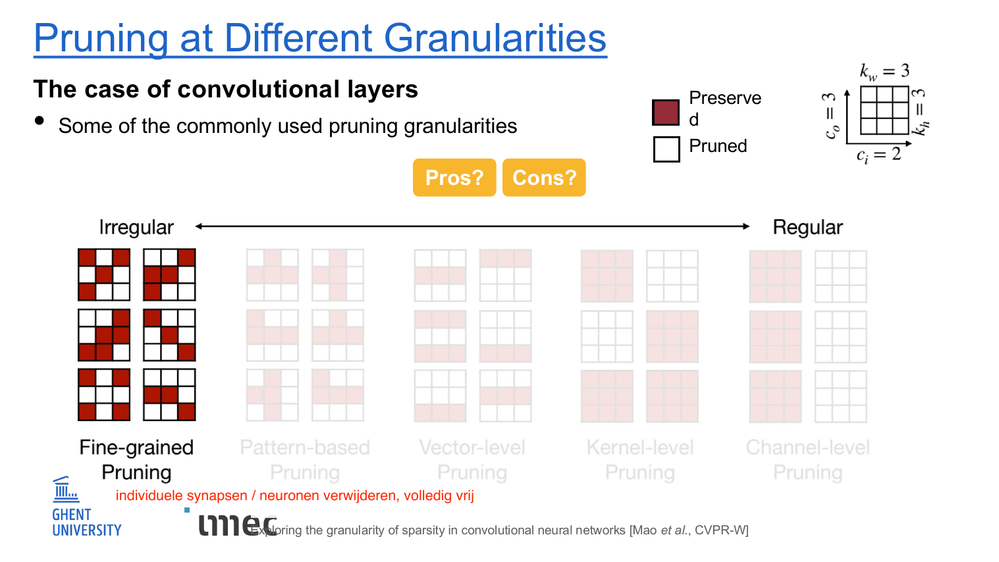

> **📝 jouw notitie:** *individuele synapsen / neuronen verwijderen, volledig vrij.*

- ➕ Flexibele pruning-indices → meestal **grotere compressie ratio** (je vindt flexibel "redundante" gewichten).
- ➖ Versnelt enkel op custom hardware (bv. EIE), **niet makkelijk op een GPU**.

## 5.7 Pattern-based pruning: N:M sparsity

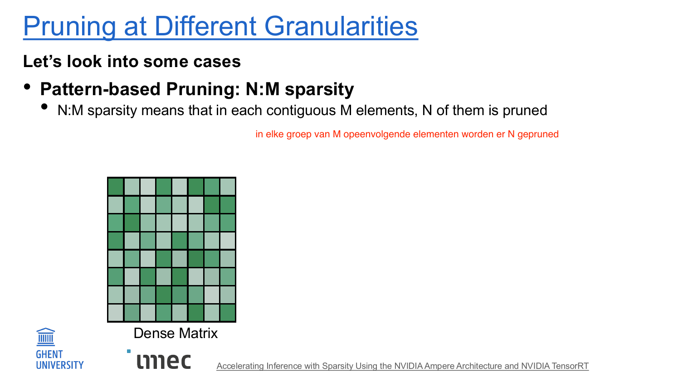

**N:M sparsity:** in elke groep van **M** opeenvolgende elementen worden er **N** geprund.

> **📝 jouw notitie:** *in elke groep van M opeenvolgende elementen worden er N gepruned.*

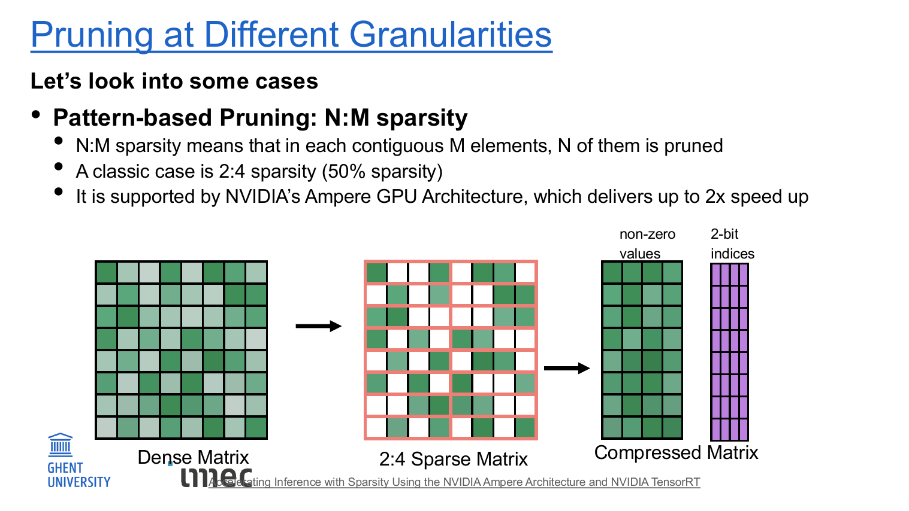

Het klassieke geval is **2:4 sparsity** (50% sparsity): van elke 4 gewichten houd je er 2. Je slaat het op als **non-zero values + 2-bit indices** (de compressed matrix), wat NVIDIA's A100 in hardware versnelt (~2×).

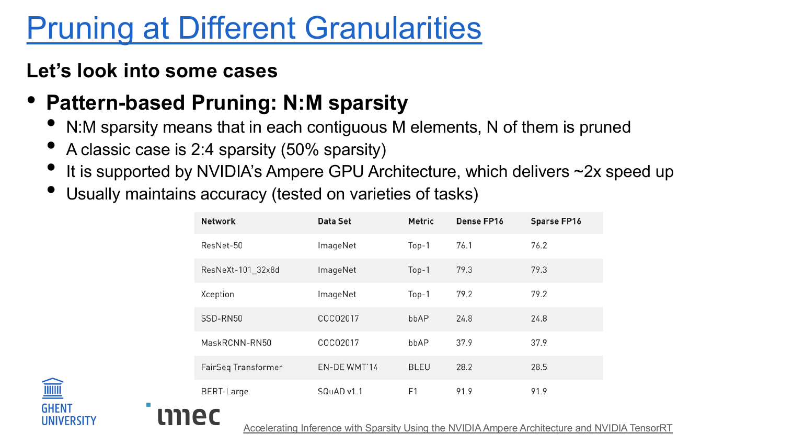

En het behoudt de accuracy over veel taken: ResNet-50, ResNeXt, Xception, SSD, MaskRCNN, FairSeq, BERT — Dense FP16 vs Sparse FP16 blijven nagenoeg gelijk (bv. BERT-Large F1 91.9 → 91.9).

## 5.8 Channel pruning

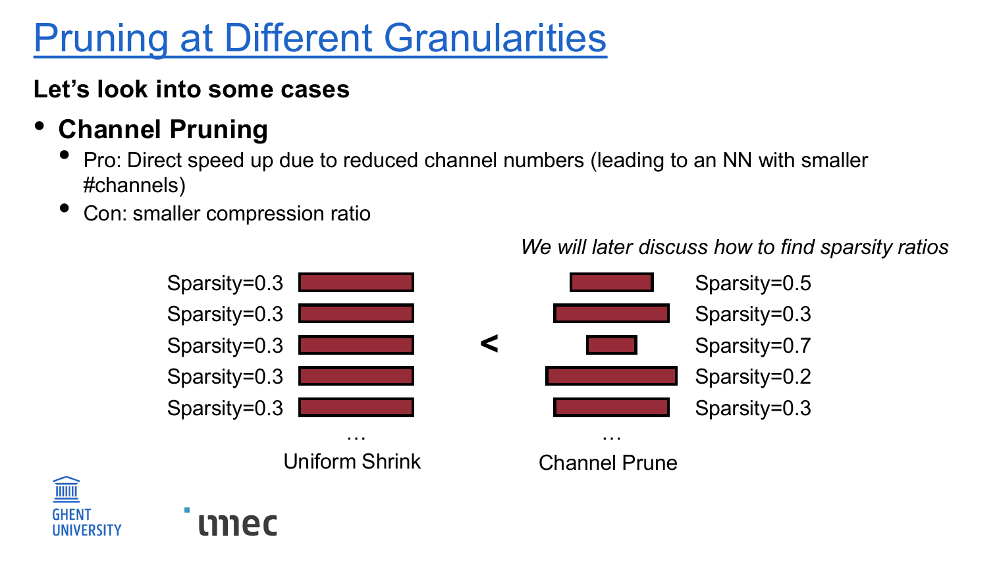

Bij **channel pruning** verwijder je hele channels → een netwerk met minder channels.
- ➕ **Directe speedup** (echt kleiner netwerk, werkt op elke GPU).
- ➖ **Kleinere compressie ratio** dan fine-grained.

> **📝 jouw notitie:** *je krijgt netwerk met minder kanalen → het is kleiner netwerk → sneller.*

**Uniform shrink vs Channel prune:** in plaats van elke laag even hard te krimpen (uniform, sparsity 0.3 overal), is het beter om **per laag een andere sparsity** te kiezen (bv. 0.5 / 0.3 / 0.7 / 0.2 / 0.3). Dat geeft een betere accuracy-latency trade-off:

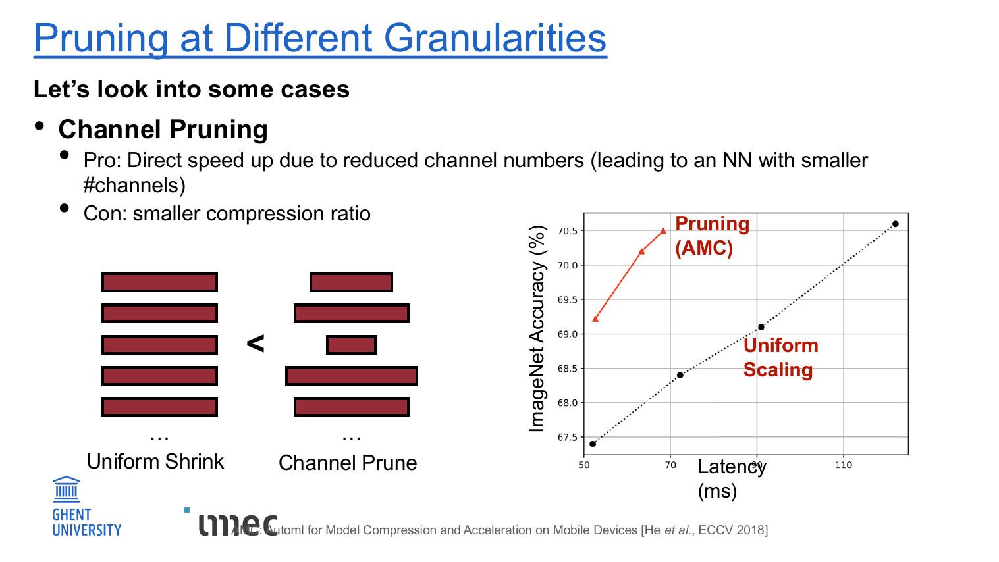

De grafiek (ImageNet accuracy vs latency) toont dat **Pruning (AMC, rood)** boven **Uniform Scaling (zwart)** ligt: bij dezelfde latency hogere accuracy. → leidt naar de vraag "hoe vind je die per-laag ratios?" (Deel 7).

---

# DEEL 6 — Criterion: welke synapsen/neuronen prunen we?

## 6.1 Het basisprincipe

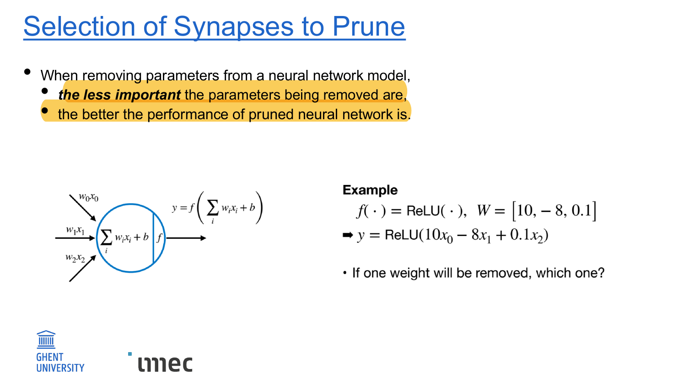

> Hoe **minder belangrijk** de verwijderde parameter is, hoe **beter** de prestatie van het geprunde netwerk blijft.

Voorbeeld: neuron `y = ReLU(10·x₀ − 8·x₁ + 0.1·x₂)`, dus W = [10, −8, 0.1]. Als je één gewicht moet weggooien → **0.1** (kleinste impact). Dit motiveert magnitude-based pruning.

## 6.2 Magnitude-based pruning (heuristiek)

**Idee:** gewichten met een **grotere absolute waarde** zijn belangrijker.

**Element-wise (L1):** `Importance = |W|`

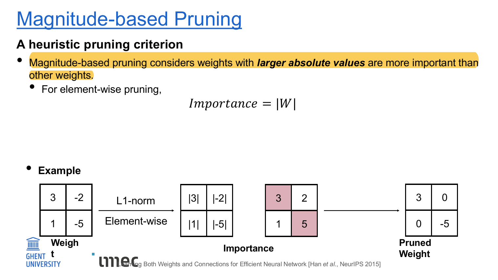

Per gewicht neem je de absolute waarde; de kleinste worden 0. Voorbeeld [3,−2,1,−5] → importances [3,2,1,5] → de kleinste (2 en 1) worden gepruned.

**Row-wise (L1):** `Importance = Σ_{i∈S} |w_i|`

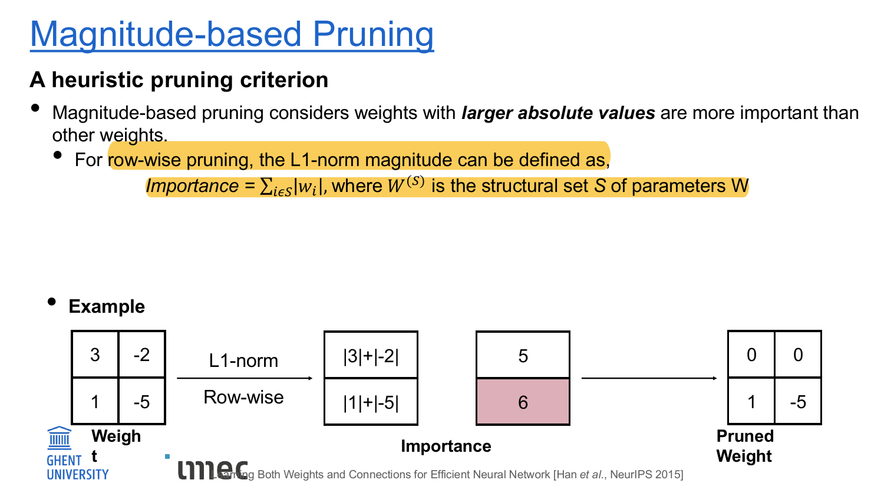

Hier prune je hele **rijen** (structured): per rij de som van absolute waarden. Rij [3,−2] → 5, rij [1,−5] → 6 → de zwakste rij (5) gaat eruit.

**Row-wise (L2):** `Importance = √(Σ_{i∈S} |w_i|²)`

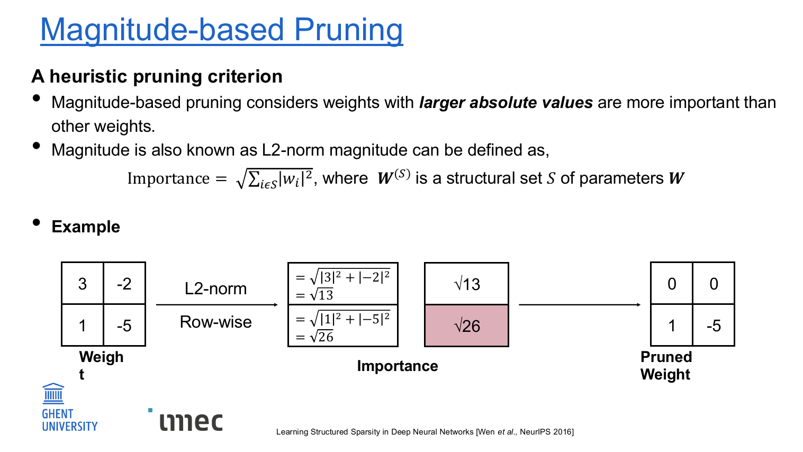

Zelfde idee maar met de L2-norm: rij [3,−2] → √13, rij [1,−5] → √26 → kleinste (√13) eruit.

> **Extra context:** L1 = som van absolute waarden, L2 = euclidische norm (wortel van som van kwadraten). L2 weegt grote gewichten zwaarder door. Beide zijn heuristieken: snel en goedkoop, maar niet gegarandeerd optimaal.

## 6.3 Scaling-based pruning (voor filter/channel pruning)

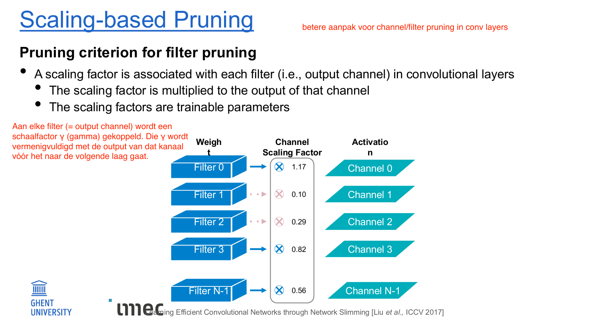

> **📝 jouw notitie:** *betere aanpak voor channel/filter pruning in conv layers.*

> **📝 jouw notitie:** *Aan elke filter (= output channel) wordt een schaalfactor γ (gamma) gekoppeld. Die γ wordt vermenigvuldigd met de output van dat kanaal vóór het naar de volgende laag gaat.*

De schaalfactoren γ zijn **trainbare parameters** (komen bijvoorbeeld gratis uit de Batch Normalization-laag).

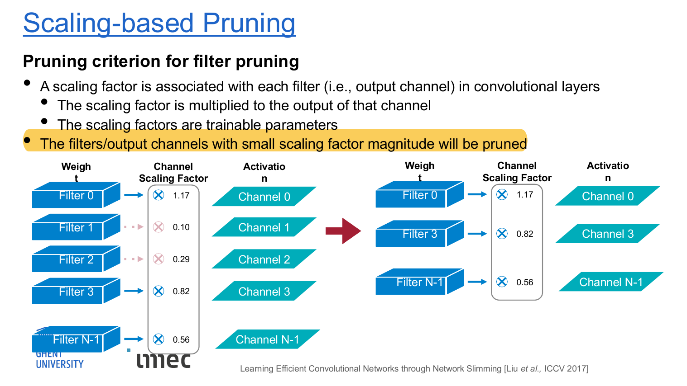

**Criterion:** de filters/output-channels met een **kleine γ** worden gepruned (bv. Filter 1 met γ=0.10 en Filter 2 met γ=0.29 eruit; Filter 0 γ=1.17 en Filter 3 γ=0.82 blijven). *(Network Slimming, Liu et al., ICCV 2017.)*

## 6.4 Selectie van neuronen

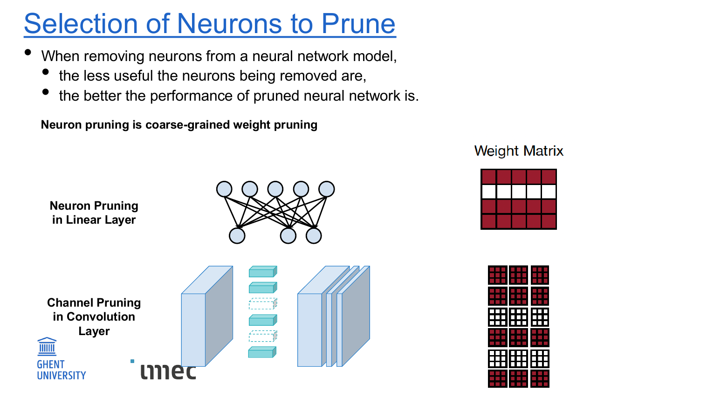

Neuron pruning = **coarse-grained** weight pruning: je verwijdert een hele rij in de gewichtsmatrix (linear layer) of een heel channel (conv layer).

## 6.5 Percentage-of-Zero-Based Pruning (APoZ)

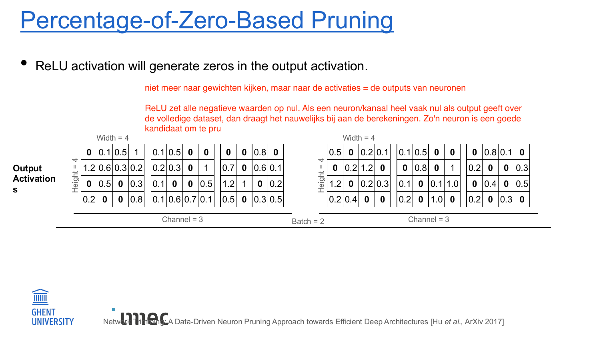

> **📝 jouw notitie:** *niet meer naar gewichten kijken, maar naar de activaties = de outputs van neuronen.*

> **📝 jouw notitie:** *ReLU zet alle negatieve waarden op nul. Als een neuron/kanaal heel vaak nul als output geeft over de volledige dataset, dan draagt het nauwelijks bij aan de berekeningen. Zo'n neuron is een goede kandidaat om te prunen.*

**APoZ = Average Percentage of Zeros** = de gemiddelde fractie nullen in de output-activaties van een channel (gemeten over een batch data).

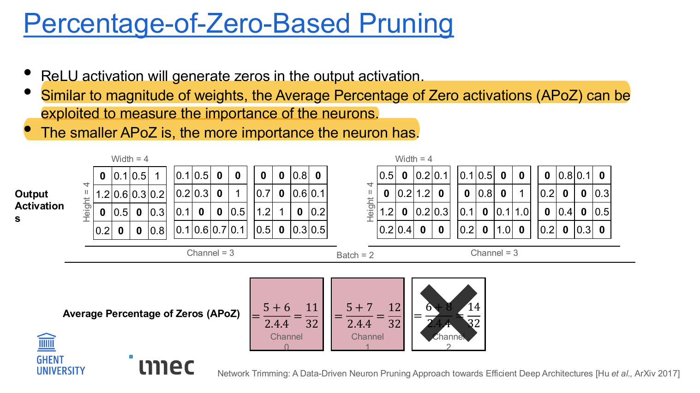

**Criterion:** hoe **kleiner** de APoZ, hoe **belangrijker** het neuron. Het channel met de hoogste APoZ (hier Channel 2 met 14/32) wordt gepruned.

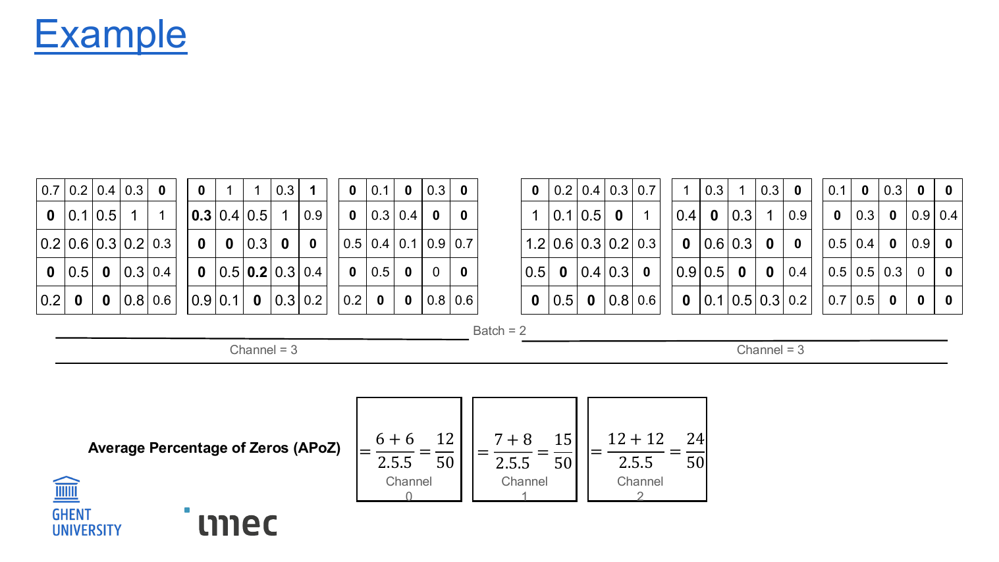

Reken-voorbeeld over Batch = 2, Channel = 3, feature maps 5×5: APoZ van channel 0 = (6+6)/(2·5·5) = 12/50, channel 1 = 15/50, channel 2 = 24/50 → channel 2 heeft de meeste nullen → prune.

> **Verschil met magnitude-based:** magnitude kijkt naar de **gewichten** (statisch, data-onafhankelijk); APoZ kijkt naar de **activaties** (data-gedreven — je hebt input-data nodig om het te meten).

---

# DEEL 7 — Pruning ratio: hoeveel sparsity per laag?

## 7.1 Sensitivity analysis

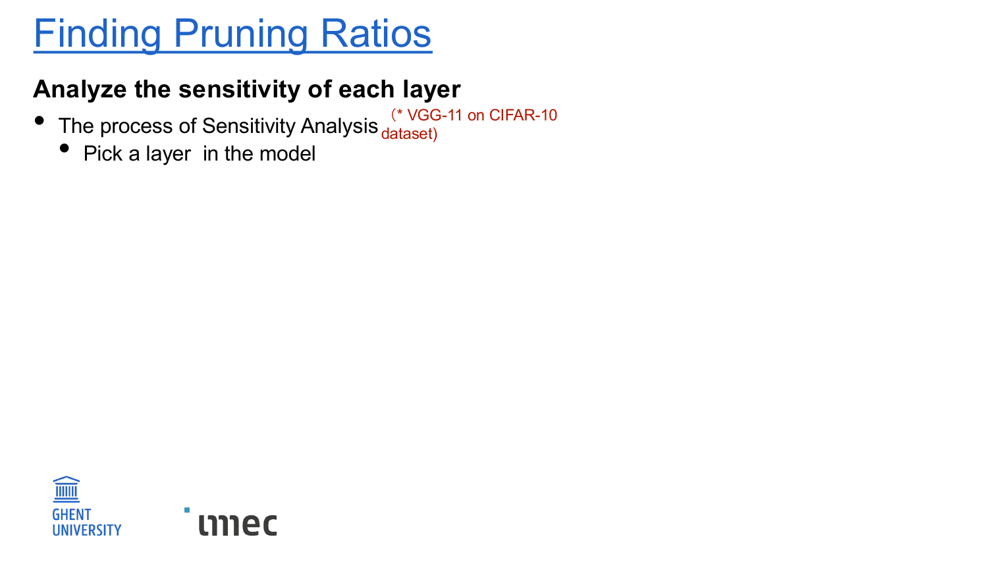

Niet elke laag is even gevoelig voor pruning: de **eerste laag** is vaak gevoeliger, andere lagen zijn redundanter. Daarom wil je een **andere ratio per laag**.

**Het proces** (voorbeeld VGG-11 op CIFAR-10):
1. Kies een laag `Lᵢ`.
2. Prune die laag met ratio `r ∈ {0, 0.1, 0.2, …, 0.9}`.
3. Observeer de **accuracy-degradatie ΔAccᵢ_r** voor elke ratio.
4. Herhaal voor alle lagen.

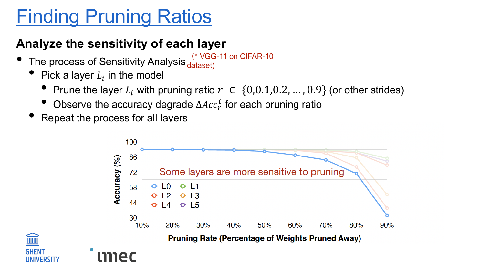

Je krijgt per laag een curve (accuracy vs pruning rate). Sommige lagen blijven lang vlak (**minder gevoelig**, bv. L1), andere zakken snel (**meer gevoelig**, bv. L0). Algemeen: *hoe hoger de pruning rate, hoe meer accuracy-verlies.*

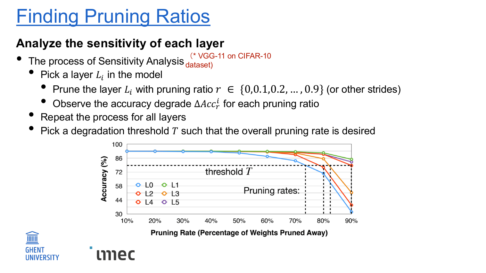

5. Kies een **degradatie-threshold T**: trek een horizontale lijn. Waar elke curve die lijn snijdt → dat is de **pruning rate voor die laag**. Een gevoelige laag krijgt zo automatisch een lagere ratio, een redundante laag een hogere.

**Beperking:** sensitivity analysis bekijkt elke laag **apart** en negeert de **interactie tussen lagen** → niet noodzakelijk optimaal. Daarom: automatic pruning.

---

# DEEL 8 — Automatic Pruning (AMC)

## 8.1 Pruning als een reinforcement learning-probleem

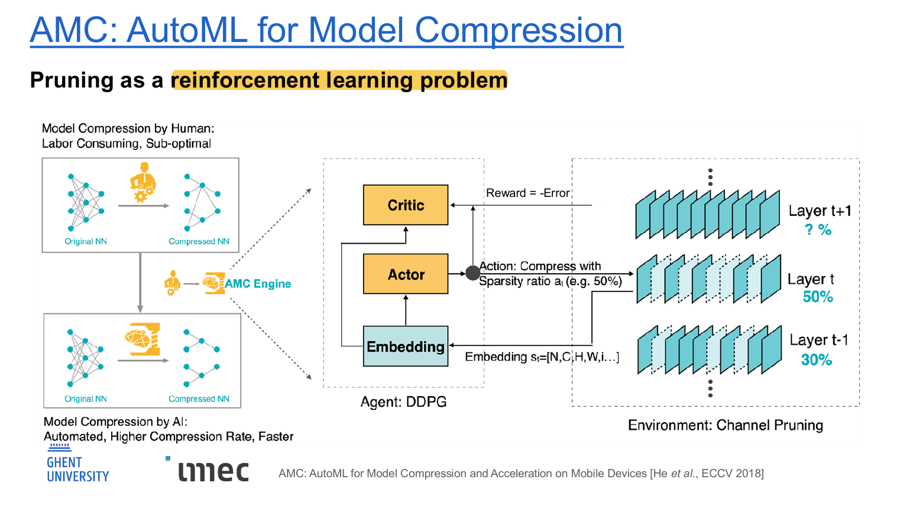

Manueel ratios kiezen steunt op menselijke expertise en trial-and-error → traag en suboptimaal. **AMC (AutoML for Model Compression, He et al., ECCV 2018)** formuleert pruning als een **reinforcement learning**-probleem dat de ratios automatisch zoekt.

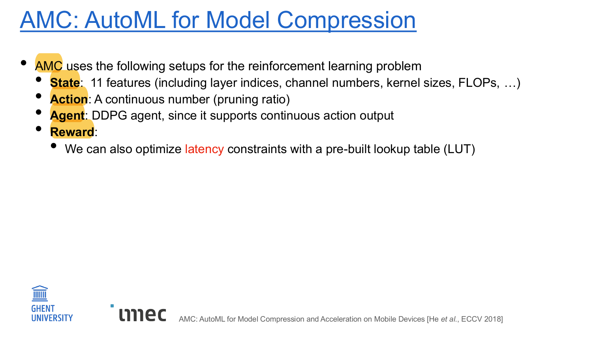

De RL-setup:
- **State:** 11 features (laag-index, channel numbers, kernel sizes, FLOPs, …)
- **Action:** een continu getal = de pruning ratio voor die laag
- **Agent:** **DDPG** (ondersteunt continue acties)
- **Reward:** −Error (en je kan ook **latency** optimaliseren via een vooraf opgebouwde **lookup table (LUT)**)

## 8.2 Resultaten van AMC

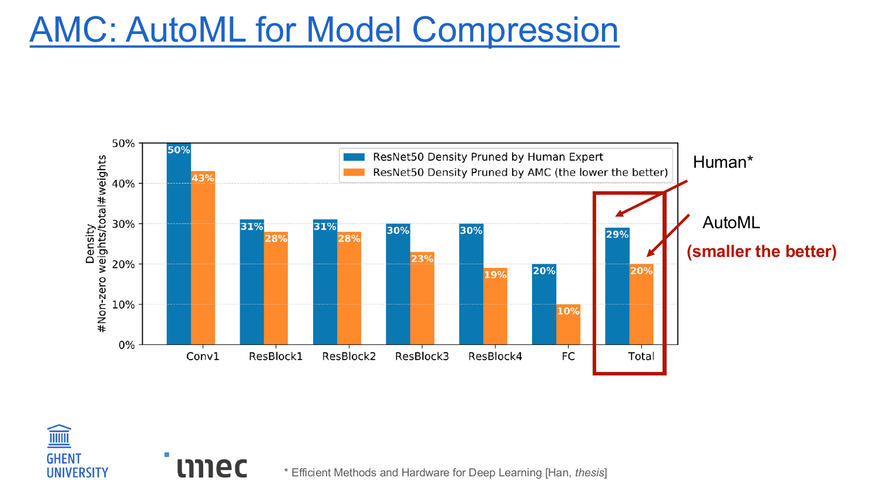

Op ResNet50 vindt **AMC** (oranje) lagere densities dan de **menselijke expert** (blauw) — "smaller the better". Totaal: 29% (human) → 20% (AMC). En cruciaal: AMC ontdekt zélf dat sommige lagen (bv. Conv1) gevoeliger zijn en minder geprund moeten worden.

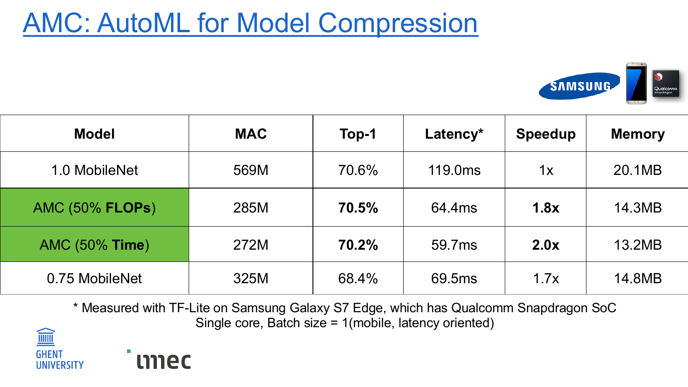

Op MobileNet (gemeten op Samsung Galaxy S7 Edge, TF-Lite):

| Model | MAC | Top-1 | Latency | Speedup | Memory |
|---|---|---|---|---|---|
| 1.0 MobileNet | 569M | 70.6% | 119.0 ms | 1× | 20.1 MB |
| **AMC (50% FLOPs)** | 285M | 70.5% | 64.4 ms | **1.8×** | 14.3 MB |
| **AMC (50% Time)** | 272M | 70.2% | 59.7 ms | **2.0×** | 13.2 MB |
| 0.75 MobileNet | 325M | 68.4% | 69.5 ms | 1.7× | 14.8 MB |

→ AMC haalt 2× speedup met nauwelijks accuracy-verlies, beter dan de handmatig geschaalde 0.75 MobileNet.

---

# DEEL 9 — Fine-tune / Train Pruned Neural Network

## 9.1 Finetuning na het prunen

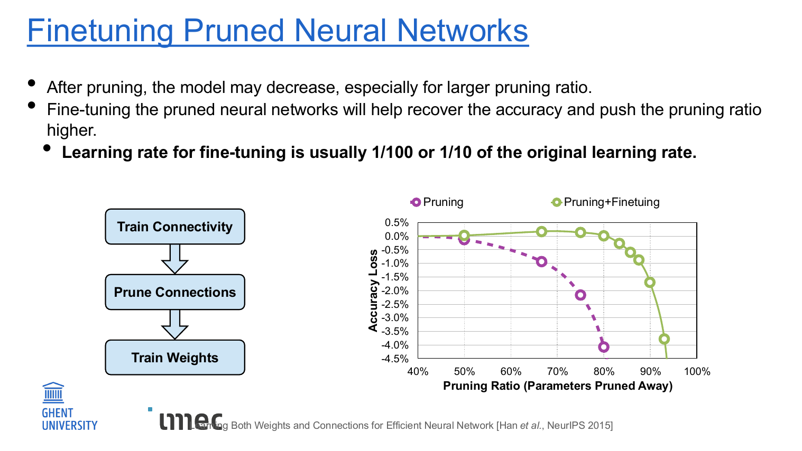

Na het prunen daalt de accuracy (vooral bij hoge pruning ratio). **Finetuning** (= hertrainen van de overgebleven gewichten) herstelt de accuracy en laat je de pruning ratio hoger pushen.

> **Vuistregel:** gebruik voor finetuning een **learning rate van 1/100 tot 1/10** van de originele learning rate (je wil de overgebleven gewichten bijregelen, niet kapotmaken).

## 9.2 Iteratief prunen

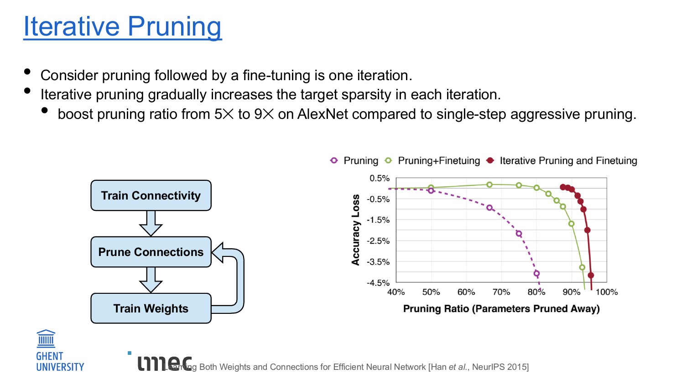

Één keer prunen + finetunen = **één iteratie**. Bij **iterative pruning** verhoog je de target-sparsity **geleidelijk** (bv. 30% → 50% → 70% → …), met telkens een finetune-stap ertussen (de lus `Prune Connections ⇄ Train Weights`).

→ Dit duwt de pruning ratio op **AlexNet van 5× naar 9×** vergeleken met in één keer aggressief prunen. De rode curve (Iterative Pruning + Finetuning) blijft het langst vlak.

---

# 🔑 Kernpunten om te onthouden

1. **Waarom?** Modellen groeien sneller dan hardware ("bridge the gap"); **data verplaatsen (DRAM) kost ~200× meer energie** dan rekenen → minder gewichten = minder energie. Cruciaal voor embedded.
2. **Wat is pruning?** Synapsen (gewichten → 0, zelfde structuur) of neuronen/channels (kleinere structuur) verwijderen. Biologische analogie: het brein snoeit ook.
3. **De 4 ontwerpvragen:** granularity (welk patroon) → criterion (welke weg) → ratio (hoeveel per laag) → fine-tune (accuracy herstellen).
4. **Param-reductie ≠ MAC-reductie:** params zitten in dense lagen, MACs in conv-lagen.
5. **MAC/params rekenen:** `MAC = in × out`; `params = in × out + bias`. Conv-output via `(W−K+2P)/S + 1`. Flattening = 0 MACs/params.
6. **Granularity-spectrum (irregular → regular):** fine-grained → pattern-based (N:M) → vector → kernel → channel. Trade-off: **flexibiliteit (hoge compressie) ↔ versnelbaarheid op echte hardware.**
7. **N:M sparsity** (bv. 2:4 = 50%) wordt door NVIDIA A100 in hardware versneld (~2×) met behoud van accuracy.
8. **Channel pruning** geeft directe speedup op elke GPU, maar lagere compressie dan fine-grained.
9. **Criteria:** magnitude-based (L1/L2 op gewichten, statisch), scaling-based (γ-factor per filter, trainbaar), APoZ (% nullen in activaties, data-gedreven). Steeds: minst belangrijke parameter eerst weg.
10. **Pruning ratio:** sensitivity analysis (per laag een curve + threshold T) → maar negeert laag-interacties. **AMC** lost dit op met **RL (DDPG)** en kan ook latency optimaliseren (LUT).
11. **Fine-tuning** (LR = 1/10–1/100 van origineel) herstelt accuracy; **iteratief prunen** (geleidelijk sparsity verhogen) is het sterkst — op AlexNet 5× → 9×.

---

# 📝 Oefenvragen

*Probeer eerst zelf te antwoorden; de uitwerking staat telkens eronder.*

### Reken-/inzichtvragen

**V1.** Een netwerk: Input 64×64×1 → Conv(32 filters, 5×5, stride 1, padding 0) → Dense 128 → Softmax 10. Bereken (a) de output-dimensie van de conv-laag, (b) het aantal parameters van de conv-laag, (c) het aantal MACs van de conv-laag.

Antwoord

(a) Output = (W−K+2P)/S + 1 = (64−5+0)/1 + 1 = **60** → output 60×60×32.
(b) Params conv = (FilterW × FilterH × InChannels + 1) × #Filters = (5×5×1 + 1) × 32 = 26 × 32 = **832**.
(c) MACs conv = OutH × OutW × Filters × (FilterH × FilterW × InChannels) = 60 × 60 × 32 × (5×5×1) = 60·60·32·25 = **2 880 000**.

**V2.** Waarom telt de bias wél mee bij het aantal *parameters* maar niet bij het aantal *MACs*?

Antwoord

Een MAC is een *multiply-accumulate* (w·x + …) over de inputs. De bias wordt enkel **opgeteld** op het einde — er is geen vermenigvuldiging met een input, dus geen MAC. Maar de bias is wél een **geleerd getal** dat opgeslagen moet worden → het is dus een parameter.

**V3.** Een laag heeft 100 M parameters maar slechts 2 M MACs; een andere laag heeft 0.5 M parameters maar 500 M MACs. Welke is waarschijnlijk een dense en welke een conv-laag? Welke pak je aan voor (a) geheugenwinst, (b) snelheidswinst?

Antwoord

Veel params/weinig MACs = **dense (fully-connected)** laag. Weinig params/veel MACs = **conv**-laag (een kleine kernel schuift over het hele beeld → veel rekenwerk, weinig gewichten).
(a) Geheugenwinst → prune de **dense** laag (daar zitten de parameters). (b) Snelheidswinst → prune de **conv**-laag (daar zitten de MACs).

**V4.** Gegeven gewichtsmatrix W = [[4, −1], [−3, 2]]. Bepaal welke rij eruit gaat bij row-wise pruning met (a) L1-norm en (b) L2-norm.

Antwoord

(a) L1: rij 0 = |4|+|−1| = 5; rij 1 = |−3|+|2| = 5 → **gelijk** (5 = 5), geen voorkeur.
(b) L2: rij 0 = √(16+1) = √17 ≈ 4.12; rij 1 = √(9+4) = √13 ≈ 3.61 → rij 1 heeft de **kleinste** importance → **rij 1 wordt gepruned**.
(Mooi voorbeeld dat L1 en L2 verschillende keuzes kunnen maken: L2 weegt grote gewichten zwaarder.)

**V5.** Een channel geeft over een batch deze output-activaties (4 nullen op 20 waarden in feature map 1, en 6 nullen op 20 in feature map 2). Bereken de APoZ. Is dit channel een goede prune-kandidaat als de andere channels APoZ ≈ 0.20 hebben?

Antwoord

APoZ = totaal aantal nullen / totaal aantal waarden = (4+6)/(20+20) = 10/40 = **0.25**.
Hoe hoger de APoZ, hoe minder het channel bijdraagt (ReLU zet veel outputs op 0). 0.25 > 0.20 → dit channel heeft méér nullen dan de andere → **ja, betere prune-kandidaat** dan de andere.

### Begripsvragen

**V6.** Leg het verschil uit tussen *fine-grained (unstructured)* en *channel (structured)* pruning, met telkens één voordeel en één nadeel.

Antwoord

- **Fine-grained:** losse gewichten op 0 zetten. ➕ zeer flexibel → hoge compressie ratio. ➖ onregelmatig patroon → moeilijk te versnellen op gewone hardware (enkel custom HW zoals EIE).
- **Channel:** hele channels verwijderen. ➕ echt kleiner netwerk → directe speedup op elke GPU. ➖ minder flexibel → lagere compressie ratio.

**V7.** Wat betekent "2:4 sparsity" en waarom is het interessant voor NVIDIA-hardware?

<parameter name="new_string">**V7.** Wat betekent "2:4 sparsity" en waarom is het interessant voor NVIDIA-hardware?

Antwoord

Het is een vorm van N:M (pattern-based) sparsity: in **elke groep van 4** opeenvolgende gewichten houd je er **2** (= 50% sparsity). Het regelmatige patroon kan worden opgeslagen als non-zero values + 2-bit indices, en de **A100 (Ampere) tensor cores** versnellen dit in hardware → tot ~2× speedup, met behoud van accuracy.

**V8.** Wat is het verschil tussen een magnitude-based criterion en APoZ qua data die je nodig hebt?

Antwoord

Magnitude-based (|W|, L1/L2) kijkt enkel naar de **gewichten** zelf → **statisch, data-onafhankelijk** (je hebt geen input-data nodig). APoZ kijkt naar de **activaties** (outputs van neuronen) → **data-gedreven**: je moet data door het netwerk sturen om het percentage nullen te meten.

**V9.** Waarom is sensitivity analysis "suboptimaal", en hoe pakt AMC dat aan?

Antwoord

Sensitivity analysis test elke laag **apart** en negeert de **interactie tussen lagen** → de gevonden per-laag ratios zijn niet noodzakelijk de globaal beste combinatie. **AMC** formuleert pruning als een **reinforcement learning-probleem** (DDPG-agent) dat het hele netwerk samen optimaliseert en zelfs latency kan meenemen (via een lookup table).

**V10.** Verklaar waarom "memory is expensive" een argument is vóór pruning.

Antwoord

Een 32-bit DRAM-toegang kost ~640 pJ, ≈ **200×** meer dan een MULT/ADD (~3 pJ). Bij inferentie domineert het verplaatsen van gewichten/activaties uit DRAM het energieverbruik. Minder gewichten (pruning) = minder DRAM-toegangen = minder energie → cruciaal voor batterij-gevoede embedded toestellen.

**V11.** Waarom is "iterative pruning + finetuning" beter dan in één keer 90% prunen?

Antwoord

In één keer aggressief prunen verwijdert te veel tegelijk → de accuracy stort in en herstelt niet meer volledig. Door **geleidelijk** te prunen (30% → 50% → 70% → …) met **telkens een finetune-stap**, kan het netwerk zich na elke stap aanpassen. Dit duwt de haalbare pruning ratio veel hoger (op AlexNet van 5× naar 9×) bij gelijke accuracy.

---

# 📖 Begrippenlijst

| Begrip | Betekenis |
|---|---|
| **Pruning** | Een neuraal netwerk kleiner maken door onbelangrijke gewichten (synapsen) of neuronen/channels te verwijderen. |
| **Sparsity** | De fractie van de gewichten die op 0 staat (gepruned). 50% sparsity = de helft is 0. |
| **MAC** | Multiply-Accumulate: `a·b + c`. De basisbewerking in conv- en dense lagen; standaardmaat voor rekencomplexiteit. |
| **FLOPs** | Floating-point operations; ~2× het aantal MACs (een MAC = 1 mult + 1 add). |
| **Parameter** | Een geleerd getal (gewicht of bias) dat opgeslagen moet worden. Bepaalt vooral de modelgrootte. |
| **Synapse** | Eén gewicht (verbinding tussen twee neuronen). |
| **Fine-grained / unstructured pruning** | Losse gewichten prunen. Flexibel, hoge compressie, maar moeilijk te versnellen. |
| **Structured pruning** | Hele rijen/kernels/channels prunen. Minder flexibel, maar makkelijk te versnellen (kleinere dense matrix). |
| **N:M sparsity** | Pattern-based: in elke groep van M gewichten worden er N gepruned (bv. 2:4 = 50%). |
| **2:4 sparsity** | Klassiek N:M-geval; door NVIDIA A100 in hardware versneld (~2×). |
| **Channel pruning** | Hele output-channels verwijderen → echt kleiner netwerk, directe speedup. |
| **Granularity** | "In welk patroon" je prunt; spectrum van irregular (fine-grained) → regular (channel). |
| **Pruning criterion** | De regel die bepaalt *welke* parameters weg mogen (minst belangrijke eerst). |
| **Magnitude-based pruning** | Criterion: gewichten met grote absolute waarde zijn belangrijker. `Importance = |W|` (of L1/L2 per groep). |
| **L1-norm** | Som van absolute waarden: Σ|wᵢ|. |
| **L2-norm** | Euclidische norm: √(Σ|wᵢ|²); weegt grote gewichten zwaarder. |
| **Scaling-based pruning** | Aan elke filter een trainbare schaalfactor γ koppelen; filters met kleine γ worden gepruned (Network Slimming). |
| **APoZ** | Average Percentage of Zeros: gemiddeld % nul-activaties van een channel. Hoge APoZ = onbelangrijk neuron. |
| **Activation** | De output (feature map) van een laag; data-afhankelijk. |
| **ReLU** | max(0, z); zet negatieve waarden op 0 → genereert nullen in activaties (basis van APoZ). |
| **Pruning ratio** | Hoeveel % van de gewichten je weggooit (per laag of globaal). |
| **Sensitivity analysis** | Per laag de accuracy-degradatie meten bij verschillende ratios → kies ratio per laag via threshold T. |
| **AMC** | AutoML for Model Compression: kiest per-laag ratios automatisch via reinforcement learning. |
| **DDPG** | Deep Deterministic Policy Gradient: RL-agent die continue acties (pruning ratio) ondersteunt. |
| **LUT** | Lookup Table: vooraf opgebouwde tabel om latency te schatten zonder elke keer te meten. |
| **Fine-tuning** | Hertrainen van de overgebleven gewichten na pruning om accuracy te herstellen (LR = 1/10–1/100 van origineel). |
| **Iterative pruning** | Sparsity geleidelijk verhogen met telkens een finetune-stap → hoogste haalbare compressie. |
| **MLPerf** | Benchmark voor AI-hardware; Closed Division (model vast) vs Open Division (model mag geoptimaliseerd worden). |
| **EIE / ESE** | Custom hardware-accelerators (Han et al.) ontworpen om sparse netwerken te versnellen. |
| **Compression ratio** | Hoeveel kleiner het model wordt (bv. 9× = negen keer minder parameters). |
