# Hoofdstuk 4 — Quantization

**Vak:** Embedded Machine Learning (E061380) — UGent / imec (IDLAB)
**College:** Lecture 04 — *Quantization*
**Docent:** Prof. Adnan Shahid

> Deze samenvatting volgt de PDF **structureel, in volgorde van de slides**. Belangrijke zaken worden met een foto erbij uitgelegd. Waar jij iets in het rood op de slide had geschreven, staat dat als **📝 jouw notitie**. Bij de slides staat hier en daar wat **extra context** die je anders zou moeten opzoeken — maar zonder het wiel opnieuw uit te vinden.

---

## 0. Waar past dit college in het vak?

Dit is het vierde college. **Quantization** is — samen met pruning (Lect03) — een van de twee kerntechnieken om een neuraal netwerk **kleiner, sneller en zuiniger** te maken zodat het op embedded hardware draait. Waar pruning *gewichten weggooit*, verlaagt quantization de **bit-precisie** van de getallen (bv. 32-bit float → 8-bit int).

| Lecture | Onderwerp |
|---|---|
| 1 | Introduction |
| 2 | Overview of Embedded Systems en ML/DL Overflow |
| 3 | Pruning and Sparsity |
| **4** | **Quantization** ← dit college |
| 5 | Lab Pruning and Quantization |
| 6 | Neural Architecture Search |
| 7 | Lab Pruning and Quantization op Nano 33 BLE |
| 8 | Knowledge Distillation |
| 9 | Distributed training, on-device learning & Transfer Learning |
| 10 | Lab Knowledge Distillation & Federated Learning |

**Recap van vorige les (Lect03):** pruning & iteratief prunen, MAC's en parameters van DNN's/CNN's berekenen, granularity (fine-grained / pattern-based / channel-level), criteria (element-wise, row-wise, scaling-based), percentage-of-zero pruning (APoZ), de pruning ratio vinden, automatic pruning (AMC).

**Lecture Outline (de rode draad van dit college):**
1. **Review numeric data types** — hoe stelt een computer getallen voor? (integer, fixed-point, floating-point)
2. **Basic concepts of Neural Network quantization** — wat is quantization en quantization error?
3. **Quantization types** — K-means-based en linear quantization
4. **Post-Training Quantization (PTQ)** — incl. quantization granularity (per-tensor / per-channel)
5. **Quantization-Aware Training (QAT)**
6. **Case study** — interference cancellation (onderzoek van de vakgroep)

---

# DEEL 1 — Numeric Data Types

## 1.1 Low Bit Operations are Cheaper

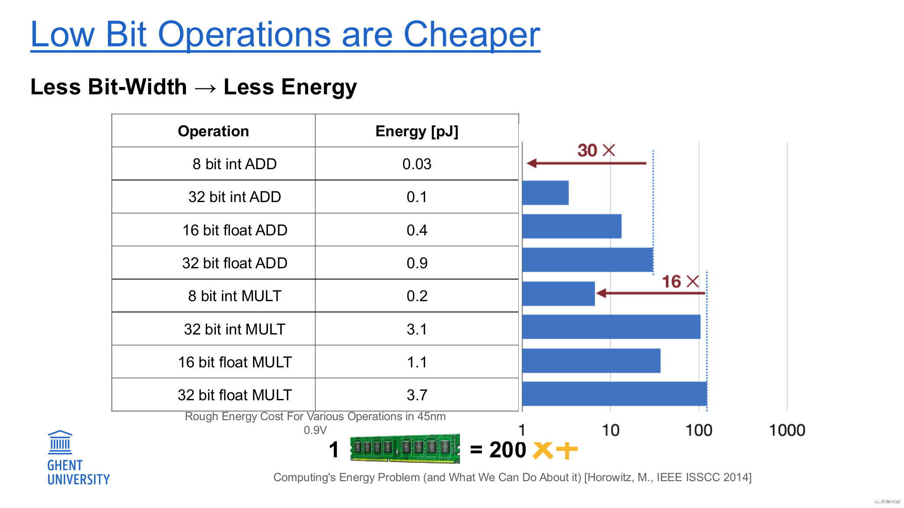

De kernboodschap die het hele vak motiveert: **minder bits → minder energie.** De tabel geeft de ruwe energiekost (in pJ, 45nm bij 0.9V) van basisbewerkingen:

| Operatie | Energie [pJ] |
|---|---|
| 8 bit int ADD | 0.03 |
| 32 bit int ADD | 0.1 |
| 16 bit float ADD | 0.4 |
| 32 bit float ADD | 0.9 |
| 8 bit int MULT | 0.2 |
| 32 bit int MULT | 3.1 |
| 16 bit float MULT | 1.1 |
| 32 bit float MULT | 3.7 |

- Een **32-bit float ADD** (0.9) kost **~30×** zoveel als een **8-bit int ADD** (0.03).
- Een **32-bit int MULT** (3.1) kost **~16×** zoveel als een **8-bit int MULT** (0.2).
- En (onderaan de slide): **1 DRAM-toegang ≈ 200× een MAC** — geheugen verplaatsen blijft veruit het duurst (dat zag je in Lect03).

→ Als we de getallen in **minder bits** voorstellen (quantization), winnen we dus op twee fronten: minder rekenenergie én minder data te bewegen. Daarom: *"How should we make deep learning more efficient?"*

> **Extra context:** dit is dezelfde Horowitz-data (IEEE ISSCC 2014) als bij pruning. Pruning verlaagt het **aantal** operaties; quantization verlaagt de **kost per** operatie.

## 1.2 Integer

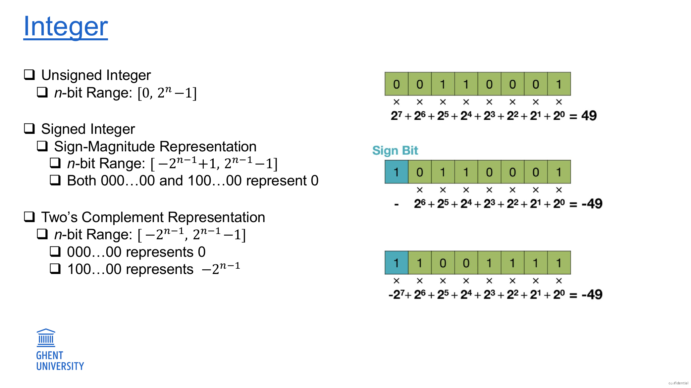

Drie manieren om gehele getallen in `n` bits voor te stellen:

- **Unsigned Integer:** bereik `[0, 2ⁿ−1]`. Elke bit is gewoon een macht van 2 (voorbeeld: `00110001₂ = 2⁵+2⁴+2⁰ = 49`).
- **Signed — Sign-Magnitude:** eerste bit = tekenbit, de rest = grootte. Bereik `[−2ⁿ⁻¹+1, 2ⁿ⁻¹−1]`. **Nadeel:** zowel `000…0` als `100…0` stellen **0** voor (twee nullen!).
- **Signed — Two's Complement (tweecomplement):** de tekenbit heeft gewicht `−2ⁿ⁻¹`. Bereik `[−2ⁿ⁻¹, 2ⁿ⁻¹−1]`. `000…0` = 0 (één unieke nul), `100…0` = `−2ⁿ⁻¹`. Dit is wat computers in de praktijk gebruiken.

> **Extra context:** two's complement wint omdat optellen/aftrekken met dezelfde hardware werkt voor positieve én negatieve getallen, en omdat er maar één representatie van 0 is.

## 1.3 Fixed-Point Number

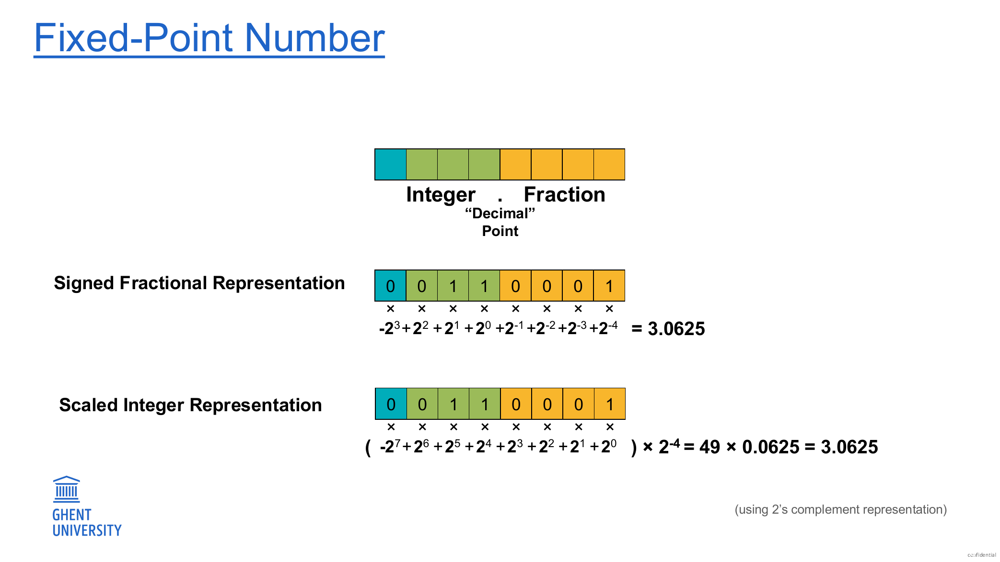

Een **fixed-point**-getal splitst de bits in een **integer-deel** en een **fractie-deel**, met een vaste (denkbeeldige) komma ertussen. Twee manieren om naar hetzelfde bitpatroon te kijken:

- **Signed Fractional Representation:** elke bit krijgt een macht van 2, ook negatieve machten voor de fractie (`…2¹, 2⁰, 2⁻¹, 2⁻², …`).
- **Scaled Integer Representation:** lees het hele patroon als een gewone integer en vermenigvuldig met een vaste schaalfactor (bv. `× 2⁻⁴`). Voorbeeld: `49 × 0.0625 = 3.0625`.

→ De **komma ligt vast** (in tegenstelling tot floating-point). Eenvoudig en goedkoop in hardware, maar het bereik én de precisie zijn beperkt.

## 1.4 Floating-Point Number (IEEE 754)

Het belangrijkste formaat voor neurale netwerken (vóór quantization). Een 32-bit IEEE 754 float bestaat uit **3 velden**:

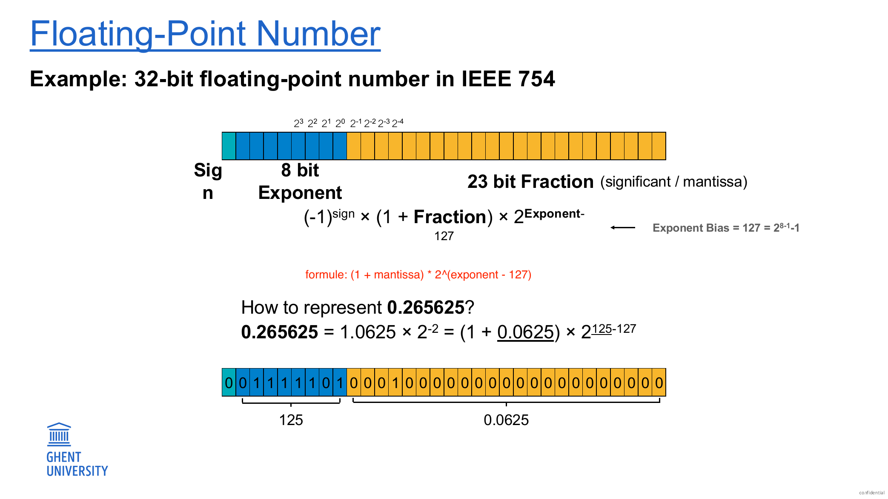

- **1 sign bit** (teken)
- **8 exponent bits**
- **23 fraction bits** (ook *significand* of *mantissa* genoemd)

De waarde van een **normaal getal** is:

$$(-1)^{\text{sign}} \times (1 + \text{Fraction}) \times 2^{\text{Exponent} - 127}$$

De **127** is de *exponent bias* (`= 2⁸⁻¹ − 1`): zo kan de 8-bit exponent zowel negatieve als positieve machten voorstellen.

**Voorbeeld:** `0.265625 = 1.0625 × 2⁻² = (1 + 0.0625) × 2^(125−127)` → exponent-veld = 125, fraction-deel codeert 0.0625.

> **📝 jouw notitie:** *formule: (1 + mantissa) · 2^(exponent − 127)*

### Subnormale getallen (Exponent = 0)

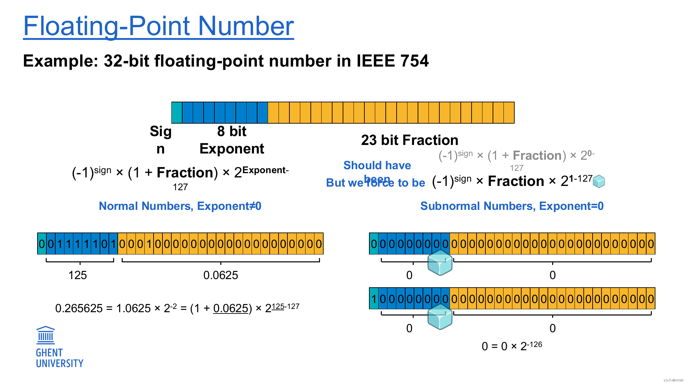

Bij **Exponent = 0** zou de gewone formule `(1 + Fraction) × 2^(0−127)` gelden, **maar** IEEE 754 *forceert* hier een andere formule zodat ook hele kleine getallen (en 0 zelf) representeerbaar zijn:

$$(-1)^{\text{sign}} \times \text{Fraction} \times 2^{1-127}$$

Merk op: de **impliciete 1 verdwijnt** (het wordt `Fraction` i.p.v. `1 + Fraction`) en de exponent wordt `1−127 = −126`. Hierdoor kan `0 = 0 × 2⁻¹²⁶` exact voorgesteld worden.

- **Kleinste positieve subnormale waarde:** fraction = `00…01` → `2⁻²³ × 2⁻¹²⁶ = 2⁻¹⁴⁹`.

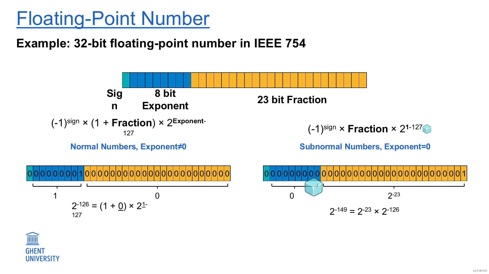

- **Grootste subnormale waarde:** fraction = `11…1` → `(1 − 2⁻²³) × 2⁻¹²⁶` (via meetkundige reeks `2⁻²³ + 2⁻²² + … + 2⁻¹ = 1 − 2⁻²³`).

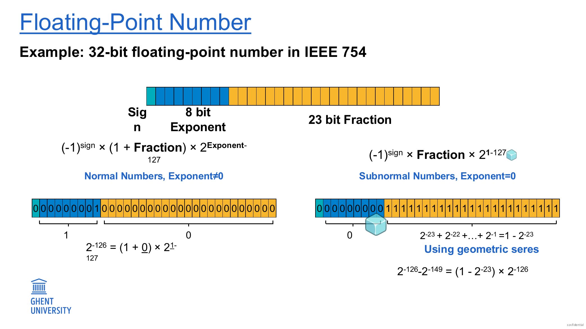

### Speciale waarden (Exponent = 255)

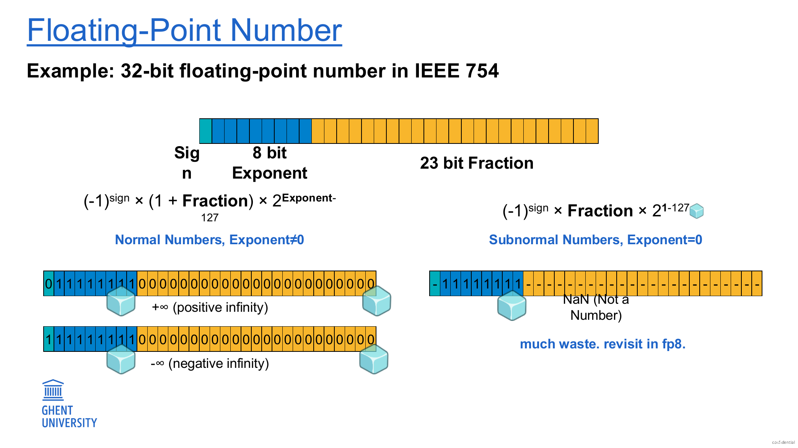

Bij **Exponent = FF (255)**:
- Fraction = 0 → **±∞** (positief of negatief oneindig, afhankelijk van de tekenbit).
- Fraction ≠ 0 → **NaN** (Not a Number, bv. resultaat van 0/0).

> **📝 jouw notitie (blauw op de slide):** *much waste. revisit in fp8.* — er gaan veel bitpatronen "verloren" aan ±∞ en NaN; bij FP8 (verderop) komt dit terug.

### Samenvattende tabel + getallenas

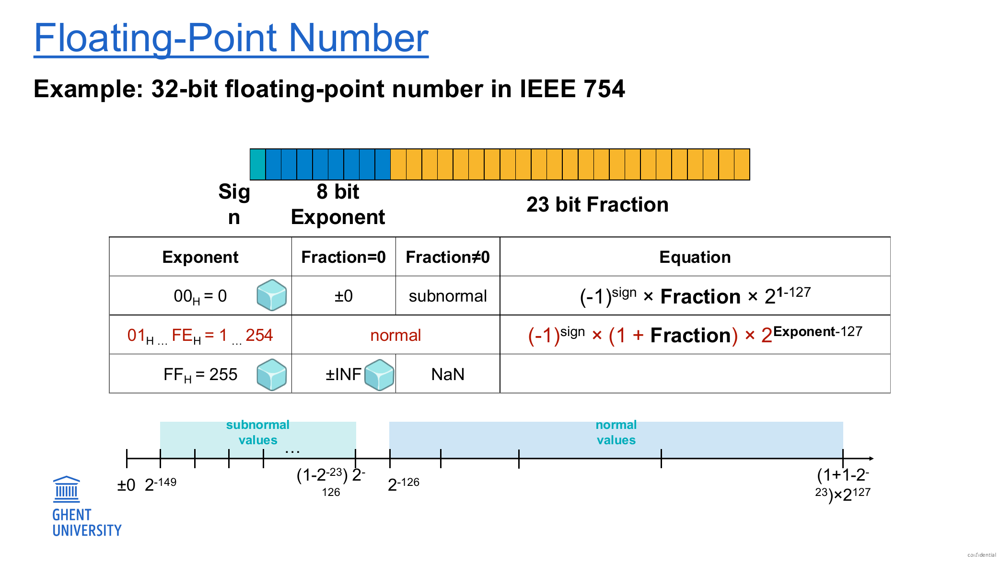

| Exponent | Fraction = 0 | Fraction ≠ 0 | Vergelijking |
|---|---|---|---|
| `00` = 0 | ±0 | subnormal | `(−1)^sign × Fraction × 2^(1−127)` |
| `01 … FE` = 1 … 254 | normal | normal | `(−1)^sign × (1 + Fraction) × 2^(Exponent−127)` |
| `FF` = 255 | ±INF | NaN | — |

De getallenas toont: **subnormal values** liggen dicht bij 0 (van `2⁻¹⁴⁹` tot `(1−2⁻²³)·2⁻¹²⁶`), daarna komen de **normal values** (vanaf `2⁻¹²⁶` tot `(1+1−2⁻²³)·2¹²⁷`).

### Floating-point formaten: FP32 / FP16 / BF16

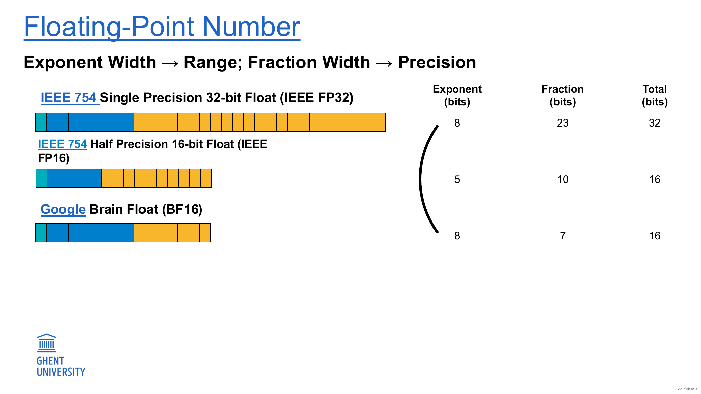

De vuistregel staat bovenaan: **Exponent Width → Range; Fraction Width → Precision.**

| Formaat | Exponent (bits) | Fraction (bits) | Totaal |
|---|---|---|---|
| **IEEE FP32** (single precision) | 8 | 23 | 32 |
| **IEEE FP16** (half precision) | 5 | 10 | 16 |
| **Google BF16** (Brain Float) | 8 | 7 | 16 |

→ **BF16** is slim voor deep learning: het houdt **8 exponent-bits** (dus dezelfde *range* als FP32, weinig overflow-risico bij training) en offert *precisie* op (maar 7 fraction-bits). FP16 doet het omgekeerde: meer precisie, kleiner bereik.

### FP8 (Nvidia)

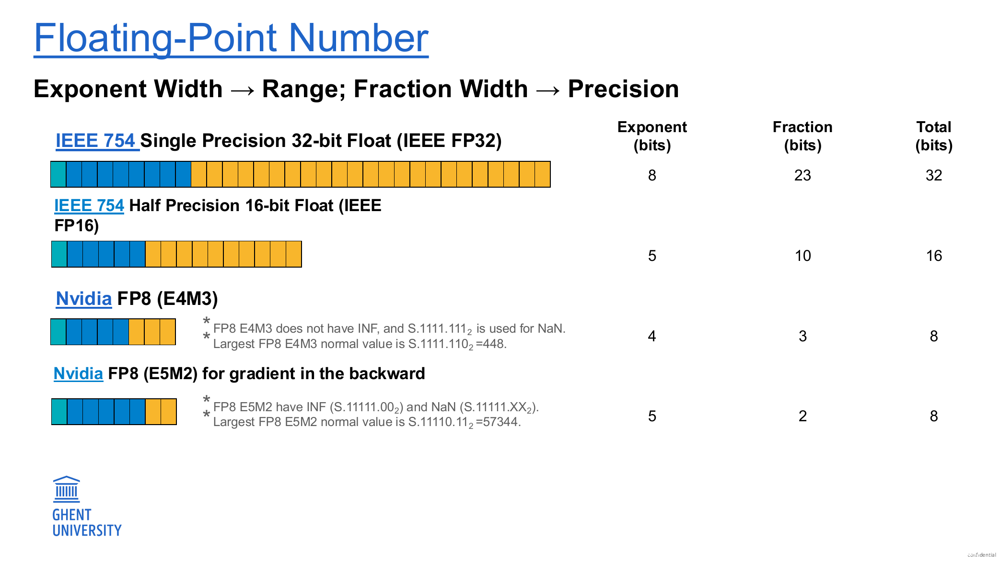

Voor extreme efficiëntie bestaan er **8-bit floats** in twee smaken:

- **FP8 E4M3:** 4 exponent + 3 mantissa bits. Heeft **geen INF**; `S.1111.111` wordt gebruikt voor NaN. Grootste normale waarde = 448. → meer precisie, voor de *forward pass*.
- **FP8 E5M2:** 5 exponent + 2 mantissa bits. Heeft wél INF en NaN. Grootste waarde = 57344. → meer bereik, gebruikt **voor de gradiënten in de backward pass**.

> **Extra context:** dit is precies het "waste" waar je bij ±∞/NaN over schreef — bij FP8 kiest men bewust hoeveel bitpatronen aan speciale waarden besteed worden, omdat elke bit telt.

## 1.5 Oefenvragen die op de slides staan

**Vraag (slide):** Wat is het volgende **IEEE FP16**-getal in decimaal? `1 10001 1100000000` (bias = 15).

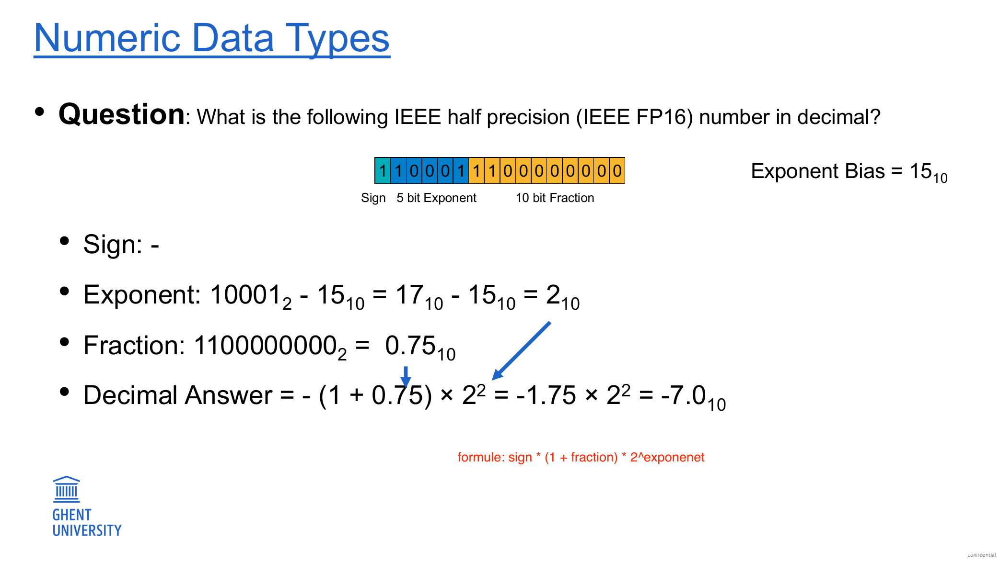

- **Sign:** 1 → negatief (−)
- **Exponent:** `10001₂ = 17`, minus bias 15 → `17 − 15 = 2`
- **Fraction:** `1100000000₂ = 0.75`
- **Antwoord:** `−(1 + 0.75) × 2² = −1.75 × 4 = −7.0`

> **📝 jouw notitie:** *formule: sign · (1 + fraction) · 2^exponent* (waarbij exponent al de bias-correctie bevat).

**Vraag (slide):** Wat is decimaal **2.5** in **Brain Float (BF16)**? (bias = 127)

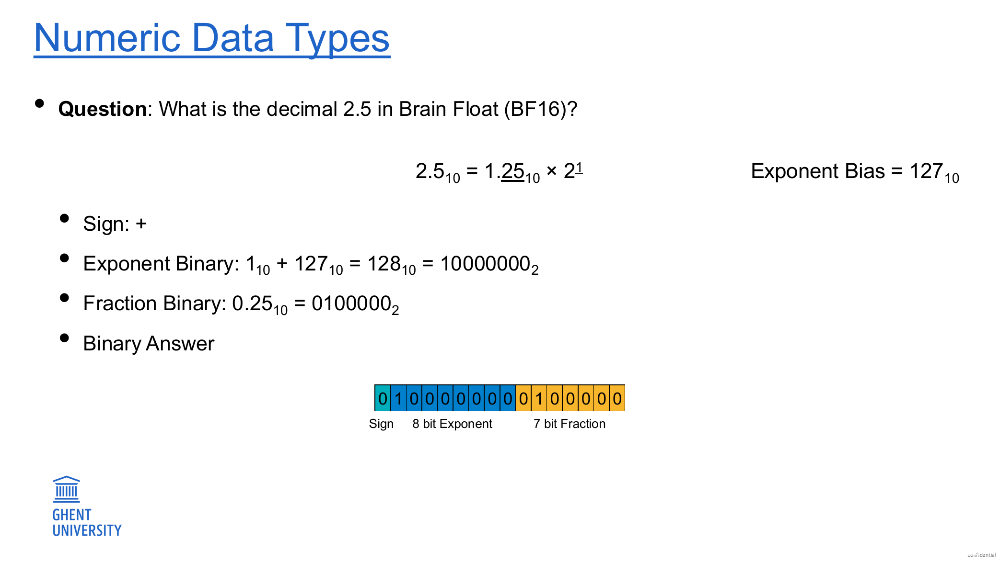

- `2.5 = 1.25 × 2¹`
- **Sign:** + → 0
- **Exponent:** `1 + 127 = 128 = 10000000₂`
- **Fraction:** `0.25 = 0100000₂` (7 bits)
- **Binair antwoord:** `0 10000000 0100000`

---

# DEEL 2 — Basic concepts of Neural Network quantization

## 2.1 What is Quantization?

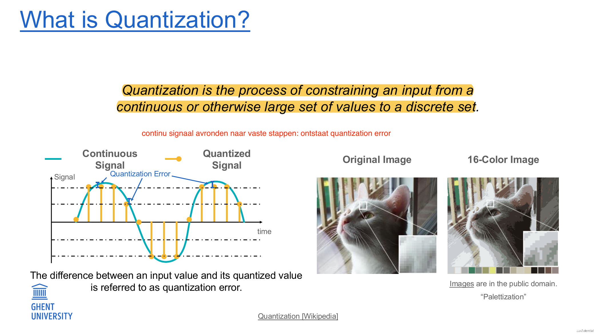

> **Quantization is the process of constraining an input from a continuous (or otherwise large) set of values to a discrete set.**

Het verschil tussen een input-waarde en zijn gequantizeerde waarde heet de **quantization error**. Links op de slide: een continu (sinus-)signaal wordt afgerond naar vaste niveaus → bij elk sample ontstaat een foutje. Rechts: een foto die naar 16 kleuren wordt teruggebracht ("palettization") — je ziet blokken ontstaan.

> **📝 jouw notitie:** *continu signaal afronden naar vaste stappen: ontstaat quantization error.*

## 2.2 Uniform vs non-uniform quantization

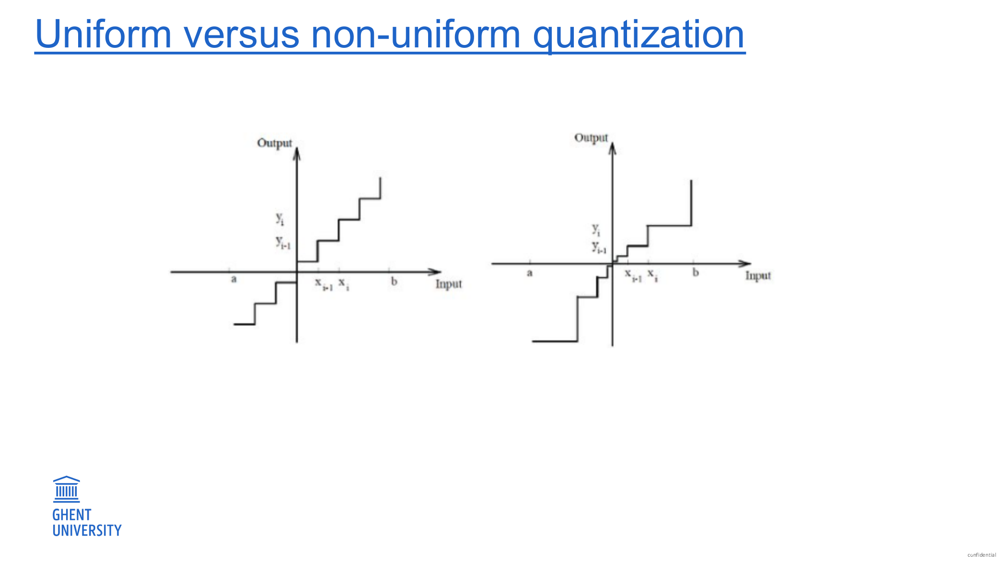

De input→output-stappenfunctie kan op twee manieren:
- **Uniform:** alle quantization-stappen zijn **even breed** (gelijke afstand tussen niveaus). Eenvoudig, hardware-vriendelijk.
- **Non-uniform:** de stappen hebben **verschillende breedtes** (bv. fijner waar veel waarden liggen). Beter passend bij de dataverdeling, maar complexer.

## 2.3 Neural Network Quantization: het overzicht

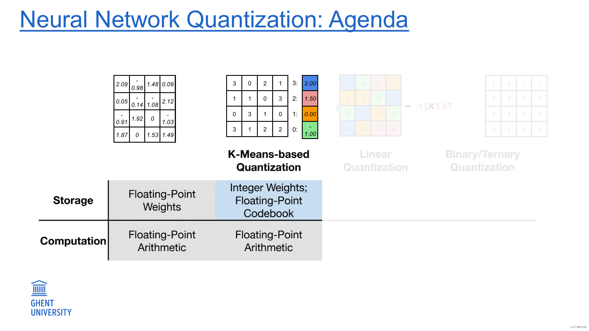

Er zijn vier "niveaus" van quantization, oplopend in agressiviteit. De onderste tabel toont wat er met **storage** (opslag) en **computation** (rekenen) gebeurt:

| Type | Storage | Computation |
|---|---|---|
| **Geen quantization** | Floating-Point Weights | Floating-Point Arithmetic |
| **K-Means-based** | Integer Weights + Floating-Point **Codebook** | Floating-Point Arithmetic |
| **Linear** | Integer Weights | **Integer** Arithmetic |
| **Binary/Ternary** | (1- of 2-bit) | (zeer goedkoop) |

→ Belangrijk onderscheid: bij **K-means** worden de gewichten *integers die naar een float-codebook wijzen* (rekenen blijft in float). Bij **linear** worden zowel opslag als **rekenen** integer → dit is wat echte int8-versnelling oplevert.

## 2.4 Weight Quantization — de basisidee

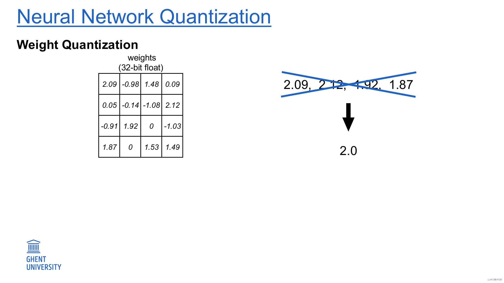

Vertrek van een matrix met **32-bit float**-gewichten. Het idee van quantization: gewichten die dicht bij elkaar liggen (`2.09, 2.12, 1.92, 1.87`) **samenvatten tot één waarde** (bv. `2.0`). In plaats van elk gewicht apart op te slaan, sla je een klein aantal representatieve waarden op + voor elk gewicht een verwijzing.

---

# DEEL 3 — Quantization types

### Wat kan je allemaal quantizeren?

In een neuraal netwerk zijn er **drie hoofdcategorieën** die je kan quantizeren:

| Wat | Wat is het? | Wanneer? |
|---|---|---|
| **Weights** (parameters) | Geleerde gewichten + biases | Vóór deployment (statisch) |
| **Activations** | Tussenresultaten van elke laag | Tijdens inferentie (dynamisch) |
| **Gradients** | Updates tijdens training | Tijdens training (alleen bij QAT/training) |

#### Waarom de focus op weights?

Er zijn praktische redenen waarom weight-quantization het eerste en meest voor de hand liggende is:

###### 1. Weights zijn statisch
Na training **veranderen weights niet meer**. Je kan ze één keer quantizeren en klaar. Geen complicaties tijdens runtime.

###### 2. Weights nemen veel geheugen in
In een typisch CNN domineren weights de model size (denk aan de FC-laag berekening die we deden: miljoenen parameters). Quantizeren = direct geheugenwinst.

##### 3. Weights → flash, activations → SRAM
Herinner je nog: weights in flash, activations in SRAM. Door **weights** te quantizeren verklein je je **flash footprint** → past sneller op een MCU.

#### Maar pas op: enkel weights quantizeren is niet altijd voldoende

Voor maximale efficiency wil je vaak **ook activations** quantizeren, want dan kan je:

- **Volledig int8-rekenen tijdens inferentie**: int8 × int8 = int (geen FPU nodig)
- **SIMD-instructies benutten**: Cortex-M4 doet 4× int8 ops tegelijk

Als je **enkel weights** quantizeert, moet je elke int8-weight nog steeds terug vermenigvuldigen met float32-activations → je verliest een groot deel van de snelheidswinst. Je krijgt wel nog steeds de **geheugenwinst**.

## 3.1 K-Means-based Weight Quantization

*(Deep Compression, Han et al., ICLR 2016.)*

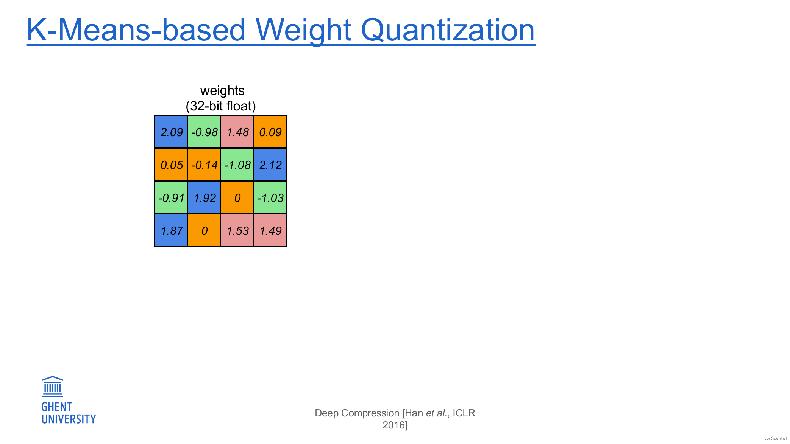

**Idee:** clusterer alle gewichten met **K-means** in een klein aantal groepen. Elk cluster krijgt één **centroid** (gemiddelde waarde). Je slaat dan op:
1. een **cluster index** per gewicht (klein integer, bv. 2-bit),
2. een **codebook** = de lijst centroids (in float).

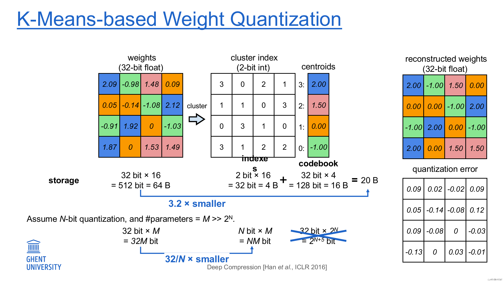

**Hoe het werkt (zie foto):**
- Links de originele 4×4 float-matrix → clusteren → **cluster index** (2-bit ints, waarden 0–3) + **codebook** (4 centroids: `-1.00, 0.00, 1.50, 2.00`).
- **Reconstructed weights:** vervang elke index door zijn centroid. Het verschil met het origineel = **quantization error** (rechts).

**Opslagwinst (16 gewichten, 4 clusters, 2-bit index):**
- Origineel: `32 bit × 16 = 512 bit = 64 B`
- Gequantizeerd: indexen `2 bit × 16 = 4 B` + codebook `32 bit × 4 = 16 B` = **20 B** → **3.2× kleiner**.
- Algemeen (N-bit quantization, M gewichten, M ≫ 2ᴺ): van `32M` bit naar `N·M` bit → **32/N × kleiner** (het codebook `32 × 2ᴺ` is verwaarloosbaar).

### Fine-tuning van gequantizeerde gewichten

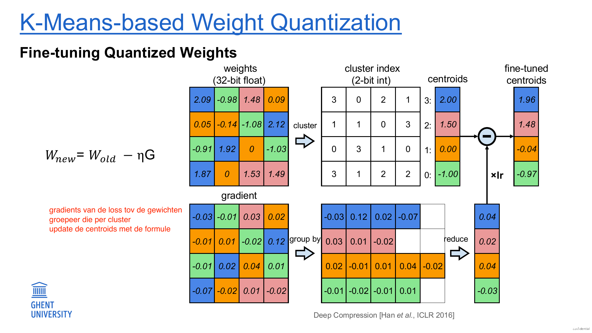

Na het clusteren kan je de **centroids bijregelen** met gradient descent (`W_new = W_old − η·G`). De truc: de gradiënten worden **per cluster gegroepeerd en opgeteld (reduce)**, en die som past de centroid aan (× learning rate).

> **📝 jouw notitie:** *gradients van de loss t.o.v. de gewichten → groepeer die per cluster → update de centroids met de formule.*

### Wat doet quantization met de gewichtsverdeling?

Drie histogrammen vertellen het verhaal:

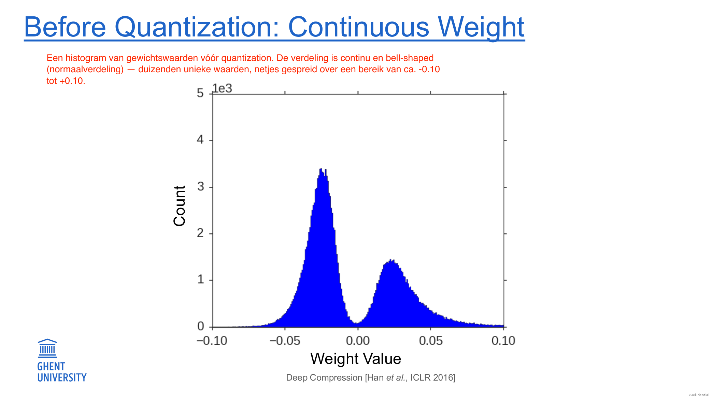

> **📝 jouw notitie:** *Een histogram van gewichtswaarden vóór quantization. De verdeling is continu en bell-shaped (normaalverdeling) — duizenden unieke waarden, netjes gespreid over een bereik van ca. −0.10 tot +0.10.*

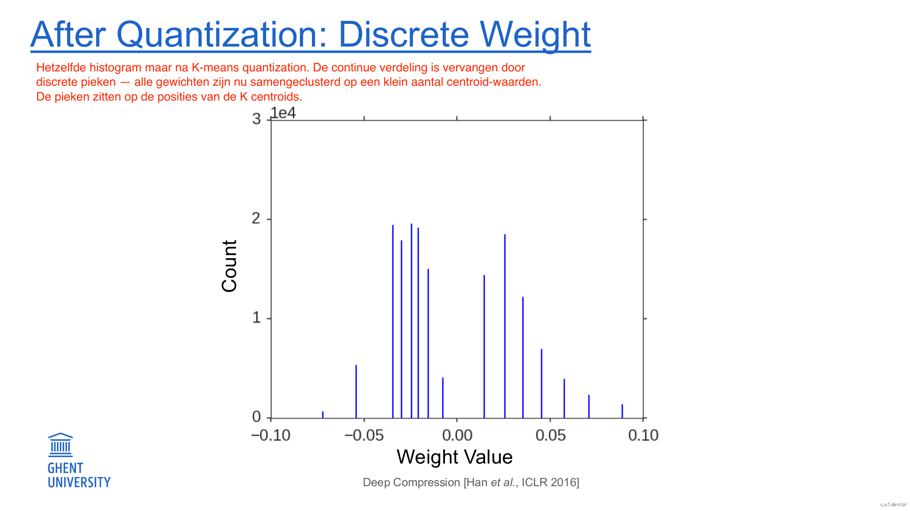

> **📝 jouw notitie:** *Hetzelfde histogram maar na K-means quantization. De continue verdeling is vervangen door discrete pieken — alle gewichten zijn nu samengeclusterd op een klein aantal centroid-waarden. De pieken zitten op de posities van de K centroids.*

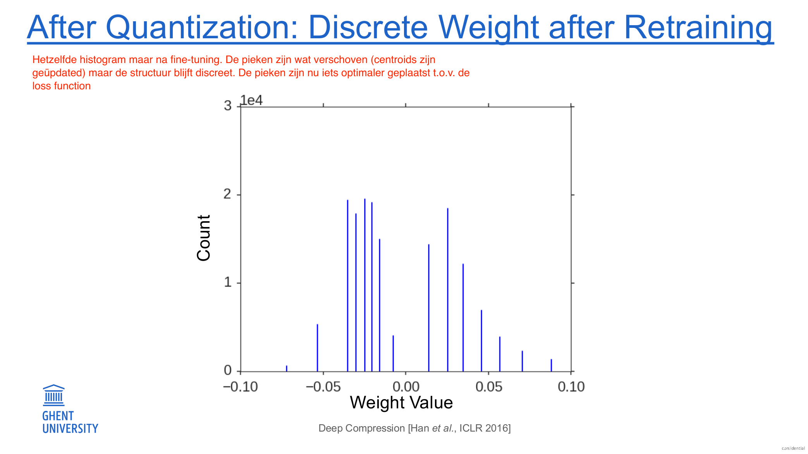

> **📝 jouw notitie:** *Hetzelfde histogram maar na fine-tuning. De pieken zijn wat verschoven (centroids zijn geüpdatet) maar de structuur blijft discreet. De pieken zijn nu iets optimaler geplaatst t.o.v. de loss function.*

### Accuracy vs compression rate (AlexNet, ImageNet)

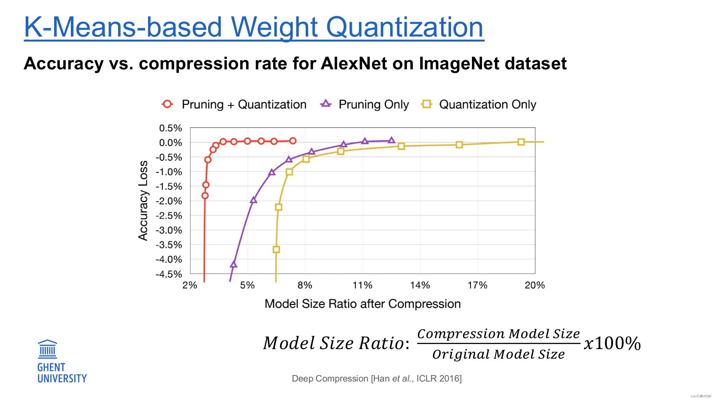

De grafiek (accuracy loss vs model size ratio na compressie) vergelijkt drie curves:
- **Quantization Only** (geel): accuracy zakt onder ~8% model-grootte.
- **Pruning Only** (paars): zakt onder ~8%.
- **Pruning + Quantization** (rood): het best — blijft vlak tot **~3%** van de originele grootte!

→ **Pruning en quantization zijn complementair** en versterken elkaar. (`Model Size Ratio = compressed size / original size × 100%`.)

## 3.2 How Many Bits do We Need?

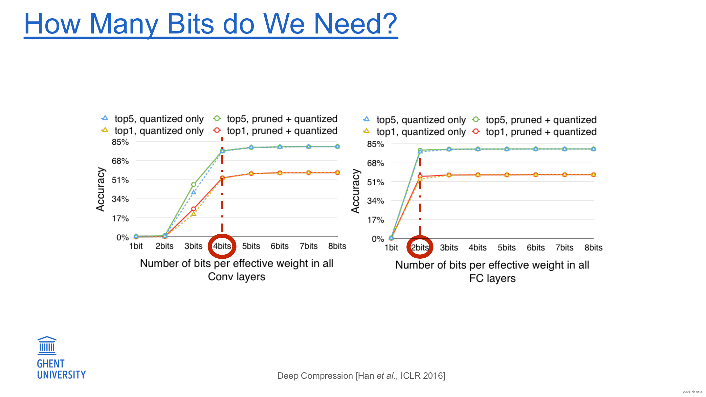

Hoeveel bits per gewicht heb je echt nodig vóór de accuracy instort? Antwoord verschilt per laagtype:
- **Conv-lagen:** ~**4 bits** zijn nodig (gevoeliger).
- **FC-lagen:** ~**2 bits** volstaan (redundanter).

Daarboven (5–8 bits) wint accuracy bijna niets meer; daaronder stort ze in.

## 3.3 Huffman Coding

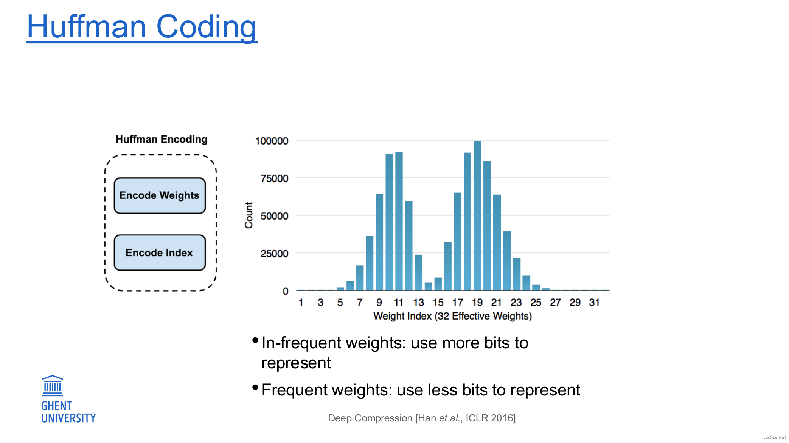

Een extra (lossless) compressiestap bovenop quantization:
- **Frequente** gewichten → **minder** bits.
- **Zeldzame** gewichten → **meer** bits.

Het gewicht-histogram is niet uniform (sommige indexen komen veel vaker voor), dus variabele-lengte-codering wint opslag zonder enige accuracy-verlies.

## 3.4 Summary of Deep Compression

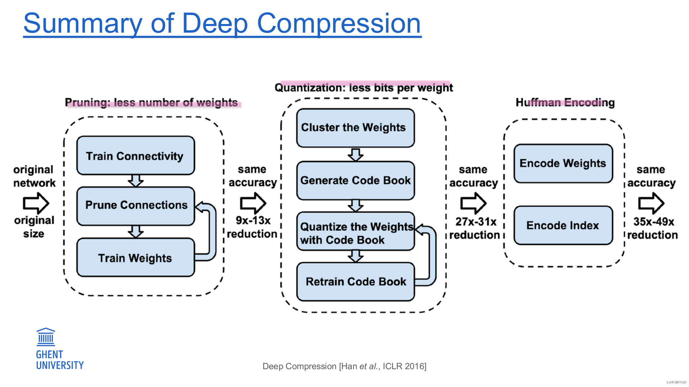

De volledige Deep Compression-pijplijn, drie stappen die **elk de accuracy behouden**:

| Stap | Wat | Cumulatieve reductie |
|---|---|---|
| **Pruning** | minder gewichten (Train Connectivity → Prune → Train Weights) | **9× – 13×** |
| **+ Quantization** | minder bits per gewicht (Cluster → Codebook → Quantize → Retrain) | **27× – 31×** |
| **+ Huffman Encoding** | frequente waarden korter coderen | **35× – 49×** |

## 3.5 Deep Compression Results

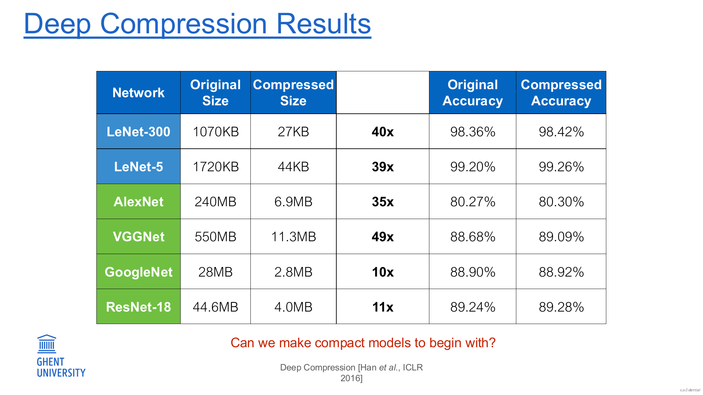

| Netwerk | Origineel | Gecomprimeerd | Ratio | Acc voor → na |
|---|---|---|---|---|
| LeNet-300 | 1070 KB | 27 KB | **40×** | 98.36% → 98.42% |
| LeNet-5 | 1720 KB | 44 KB | **39×** | 99.20% → 99.26% |
| AlexNet | 240 MB | 6.9 MB | **35×** | 80.27% → 80.30% |
| VGGNet | 550 MB | 11.3 MB | **49×** | 88.68% → 89.09% |
| GoogleNet | 28 MB | 2.8 MB | **10×** | 88.90% → 88.92% |
| ResNet-18 | 44.6 MB | 4.0 MB | **11×** | 89.24% → 89.28% |

→ Tot **49× kleiner** zonder accuracy-verlies (soms zelfs iets beter). De slide eindigt met de open vraag: *"Can we make compact models to begin with?"* (→ leidt naar NAS, Lect07).

## 3.6 Linear Quantization

Vanaf hier het tweede type — en het belangrijkste voor echte int-hardware. In het overzicht: **integer weights én integer arithmetic**.

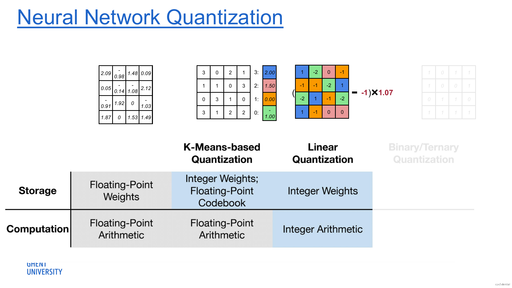

### De affine mapping

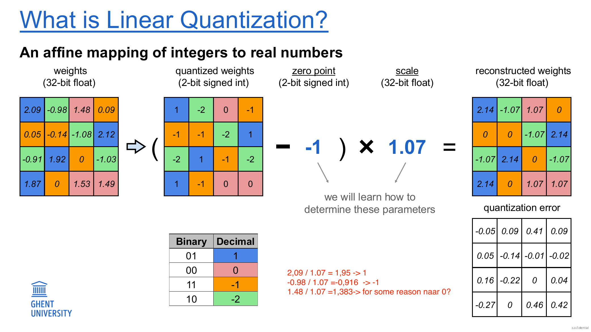

**Linear quantization = een affine mapping van integers naar reële getallen:**

$$r = S \cdot (q - Z)$$

waarbij (zie de slide):
- **r** = de echte floating-point waarde (reconstructed),
- **q** = de opgeslagen quantized integer,
- **Z** = het **zero point** (een integer),
- **S** = de **scale** (een float).

Voorbeeld op de slide: `(q − (−1)) × 1.07` mapt de 2-bit ints `{-2,-1,0,1}` terug naar floats. De binary↔decimal tabel toont de 2-bit two's-complement codering.

> **📝 jouw notitie:** *r = (q − Z) · S* — *r = floating point waarde; q = opgeslagen integer (quantized); Z = zero point (int): zorgt dat r = 0 ook exact kan; S = scale: stapgrootte.*

> **📝 jouw notitie (over de gewichtsdeling):** *2.09 / 1.07 = 1.95 → 1; −0.98 / 1.07 = −0.916 → −1; 1.48 / 1.07 = 1.383 → "for some reason naar 0?"* (afronden + clampen naar het beschikbare 2-bit bereik kan verrassend uitvallen — vandaar de quantization error).

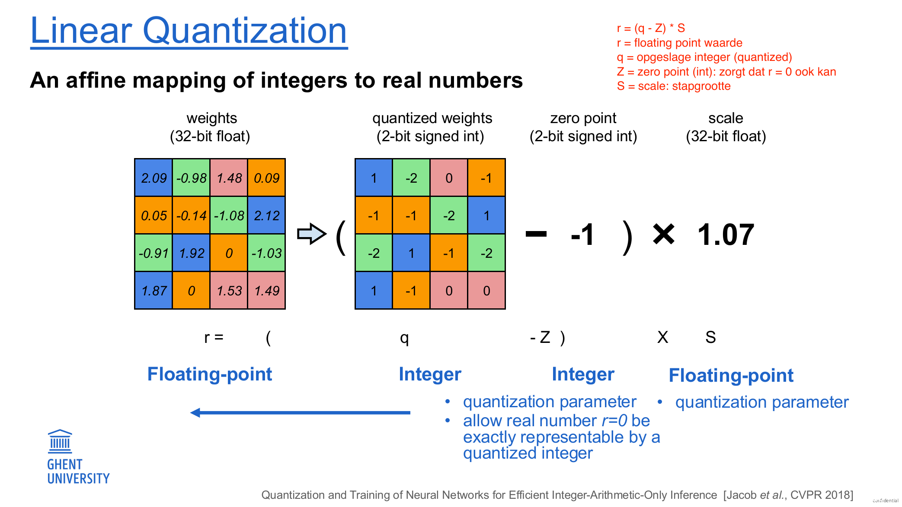

De slide kleurt de formule volgens datatype: **r** = floating-point, **q** en **Z** = integer, **S** = floating-point. `q` en `Z` zijn de twee **quantization parameters**. Een belangrijk doel: de reële waarde **r = 0 moet exact representeerbaar** zijn door een quantized integer (vandaar het zero point).

### De scale S berekenen

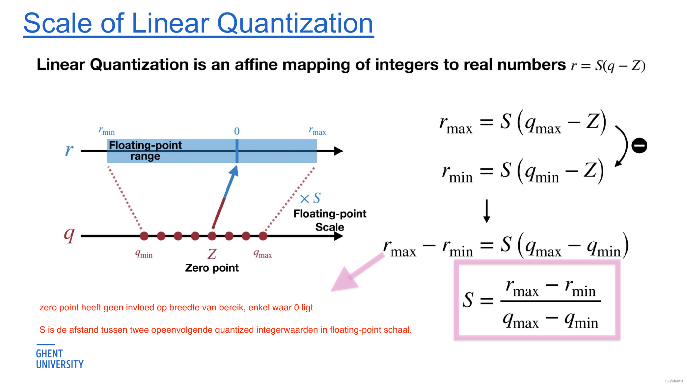

Trek `r_min = S(q_min − Z)` af van `r_max = S(q_max − Z)` → het zero point Z valt weg:

$$S = \frac{r_{max} - r_{min}}{q_{max} - q_{min}}$$

> **📝 jouw notitie:** *het zero point heeft geen invloed op de breedte van het bereik, enkel op waar 0 ligt.* En: *S is de afstand tussen twee opeenvolgende quantized integerwaarden in floating-point schaal.*

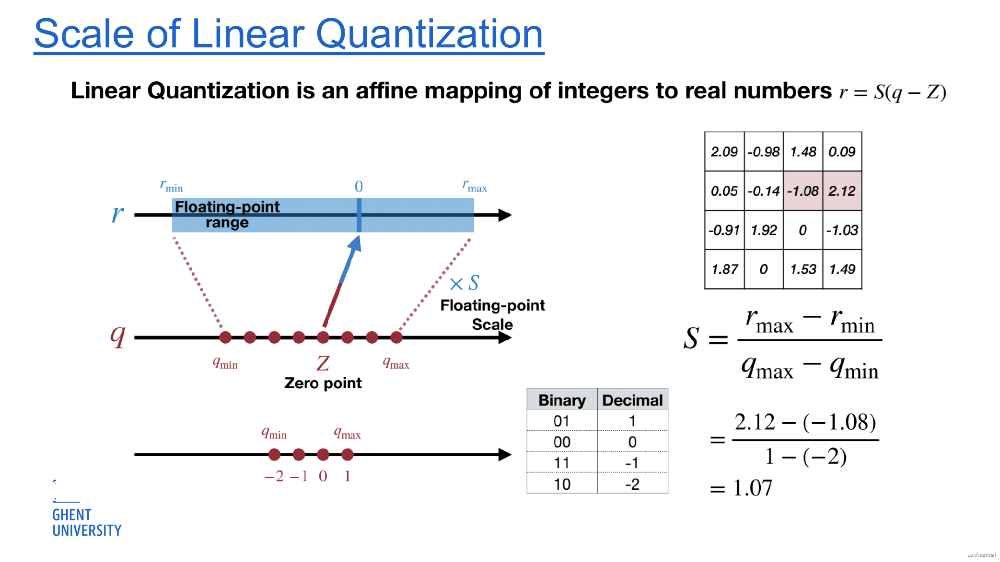

**Voorbeeld:** met `r_max = 2.12`, `r_min = −1.08` en 2-bit ints (`q_max = 1`, `q_min = −2`):

$$S = \frac{2.12 - (-1.08)}{1 - (-2)} = \frac{3.20}{3} = 1.07$$

### Het zero point Z berekenen

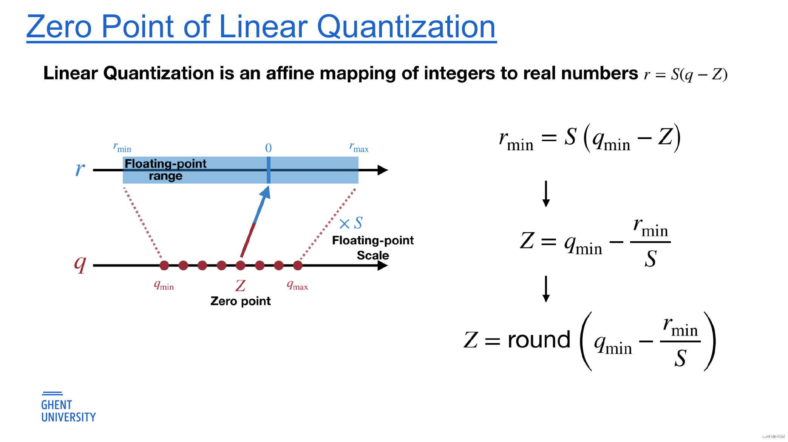

Uit `r_min = S(q_min − Z)` los je Z op, en je **rondt af** (want Z moet een integer zijn):

$$Z = \text{round}\left(q_{min} - \frac{r_{min}}{S}\right)$$

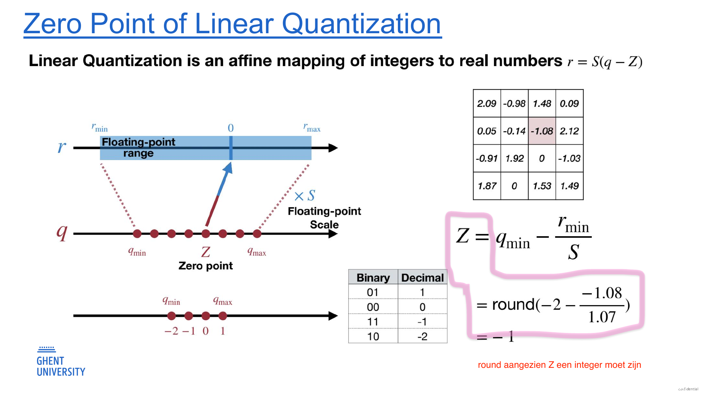

**Voorbeeld:** `Z = round(−2 − (−1.08 / 1.07)) = round(−2 + 1.009) = round(−0.99) = −1`.

> **📝 jouw notitie:** *round, aangezien Z een integer moet zijn.*

### Volledig uitgewerkt voorbeeld

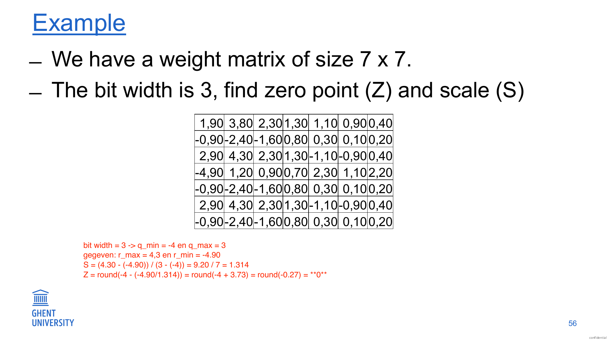

**Opgave:** weight-matrix 7×7, bit width = 3, vind Z en S.

> **📝 jouw notitie (uitwerking):**
> - bit width = 3 → `q_min = −4` en `q_max = 3`
> - gegeven: `r_max = 4.30` en `r_min = −4.90`
> - `S = (4.30 − (−4.90)) / (3 − (−4)) = 9.20 / 7 = 1.314`
> - `Z = round(−4 − (−4.90 / 1.314)) = round(−4 + 3.73) = round(−0.27) = 0`

### INT8 Linear Quantization — resultaten

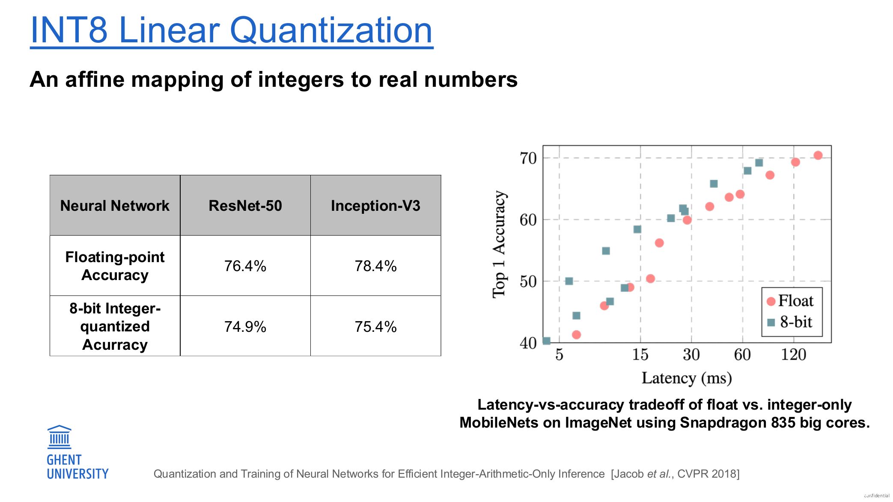

*(Jacob et al., CVPR 2018 — "Integer-Arithmetic-Only Inference".)*

| Netwerk | FP-accuracy | 8-bit int accuracy |
|---|---|---|
| ResNet-50 | 76.4% | 74.9% |
| Inception-V3 | 78.4% | 75.4% |

De grafiek (latency vs top-1 accuracy op Snapdragon 835) toont dat **int8 (blauw)** bij dezelfde latency een hogere accuracy haalt dan **float (rood)** — of, omgekeerd, dezelfde accuracy veel sneller. Klein accuracy-verlies, grote snelheidswinst.

---

# DEEL 4 — Post-Training Quantization (PTQ)

## 4.1 Wat is PTQ?

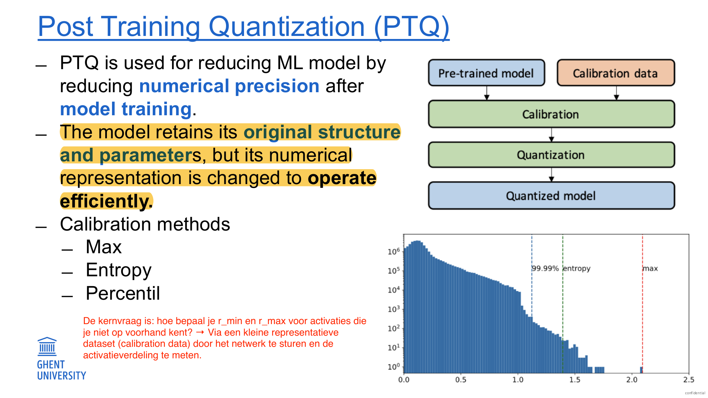

**PTQ** verkleint een model door de **numerieke precisie te verlagen ná het trainen.** Het model behoudt zijn **originele structuur en parameters**, enkel de numerieke representatie verandert (om efficiënter te draaien). De pijplijn: `Pre-trained model + Calibration data → Calibration → Quantization → Quantized model`.

**Calibration methods** (hoe bepaal je het bereik `r_min`/`r_max` van de activaties?):
- **Max** — neem de absolute max (rode lijn; gevoelig voor outliers).
- **Entropy** — minimaliseer informatieverlies (bv. 99.99%).
- **Percentile** — knip een klein percentage outliers weg.

> **📝 jouw notitie:** *De kernvraag is: hoe bepaal je r_min en r_max voor activaties die je niet op voorhand kent? → Via een kleine representatieve dataset (calibration data) door het netwerk te sturen en de activatieverdeling te meten.*

> **Extra context:** gewichten ken je exact (vaste getallen), maar **activaties** hangen af van de input. Daarom heb je calibration data nodig om hun bereik te schatten.

## 4.2 Quantization Granularity: per-tensor vs per-channel

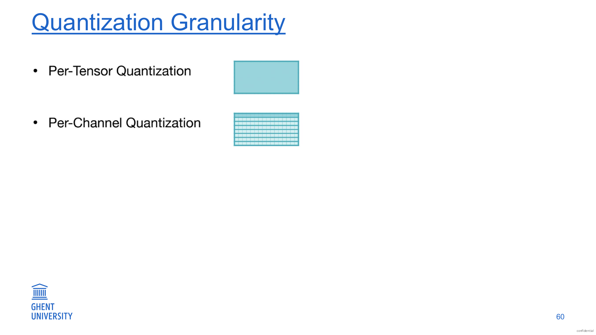

- **Per-Tensor Quantization:** één scale S (en zero point) voor de **hele tensor**.
- **Per-Channel Quantization:** een **aparte** scale per **channel/rij**.

## 4.3 Symmetric Linear Quantization on Weights

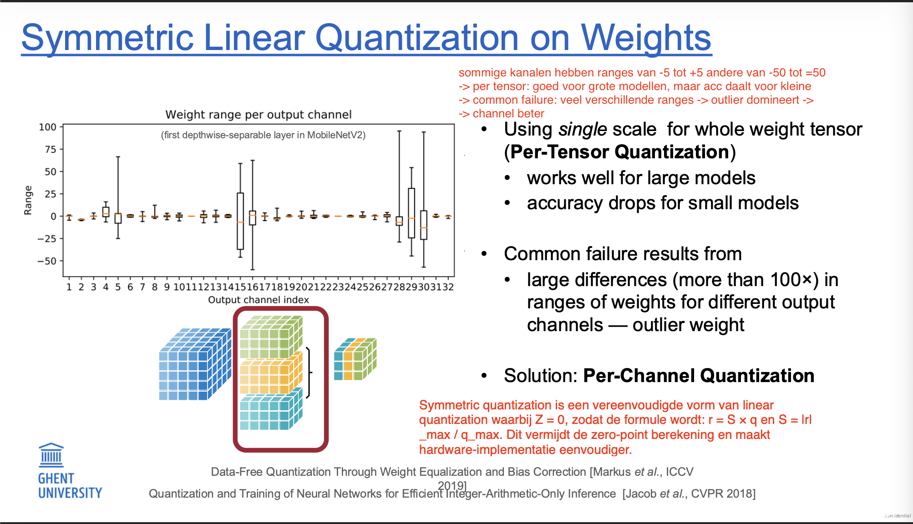

Bij **symmetrische** quantization is `Z = 0`, dus `r = S·q`, met `S = |r|_max / q_max`.

De boxplot (gewicht-range per output-channel van MobileNetV2) toont waarom **per-tensor** soms faalt:
- **Per-Tensor met één scale** werkt goed voor **grote modellen**, maar de **accuracy zakt bij kleine modellen.**
- **Common failure:** als de gewicht-ranges van verschillende output-channels **>100× verschillen** (een **outlier-channel**), dan domineert die ene uitschieter de gemeenschappelijke scale en worden alle andere channels grof gequantizeerd.
- **Oplossing → Per-Channel Quantization.**

> **📝 jouw notitie:** *Symmetric quantization is een vereenvoudigde vorm van linear quantization waarbij Z = 0, zodat de formule wordt: r = S × q en S = |r|_max / q_max. Dit vermijdt de zero-point berekening en maakt hardware-implementatie eenvoudiger.*

## 4.4 Per-Channel Weight Quantization — uitgewerkt

**Per-tensor (ter vergelijking):** één `|r|_max = 2.12` voor de hele matrix.

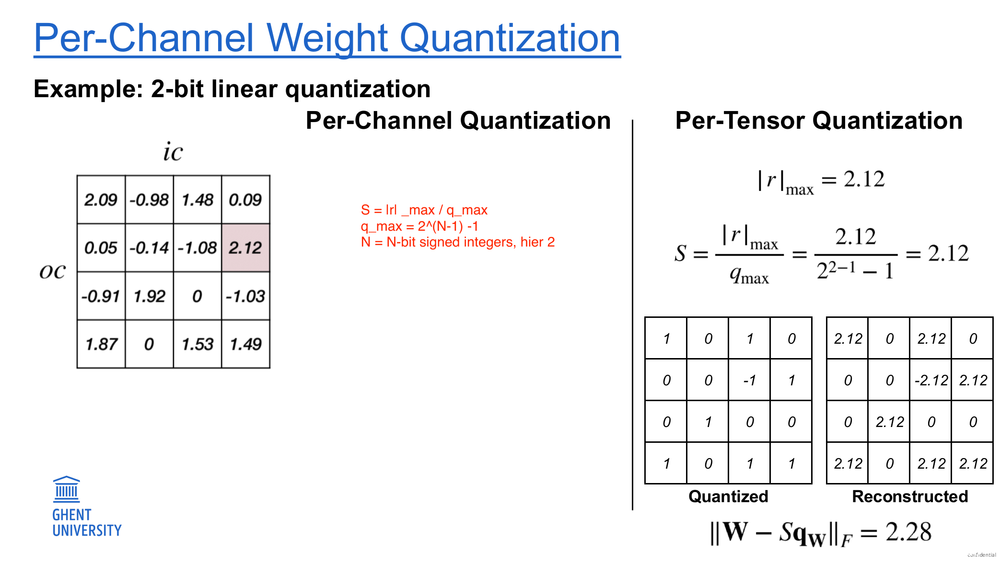

> **📝 jouw notitie:** *S = |r|_max / q_max; q_max = 2^(N−1) − 1; N = aantal bits van de signed integers, hier 2 → q_max = 1, dus S = 2.12 / 1 = 2.12.*

**Per-channel:** elke rij krijgt zijn eigen `|r|_max` en dus eigen scale:

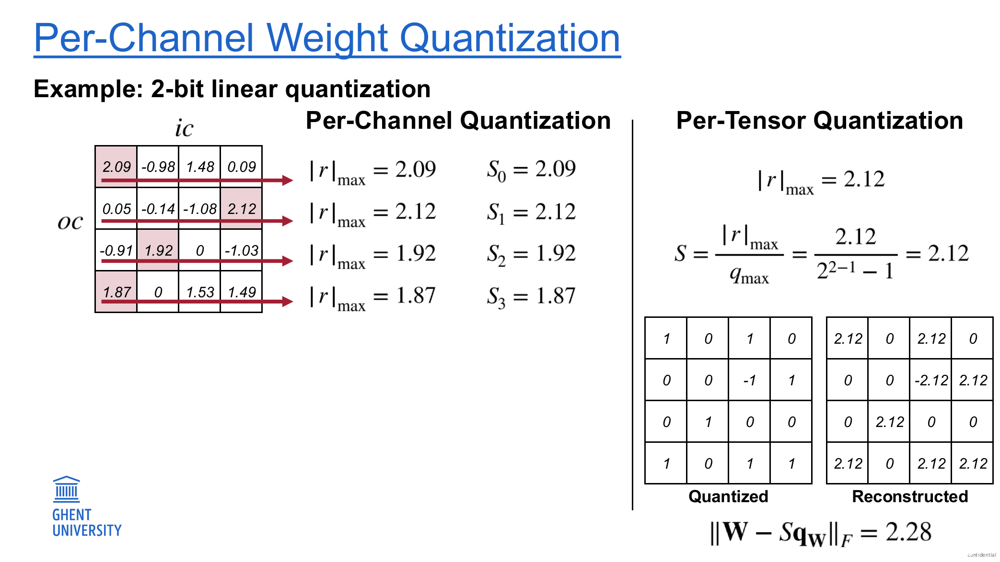

- Rij 0: `|r|_max = 2.09` → S₀ = 2.09
- Rij 1: `|r|_max = 2.12` → S₁ = 2.12
- Rij 2: `|r|_max = 1.92` → S₂ = 1.92
- Rij 3: `|r|_max = 1.87` → S₃ = 1.87

**Het resultaat — per-channel is nauwkeuriger:**

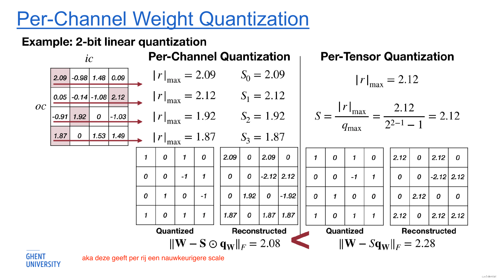

De reconstructie-fout (Frobenius-norm `‖W − S·q‖`):
- **Per-Channel:** `2.08`
- **Per-Tensor:** `2.28`

→ Per-channel heeft de **kleinere fout** want elke rij krijgt een scale op maat.

> **📝 jouw notitie:** *aka deze geeft per rij een nauwkeurigere scale.*

> **Extra context:** de prijs is dat je meer scales moet opslaan (één per channel i.p.v. één per tensor) en dat de hardware per-channel scales moet ondersteunen. Voor gewichten is dit ondertussen standaard; voor activaties blijft per-tensor gangbaar.

---

# DEEL 5 — Quantization-Aware Training (QAT)

## 5.1 Wat is QAT?

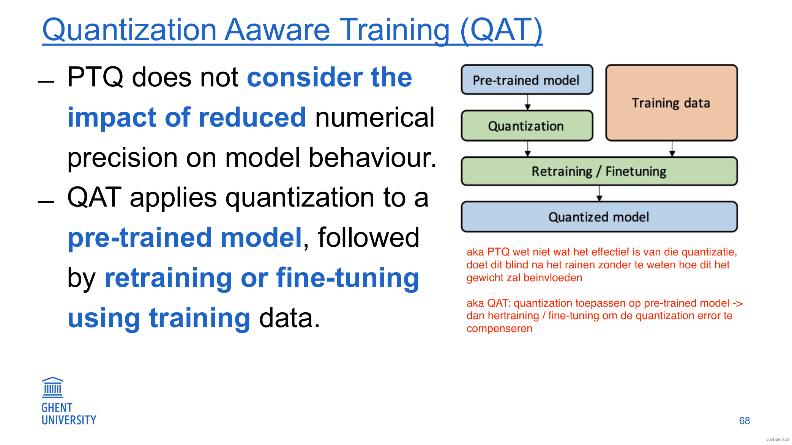

- **PTQ houdt geen rekening met de impact** van de verlaagde precisie op het modelgedrag — het quantizeert "blind" ná het trainen.
- **QAT** past quantization toe op een **pre-trained model** en doet dan **retraining / fine-tuning met de trainingsdata**, zodat het netwerk leert omgaan met de quantization error.

> **📝 jouw notitie:** *PTQ weet niet wat het effect is van die quantisatie — het doet dit blind na het trainen, zonder te weten hoe het de gewichten zal beïnvloeden.*
>
> *QAT: quantization toepassen op een pre-trained model → dan hertraining / fine-tuning om de quantization error te compenseren.*

## 5.2 QAT kan starten van een PTQ-model

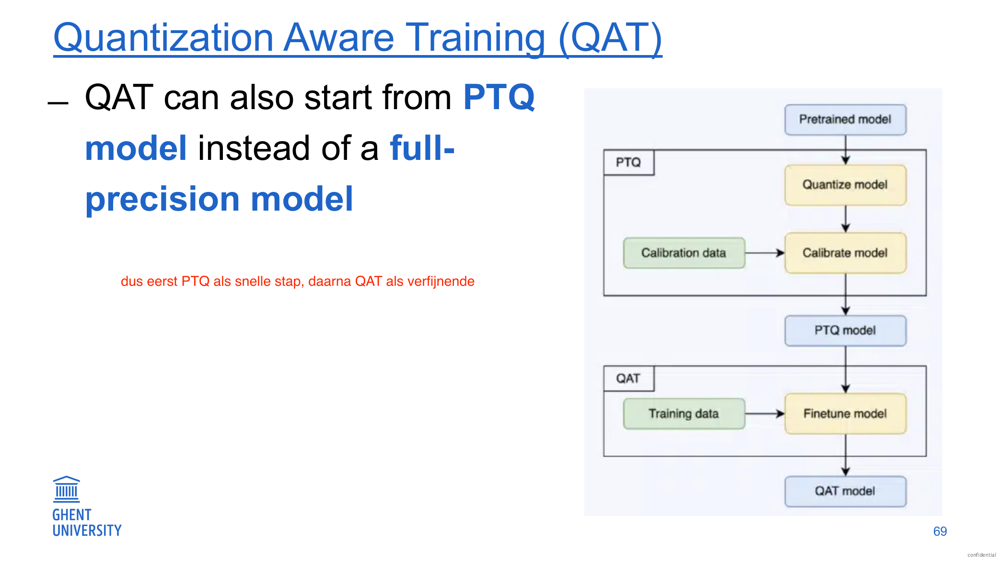

QAT hoeft niet per se van een full-precision model te vertrekken — het kan ook starten van een reeds **PTQ-gequantizeerd model**. De pijplijn: eerst PTQ (Quantize → Calibrate → PTQ model), dan QAT (Finetune met training data → QAT model).

> **📝 jouw notitie:** *dus eerst PTQ als snelle stap, daarna QAT als verfijnende.*

## 5.3 QAT vs PTQ

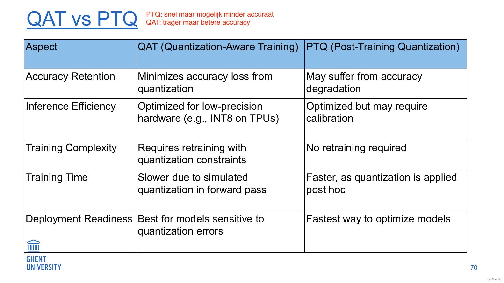

> **📝 jouw notitie:** *PTQ: snel maar mogelijk minder accuraat. QAT: trager maar betere accuracy.*

| Aspect | QAT | PTQ |
|---|---|---|
| **Accuracy Retention** | minimaliseert accuracy-verlies | kan accuracy-degradatie hebben |
| **Inference Efficiency** | geoptimaliseerd voor low-precision HW (bv. INT8 op TPU) | geoptimaliseerd, maar vereist calibratie |
| **Training Complexity** | retraining met quantization-constraints nodig | géén retraining nodig |
| **Training Time** | trager (gesimuleerde quantization in forward pass) | sneller (post hoc) |
| **Deployment Readiness** | best voor modellen gevoelig aan quantization-fouten | snelste manier om te optimaliseren |

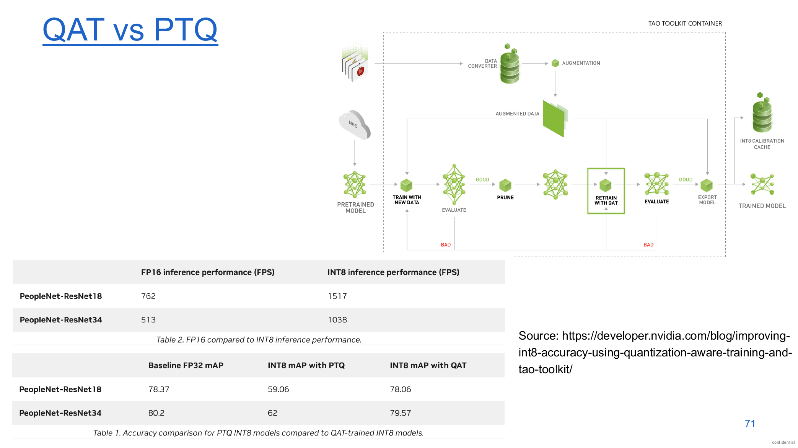

**Concrete cijfers (NVIDIA TAO, PeopleNet):**
- INT8 verdubbelt ongeveer de **inference-snelheid** t.o.v. FP16 (ResNet18: 762 → 1517 FPS).
- Maar **PTQ kost veel accuracy**, **QAT herstelt die bijna volledig**:

| Model | FP32 mAP | INT8 + PTQ | INT8 + QAT |
|---|---|---|---|
| PeopleNet-ResNet18 | 78.37 | 59.06 | **78.06** |
| PeopleNet-ResNet34 | 80.2 | 62 | **79.57** |

→ Dit is hét argument voor QAT: bijna gratis int8-snelheid mét behoud van accuracy.

---

# DEEL 6 — Case study: Interference Cancellation

Tot slot toont de prof eigen onderzoek van de vakgroep, waar deze technieken (quantization, pruning, depthwise separable convolutions) op een echt draadloos probleem worden toegepast.

## 6.1 Known Interference Cancellation

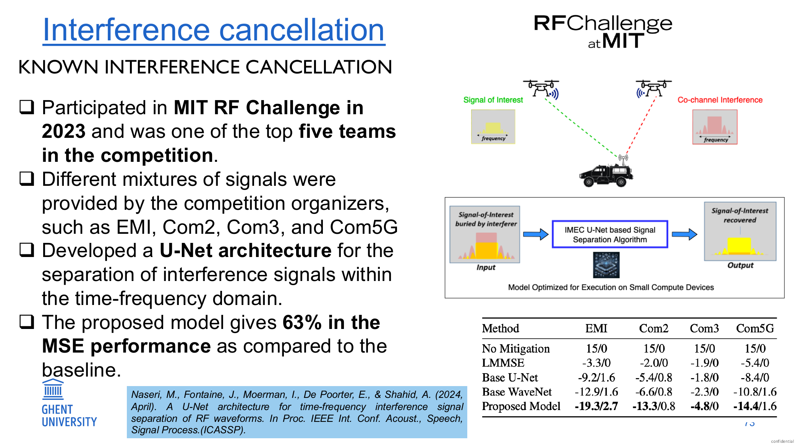

- Deelgenomen aan de **MIT RF Challenge 2023** → **top-5** team.
- Verschillende signaalmengsels (EMI, Com2, Com3, Com5G).
- Een **U-Net-architectuur** scheidt het gewenste signaal van de interferentie in het **tijd-frequentie-domein**.
- De voorgestelde aanpak geeft **63% betere MSE** dan de baseline.

## 6.2 Blind Interference Cancellation

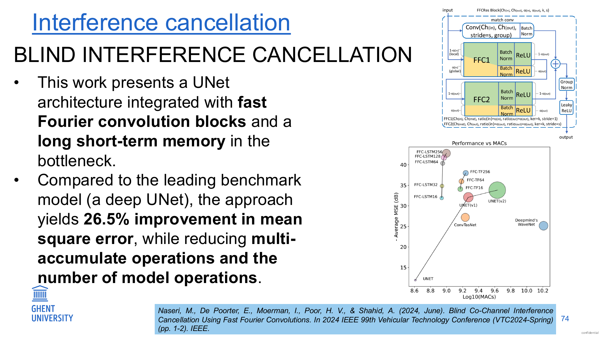

- Een **U-Net** met **Fast Fourier Convolution (FFC)**-blokken en een **LSTM** in de bottleneck.
- **26.5% MSE-verbetering** t.o.v. de leidende benchmark (een diepe U-Net), én **minder MACs** en modeloperaties.

## 6.3 Optimization Interference Cancellation

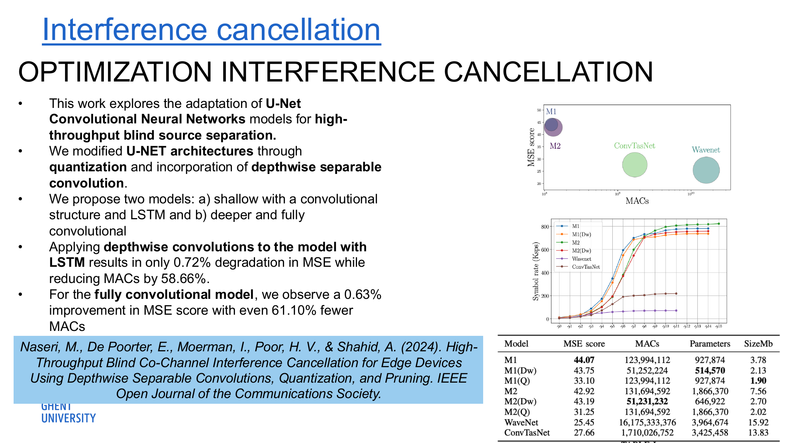

Hier komen **alle compressie-technieken van het vak** samen om het model **edge-ready** te maken:
- U-Net CNN's aangepast met **quantization** en **depthwise separable convolutions**.
- Twee modellen: (a) ondiep met LSTM, (b) dieper en volledig convolutioneel.
- **Depthwise convoluties op het LSTM-model:** slechts **0.72% MSE-degradatie** maar **58.66% minder MACs**.
- **Volledig convolutioneel model:** **0.63% MSE-verbetering** met **61.10% minder MACs**.
- In de tabel zie je `M1(Q)` / `M2(Q)` (quantized): de **SizeMb daalt fors** (M1: 3.78 → 1.90 MB) → precies wat quantization belooft.

## 6.4 AI wireless foundation model

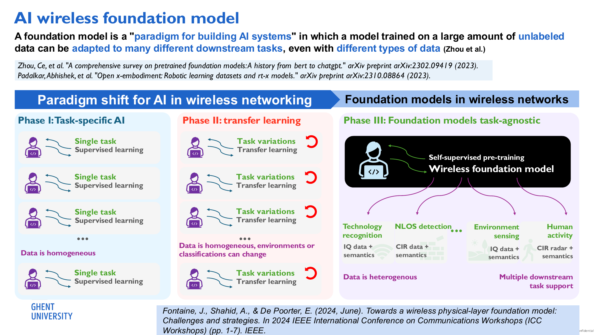

De toekomstvisie: van **task-specific AI** (Fase I) over **transfer learning** (Fase II) naar een **task-agnostic wireless foundation model** (Fase III) dat met self-supervised pre-training op veel verschillende downstream-taken inzetbaar is (technology recognition, NLOS-detectie, environment sensing, human activity).

---

# 🔑 Kernpunten om te onthouden

1. **Waarom quantization?** Minder bits → minder rekenenergie (32→8 bit ≈ 16–30× goedkoper per operatie) én minder data te bewegen. Complementair met pruning.
2. **Numerieke types:** integer (two's complement), fixed-point (vaste komma), floating-point (IEEE 754: sign + exponent + fraction). **Exponent → range, fraction → precision.** BF16 = FP32-range met minder precisie; FP8 (E4M3 forward / E5M2 backward) voor extreem.
3. **Floating-point waarde** (normaal) = `(−1)^sign × (1 + Fraction) × 2^(Exponent−127)`; subnormaal (exp=0) = `(−1)^sign × Fraction × 2^(1−127)`; exp=255 → ±∞ / NaN.
4. **Quantization** = continue/grote set → discrete set; het verschil = **quantization error**.
5. **K-means-based** (Deep Compression): cluster-index + float-codebook → `32/N×` kleiner, maar rekenen blijft float. Fine-tunen door gradiënten per cluster te sommeren.
6. **Deep Compression**: pruning (9–13×) + quantization (27–31×) + Huffman (35–49×), telkens zonder accuracy-verlies. Conv ~4 bit, FC ~2 bit nodig.
7. **Linear quantization** = affine mapping `r = S(q − Z)`, met `S = (r_max−r_min)/(q_max−q_min)` en `Z = round(q_min − r_min/S)`. Geeft **integer weights + integer arithmetic** → echte int8-versnelling.
8. **Symmetric quantization:** `Z = 0` → `r = S·q`, `S = |r|_max/q_max`. Eenvoudiger in hardware.
9. **PTQ** = quantizeren ná training, met **calibration data** om het activatie-bereik te schatten (Max / Entropy / Percentile). Snel, maar accuracy kan dalen.
10. **Per-channel vs per-tensor:** per-channel geeft een scale per rij/channel → kleinere fout (2.08 < 2.28), vooral nodig bij **outlier-channels** in kleine modellen.
11. **QAT** = quantizeren + hertrainen, zodat het model de quantization error leert compenseren. Trager dan PTQ maar **behoudt accuracy bijna volledig** (ResNet18: PTQ 59 vs QAT 78 mAP). Kan starten van een PTQ-model.

---

# 📝 Oefenvragen

*Probeer eerst zelf te antwoorden; de uitwerking staat telkens eronder.*

### Reken-/inzichtvragen

**V1.** Wat is het IEEE **FP16**-getal `0 10010 1000000000` in decimaal? (bias = 15)

Antwoord

- Sign = 0 → positief.
- Exponent: `10010₂ = 18`, minus bias → `18 − 15 = 3`.
- Fraction: `1000000000₂ = 0.5`.
- Waarde = `(1 + 0.5) × 2³ = 1.5 × 8 = **12.0**`.

**V2.** Een laag heeft gewichten met `r_min = −3.0` en `r_max = 5.0`. Je quantizeert naar **8-bit signed** integers (`q_min = −128`, `q_max = 127`). Bereken de scale S en het zero point Z.

Antwoord

- `S = (r_max − r_min)/(q_max − q_min) = (5.0 − (−3.0))/(127 − (−128)) = 8.0 / 255 ≈ **0.03137**`.
- `Z = round(q_min − r_min/S) = round(−128 − (−3.0/0.03137)) = round(−128 + 95.6) = round(−32.4) = **−32**`.

**V3.** Waarom is de opslagwinst van K-means-based quantization ongeveer `32/N ×` en niet exact?

Antwoord

De gewichten gaan van `32 bit × M` naar `N bit × M` (indexen), dus `32/N×` kleiner. Maar je moet ook het **codebook** opslaan: `32 bit × 2ᴺ` centroids. Omdat normaal `M ≫ 2ᴺ` (veel meer gewichten dan clusters) is die codebook-kost verwaarloosbaar → daarom *ongeveer* `32/N×`.

**V4.** Voor een 4×4 gewichtsmatrix met `|r|_max` per rij = `{2.0, 0.5, 1.8, 0.3}` doe je symmetrische 4-bit per-channel quantization. Wat zijn de scales per rij? (`q_max = 2³ − 1 = 7`)

Antwoord

Symmetrisch: `S = |r|_max / q_max`, met `q_max = 7`.
- Rij 0: `2.0/7 ≈ 0.286`
- Rij 1: `0.5/7 ≈ 0.071`
- Rij 2: `1.8/7 ≈ 0.257`
- Rij 3: `0.3/7 ≈ 0.043`

Elke rij heeft zo een scale op maat — vandaar dat per-channel kleinere fouten geeft dan één gemeenschappelijke per-tensor scale (die door de grootste rij, 2.0, gedomineerd zou worden).

### Begripsvragen

**V5.** Wat is het verschil tussen K-means-based en linear quantization op het vlak van *storage* en *computation*?

Antwoord

- **K-means-based:** storage = integer-indexen + een **float-codebook**; computation blijft **floating-point** (je zoekt de centroid op en rekent in float).
- **Linear:** storage = **integer** weights; computation = **integer arithmetic**. Dit is wat echte int8-hardwareversnelling oplevert.

**V6.** Waarom heb je voor het quantizeren van *activaties* calibration data nodig, maar voor *gewichten* niet?

Antwoord

Gewichten zijn na het trainen **vaste, gekende getallen** → je kent hun `r_min`/`r_max` exact. **Activaties** hangen af van de **input** en zijn dus niet op voorhand gekend. Door een kleine representatieve dataset (calibration data) door het netwerk te sturen, meet je de activatieverdeling en schat je hun bereik.

**V7.** Wanneer faalt per-tensor quantization, en hoe lost per-channel dit op?

Antwoord

Per-tensor gebruikt **één scale** voor de hele tensor. Als verschillende output-channels **sterk verschillende ranges** hebben (>100×, een **outlier-channel**), dan domineert die uitschieter de gemeenschappelijke scale en worden alle andere channels grof (onnauwkeurig) gequantizeerd → accuracy zakt, vooral bij **kleine modellen**. **Per-channel** geeft elke channel een **eigen scale**, zodat geen enkele channel door een ander gedomineerd wordt → kleinere quantization error.

**V8.** Wat is het verschil tussen PTQ en QAT, en wanneer kies je QAT?

Antwoord

- **PTQ** quantizeert **na** het trainen, zonder hertraining (enkel calibratie). Snel, maar houdt geen rekening met de impact van de precisieverlaging → accuracy kan dalen.
- **QAT** past quantization toe en **hertraint** het model (met gesimuleerde quantization in de forward pass), zodat het de quantization error leert compenseren. Trager, maar behoudt de accuracy bijna volledig.
- Kies **QAT** wanneer het model gevoelig is aan quantization-fouten (bv. kleine modellen, agressieve bit-widths) en accuracy cruciaal is. PTQ is de snelle eerste keuze; QAT kan zelfs van een PTQ-model vertrekken als verfijning.

**V9.** Leg uit waarom een subnormaal getal (exponent = 0) een **andere** formule gebruikt dan een normaal getal.

Antwoord

Een normaal getal gebruikt `(1 + Fraction) × 2^(Exponent−127)` — de "verborgen 1" maakt dat de kleinste normale waarde `2⁻¹²⁶` is. Onder die grens zou je niets meer kunnen voorstellen (een "gat" rond 0). Daarom forceert IEEE 754 bij exponent = 0 de formule `Fraction × 2^(1−127)` (**zonder** de verborgen 1): zo kan je **0 zelf** exact voorstellen en **steeds kleinere getallen** richting `2⁻¹⁴⁹` (gradual underflow).

**V10.** Waarom zijn pruning en quantization complementair (zie de accuracy-vs-compression grafiek)?

Antwoord

Pruning verlaagt het **aantal** gewichten (minder data, minder MACs); quantization verlaagt het **aantal bits per** gewicht (goedkopere opslag en rekenen). Ze pakken een verschillend aspect aan en stapelen op: in de grafiek blijft **Pruning + Quantization** (rood) accuraat tot ~3% van de originele modelgrootte, terwijl elk apart al rond ~8% instort. Samen met Huffman geeft dit tot 49× compressie zonder accuracy-verlies.

---

# 📖 Begrippenlijst

| Begrip | Betekenis |
|---|---|
| **Quantization** | Een input uit een continue/grote verzameling beperken tot een discrete verzameling waarden (bv. 32-bit float → 8-bit int). |
| **Quantization error** | Het verschil tussen een originele waarde en zijn gequantizeerde waarde. |
| **Bit-width (N)** | Aantal bits per gequantizeerd getal. Bepaalt het aantal mogelijke waarden (2ᴺ). |
| **Integer (two's complement)** | Gehele-getal-representatie; tekenbit heeft gewicht −2ⁿ⁻¹, één unieke nul. Standaard in hardware. |
| **Sign-magnitude** | Tekenbit + grootte; nadeel: twee representaties van 0. |
| **Fixed-point** | Getal met een **vaste** komma tussen integer- en fractie-deel. Eenvoudig, beperkt bereik/precisie. |
| **Floating-point (IEEE 754)** | sign + exponent + fraction; bewegende komma. Exponent → range, fraction → precision. |
| **Exponent bias** | Constante (127 bij FP32, 15 bij FP16) zodat de exponent ook negatieve machten kan voorstellen. |
| **Mantissa / fraction / significand** | Het fractie-deel van een floating-point getal; bepaalt de precisie. |
| **Subnormal (denormal)** | Getallen met exponent = 0; gebruiken `Fraction × 2^(1−bias)` (zonder verborgen 1) → laat 0 en hele kleine waarden toe. |
| **FP32 / FP16 / BF16** | 32-bit (8+23), half-precision 16-bit (5+10), Brain Float 16-bit (8+7). BF16 = FP32-range, minder precisie. |
| **FP8 (E4M3 / E5M2)** | 8-bit floats; E4M3 (meer precisie, forward), E5M2 (meer range, backward/gradient). |
| **K-means-based quantization** | Gewichten clusteren; sla cluster-index + float-codebook op (Deep Compression). Rekenen blijft float. |
| **Codebook / centroids** | De lijst representatieve waarden (centroids) waarnaar de cluster-indexen verwijzen. |
| **Deep Compression** | Pipeline pruning + quantization + Huffman coding → 35–49× kleiner zonder accuracy-verlies (Han et al.). |
| **Huffman coding** | Lossless codering: frequente waarden met minder bits, zeldzame met meer bits. |
| **Linear quantization** | Affine mapping `r = S(q − Z)`; integer weights én integer arithmetic. |
| **Scale (S)** | Float-stapgrootte: `S = (r_max − r_min)/(q_max − q_min)`. Afstand tussen twee quantized waarden in float-schaal. |
| **Zero point (Z)** | Integer die ervoor zorgt dat de reële 0 exact representeerbaar is: `Z = round(q_min − r_min/S)`. |
| **Symmetric quantization** | Speciaal geval met `Z = 0` → `r = S·q`, `S = |r|_max/q_max`. Eenvoudiger in hardware. |
| **r / q** | `r` = reële (float) waarde; `q` = opgeslagen quantized integer. |
| **PTQ (Post-Training Quantization)** | Quantizeren ná het trainen, zonder hertraining; gebruikt calibration data. Snel, accuracy kan dalen. |
| **Calibration data** | Kleine representatieve dataset om het bereik (r_min/r_max) van **activaties** te schatten. |
| **Calibration methods** | Max (absolute max), Entropy (min. info-verlies), Percentile (outliers wegknippen). |
| **Quantization granularity** | Per-tensor (één scale per tensor) vs per-channel (één scale per channel/rij). |
| **Per-channel quantization** | Aparte scale per channel → kleinere fout, vooral nodig bij outlier-channels in kleine modellen. |
| **Outlier weight/channel** | Een channel met een veel grotere range (>100×) dat een per-tensor scale doet falen. |
| **QAT (Quantization-Aware Training)** | Quantizeren + hertrainen (gesimuleerde quantization in forward pass) → behoudt accuracy. |
| **MAC** | Multiply-Accumulate (`a·b + c`); standaardmaat voor rekencomplexiteit. |
| **Depthwise separable convolution** | Goedkope convolutie-variant; gebruikt in de case study om MACs te reduceren. |
