# Hoofdstuk 7 — Neural Architecture Search (NAS)

**Vak:** Embedded Machine Learning (E061380) — UGent / imec (IDLAB)
**College:** Lecture 06 — *Neural Architecture Search* (de slides zijn gelabeld "Lecture – 06"; in jouw bestandsnummering is dit Lecture 07)
**Docent:** Prof. Adnan Shahid

> Deze samenvatting volgt de PDF **structureel, in volgorde van de slides**. Belangrijke zaken worden met een foto erbij uitgelegd. Waar jij iets in het rood op de slide had geschreven, staat dat als **📝 jouw notitie**. Bij de slides staat hier en daar wat **extra context** die je anders zou moeten opzoeken — maar zonder het wiel opnieuw uit te vinden.

---

## 0. Waar past dit college in het vak?

De eerste helft van het vak ging over een netwerk *kleiner maken nadat het al bestaat*: **pruning** (Lect03) gooit gewichten weg, **quantization** (Lect04) verlaagt de bit-precisie. Dit college draait die logica om. Bij **Neural Architecture Search (NAS)** laat je een **algoritme automatisch de netwerk-architectuur ontwerpen** zodat ze van bij het begin efficiënt is — en bij **hardware-aware NAS** zelfs afgestemd op de exacte chip waarop het model moet draaien.

Waarom is dat nodig? Een architectuur ontwerpen is een spel met enorm veel knoppen: hoeveel lagen, hoe breed, welke kernel-grootte, welke connecties, welke input-resolutie… Het aantal combinaties loopt al snel in de miljarden. Mensen hebben handmatig een handvol goede ontwerpen gevonden (ResNet, MobileNet…), maar dat is traag, vereist expertise, en is **niet schaalbaar** — zeker niet als je voor élk apparaat (telefoon, microcontroller, FPGA) een apart geoptimaliseerd model wil. NAS automatiseert precies die zoektocht.

| Lecture | Onderwerp |
|---|---|
| 1 | Introduction |
| 2 | Overview of Embedded Systems en ML/DL Overflow |
| 3 | Pruning and Sparsity |
| 4 | Quantization |
| 5 | Lab Pruning and Quantization |
| **6** | **Neural Architecture Search** ← dit college |
| 7 | Lab Pruning and Quantization op Nano 33 BLE |
| 8 | Knowledge Distillation |
| 9 | Distributed training, on-device learning & Transfer Learning |
| 10 | Lab Knowledge Distillation & Federated Learning |

**Recap van vorige les (Lect04):** numerieke datatypes (integer, floating-point met normal/subnormal numbers), quantization, K-means quantization, linear quantization, post-training quantization (PTQ) + quantization granularity, quantization-aware training (QAT), en de case study interference cancellation.

**Lecture Outline (de rode draad van dit college):**
1. **Case study** — interference cancellation (brug vanuit vorige les)
2. **Primitive operations** — recap van de bouwstenen (linear, conv, grouped, depthwise, 1×1) en hun MAC-kost
3. **Classic building blocks** — ResNet, ResNeXt, MobileNet(V2), ShuffleNet
4. **Introduction to NAS** — wat is NAS, search space, search space ontwerpen, search strategy
5. **Efficient & hardware-aware NAS** — performance estimation strategy, hardware-aware NAS, Once-for-All

De logica van de opbouw: eerst herhalen *waaruit* een netwerk bestaat (DEEL 2) en *welke slimme combinaties* mensen al verzonnen (DEEL 3). Dat zijn precies de "ingrediënten" en "recepten" waaruit NAS straks automatisch kiest (DEEL 4–7).

---

# DEEL 1 — Case study & de trade-off

## 1.1 Case study: Interference cancellation

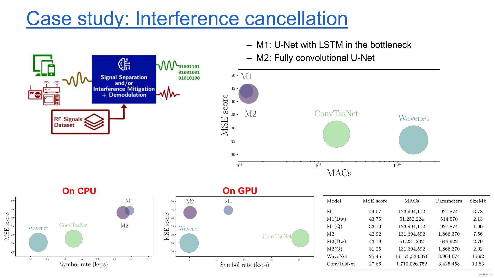

Dit is de brug vanuit Lect04. **Het probleem:** in een draadloze omgeving overlappen radiosignalen elkaar — je gewenste signaal wordt verstoord door interferentie van andere zenders. De taak is **signaalscheiding / interferentie-onderdrukking + demodulatie**: uit een mengsel het zuivere signaal terugwinnen en het terug omzetten naar bits. De input is een **RF-signalendataset**.

Er worden twee eigen modellen vergeleken met bestaande baselines:

- **M1:** een **U-Net** (encoder-decoder met skip connections, klassiek voor signaal/beeld-reconstructie) met een **LSTM** in de bottleneck — de LSTM vangt het tijdsverloop van het signaal op.
- **M2:** een **volledig convolutioneel** U-Net (geen LSTM).

| Model | MSE score | MACs | Parameters | SizeMb |
|---|---|---|---|---|
| M1 | 44.07 | 123.994.112 | 927.874 | 3.78 |
| M1(Dw) | 43.75 | 51.252.224 | 514.570 | 2.13 |
| M1(Q) | 33.10 | 123.994.112 | 927.874 | 1.90 |
| M2 | 42.92 | 131.694.592 | 1.866.370 | 7.56 |
| M2(Dw) | 43.19 | 51.231.232 | 646.922 | 2.70 |
| M2(Q) | 31.25 | 131.694.592 | 1.866.370 | 2.02 |
| WaveNet | 25.45 | 16.175.333.376 | 3.964.674 | 15.92 |
| ConvTasNet | 27.66 | 1.710.026.752 | 3.425.458 | 13.83 |

**Hoe lees je deze tabel?** Let op de drie kostenmaten — ze meten elk iets anders:
- **MACs** = rekenwerk per inferentie (→ latency/energie).
- **Parameters** = aantal gewichten (→ flash/opslag).
- **SizeMb** = de modelgrootte op schijf.
En de `(Dw)`/`(Q)`-suffixen zijn precies de technieken uit de vorige hoofdstukken: `(Dw)` = depthwise gemaakt (architectuur-truc, zie DEEL 2–3), `(Q)` = quantized (Lect04).

**Wat de cijfers vertellen:** M1/M2 halen een **MSE-score van ~43–44** (hoger = beter hier) met ~124–132 **miljoen** MACs. WaveNet haalt maar 25.45 met ruim **16 miljard** MACs — dat is **~130× meer rekenwerk voor een slechter resultaat**. De `(Dw)`-varianten halveren de MACs nóg eens (124M → 51M) met amper accuracy-verlies; de `(Q)`-varianten drukken vooral de grootte (3.78 MB → 1.90 MB).

**De les die het college hieruit trekt:** de **architectuurkeuze bepaalt rechtstreeks de efficiëntie**. Een slim ontworpen klein netwerk verslaat een log groot netwerk op álle assen tegelijk. Dat is exact wat NAS automatiseert — in plaats van met de hand te ontdekken dat "een U-Net met depthwise convs" goed werkt, laat je de zoekmachine dat vinden.

## 1.2 Trade-off tussen efficiency en accuracy

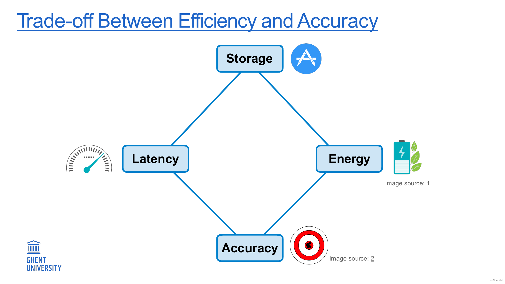

Embedded ML is altijd een **vierhoek van conflicterende doelen**: **Storage** ↔ **Latency** ↔ **Energy** ↔ **Accuracy**. Ze trekken aan elkaar:
- Wil je **hogere accuracy**? Dan typisch een groter netwerk → meer storage, hogere latency, meer energie.
- Wil je **lagere latency/energie**? Dan kleiner/simpeler → meestal wat accuracy-verlies.

Er bestaat geen gratis lunch: je kiest een **punt op de trade-off-curve** dat past bij jouw apparaat en toepassing. NAS is in feite een machine die — gegeven jouw constraints (bv. "max 100 ms latency op deze chip") — automatisch het beste haalbare accuracy-punt zoekt. Onthou deze vierhoek; het hele hoofdstuk gaat over manieren om hem gunstiger te schuiven.

---

# DEEL 2 — Primitive operations (recap)

Voordat we architecturen kunnen vergelijken, moeten we hun **rekenkost** kunnen berekenen. De eenheid is de **MAC** (Multiply-ACcumulate): één vermenigvuldiging gevolgd door een optelling, `a += w · x`. Dat is precies wat een neuraal netwerk de hele tijd doet — een gewicht maal een input, opgeteld bij een lopende som. Het aantal MACs is daarom dé proxy voor "hoeveel werk" een laag is.

> **Belangrijk:** alle formules hieronder gelden voor **batch size n = 1** en **negeren de bias** (verwaarloosbaar t.o.v. de matrixvermenigvuldigingen).

**Notaties:** `n` = batch size · `cᵢ` = input channels · `c_o` = output channels · `hᵢ,h_o` = input/output hoogte · `wᵢ,w_o` = input/output breedte · `k_h,k_w` = kernel hoogte/breedte · `g` = groups.

> **Tip om de formules te onthouden:** lees ze als *"voor elke output-waarde, hoeveel vermenigvuldigingen?"* Het aantal output-waarden × het aantal MACs per output-waarde. Alle formules hieronder volgen dat patroon.

## 2.1 Fully-connected / linear layer

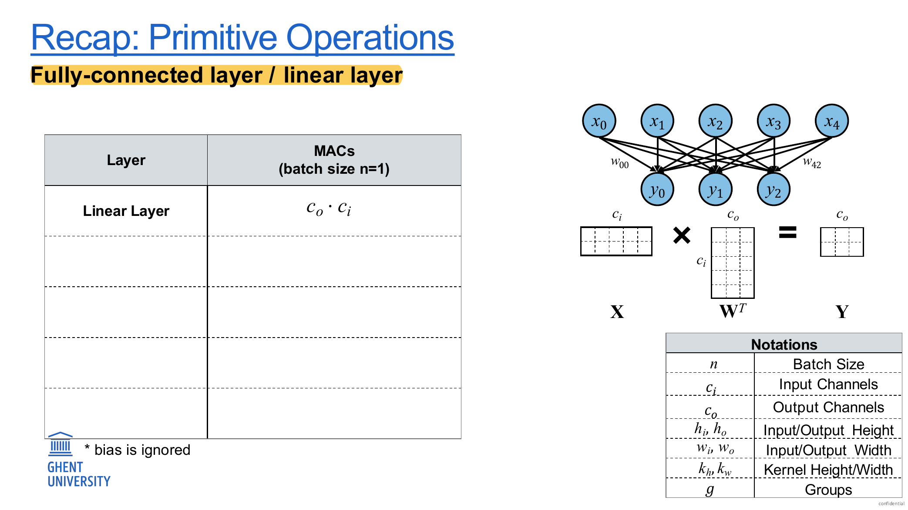

Een fully-connected laag verbindt elke input met elke output. Shapes: input `X: (n, cᵢ)`, output `Y: (n, c_o)`, weights `W: (c_o, cᵢ)`, bias `b: (c_o,)`.

- **MACs = c_o · cᵢ**

**Waarom?** Elk van de `c_o` outputs is een gewogen som over álle `cᵢ` inputs → `cᵢ` MACs per output, × `c_o` outputs = `c_o · cᵢ`. Dit is gewoon de kost van één matrix-vector-vermenigvuldiging `W · x`.

## 2.2 Convolution layer

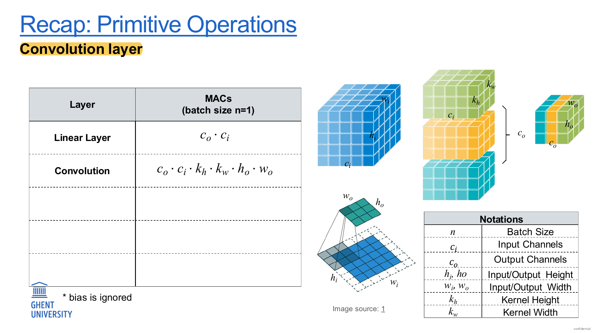

Bij een conv schuift een kernel over de input. Weights `W: (c_o, cᵢ, k_h, k_w)`.

- **MACs = c_o · cᵢ · k_h · k_w · h_o · w_o**

**Waarom?** Lees de factoren in twee groepen:
- **`h_o · w_o`** = het aantal output-posities (elke pixel van de output feature map).
- **`c_o · cᵢ · k_h · k_w`** = de kost per output-positie: voor elke van de `c_o` output channels doe je een dot product over de hele receptieve buurt, namelijk `cᵢ` input channels × `k_h · k_w` kernel-pixels.

Een conv is dus een fully-connected laag (`c_o · cᵢ`) die je (a) herhaalt over elke output-pixel (`h_o · w_o`) en (b) uitbreidt met een ruimtelijk venster (`k_h · k_w`).

> 📝 **jouw notitie:** een gewone conv layer verbindt **elke output channel met alle input channels** (en kijkt ook ruimtelijk rond, bv. 3×3).

## 2.3 Grouped convolution layer

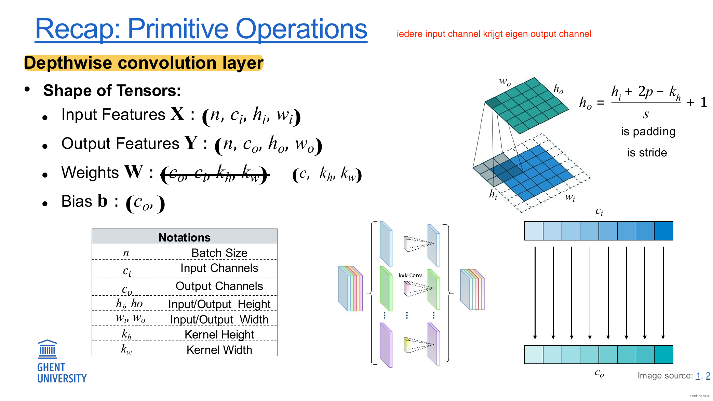

Bij een grouped conv splits je de channels in `g` groepen, en elke groep is een eigen, kleinere conv die *alleen binnen zijn eigen groep* werkt. Weights `W: (g · c_o/g, cᵢ/g, k_h, k_w)`.

- **MACs = c_o · cᵢ · k_h · k_w · h_o · w_o / g**

**Waarom die `/g`?** Per groep zijn er `c_o/g` output channels die elk maar naar `cᵢ/g` input channels kijken. Eén groep kost dus `(c_o/g) · (cᵢ/g) · k_h · k_w · h_o · w_o`. Je hebt `g` groepen, dus × `g`:
`g · (c_o/g)(cᵢ/g)·… = c_o · cᵢ · k_h · k_w · h_o · w_o / g`. De `g` valt één keer weg → netto deel je door `g`. Hoe meer groepen, hoe goedkoper (maar hoe minder de channels onderling kunnen mengen).

> 📝 **jouw notitie:** grouped conv **splitst de input/output channels op in g groepen**: elke groep kijkt alleen naar zijn eigen deel van de input channels → minder connecties en berekeningen. **MACs verlaagd met factor g** t.o.v. gewone conv.

## 2.4 Depthwise convolution layer

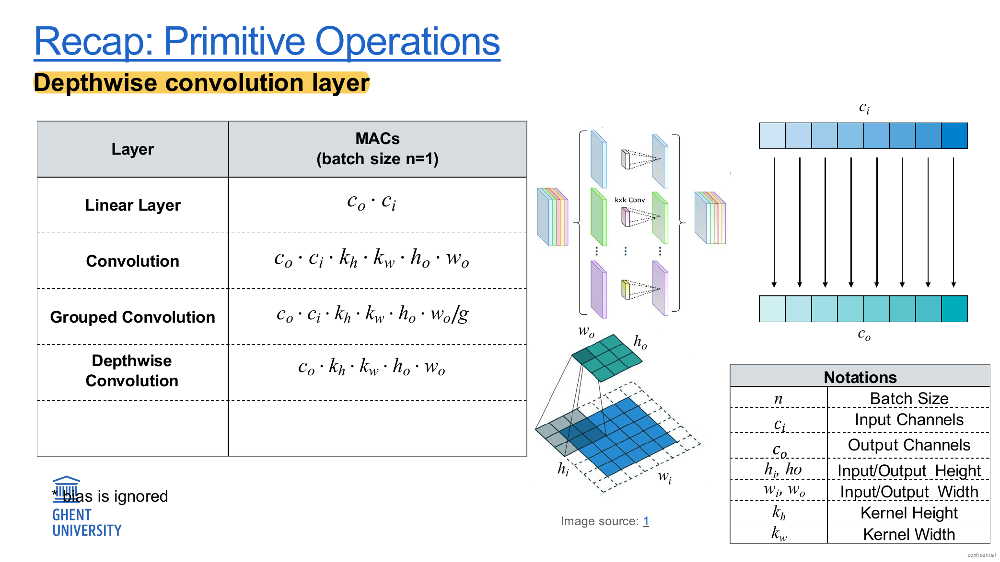

Dit is het **uiterste geval** van een grouped conv: `g = cᵢ = c_o`. Elke groep bevat dan precies één channel. Weights `W: (c, k_h, k_w)`.

- **MACs = c_o · k_h · k_w · h_o · w_o** (de factor `cᵢ` is helemaal verdwenen!)

**Waarom is dit zó goedkoop?** Vul `g = cᵢ` in de grouped-formule in: `c_o · cᵢ · … / cᵢ = c_o · …`. De volledige `cᵢ`-factor schrapt weg. Concreet: elke input channel krijgt zijn eigen kernel en produceert precies één output channel. Er wordt **niets gemengd tussen channels** — alleen ruimtelijk gefilterd binnen elk channel apart.

> 📝 **jouw notitie:** iedere input channel krijgt zijn **eigen filter en eigen output channel** → channel-per-channel.

## 2.5 1×1 convolution layer

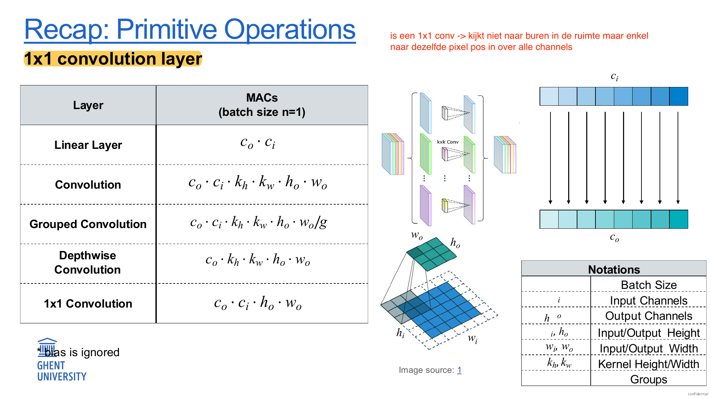

Een conv met een kernel van 1×1: `k_h = k_w = 1`.

- **MACs = c_o · cᵢ · h_o · w_o** (de `k_h · k_w` valt weg want = 1).

**Wat doet het?** Omdat de kernel maar 1 pixel groot is, kijkt deze conv **niet naar buren in de ruimte**. Op elke pixelpositie doet ze gewoon een fully-connected mix over de channels (`c_o · cᵢ`). Het is dé manier om channels te **reduceren, uit te breiden of te mengen** zonder ruimtelijk werk.

> 📝 **jouw notitie:** een 1×1 conv kijkt **niet naar buren in de ruimte**, maar enkel naar dezelfde pixelpositie over alle channels heen.

## 2.6 Het grote plaatje: de twee taken van een conv

> 📝 **jouw notitie (volledige slide):**
>
> **Normal conv:** elke output channel kijkt naar alle input channels; kijkt ook ruimtelijk rond (bv. 3×3) → alles met alles → duurste, maar volledige channel mixing + spatial filtering.
>
> **Grouped conv:** input en output channels opgesplitst in g groepen; elke groep is een kleine gewone conv. Binnen groep: meerdere input → meerdere output channels. Tussen groepen: geen connecties → MACs gedeeld door g.
>
> **Depthwise conv:** extreme grouped conv waarbij g = aantal input channels; elke input channel krijgt eigen filter en eigen output channel → channel per channel → zeer goedkoop, wel spatial filtering, **maar geen channel mixing**.
>
> **1×1 conv:** kernel = 1×1; kijkt niet naar naburige pixels; mixt wél informatie tussen channels op dezelfde pixelpositie → gebruikt om channels te reduceren, uit te breiden of te mengen.
>
> **MobileNet-combinatie:** depthwise 3×3 conv = spatial filtering per channel; 1×1 conv = channel mixing.

**Extra context — dit is de sleutel tot heel DEEL 3.** Een gewone conv doet *tegelijk* twee dingen:
1. **Spatial filtering** — kijken naar de ruimtelijke buurt (de `k_h · k_w`-factor).
2. **Channel mixing** — alle input channels combineren (de `cᵢ`-factor).

Die twee samen maken de gewone conv duur (`cᵢ · k_h · k_w` per output). Het trucje van alle efficiënte blokken is: **splits deze twee taken op** over goedkopere operaties.
- **Depthwise** doet *alleen* spatial filtering (mist `cᵢ`).
- **1×1** doet *alleen* channel mixing (mist `k_h · k_w`).
Eerst depthwise, dan 1×1 → samen benader je een gewone conv tegen een fractie van de kost. Dat inzicht — "ontkoppel ruimte en channels" — keert in elk blok hieronder terug.

---

# DEEL 3 — Classic building blocks

Vóór NAS hebben mensen handmatig slimme bouwblokken ontworpen. Je moet ze kennen om twee redenen: (1) ze illustreren telkens een nieuwe efficiëntie-truc, en (2) het zijn precies de "primitieven" waaruit NAS later kiest. Lees ze als een **evolutie waarin elk blok een stukje goedkoper is** dan het vorige.

## 3.1 ResNet50: bottleneck block

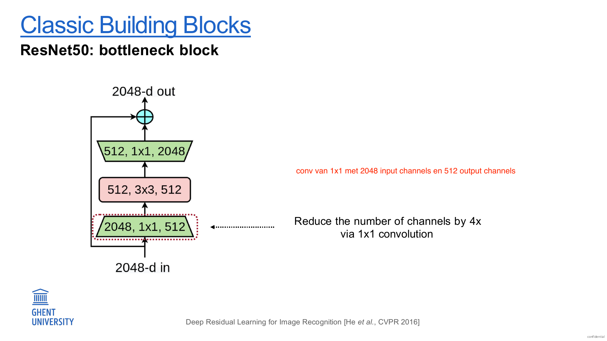

Het idee van een **bottleneck**: een 3×3 conv direct op 2048 channels draaien is peperduur (`2048 · 2048 · 9` per pixel). De truc is om eerst **goedkoop te knijpen, dan het dure werk klein te doen, en daarna terug uit te breiden**:

1. **1×1 conv: reduceer** de channels met 4× (2048 → 512). > 📝 *jouw notitie: een 1×1 conv met 2048 input channels en 512 output channels.*
2. **3×3 conv** op het *gereduceerde* aantal (512 → 512) — dit is waar de ruimtelijke filtering gebeurt, maar nu op 4× minder channels.
3. **1×1 conv: expand** terug naar 2048 zodat het blok in het netwerk past.

Daaromheen loopt de **residual connection** (de `+` bovenaan): de input wordt bij de output opgeteld. Dat is het kernidee van ResNet — het blok hoeft alleen het *verschil* (residu) te leren, wat heel diepe netwerken traineerbaar maakt.

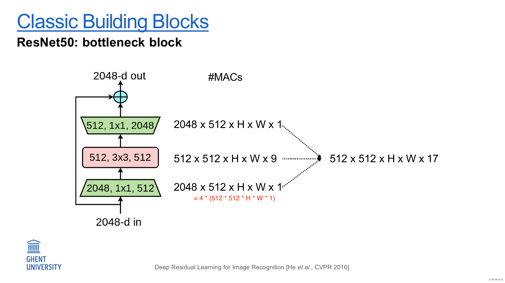

Reken de kost uit (alles × H × W, dus we laten `h_o · w_o` weg en vergelijken de rest):
- 1×1 reduce: `2048 × 512 × 1`
- 3×3: `512 × 512 × 9`
- 1×1 expand: `2048 × 512 × 1`
- **Totaal = 512 × 512 × 17** > 📝 *jouw notitie: = 4 × (512 × 512 × H × W × 1).*

(Tip: `2048 = 4·512`, dus `2048·512 = 512·512·4`. De som wordt `512·512·(4 + 9 + 4) = 512·512·17`.)

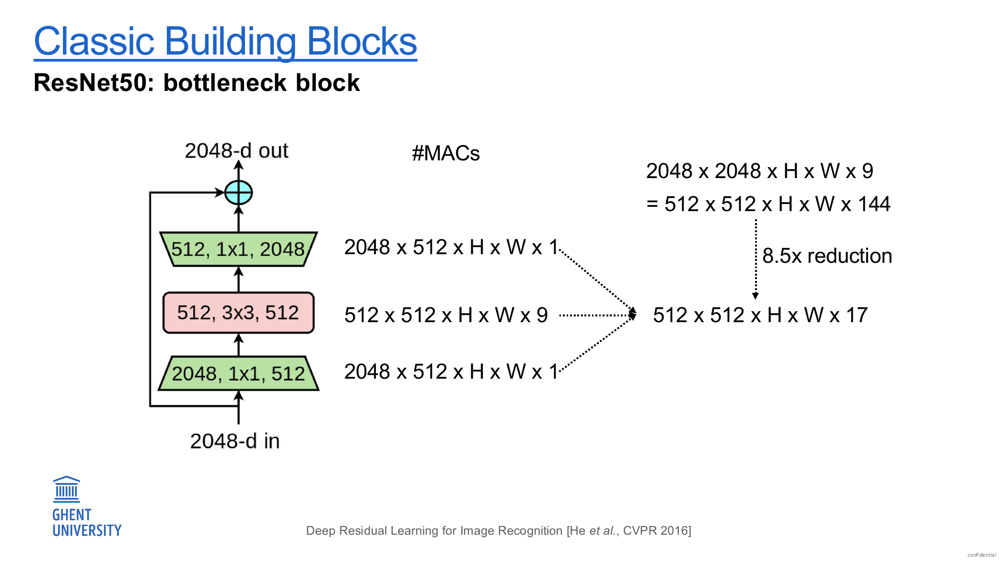

Vergelijk nu met de **naïeve** aanpak: één gewone 3×3 conv 2048→2048 zou `2048 · 2048 · 9 = 512·512·144` kosten. De bottleneck (`×17`) is dus een **8,5× reductie** (`144/17 ≈ 8.5`). En het mooie: de accuracy blijft behouden of stijgt zelfs licht (BoT50 doet +0.6 top-1). Conclusie: de twee 1×1 convs "kosten" wat, maar besparen veel meer door de dure 3×3 op een smal kanaal te draaien.

### Voorbeeld: reduction factor van een "bottlenext"

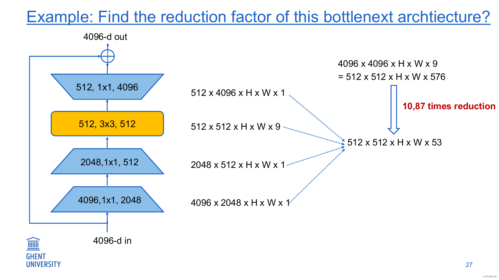

Hetzelfde recept op een 4096-d blok (4096→2048→512→512→4096):
- Naïeve 3×3 conv 4096→4096: `4096 · 4096 · 9 = 512·512·576`.
- Bottleneck-som: `512·512·53`.
- → **10,87× reductie** (`576/53 ≈ 10.87`).

Hoe breder de input, hoe groter de besparing van de bottleneck. Goede oefening om de formules in de vingers te krijgen.

## 3.2 ResNeXt: grouped convolution

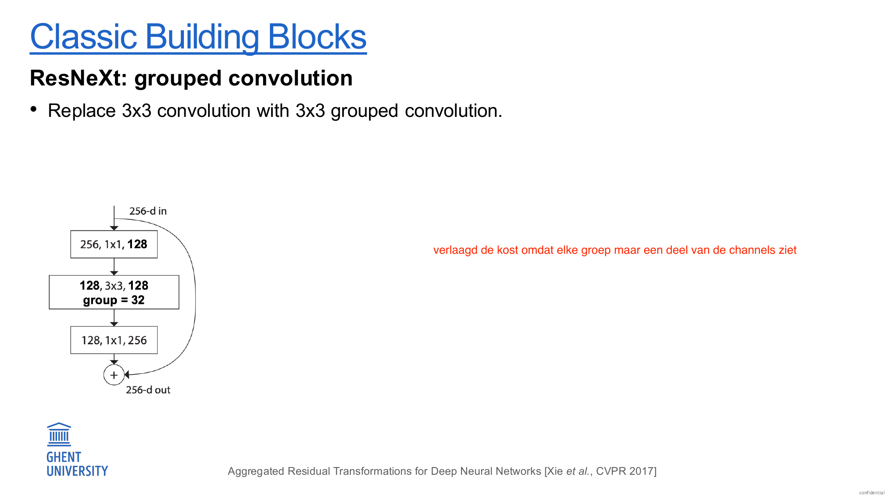

ResNeXt neemt de ResNet-bottleneck en vervangt de **3×3 conv door een 3×3 grouped conv** (hier `group = 32`). Uit DEEL 2 weet je: een grouped conv deelt de kost door `g`. Je krijgt dus dezelfde structuur, maar het middelste (al gereduceerde) stuk wordt nóg 32× goedkoper.

> 📝 **jouw notitie:** dit verlaagt de kost omdat **elke groep maar een deel van de channels ziet**.

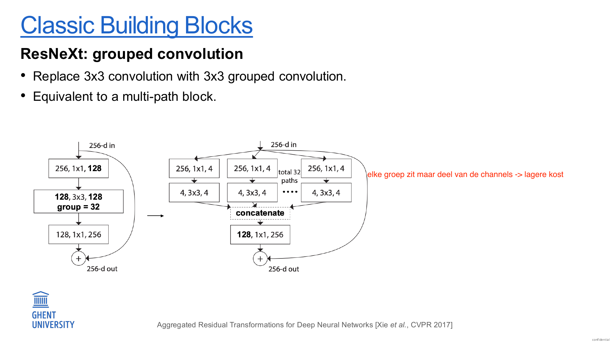

**Belangrijk inzicht:** een grouped conv is wiskundig **equivalent aan een multi-path block**. In plaats van "1 brede conv met 32 groepen" kun je het tekenen als 32 parallelle, smalle paden (256→4→4→256) die op het einde worden **opgeteld**. Dit aantal parallelle paden noemt ResNeXt de **cardinality** — een extra "knop" naast diepte en breedte om de capaciteit te regelen, en goedkoper dan gewoon breder maken.

> 📝 **jouw notitie:** elke groep zit maar in een deel van de channels → lagere kost.

## 3.3 MobileNet: depthwise-separable block

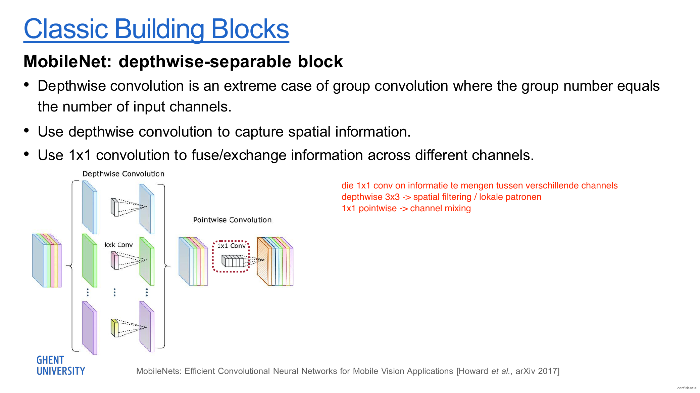

Hier wordt de "ontkoppel ruimte en channels"-truc uit §2.6 expliciet toegepast. MobileNet vervangt één gewone conv door **twee goedkope stappen**:

1. **Depthwise convolution** (k×k per channel) → doet de **spatial filtering**. > 📝 *jouw notitie: 3×3 depthwise kijkt naar lokale patronen binnen elk kanaal.*
2. **Pointwise 1×1 convolution** → doet de **channel mixing** (fuse/exchange tussen channels).

**Hoeveel goedkoper?** Een gewone 3×3 conv kost `c_o·cᵢ·9·HW`. De separable versie kost `cᵢ·9·HW` (depthwise) + `c_o·cᵢ·HW` (1×1) = `cᵢ·HW·(9 + c_o)`. Bij grote `c_o` domineert de `+c_o`-term, en de verhouding nadert ongeveer `1/9 + 1/c_o` — dus al gauw **~8–9× minder rekenwerk** voor bijna dezelfde functie.

> 📝 **jouw notitie:** die 1×1 conv is om informatie te mengen tussen verschillende channels. **depthwise 3×3 → spatial filtering / lokale patronen; 1×1 pointwise → channel mixing.**

## 3.4 MobileNetV2: inverted bottleneck block

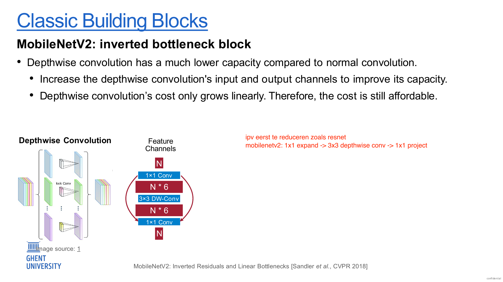

Probleem met de pure depthwise-separable: een depthwise conv heeft een **lage capaciteit** (ze mengt niets, werkt op smalle channels). MobileNetV2 lost dat op met een **inverted bottleneck** — letterlijk de *omgekeerde* volgorde van ResNet. Waar ResNet eerst *knijpt*, gaat MobileNetV2 eerst *uitzetten*:

- **1×1 expand** (N → N·6) — tijdelijk veel meer channels.
- **3×3 depthwise conv** (op die brede N·6) — ruimtelijke filtering met veel meer "ruimte" om te werken.
- **1×1 project** (N·6 → N) — terug naar smal.

**Waarom expanden?** Omdat de depthwise-kost maar **lineair** groeit met het aantal channels (geen `cᵢ`-factor!), is het betaalbaar om de depthwise op een breed kanaal te doen. Zo krijgt het goedkope depthwise-deel toch genoeg "werkruimte" / capaciteit.

> 📝 **jouw notitie:** in plaats van eerst te reduceren zoals ResNet: **MobileNetV2 = 1×1 expand → 3×3 depthwise conv → 1×1 project.**

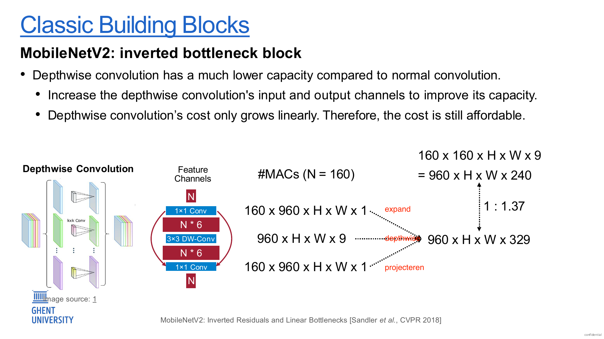

Met N = 160 (expansion ×6 → 960): expand `160·960·1`, depthwise `960·9`, project `160·960·1` → totaal `960·329`, t.o.v. een gewone conv die `960·240` zou kosten → verhouding **1 : 1.37**. Met andere woorden: dit blok is iets *duurder* dan één enkele gewone conv, maar levert veel meer representatiekracht en is veel goedkoper dan een volle dichte bottleneck.

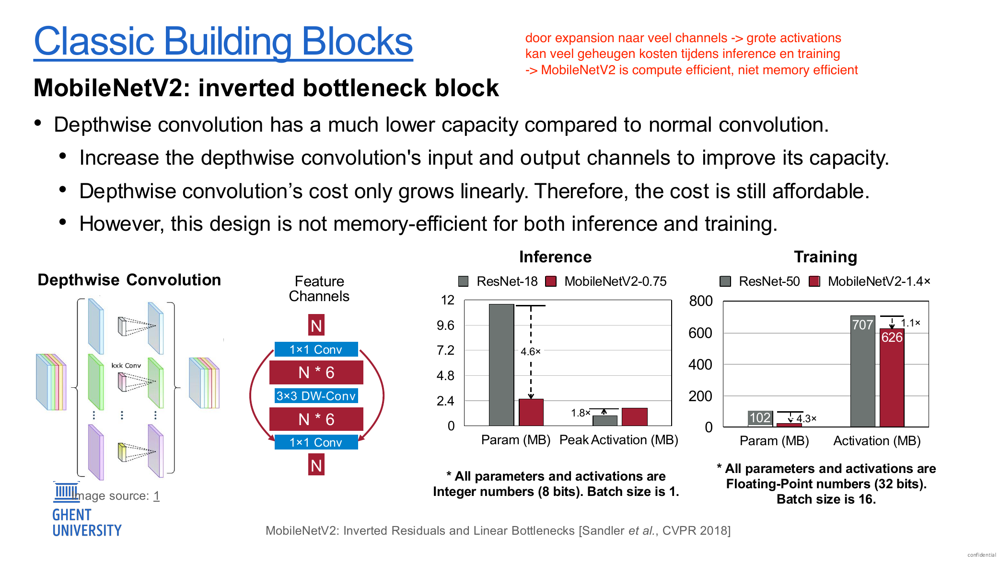

**De keerzijde — en dit is een belangrijk examenpunt.** Door tijdelijk naar N·6 channels te **expanden**, ontstaan **grote activation tensors** middenin het blok. Activations zijn de tussenliggende feature maps die je in het geheugen moet bijhouden (zeker tijdens training, want je hebt ze nodig voor de backward pass).

> 📝 **jouw notitie:** door expansion naar veel channels → grote activations → kan veel geheugen kosten tijdens inference én training → **MobileNetV2 is compute efficient, niet memory efficient.**

De grafieken bevestigen het onderscheid: MobileNetV2 heeft veel minder **parameters** (4.6× / 4.3× minder dan ResNet), maar de **peak activation** is juist *groter* (1.8× bij inference). Onthou dus: *weinig parameters ≠ weinig geheugen*. Voor microcontrollers (DEEL 5) is net die piek-activation vaak de échte bottleneck.

### Voorbeeld: scaling factor van een inverted bottleneck

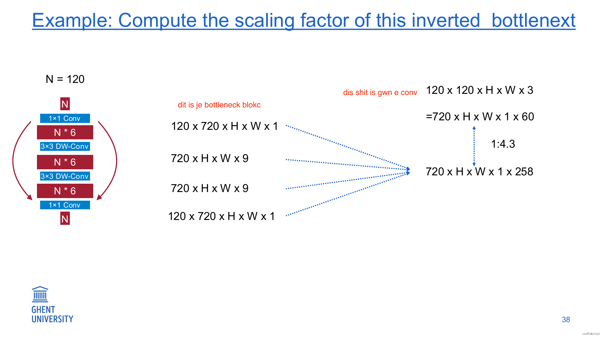

Met N = 120 en een variant met twee depthwise-stappen: de blok-som is `720·258` t.o.v. een gewone conv `720·60` → **1 : 4.3**. Dit blok is dus 4.3× duurder dan één gewone conv — illustreert dat je niet eindeloos kunt expanden zonder kost.

> 📝 **jouw notities:** "dit is je bottleneck blok" (links) en "dis is gewoon een conv" (de vergelijkingsterm rechts).

## 3.5 ShuffleNet: 1×1 group convolution & channel shuffle

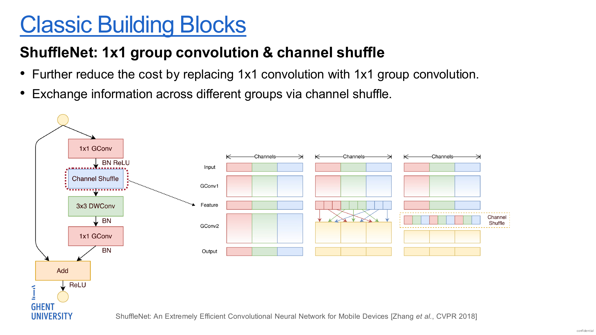

In MobileNetV2 zijn de 1×1 convs (de channel-mixers) intussen het *duurste* deel geworden. ShuffleNet maakt ze goedkoper door ook de **1×1 conv te vervangen door een 1×1 group conv** (deel door `g`).

**Maar dan ontstaat een nieuw probleem:** als élke laag in groepen werkt, praten de groepen nooit met elkaar — informatie blijft in zijn eigen "koker" zitten en het netwerk verliest kracht. De oplossing is **channel shuffle**: na de eerste group conv worden de channels **herschikt** (door elkaar gehusseld) zodat de volgende group conv inputs uit *alle* vorige groepen ziet. Zo herstel je de informatie-uitwisseling tussen groepen, zonder de kost van een volle 1×1 conv.

**Extra context — de rode draad van DEEL 3.** Elke klassieker is een stap goedkoper dan de vorige, en telkens door spatial filtering en channel mixing verder te ontkoppelen of op te splitsen:

> gewone conv → ResNet-bottleneck (1×1 reduce) → ResNeXt (grouped) → MobileNet (depthwise-separable) → MobileNetV2 (inverted bottleneck) → ShuffleNet (group 1×1 + shuffle)

Het zijn precies deze blokken en hun knoppen (kernel size, expansion ratio, #groepen, breedte) die NAS straks **automatisch** door elkaar gaat proberen.
---
overzicht: 
## Evolutie van de blocks

1. **Gewone 3×3 conv** — peperduur op brede channels.

2. **Bottleneck (ResNet)**
   → *Fix:* 1×1 reduce → 3×3 → 1×1 expand. Duur ruimtelijk werk op smal kanaal.

3. **Grouped bottleneck (ResNeXt)**
   → *Probleem:* middelste 3×3 blijft duurste stuk.
   → *Fix:* 3×3 wordt grouped conv → nog eens ×g goedkoper.

4. **Depthwise-separable (MobileNet)**
   → *Probleem:* grouped is half werk, elke groep ziet nog meerdere channels.
   → *Fix:* trek door tot het extreme — `g = aantal channels` → depthwise (1 filter/channel).
   → *Maar:* nu geen channel-mixing meer → voeg 1×1 pointwise toe.
   → *Resultaat:* depthwise = spatial, pointwise = channel mixing.

5. **Inverted bottleneck (MobileNetV2)**
   → *Probleem:* depthwise zelf heeft lage capaciteit (1 filter/channel op smal kanaal).
   → *Fix:* eerst expanden (kan, want depthwise-kost is lineair in channels):
   1×1 expand (N → 6N) → 3×3 depthwise → 1×1 project (6N → N).
   → *"Inverted"* = omgekeerd van ResNet (eerst breder i.p.v. smaller).

6. **Group 1×1 + channel shuffle (ShuffleNet)**
   → *Probleem:* na de inverted bottleneck zijn de **1×1 convs** intussen het duurste stuk.
   → *Fix 1:* maak ook de 1×1 een **group conv** (deel door `g`).
   → *Maar:* groepen praten nooit met elkaar → informatie blijft in eigen koker.
   → *Fix 2:* **channel shuffle** tussen de group convs → herschik channels zodat volgende laag inputs uit álle vorige groepen ziet.

**Rode draad:** elke stap fixt het pijnpunt van de vorige.

- bottleneck → grouped: 3×3 nog goedkoper
- grouped → depthwise-separable: extreem doortrekken + pointwise voor channel-mixing
- depthwise-separable → inverted bottleneck: capaciteit van depthwise oplossen via expansion
- inverted bottleneck → ShuffleNet: 1×1 ook groepen + shuffle om mixing tussen groepen te herstellen

---

# DEEL 4 — Introductie tot Neural Architecture Search

## 4.1 Van handmatig ontwerp naar automatisch ontwerp

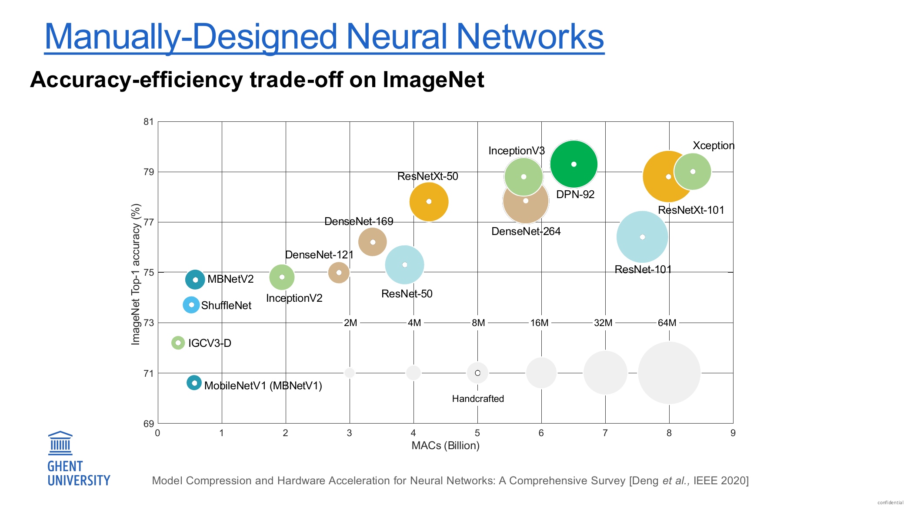

Deze bubble-grafiek zet de handmatig ontworpen netwerken (MobileNet, ShuffleNet, ResNet, DenseNet, Inception, Xception…) uit als **accuracy (y) vs. MACs (x)** op ImageNet; de bubbelgrootte = aantal parameters. Je ziet een typische trade-off-curve: meer rekenwerk koopt meer accuracy, met afnemende meeropbrengst.

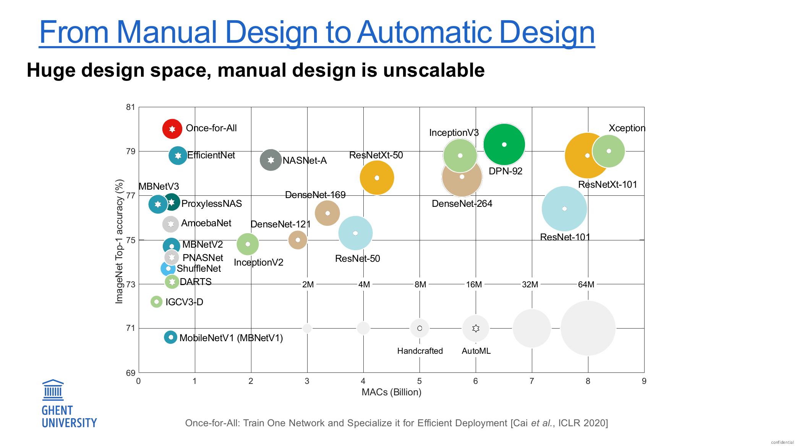

Dezelfde grafiek, nu met de **automatisch ontworpen** netwerken erbij (NASNet-A, AmoebaNet, PNASNet, DARTS, ProxylessNAS, EfficientNet, MobileNetV3, **Once-for-All**). Die zitten **links-boven**: **hogere accuracy bij minder MACs**. De boodschap: de design space is gigantisch en **handmatig ontwerp is niet schaalbaar** — automatisch zoeken vindt betere punten dan menselijke intuïtie, en kan dat bovendien herhalen voor elk apparaat.

## 4.2 Wat is NAS? Componenten en doel

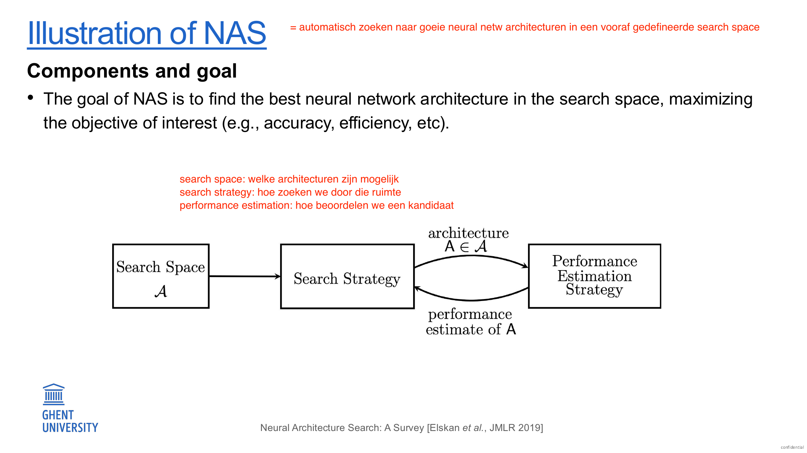

> 📝 **jouw notitie:** NAS = **automatisch zoeken naar goeie neural-netwerk-architecturen in een vooraf gedefinieerde search space.**

Formeel: vind in de search space de architectuur die de **objective** (accuracy, efficiency, of een combinatie) maximaliseert. NAS bestaat uit **drie componenten in een lus**:

```
Search Space  ──kies architectuur A∈𝒜──▶  Search Strategy  ──evalueer A──▶  Performance Estimation
      ▲                                                                              │
      └──────────────────── performance estimate van A ◀───────────────────────────┘
```

De search strategy kiest een kandidaat-architectuur uit de search space, de performance estimation beoordeelt ze, en die score stuurt de volgende keuze. Zo "leert" de zoekmachine geleidelijk waar de goede architecturen zitten. **Elk van deze drie is een ontwerpkeuze op zich** — en de rest van het hoofdstuk behandelt ze één voor één.

> 📝 **jouw notitie:**
> - **search space:** welke architecturen zijn mogelijk
> - **search strategy:** hoe zoeken we door die ruimte
> - **performance estimation:** hoe beoordelen we een kandidaat

## 4.3 Search space

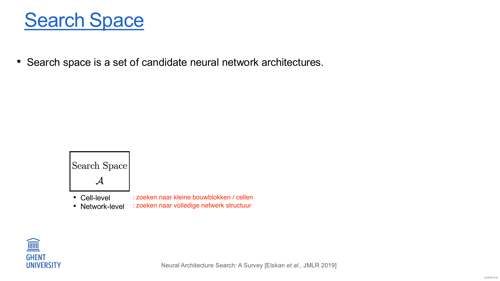

De **search space** is de verzameling van alle architecturen die de zoekmachine *mag* voorstellen. De keuze van deze ruimte is cruciaal: te klein → je mist goede netwerken; te groot → ondoorzoekbaar. Er zijn twee niveaus om hem te definiëren:

> 📝 **jouw notitie:**
> - **Cell-level:** zoeken naar kleine bouwblokken / cellen
> - **Network-level:** zoeken naar de volledige netwerkstructuur

### Cell-level search space

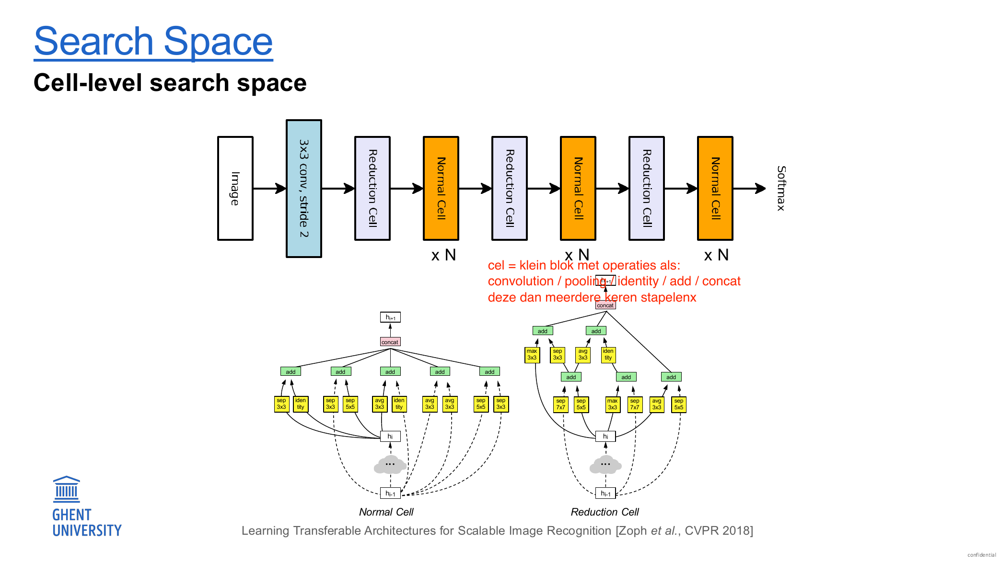

Hier zoek je niet het hele netwerk, maar één klein, herbruikbaar **blok (cel)**. Dat blok stapel je daarna **N keer** in een vast skelet (NASNet-stijl: afwisselend "Normal Cells" die de resolutie behouden en "Reduction Cells" die downsamplen). Voordeel: de zoekruimte is veel kleiner (je zoekt één cel i.p.v. honderden lagen) én het resultaat is schaalbaar — meer cellen stapelen = groter netwerk.

> 📝 **jouw notitie:** een cel = klein blok met operaties zoals convolution / pooling / identity / add / concat; deze dan meerdere keren stapelen.

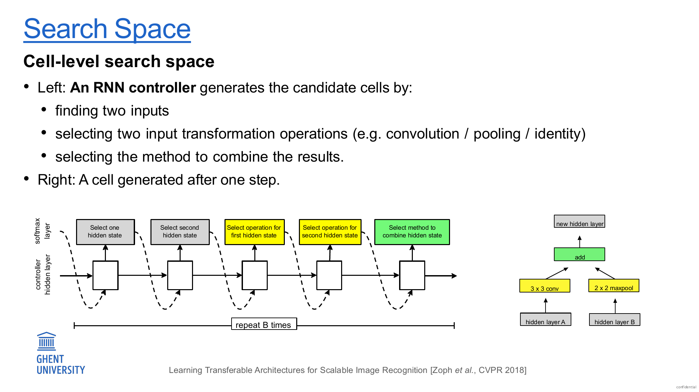

Hoe wordt zo'n cel concreet gegenereerd? Een **RNN-controller** bouwt ze stap voor stap op, en herhaalt B keer: (1) kies twee inputs (eerdere hidden states), (2) kies voor elk een transformatie-operatie (conv / pooling / identity), (3) kies hoe je de twee resultaten combineert (bv. add). De controller wordt getraind met reinforcement learning (zie §6.3) zodat hij steeds betere cellen voorstelt.

### Network-level search space — de dimensies

In plaats van (of naast) cellen kun je op **netwerkniveau** verschillende **dimensies** variëren. Elke dimensie is een knop die accuracy tegen kost ruilt:

**Depth (aantal blokken per stage)**

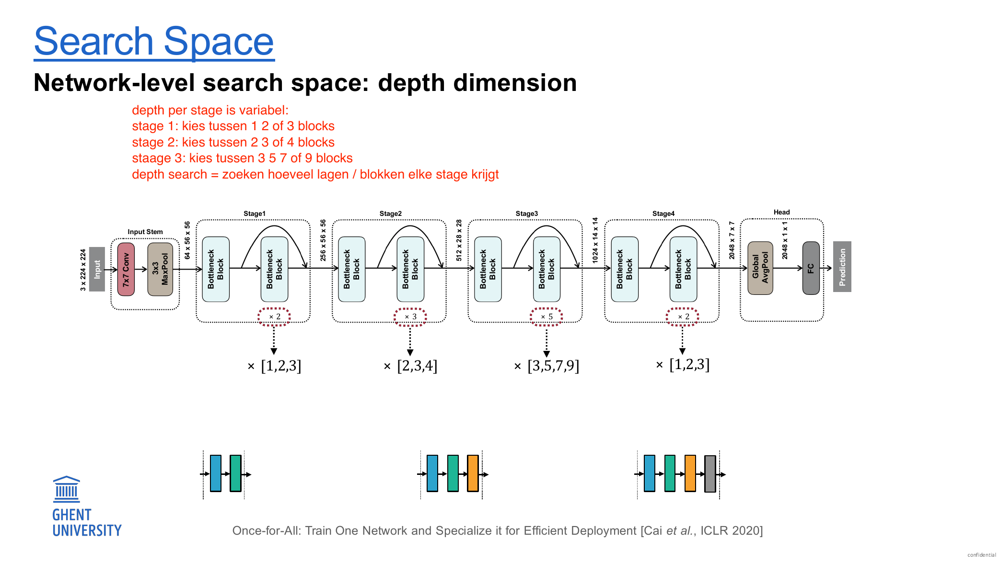

Hoeveel blokken stapel je in elke stage? Dieper = meer capaciteit maar trager. In het voorbeeld: stage 1 ∈ [1,2,3], stage 2 ∈ [2,3,4], stage 3 ∈ [3,5,7,9] blokken.

> 📝 **jouw notitie:** depth per stage is variabel: stage 1 kies tussen 1/2/3 blocks; stage 2: 2/3/4; stage 3: 3/5/7/9. **Depth search = zoeken hoeveel lagen/blokken elke stage krijgt.**

**Resolution (input grootte)**

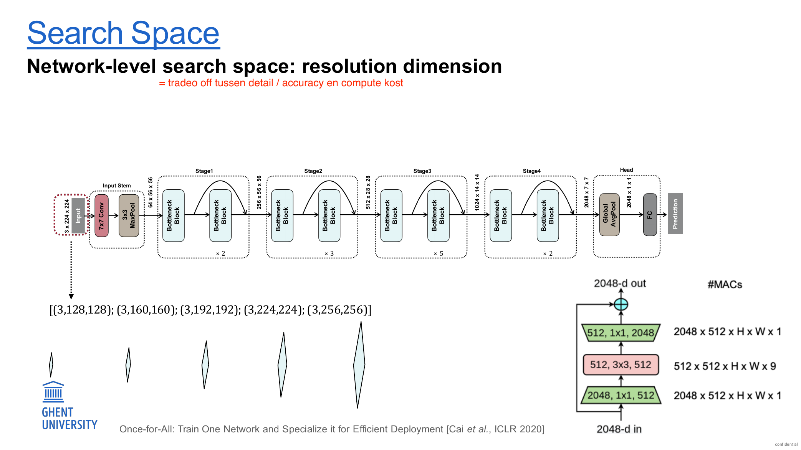

Hoe groot is het inputbeeld? Bv. `[(3,128,128); (3,160,160); (3,192,192); (3,224,224); (3,256,256)]`. Grotere resolutie = meer detail/accuracy, maar de rekenkost groeit **kwadratisch** (`h_o · w_o`!).

> 📝 **jouw notitie:** = trade-off tussen detail/accuracy en compute-kost.

**Width (aantal channels per stage)**

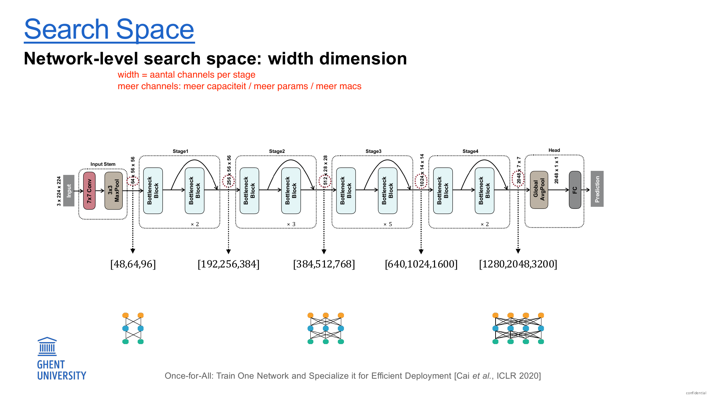

Hoe "breed" is elke stage, d.w.z. hoeveel channels? Bv. per stage `[48,64,96]`, `[192,256,384]`, `[384,512,768]`, … Breder = meer capaciteit, maar de kost groeit **kwadratisch** in de breedte (de `c_o · cᵢ`-factor).

> 📝 **jouw notitie:** width = aantal channels per stage; meer channels → meer capaciteit / meer params / meer macs.

**Kernel size**

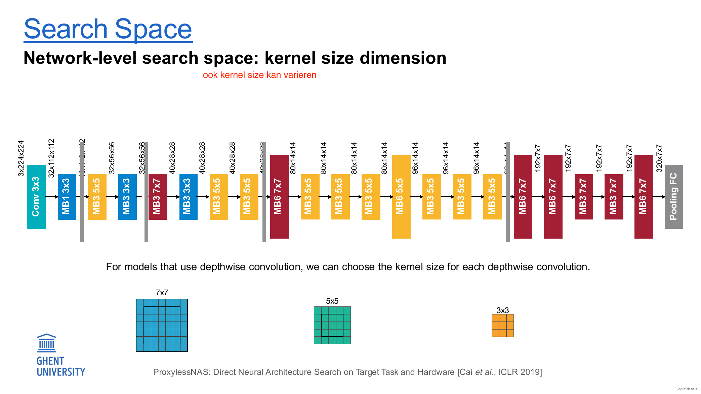

Voor modellen met depthwise conv kun je per laag de kernel-grootte kiezen (7×7 / 5×5 / 3×3). Grotere kernel = grotere receptieve buurt (ziet meer ruimtelijke context), maar duurder (`k_h · k_w`).

> 📝 **jouw notitie:** ook kernel size kan variëren.

**Topology / connecties**

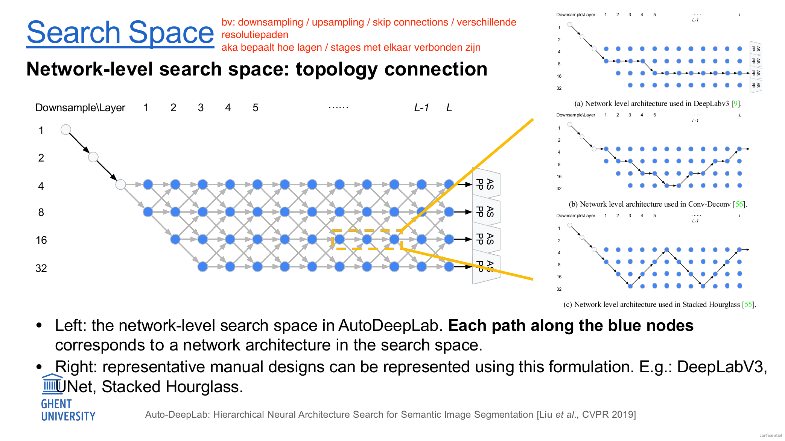

Niet alleen *wat* de lagen zijn, maar *hoe ze verbonden zijn*: waar downsample/upsample je, welke skip connections, welke resolutiepaden. In AutoDeepLab is elk pad door de blauwe nodes één architectuur — en bekende handontwerpen (DeepLabV3, U-Net, Stacked Hourglass) blijken gewoon specifieke paden in deze ruimte.

> 📝 **jouw notitie:** bv. downsampling / upsampling / skip connections / verschillende resolutiepaden — bepaalt hoe lagen/stages met elkaar verbonden zijn.

---

# DEEL 5 — De search space ontwerpen (TinyNAS / MCUNet)

## 5.1 TinyNAS

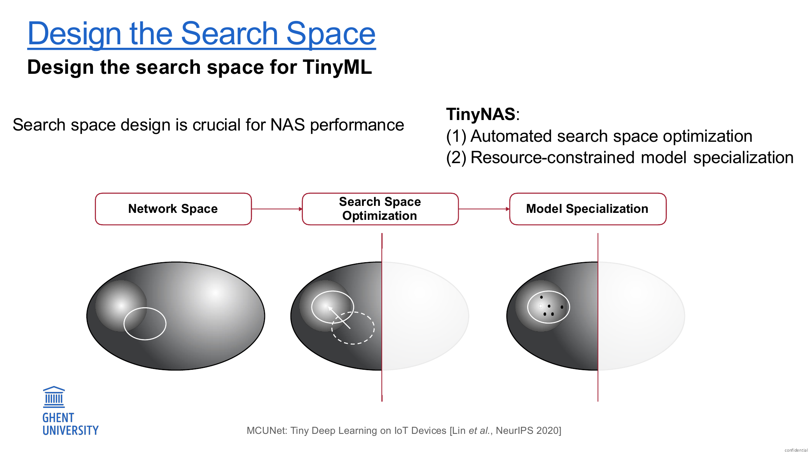

Tot nu namen we de search space als gegeven. Maar **het ontwerp van de search space is zelf cruciaal voor de NAS-prestatie** — een slecht gekozen ruimte bevat domweg geen goede modellen, hoe goed je ook zoekt. TinyNAS (uit MCUNet) pakt dit in twee fasen aan:
1. **Automated search space optimization** — eerst automatisch *afbakenen* welk deel van de gigantische network space de moeite waard is voor jouw constraint.
2. **Resource-constrained model specialization** — pas *daarna* binnen die afgebakende ruimte het beste concrete model zoeken.

Je optimaliseert dus eerst *waar* je zoekt, en dan *wat* je kiest.

## 5.2 Geheugen is dé constraint voor TinyML

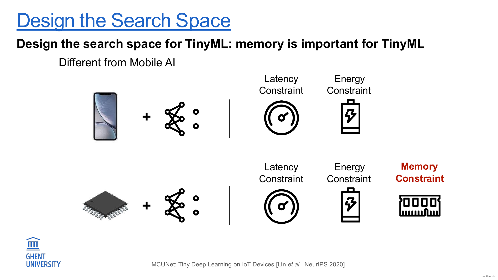

Waarom is TinyML anders dan Mobile AI? Op een telefoon let je vooral op **latency** en **energy**. Op een microcontroller komt er een derde, *harde* constraint bij: **memory**. Het geheugen is zó klein dat een model er domweg niet in past — dat is een ja/nee-grens, geen trade-off.

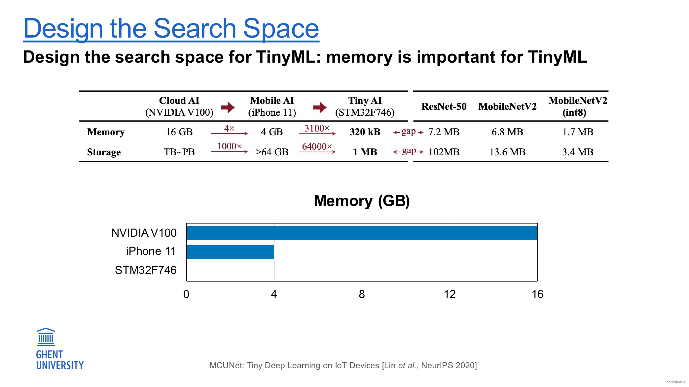

De kloof is gigantisch en het is goed om de ordes van grootte te kennen:
- **Geheugen (SRAM):** 16 GB (cloud, NVIDIA V100) → 4 GB (iPhone 11) → **320 kB** (STM32F746). Dat is ~3100× kleiner dan mobiel.
- **Storage (flash):** TB~PB → >64 GB → **1 MB**. Zo'n 64000× kleiner.

Ter vergelijking: ResNet-50 heeft 7.2 MB activations / 102 MB params — dat past **bij lange na niet** in 320 kB / 1 MB. Zelfs MobileNetV2-int8 (1.7 MB / 3.4 MB) zit nog ruim boven het tiny-budget. Je kúnt deze modellen dus niet zomaar verkleinen; je moet vanaf het begin binnen de geheugengrens ontwerpen.

## 5.3 De juiste FLOPs-verdeling kiezen

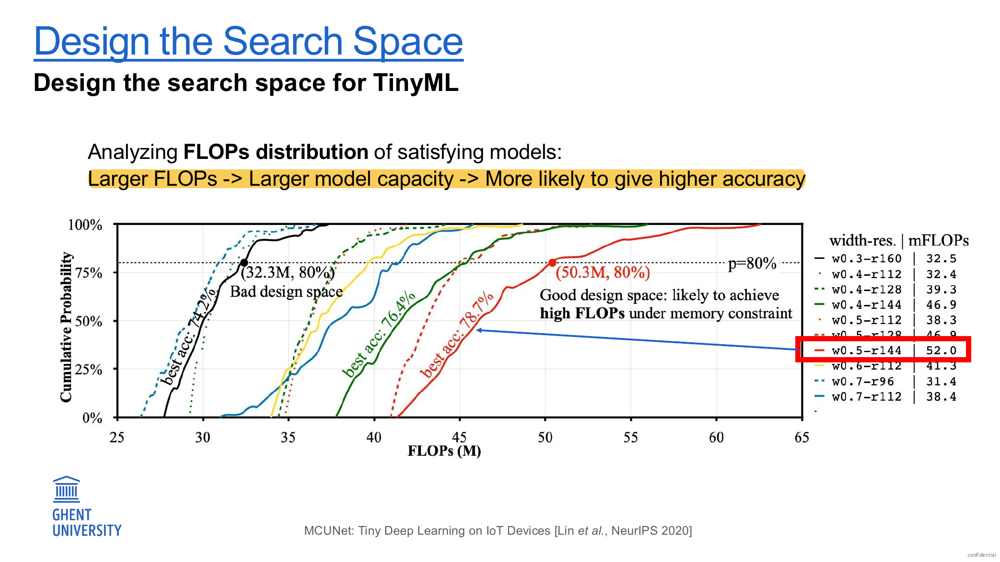

Hoe weet TinyNAS of een afgebakende search space "goed" is? Het kijkt naar de **FLOPs-verdeling** van alle modellen in die ruimte die de memory-constraint halen. De redenering: **meer FLOPs → meer capaciteit → waarschijnlijk hogere accuracy** — máár alleen onder de geheugengrens.

In de grafiek (cumulatieve waarschijnlijkheid vs. FLOPs): een **goede design space** (rood, `w0.5-r144`) bereikt met 80% kans hoge FLOPs (50.3M) terwijl ze nog in het geheugen past; een **slechte design space** (zwart) blijft hangen rond 32.3M FLOPs. Je wil dus de configuratie kiezen waarvan de curve het verst naar rechts ligt — die bevat de "rijkste" modellen die nog passen.

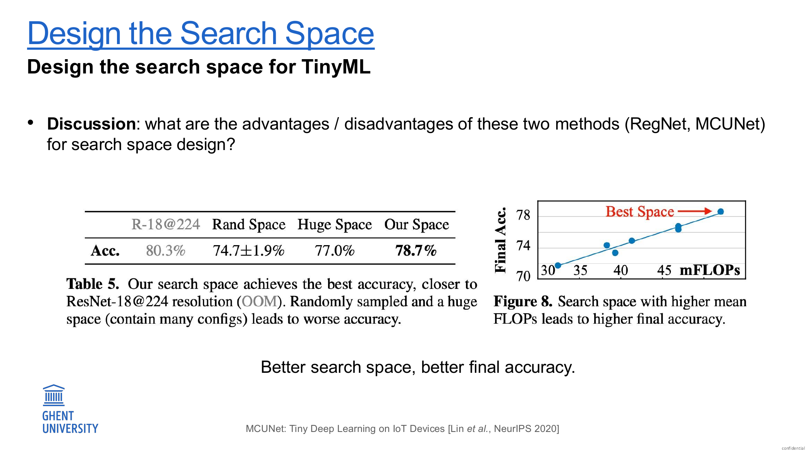

Het effect is meetbaar (Table 5): de geoptimaliseerde space haalt **78.7%**, vs. een willekeurig gekozen space 74.7% en een veel te grote space 77.0%. De conclusie die je moet onthouden: **betere search space → betere finale accuracy** — nog vóór je begint te zoeken.

---

# DEEL 6 — Search strategy

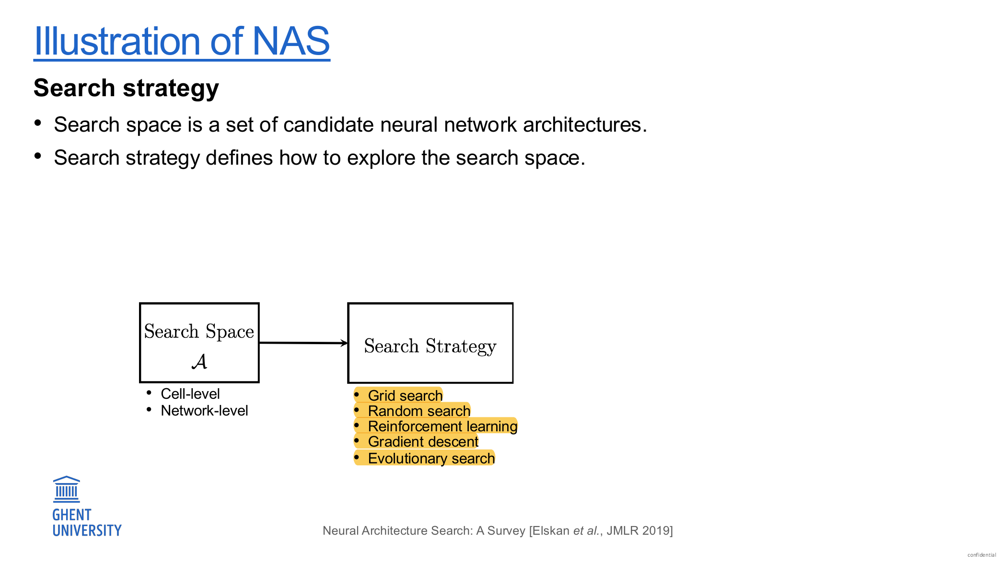

Gegeven een search space: *hoe* doorzoek je hem? Er zijn vijf hoofdstrategieën, oplopend in slimheid: **grid search, random search, reinforcement learning, gradient descent, evolutionary search.** Elk maakt een andere afweging tussen "grondig" en "haalbaar".

## 6.1 Grid search

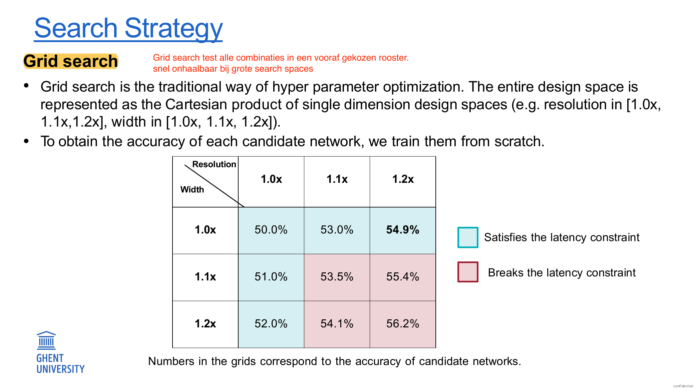

De bruteforce-aanpak: leg een rooster over de keuzes en test **alle** combinaties.

> 📝 **jouw notitie:** grid search test alle combinaties in een vooraf gekozen rooster → snel onhaalbaar bij grote search spaces.

Het probleem is **combinatorische explosie**: met d dimensies en k waarden elk heb je `kᵈ` combinaties. Voor een paar knoppen oké, maar voor een echte NAS-ruimte (miljarden opties) onbruikbaar.

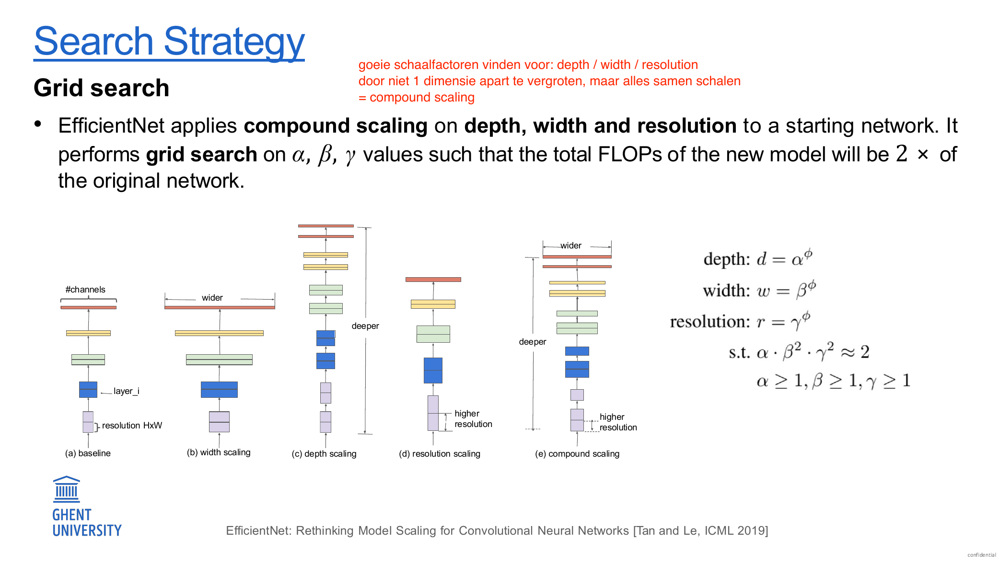

**EfficientNet** maakt grid search wél bruikbaar door het probleem te verkleinen tot enkele **schaalfactoren**.

> 📝 **jouw notitie:** goeie schaalfactoren vinden voor **depth / width / resolution** door niet één dimensie apart te vergroten, maar **alles samen te schalen** = compound scaling.

**Het inzicht achter compound scaling:** als je een netwerk groter wilt maken, is het verspilling om maar één dimensie (alleen dieper, óf alleen breder, óf alleen hogere resolutie) te maximaliseren — die loopt snel vast. Beter is om depth, width én resolution *in een vaste verhouding samen* op te schalen. EfficientNet zoekt die verhouding één keer met grid search en past hem dan toe op alle modelgroottes.
- efficientNet: ipv random -> maak het model precies 2x duurder qua FLOPs en vind de beste manier om die extra rekenkracht te verdelen over depth/width/resolution

## 6.2 Random search

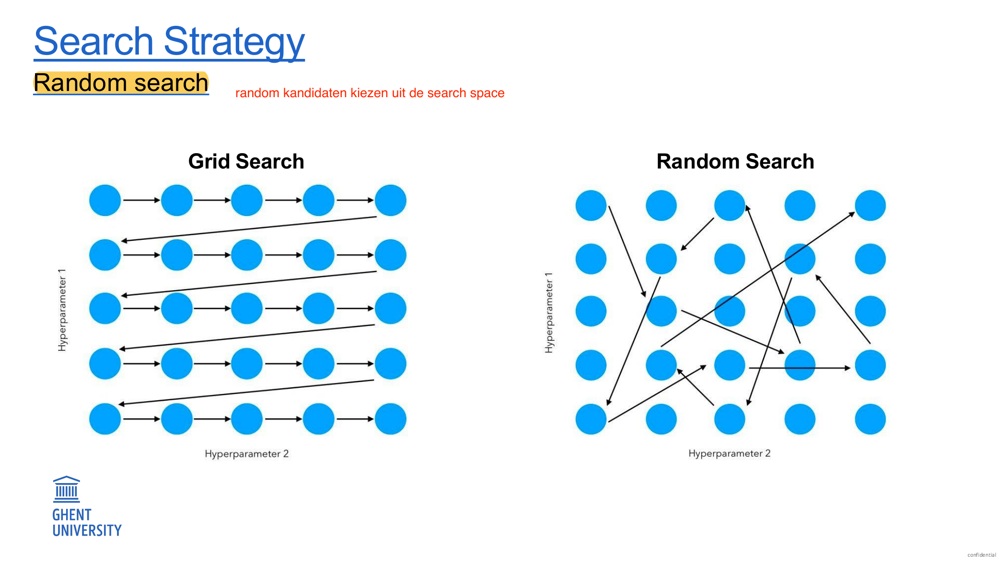

> 📝 **jouw notitie:** random kandidaten kiezen uit de search space. (Verrassend sterke baseline.)

Klinkt naïef, maar in een goed ontworpen search space (DEEL 5!) zijn er zóveel goede architecturen dat willekeurig prikken vaak al verrassend dicht bij de beste komt. Random search is dáárom de standaard-baseline waartegen je elke slimmere strategie afzet — als jouw fancy methode random niet verslaat, doet ze niets nuttigs.

## 6.3 Reinforcement learning

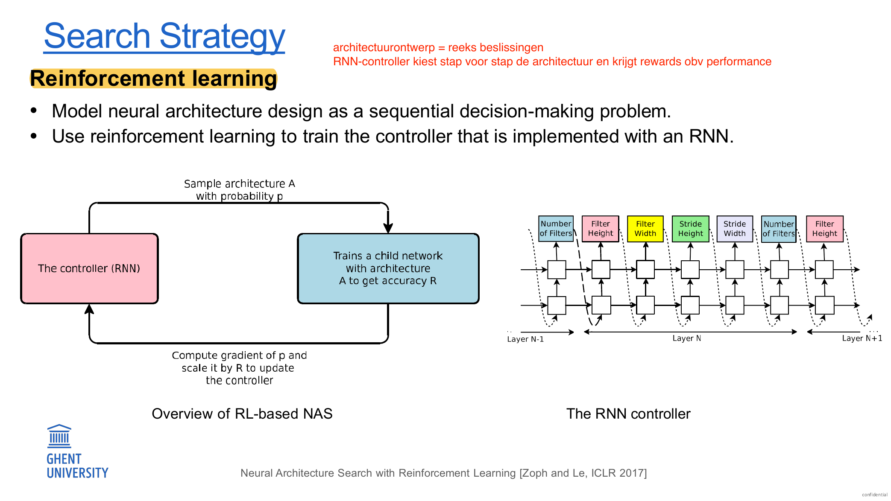

> 📝 **jouw notitie:** architectuurontwerp = reeks beslissingen; een **RNN-controller** kiest stap voor stap de architectuur en krijgt **rewards** op basis van performance.

Het idee: zie het bouwen van een architectuur als een **reeks beslissingen** (eerst laag 1 kiezen, dan laag 2, …) — precies een sequentieel probleem voor een **RNN-controller** (zie §4.3). Je traint die controller met RL: hij stelt een architectuur voor, die wordt getraind en geëvalueerd, en de behaalde accuracy is de **reward**. Hoge reward → de controller wordt aangemoedigd om zulke keuzes vaker te maken. Nadeel: elke evaluatie vereist een netwerk trainen → **extreem duur** (duizenden GPU-dagen in de originele papers).

## 6.4 Gradient descent (DARTS)

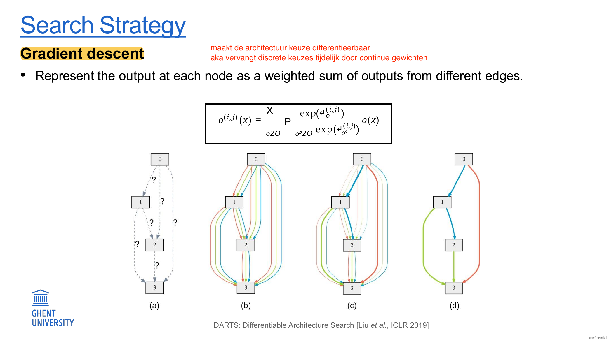

> 📝 **jouw notitie:** maakt de architectuurkeuze **differentieerbaar**, ofwel vervangt discrete keuzes tijdelijk door **continue gewichten** (zodat je via gradient descent kunt optimaliseren).

**Het probleem dat DARTS oplost:** "welke operatie kies ik?" is normaal een **discrete** keuze (conv óf pool óf identity), en discrete keuzes kun je niet afleiden/differentiëren — dus geen gradient descent. DARTS' truc: vervang de harde keuze door een **gewogen mix** van alle opties, met continue gewichten α (een soort "softmax over operaties"). Nu is alles differentieerbaar en kun je α gewoon meetrainen met gradient descent. Op het einde kies je per plek de operatie met het hoogste gewicht. Veel sneller dan RL, want je traint één keer i.p.v. duizenden netwerken — maar het geheugen-/rekengebruik tijdens de search is hoog (alle opties tegelijk actief).

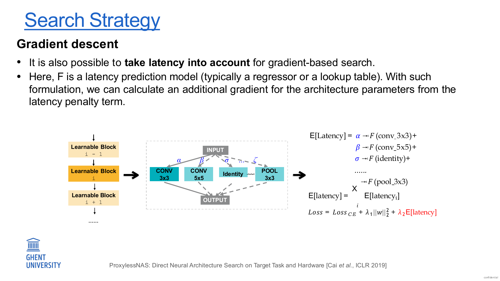

Deze gradient-aanpak kan ook **latency-aware** gemaakt worden: voeg een latency-term toe aan de loss zodat de search niet alleen op accuracy, maar ook op snelheid optimaliseert (dit is precies wat ProxylessNAS doet, zie DEEL 7).

## 6.5 Evolutionary search

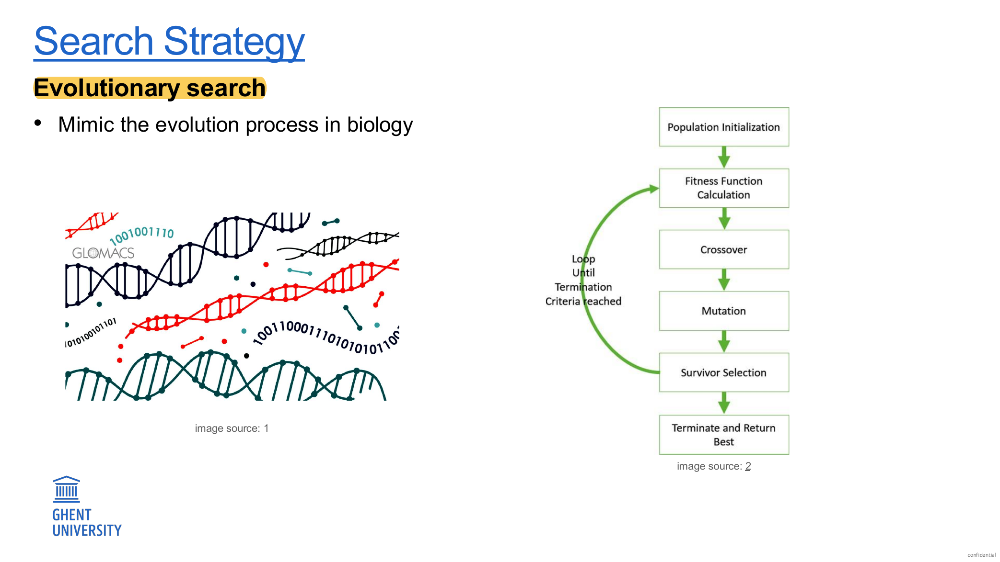

Geïnspireerd op natuurlijke selectie: houd een **populatie** van architecturen bij, beoordeel ze, gooi de slechte weg en maak nieuwe varianten van de goede. Herhaal generatie na generatie.

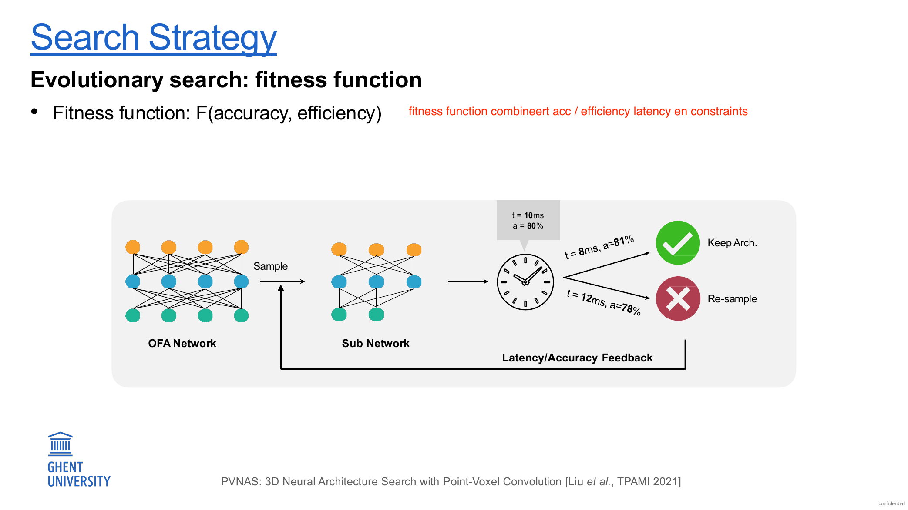

> 📝 **jouw notitie:** de **fitness function** combineert accuracy + efficiency/latency + constraints.

De **fitness function** bepaalt wie "fit" is en dus mag voortplanten. Door er naast accuracy ook latency en constraints in te stoppen, stuur je de evolutie meteen richting efficiënte modellen.

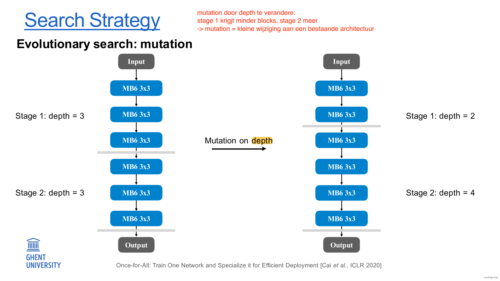

> 📝 **jouw notitie:** mutation door **depth** te veranderen: stage 1 krijgt minder blocks, stage 2 meer → **mutation = kleine wijziging aan een bestaande architectuur.**

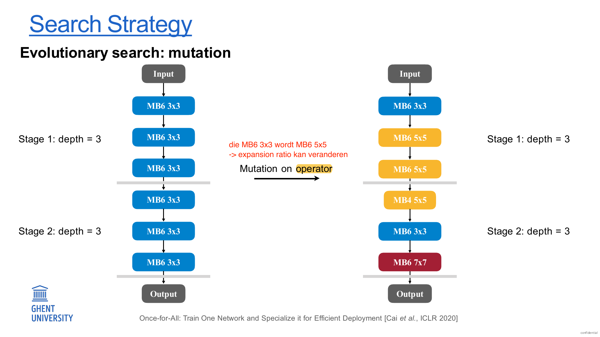

> 📝 **jouw notitie:** een MB6 3×3 wordt MB6 5×5 → ook de **expansion ratio / kernel size** kan muteren.

**Mutation** = een kleine, willekeurige wijziging aan één bestaande architectuur (een stage dieper/ondieper, een kernel 3×3→5×5, een andere expansion ratio). Het zorgt voor lokale variatie.

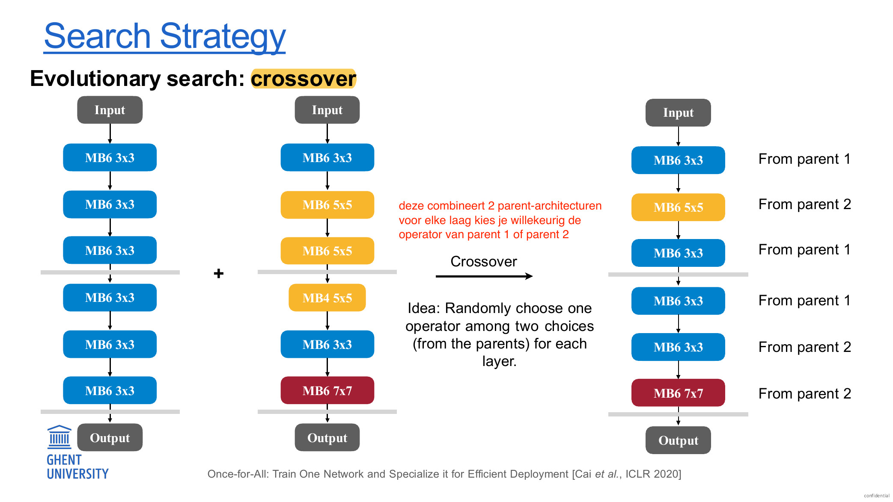

> 📝 **jouw notitie:** **crossover** combineert 2 parent-architecturen: voor elke laag kies je willekeurig de operator van parent 1 of parent 2.

**Crossover** = twee goede "ouders" combineren tot een kind, in de hoop dat het de sterke punten van beide erft. Samen zorgen mutation (lokaal verkennen) en crossover (combineren) ervoor dat de populatie geleidelijk betere architecturen voortbrengt.

---

# DEEL 7 — Efficient & hardware-aware NAS

## 7.1 Van algemeen model naar gespecialiseerde modellen

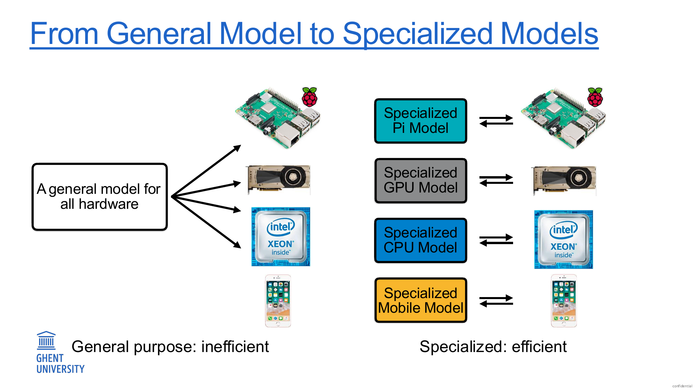

De ambitie verschuift hier: niet één "universeel" model dat overal redelijk draait, maar **per target (taak + specifieke hardware) een gespecialiseerd model**. Een model dat optimaal is voor een GPU is dat namelijk niet voor een microcontroller — en omgekeerd. De rest van DEEL 7 gaat over hoe je dat efficiënt voor elkaar krijgt.

## 7.2 Waarom MACs niet volstaan

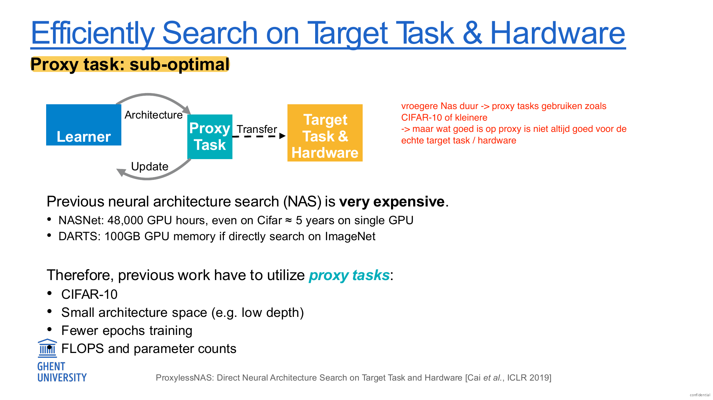

> 📝 **jouw notitie:** vroegere NAS was duur → men gebruikte **proxy tasks** (bv. CIFAR-10, of kleinere netwerken). Maar wat goed is op de proxy is niet altijd goed voor de echte target task/hardware.

Omdat zoeken zo duur is, deed men het vroeger op een goedkopere **proxy task** (een kleinere dataset zoals CIFAR-10, of een ingekort netwerk) en hoopte dat het resultaat overdraagt. Het probleem: **een winnaar op de proxy is niet noodzakelijk een winnaar op de echte taak/hardware**.

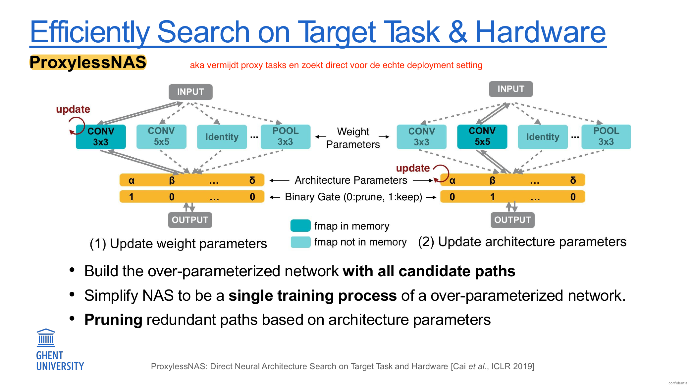

> 📝 **jouw notitie:** **ProxylessNAS** vermijdt proxy tasks en zoekt direct voor de echte deployment-setting.

**ProxylessNAS** schrapt de proxy en zoekt **rechtstreeks op de echte target task + hardware**.

**Extra context — hoe maakt ProxylessNAS dat betaalbaar?** Het bouwt voort op de DARTS-aanpak (alle operaties tegelijk), maar **binariseert** de paden: per stap is er telkens maar één pad actief in plaats van alle. Daardoor zakt het geheugengebruik van O(N) (alle N opties tegelijk) naar O(1) (één tegelijk). Zo kun je tóch direct op de volledige, echte taak zoeken zonder dat het geheugen ontploft.

**Bij jouw voorbeeld (2 lagen, elk 2 opties):**

**DARTS:** in élke laag staan **beide opties** tegelijk aan. De output van laag 1 is een gewogen som van conv 3×3 én conv 5×5. Dan gaat dat naar laag 2, waar weer beide opties parallel draaien.
```
Laag 1:  [conv 3×3] + [conv 5×5]   ← beide in memory
Laag 2:  [conv 3×3] + [conv 5×5]   ← beide in memory
Totaal actief: 4
```

**ProxylessNAS:** in élke laag staat maar **één optie** aan (via binary gate). Welke? Dat wordt gesampled.
```
Laag 1:  [conv 3×3] ✓   [conv 5×5] ✗   ← één in memory
Laag 2:  [conv 3×3] ✗   [conv 5×5] ✓   ← één in memory
Totaal actief: 2
```

**Volgende iteratie** kan ProxylessNAS een andere sample maken:
```
Laag 1:  [conv 3×3] ✗   [conv 5×5] ✓
Laag 2:  [conv 3×3] ✓   [conv 5×5] ✗
```

Dus: **alle lagen draaien altijd, maar per laag is bij ProxylessNAS slechts 1 van de N opties geactiveerd**, terwijl bij DARTS alle N opties per laag tegelijk in memory zitten.

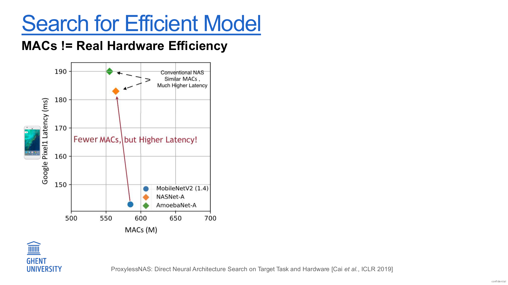

**Het kernpunt van dit hele deel: *MACs ≠ echte hardware-efficiëntie.*** MACs tellen alleen vermenigvuldigingen, maar de echte latency hangt ook af van geheugentoegang, parallellisme, hoe goed een operatie op de chip "mapt", enz. Concreet:
- Conventionele NAS-netwerken (NASNet-A, AmoebaNet-A) hebben **gelijkaardige MACs als MobileNetV2 maar veel hogere latency** ("fewer MACs, but higher latency!").
- Op een GPU bij **gelijke FLOPs**: *layer-number scaling* geeft een totaal andere latency-curve dan *hidden-dimension scaling*.


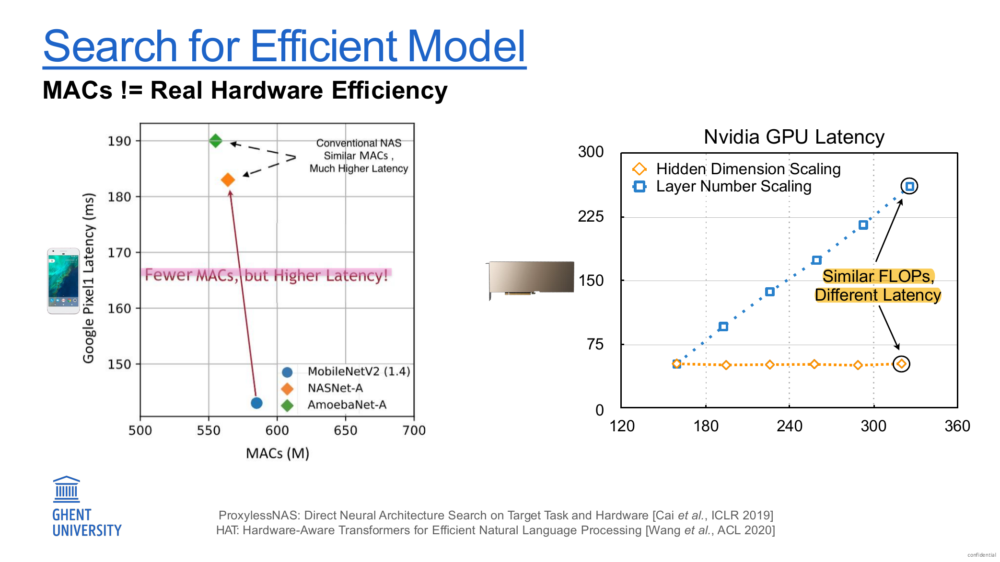
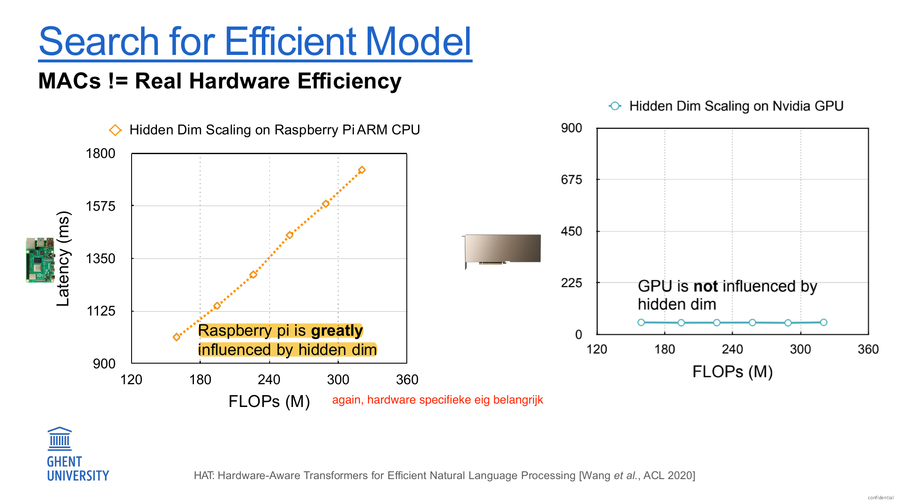

En het gedrag verschilt **per hardware**: hidden-dimension opschalen maakt een Raspberry Pi (ARM CPU) veel trager, terwijl een Nvidia GPU er nauwelijks last van heeft (de GPU heeft genoeg parallellisme om het te verbergen). Daarom moet je per hardware apart optimaliseren — een algemene MAC- of FLOP-telling liegt.

> 📝 **jouw notitie:** again — hardware-specifieke eigenschappen zijn belangrijk.

## 7.3 Hardware-feedback in NAS brengen

Als MACs liegen, moet de **echte latency** in de zoeklus. Maar hoe meet je die zonder de boel onbetaalbaar te maken?

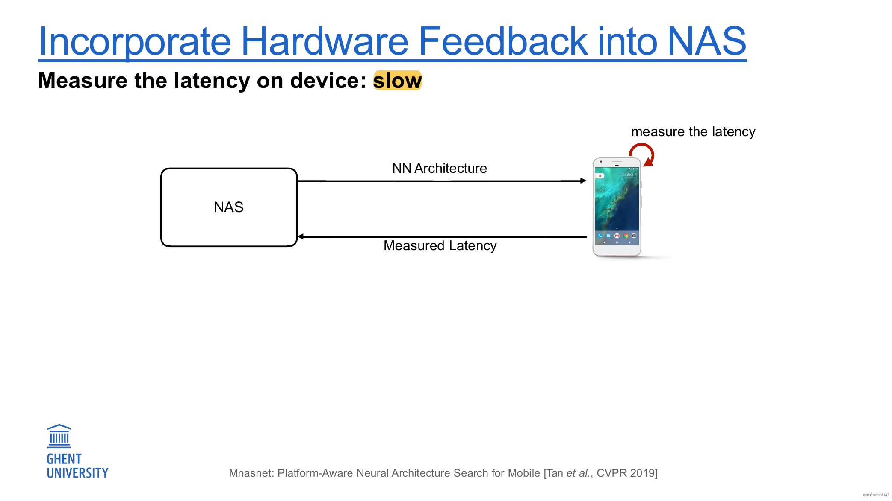
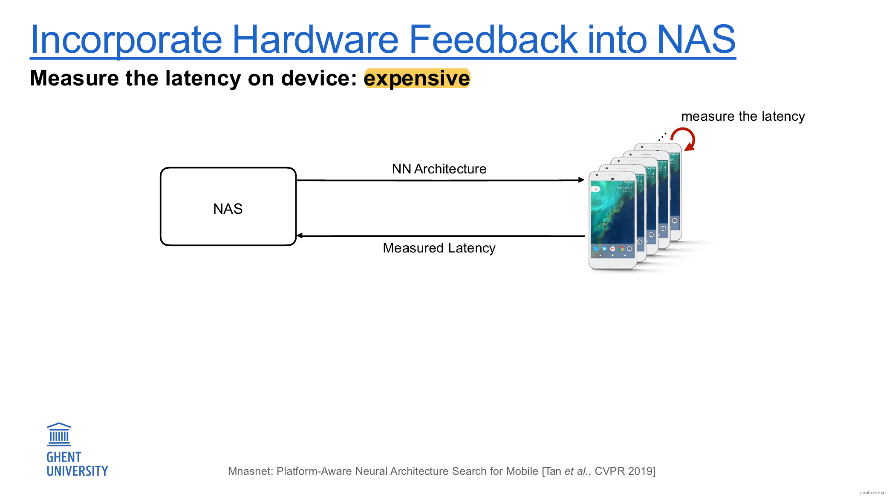

**Optie 1 — meten op het device.** Dit geeft de waarheid, maar is **traag** (elke kandidaat moet je echt timen) en **duur** (je hebt veel fysieke devices nodig en moet duizenden architecturen meten). Onhaalbaar in een zoeklus met miljoenen kandidaten.

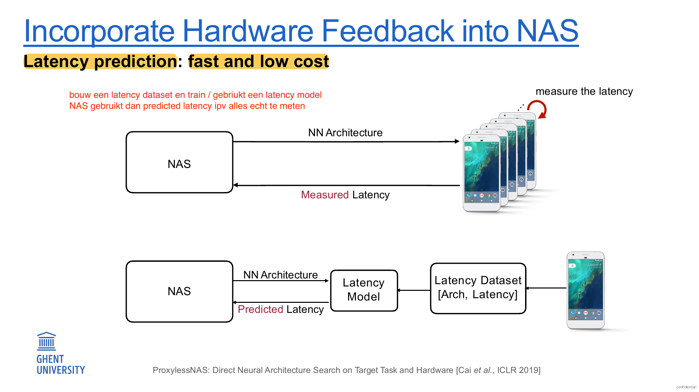

**Optie 2 — latency *voorspellen*.** Snel en goedkoop.

> 📝 **jouw notitie:** bouw een latency-dataset en train/gebruik een **latency model**; NAS gebruikt dan **predicted latency** in plaats van alles echt te meten.

Het recept: meet *één keer* een hoop architecturen op het echte device → dat is je **latency-dataset** → train daarmee een goedkoop model dat latency voorspelt. In de NAS-lus gebruik je voortaan die **voorspelde** latency. Twee manieren om dit te doen:

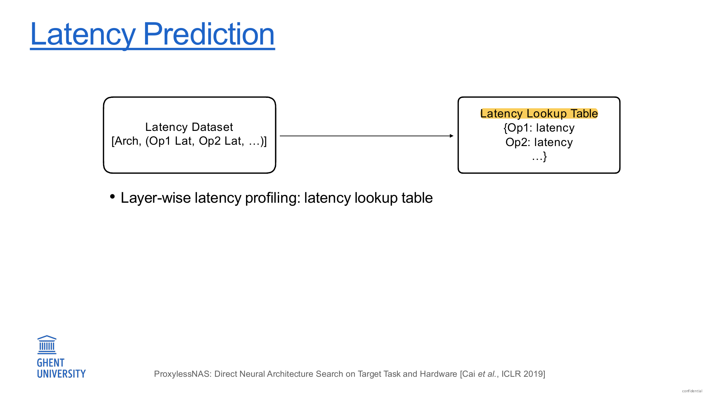

**(a) Layer-wise → latency lookup table.** Meet de latency van elke individuele operatie en zet ze in een tabel `{Op1: latency, Op2: latency, …}`. De latency van een hele architectuur ≈ de **som** van de latencies van haar lagen. Simpel en snel op te zoeken.

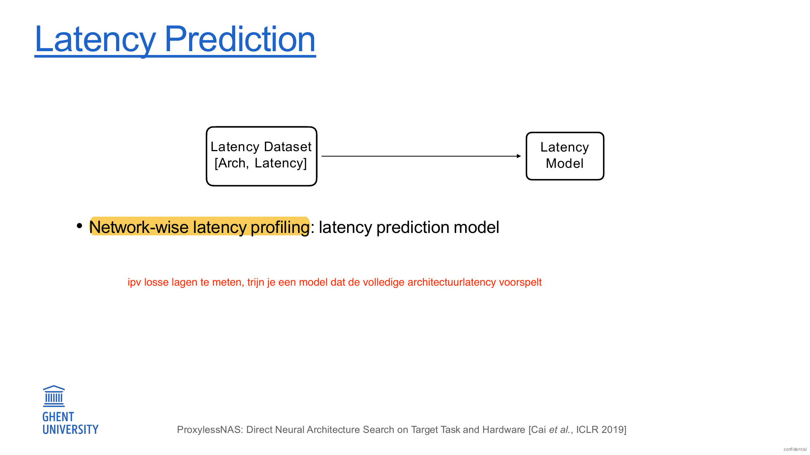

En het werkt: de voorspelde vs. echte latency (ms) liggen netjes op de **y = x**-lijn — de optelling van laag-latencies benadert de echte latency verrassend goed.

**(b) Network-wise → latency prediction model.**

> 📝 **jouw notitie:** in plaats van losse lagen te meten, train je een model dat de **volledige architectuurlatency** voorspelt.

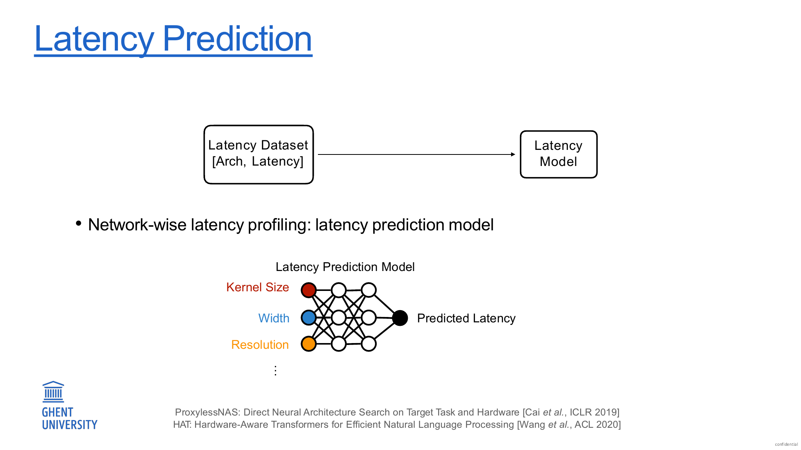

Hier is de voorspeller zelf een klein netwerkje: het neemt architectuur-kenmerken als input (kernel size, width, resolution, …) en geeft direct de **predicted latency** terug. Voordeel t.o.v. de lookup table: het kan ook niet-additieve effecten (overhead, geheugengedrag) leren.

## 7.4 Gespecialiseerde modellen per hardware

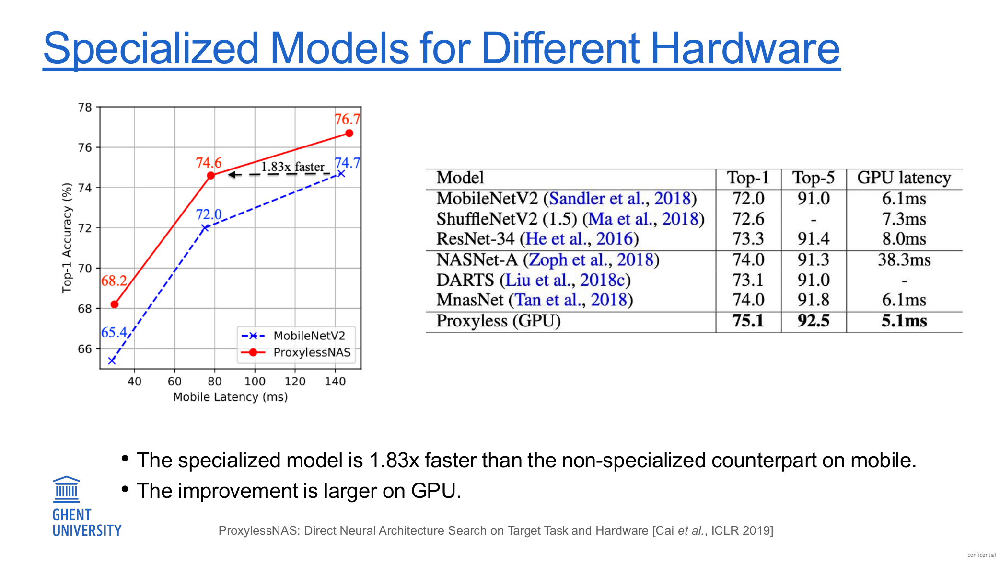

Resultaat van direct + latency-aware zoeken (ProxylessNAS): het gespecialiseerde model is **1.83× sneller** dan de niet-gespecialiseerde tegenhanger op mobile (op GPU is de winst nog groter). Proxyless (GPU) haalt **75.1% top-1 bij slechts 5.1 ms** GPU-latency — beter én sneller dan MobileNetV2, NASNet-A en MnasNet. Let op NASNet-A in de tabel: 38.3 ms, terwijl het qua accuracy vergelijkbaar is — precies het "MACs ≠ latency"-effect.

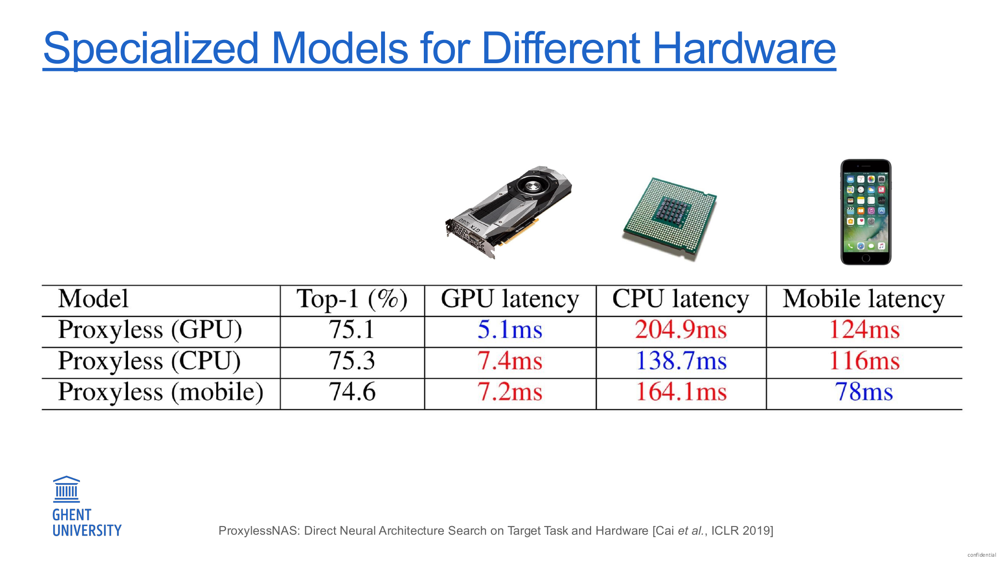

En de clou: hetzelfde "Proxyless" recept, apart geoptimaliseerd voor **GPU / CPU / mobile**, geeft elk een **ander** netwerk. In de tabel zie je dat het GPU-model traag is op CPU (204.9 ms!) en het mobile-model traag op GPU. **Geen enkel model is optimaal op alle hardware** → specialiseer per target. Dat motiveert meteen de volgende vraag: moet je dan voor élk apparaat opnieuw een dure search + training doen? Nee — daarvoor is Once-for-All.

## 7.5 Once-for-All (OFA) Network

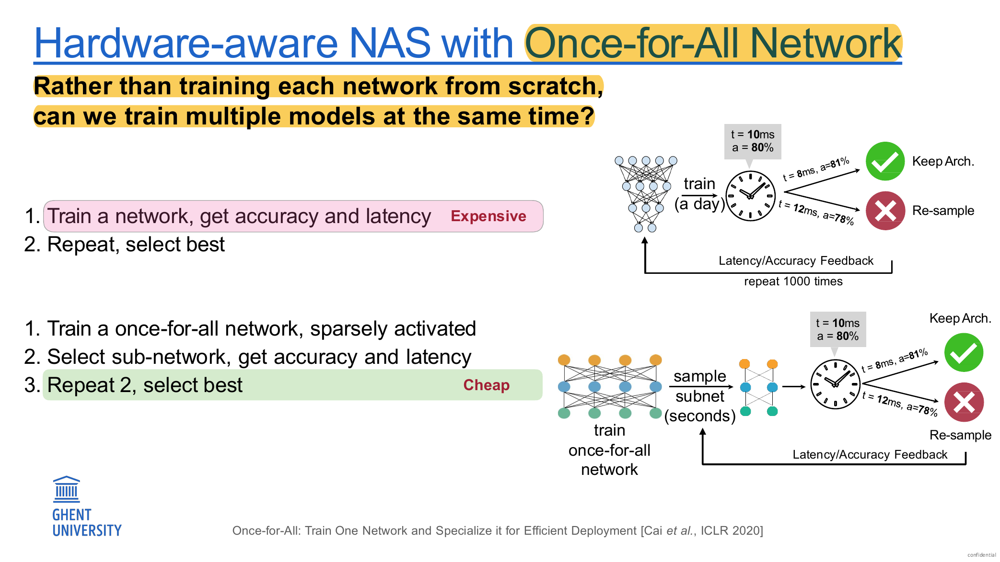

**Het probleem:** als je per hardware een model wil, en je evalueert kandidaten door ze vanaf nul te trainen (≈1 dag/model, ×1000 kandidaten), is dat onbetaalbaar én slecht voor het milieu. De OFA-aanpak vergelijkt twee workflows:

- **Conventioneel (duur):** train een netwerk → meet accuracy + latency → herhaal 1000×, kies het beste. Elke iteratie = volledige training.
- **OFA (goedkoop):**
  1. Train **één keer** een groot "once-for-all" netwerk (sparsely activated).
  2. **Sample** er een sub-netwerk uit en meet accuracy + latency — dit duurt **seconden**, want het is al getraind.
  3. Herhaal stap 2 en kies het beste. Geen hertrainen nodig.

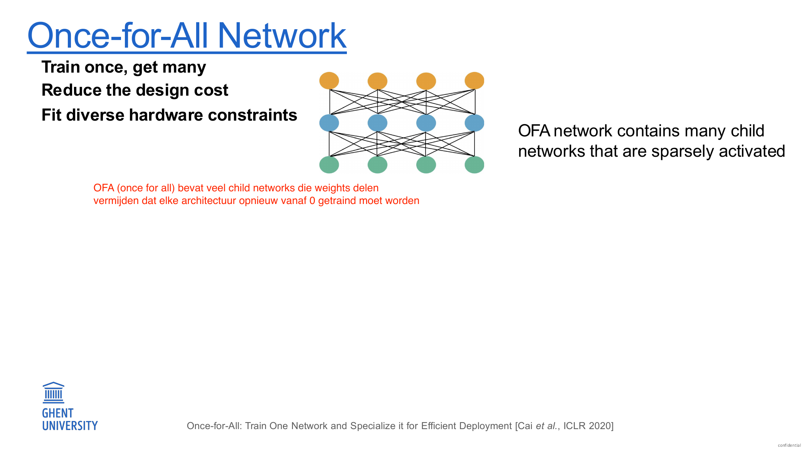

> 📝 **jouw notitie:** OFA (once-for-all) bevat **veel child networks die weights delen**; dit vermijdt dat elke architectuur opnieuw vanaf 0 getraind moet worden.

De kerngedachte — **train once, get many · reduce design cost · fit diverse hardware constraints**: het OFA-netwerk bevat heel veel kleinere **child networks** die **dezelfde gewichten delen**. Door ze samen (joint) te trainen, "amortiseer" je de trainingskost over allemaal: één dure training, daarna gratis kandidaten.

die `fit diverse hardware constraints`: 
- **Wat ze trainen:** de **gewichten** van het super-netwerk. Dat is **hardware-agnostisch** — gewichten zijn gewoon getallen, ze "weten" niks van een GPU of MCU.
- **Wat hardware-specifiek is:** welk **sub-netwerk** je eruit haalt (welke depth, width, kernel sizes). Die keuze hangt af van latency-constraints van de target hardware.

**De flow:**

```
1. Train OFA-netwerk één keer  ──►  gewichten (hw-agnostisch)
                                     │
                                     ├──► sample sub-net A → past op iPhone
                                     ├──► sample sub-net B → past op Pixel  
                                     ├──► sample sub-net C → past op MCU
                                     └──► sample sub-net D → past op GPU
```

Voor elke nieuwe hardware doe je **alleen stap 2 opnieuw**: zoek het beste sub-netwerk binnen de latency-budget van die hardware. De gewichten zijn al getraind, je hoeft niks te hertrainen.


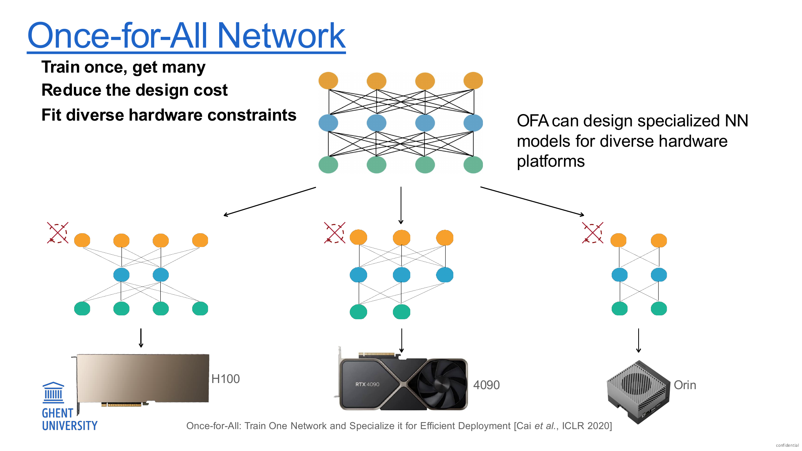
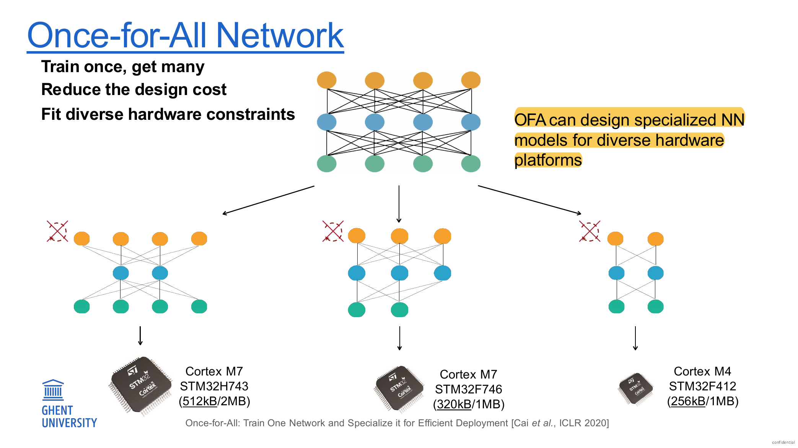

Uit datzelfde getrainde OFA-netwerk haal je dan **gespecialiseerde sub-netwerken** voor totaal verschillende doelen, **zonder hertrainen**:
- GPU's van verschillend formaat: H100 / RTX 4090 / Jetson Orin.
- Microcontrollers met verschillend geheugen: Cortex-M7 STM32H743 (512 kB) / Cortex-M7 STM32F746 (320 kB) / Cortex-M4 STM32F412 (256 kB).
- Verschillende telefoons (Samsung S22/S21/S20).
- Zelfs verschillende **batterijtoestanden** van hetzelfde toestel (full / low / battery-saving) → je kunt *runtime* een kleiner sub-netwerk kiezen als de batterij leeg raakt.

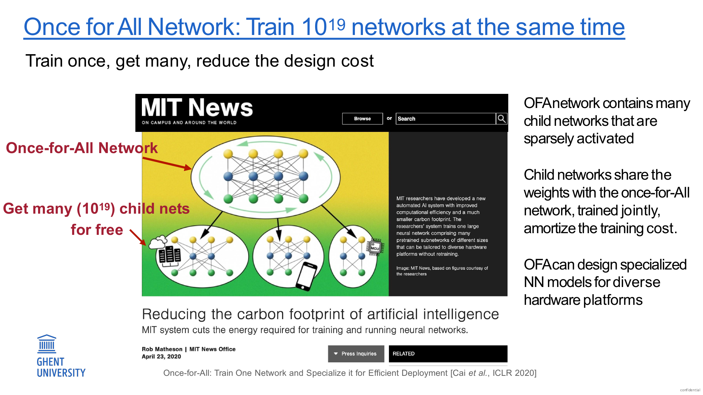

De schaal is enorm: één OFA-netwerk bevat in de praktijk **~10¹⁹ child networks tegelijk**. Ze delen de gewichten, worden joint getraind, en amortiseren zo zowel de trainingskost als de **CO₂-footprint** (MIT News maakte er een artikel over).

## 7.6 OFA: hoe train je één netwerk waar al die sub-netwerken in zitten?

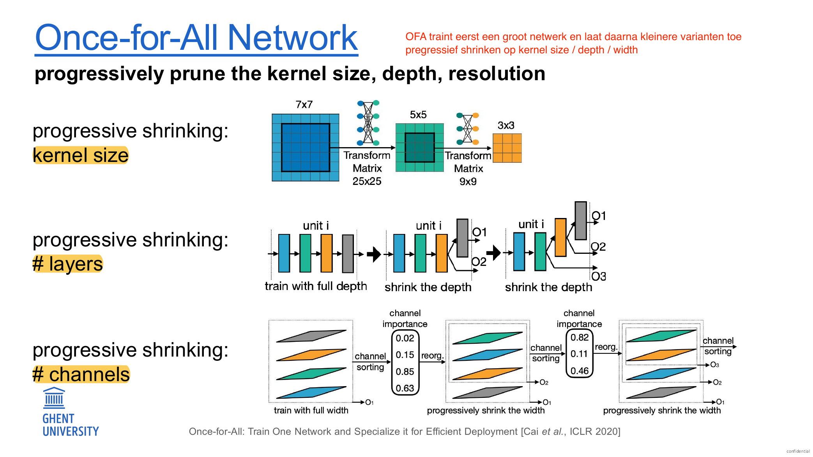

> 📝 **jouw notitie:** OFA traint eerst een **groot** netwerk en laat daarna kleinere varianten toe — progressief **shrinken** op kernel size / depth / width.

De techniek heet **progressive shrinking**. Naïef alle sub-netwerken tegelijk trainen werkt slecht: de grote en kleine varianten "vechten" om dezelfde gewichten. Daarom train OFA eerst het **volledige, grootste** netwerk goed, en staat het *daarna geleidelijk* steeds kleinere varianten toe — telkens vertrekkend van de al-getrainde grote.

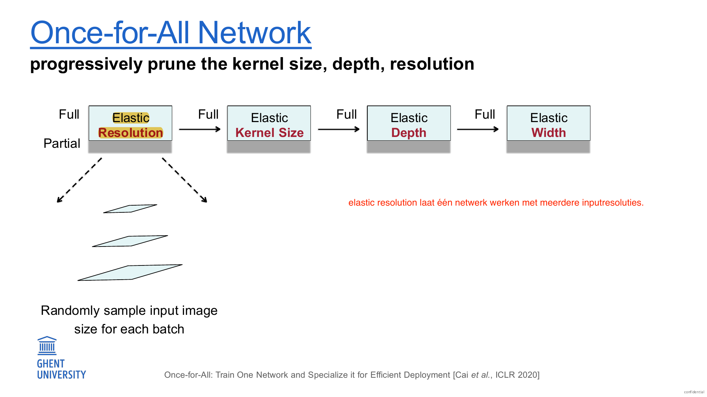

De volgorde is **Elastic Resolution → Elastic Kernel Size → Elastic Depth → Elastic Width** (telkens van "Full" naar "Partial").

> 📝 **jouw notitie:** elastic resolution laat één netwerk werken met **meerdere inputresoluties** (random sample input image size per batch).

Hieronder per dimensie *hoe* een kleinere variant de gewichten van de grote hergebruikt:

**Elastic kernel size**

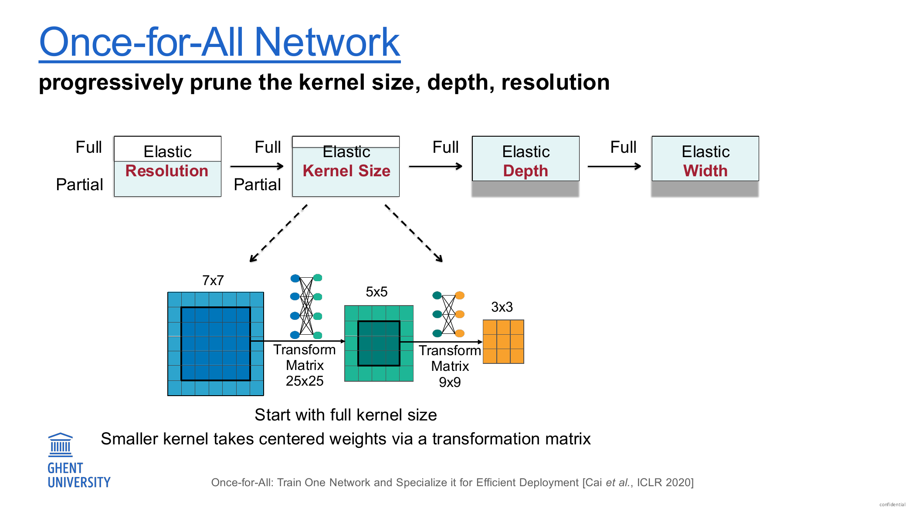

Start met de volle kernel (7×7). Een kleinere kernel (5×5, dan 3×3) neemt de **gecentreerde gewichten** van de grote over, maar via een geleerde **transformatie-matrix** (25×25, dan 9×9). Die matrix herweegt de centrale gewichten zodat ze ook als kleine kernel goed werken — anders zou je gewoon de buitenrand wegknippen en kwaliteit verliezen.

**Elastic depth**

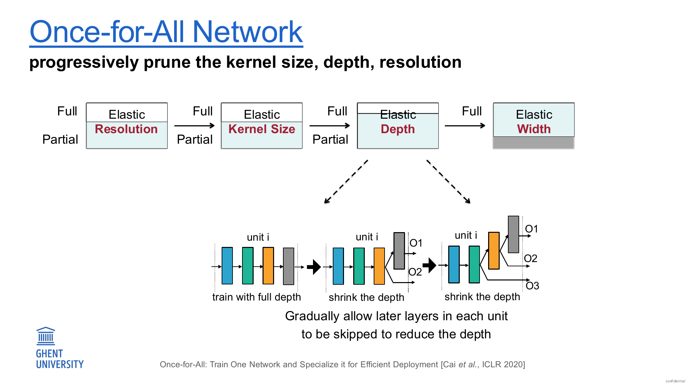

Train eerst met volle diepte; sta dan toe dat de **laatste lagen van elke unit worden overgeslagen** om de diepte te verlagen. Zo deelt het ondiepe sub-netwerk de eerste lagen met het diepe.

**Elastic width**

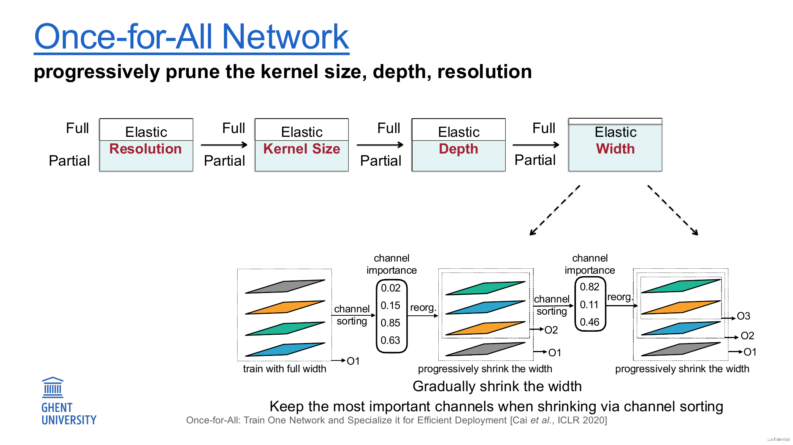

Train met volle breedte; krimp dan geleidelijk en **behoud de belangrijkste channels** via **channel sorting**: bereken een channel-importance score, sorteer/reorganiseer de channels van belangrijk naar onbelangrijk, en houd bij het krimpen telkens de bovenste (belangrijkste) over. Zo verlies je zo weinig mogelijk bij het versmallen.

## 7.7 OFA: resultaten

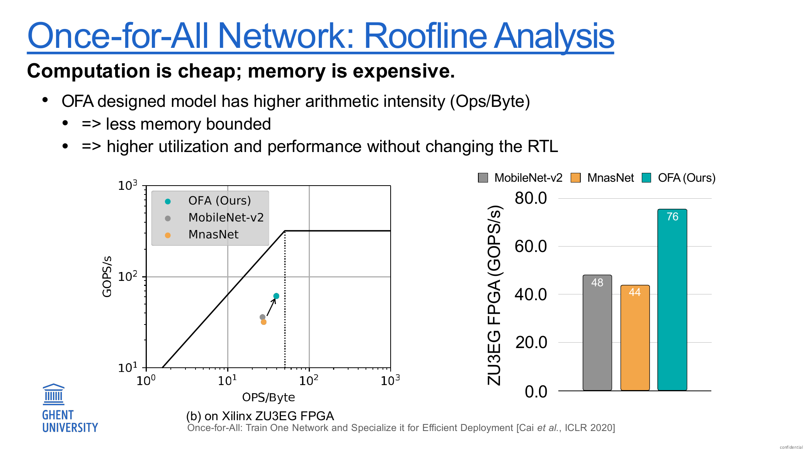

**Roofline-analyse — "computation is cheap; memory is expensive".** Een roofline-plot zet performance (GOPS/s) uit tegen **arithmetic intensity** (Ops/Byte = hoeveel rekenwerk je doet per byte geheugentoegang). Modellen links zijn *memory-bound* (geheugen is de flessenhals), rechts *compute-bound*. Het OFA-model heeft een **hogere arithmetic intensity** → het is minder memory-bound → het haalt **hogere utilization en performance op exact dezelfde hardware** (zonder de RTL te wijzigen). Concreet op een Xilinx ZU3EG FPGA: 76 vs. 48 GOPS/s voor MobileNetV2.

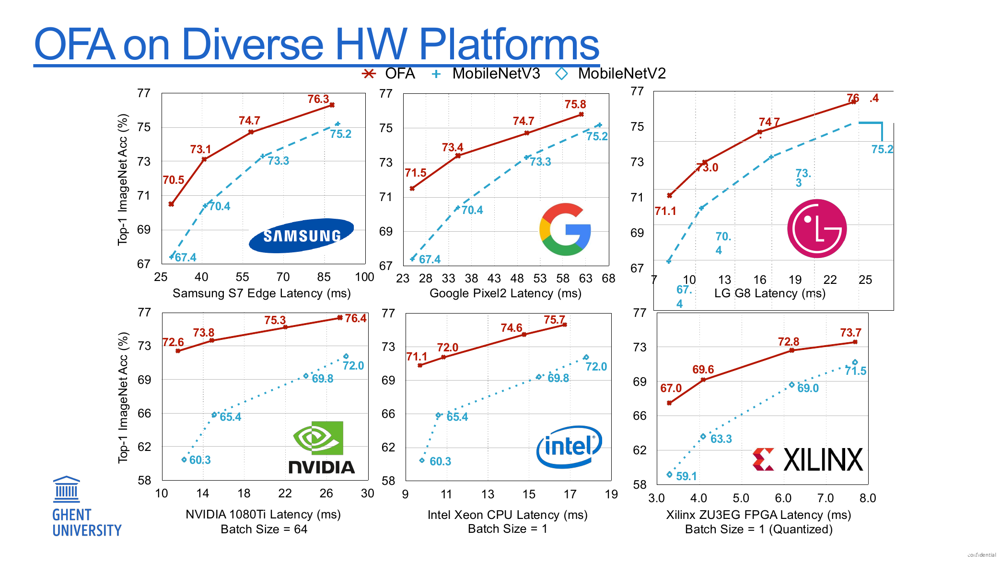

En het generaliseert: op **alle** geteste platforms (Samsung S7 Edge, Google Pixel2, LG G8, NVIDIA 1080Ti, Intel Xeon CPU, Xilinx FPGA) ligt de **OFA accuracy-vs-latency-curve boven die van MobileNetV3 en MobileNetV2**. Bij gelijke latency haalt OFA dus telkens een hogere ImageNet-accuracy — het bewijs dat per-hardware specialiseren uit één getraind netwerk écht werkt.

---

# 🔑 Kernpunten om te onthouden

1. **NAS = automatisch zoeken** naar een goede netwerk-architectuur in een vooraf gedefinieerde search space, met drie componenten in een lus: **search space, search strategy, performance estimation**.
2. **MAC-formules** (n=1, bias genegeerd), lees als *aantal outputs × kost per output*: linear `c_o·cᵢ`; conv `c_o·cᵢ·k_h·k_w·h_o·w_o`; grouped `…/g`; depthwise `c_o·k_h·k_w·h_o·w_o` (mist `cᵢ`); 1×1 `c_o·cᵢ·h_o·w_o` (mist `k_h·k_w`).
3. Een gewone conv doet **spatial filtering** (`k_h·k_w`) **én channel mixing** (`cᵢ`) tegelijk → duur. Alle efficiënte blokken **ontkoppelen** die twee: depthwise = enkel spatial, 1×1 = enkel channels.
4. **ResNet bottleneck**: 1×1 reduce → 3×3 → 1×1 expand → ~8.5× minder MACs (dure 3×3 op smal kanaal). **MobileNetV2 inverted bottleneck**: 1×1 expand → 3×3 depthwise → 1×1 project → **compute-efficient maar niet memory-efficient** (grote tussen-activations; weinig params ≠ weinig geheugen).
5. **Search space dimensies** (network-level): depth, resolution (kost ∝ kwadratisch), width (kost ∝ kwadratisch), kernel size, topology. **Cell-level**: zoek één cel, stapel die N keer.
6. **Search strategies**: grid (→ EfficientNet compound scaling), random (sterke baseline), RL (RNN-controller + rewards, duur), gradient (DARTS, maakt discrete keuzes differentieerbaar via continue gewichten), evolutionary (fitness + mutation + crossover).
7. **TinyNAS/MCUNet**: voor TinyML is **memory** dé harde extra constraint (320 kB vs. GB's). Ontwerp eerst een goede search space — die met de hoogste FLOPs *onder* de memory-constraint geeft de hoogste accuracy.
8. **MACs ≠ echte hardware-efficiëntie**: zelfde MACs/FLOPs kan totaal andere latency geven, en dat verschilt per hardware (CPU voelt hidden-dim sterk, GPU nauwelijks).
9. **Hardware-aware NAS** brengt latency in de zoeklus. Echt meten is traag/duur → gebruik een **latency lookup table** (layer-wise, som van laag-latencies) of een **latency prediction model** (network-wise, klein NN'tje).
10. **ProxylessNAS** vermijdt proxy tasks en zoekt direct op de target task + hardware (gebinariseerde paden, O(N)→O(1) geheugen) → gespecialiseerd model, ~1.83× sneller; geen enkel model is optimaal op álle hardware.
11. **Once-for-All**: train één groot netwerk met gedeelde weights via **progressive shrinking** (resolution → kernel → depth → width), en sample daarna goedkoop (seconden, geen hertraining) een gespecialiseerd sub-netwerk per hardware/batterij-toestand — *train once, get many*.

---

# 📝 Oefenvragen

**V1.** Geef de MAC-formule (n=1, bias genegeerd) voor een (a) gewone conv, (b) grouped conv met g groepen, (c) depthwise conv, (d) 1×1 conv. Wat is het verschil tussen (c) en (a) qua factoren?

<details><summary>Antwoord</summary>

(a) `c_o · cᵢ · k_h · k_w · h_o · w_o` · (b) `c_o · cᵢ · k_h · k_w · h_o · w_o / g` · (c) `c_o · k_h · k_w · h_o · w_o` · (d) `c_o · cᵢ · h_o · w_o`.
Depthwise mist de factor **cᵢ** (elke output channel kijkt maar naar één input channel i.p.v. alle), waardoor het veel goedkoper is — maar er is geen channel mixing meer. Het is het uiterste geval van (b) met `g = cᵢ`.
</details>

**V2.** Een ResNet bottleneck-blok (2048→512→512→2048) bespaart MACs t.o.v. één gewone 3×3 conv 2048→2048. Toon waarom dit ~8.5× is.

<details><summary>Antwoord</summary>

Bottleneck-som (× H×W): 1×1 reduce `2048·512·1` + 3×3 `512·512·9` + 1×1 expand `2048·512·1`. Met `2048 = 4·512`: `512·512·(4 + 9 + 4) = 512·512·17`.
Gewone conv: `2048·2048·9 = 512·512·144`.
Verhouding `144/17 ≈ 8.5×`. De winst komt doordat de dure 3×3 op een 4× smaller kanaal draait.
</details>

**V3.** Waarom heeft MobileNetV2 weinig parameters maar tóch een geheugenprobleem?

<details><summary>Antwoord</summary>

De inverted bottleneck **expandt** eerst naar veel channels (N·6) vóór de depthwise conv. Die tussenliggende **activations** zijn groot en moeten in het geheugen blijven (zeker bij training, voor de backward pass). MobileNetV2 is dus **compute-efficient maar niet memory-efficient**: weinig params, maar hoge peak activation. Les: *weinig parameters ≠ weinig geheugen* — voor microcontrollers telt vaak net de peak activation.
</details>

**V4.** Wat is een depthwise-separable block en welke twee taken splitst het? Waarom is het goedkoper?

<details><summary>Antwoord</summary>

Een **3×3 depthwise conv** (spatial filtering, per channel, geen channel mixing) gevolgd door een **1×1 pointwise conv** (channel mixing, geen spatial context). Samen benaderen ze een gewone conv. Kost: `cᵢ·9·HW + c_o·cᵢ·HW` t.o.v. `c_o·cᵢ·9·HW` voor een gewone 3×3 → verhouding ≈ `1/9 + 1/c_o`, dus ~8–9× goedkoper bij grote `c_o`.
</details>

**V5.** Noem de drie componenten van NAS en hoe ze samenwerken in een lus.

<details><summary>Antwoord</summary>

**Search space** = welke architecturen mogelijk zijn. **Search strategy** = kiest een kandidaat A uit die ruimte. **Performance estimation strategy** = beoordeelt A (accuracy, en bij hardware-aware NAS ook latency) en geeft een score terug. Die score stuurt de volgende keuze van de search strategy → de lus herhaalt tot een goede architectuur gevonden is.
</details>

**V6.** Wat is het verschil tussen een cell-level en een network-level search space, en wat is het voordeel van cell-level?

<details><summary>Antwoord</summary>

**Cell-level:** je zoekt één kleine cel (blok met conv/pool/identity/add/concat) en stapelt die N keer in een vast skelet. **Network-level:** je zoekt over de volledige structuur — depth, resolution, width, kernel size, topology. Voordeel van cell-level: veel kleinere zoekruimte (één cel i.p.v. honderden lagen) en schaalbaar (meer cellen stapelen = groter netwerk).
</details>

**V7.** Wat is compound scaling (EfficientNet) en waarom is het beter dan één dimensie schalen?

<details><summary>Antwoord</summary>

Compound scaling vergroot **depth, width én resolution samen** in een vaste verhouding (de schaalfactoren worden één keer via grid search gevonden), in plaats van één dimensie te maximaliseren. Eén dimensie opblazen loopt snel vast (afnemende meeropbrengst); een gebalanceerde groei benut extra rekenkracht efficiënter en geeft een betere accuracy/efficiency-trade-off.
</details>

**V8.** Wat doet mutation en wat doet crossover in evolutionary search, en wat is de rol van de fitness function?

<details><summary>Antwoord</summary>

**Mutation** = kleine willekeurige wijziging aan één bestaande architectuur (bv. depth van een stage, of MB6 3×3 → MB6 5×5) → lokale variatie. **Crossover** = twee parent-architecturen combineren (per laag willekeurig de operator van parent 1 of 2) → goede eigenschappen samenbrengen. De **fitness function** (accuracy + latency + constraints) bepaalt wie overleeft en zich voortplant, en stuurt de evolutie richting efficiënte modellen.
</details>

**V9.** "MACs ≠ real hardware efficiency." Leg uit met een voorbeeld.

<details><summary>Antwoord</summary>

Twee netwerken met gelijke MACs/FLOPs kunnen sterk verschillende latency hebben (NASNet-A heeft vergelijkbare MACs als MobileNetV2 maar veel hogere latency), want MACs negeren geheugentoegang, parallellisme en hoe goed een op op de chip mapt. Bovendien is dit hardware-afhankelijk: hidden-dimension scaling maakt een Raspberry Pi/ARM CPU veel trager, maar een Nvidia GPU nauwelijks. Daarom moet NAS **echte latency** (gemeten of voorspeld) gebruiken en per hardware specialiseren.
</details>

**V10.** Hoe lost een latency lookup table / latency model het probleem op dat echt meten traag en duur is? Wat is het verschil tussen beide?

<details><summary>Antwoord</summary>

Je meet *één keer* een latency-dataset op het echte device en bouwt daaruit een goedkope voorspeller. **Layer-wise → lookup table** `{Op: latency}`: architectuurlatency = som van de op-latencies (simpel, ligt mooi op de y=x-lijn). **Network-wise → predictiemodel**: een klein NN dat uit (kernel size, width, resolution, …) de volledige latency voorspelt en ook niet-additieve effecten kan vatten. NAS gebruikt dan deze **predicted latency** — snel en goedkoop.
</details>

**V11.** Wat is het Once-for-All-idee en wat is "progressive shrinking"? Waarom train je niet gewoon alle sub-netwerken tegelijk?

<details><summary>Antwoord</summary>

**Once-for-All:** train één groot netwerk waarvan veel sub-netwerken (child networks) de weights **delen**; daarna sample je goedkoop (seconden, geen hertraining) een gespecialiseerd sub-netwerk per hardware/constraint ("train once, get many"). **Progressive shrinking:** train eerst het volledige grote netwerk, en sta dan *geleidelijk* kleinere varianten toe in de volgorde **resolution → kernel size → depth → width** (kleinere kernel via transform-matrix van gecentreerde gewichten; depth door laatste lagen te skippen; width door de belangrijkste channels te houden via channel sorting). Naïef alles tegelijk trainen werkt slecht omdat grote en kleine varianten om dezelfde gewichten "vechten".
</details>

**V12.** Waarom is geheugen voor TinyML een hardere constraint dan voor Mobile AI, en wat is het gevolg voor het ontwerpen van de search space?

<details><summary>Antwoord</summary>

Een microcontroller (STM32F746) heeft ~**320 kB** SRAM en ~1 MB flash, tegenover GB's op mobiel/cloud (~3100× / 64000× minder). Zelfs een gekwantiseerde MobileNetV2 (1.7 MB) past niet zomaar — het is een **ja/nee-grens**, geen trade-off. Gevolg (TinyNAS): ontwerp éérst een **goede search space** die — gegeven de memory-constraint — modellen met zo hoog mogelijke FLOPs/capaciteit bevat, want dat correleert met hogere finale accuracy (78.7% vs 74.7% voor een willekeurige space).
</details>

---

# 📖 Begrippenlijst

| Term | Betekenis |
|---|---|
| **NAS** | Neural Architecture Search: automatisch een goede netwerk-architectuur zoeken in een vooraf gedefinieerde search space. |
| **Search space** | De verzameling kandidaat-architecturen waaruit NAS kiest. |
| **Search strategy** | Hoe je door de search space zoekt (grid/random/RL/gradient/evolutionary). |
| **Performance estimation strategy** | Hoe je een kandidaat-architectuur beoordeelt (accuracy, latency, …). |
| **Cell-level search space** | Zoeken naar één kleine cel (blok) die N keer gestapeld wordt; kleinere, schaalbare zoekruimte. |
| **Network-level search space** | Zoeken over de volledige netwerkstructuur: depth, resolution, width, kernel size, topology. |
| **MAC** | Multiply-ACcumulate: één vermenigvuldiging + optelling; de basismaat voor rekenkost. |
| **Linear / FC layer** | Volledig verbonden laag; MACs = `c_o·cᵢ`. |
| **Convolution** | Spatial filtering + channel mixing tegelijk; MACs = `c_o·cᵢ·k_h·k_w·h_o·w_o`. |
| **Grouped convolution** | Channels opgesplitst in g groepen die los van elkaar werken; MACs gedeeld door g. |
| **Depthwise convolution** | Extreme grouped conv (g = #channels): één filter per channel; enkel spatial filtering, geen channel mixing. |
| **1×1 (pointwise) convolution** | Kernel 1×1; enkel channel mixing op dezelfde pixelpositie, geen ruimtelijke context. |
| **Spatial filtering / channel mixing** | De twee taken van een conv (ruimtelijke buurt bekijken `k_h·k_w` / channels combineren `cᵢ`); efficiënte blokken ontkoppelen ze. |
| **Bottleneck (ResNet)** | 1×1 reduce → 3×3 → 1×1 expand; dure 3×3 op smal kanaal → ~8.5× minder MACs. |
| **Residual connection** | Skip die de input bij de output optelt; laat het blok het residu leren en maakt diepe netwerken traineerbaar. |
| **ResNeXt / cardinality** | Vervangt de 3×3 conv door grouped conv (≡ multi-path block); cardinality = aantal parallelle paden. |
| **Depthwise-separable block (MobileNet)** | Depthwise 3×3 (spatial) + 1×1 pointwise (channel mixing); ~8–9× goedkoper dan gewone conv. |
| **Inverted bottleneck (MobileNetV2)** | 1×1 expand → 3×3 depthwise → 1×1 project; compute-efficient, niet memory-efficient (grote tussen-activations). |
| **Activations** | Tussenliggende feature maps; moeten in geheugen blijven (zeker bij training) → peak activation kan groter zijn dan params. |
| **Channel shuffle (ShuffleNet)** | Herschikt channels tussen group 1×1 convs zodat groepen toch informatie uitwisselen. |
| **Compound scaling (EfficientNet)** | Depth, width én resolution samen schalen in een vaste, via grid search gevonden verhouding. |
| **RNN-controller** | Genereert architectuur-keuzes stap voor stap; getraind met RL via rewards. |
| **DARTS** | Gradient-based NAS; maakt discrete architectuurkeuzes differentieerbaar via continue gewichten (gewogen mix van operaties). |
| **Evolutionary search** | Populatie van architecturen evolueert via fitness, mutation en crossover. |
| **Mutation / Crossover** | Mutation = kleine wijziging aan één architectuur; crossover = twee parents combineren. |
| **TinyNAS / MCUNet** | NAS voor TinyML: (1) automated search-space optimization + (2) resource-constrained model specialization. |
| **Memory constraint** | De harde SRAM/flash-limiet op microcontrollers (bv. 320 kB / 1 MB), dé extra constraint voor TinyML. |
| **Hardware-aware NAS** | NAS die de echte latency op de doelhardware mee optimaliseert. |
| **Proxy task** | Goedkopere surrogaattaak (bv. CIFAR-10) om kandidaten te evalueren; niet altijd representatief. |
| **ProxylessNAS** | NAS die proxy tasks vermijdt en direct op target task + hardware zoekt (gebinariseerde paden, O(N)→O(1)). |
| **Latency lookup table** | Layer-wise tabel `{Op: latency}`; architectuurlatency = som van de op-latencies. |
| **Latency prediction model** | Klein NN dat uit (kernel size, width, resolution, …) de volledige latency voorspelt. |
| **Once-for-All (OFA)** | Eén groot netwerk met gedeelde weights (~10¹⁹ child nets); sample goedkoop gespecialiseerde sub-netwerken per hardware, geen hertraining. |
| **Progressive shrinking** | OFA-trainstrategie: van groot naar klein in volgorde resolution → kernel → depth → width. |
| **Channel sorting** | Bij width-shrinking de belangrijkste channels behouden volgens channel-importance score. |
| **Arithmetic intensity (Ops/Byte)** | Verhouding rekenwerk/geheugentoegang; hoger = minder memory-bound → hogere utilization (roofline). |
| **Roofline** | Plot van performance vs. arithmetic intensity; toont of een model memory-bound of compute-bound is. |
