# Hoofdstuk 8 — Knowledge Distillation (KD)

**Vak:** Embedded Machine Learning (E061380) — UGent / imec (IDLAB)
**College:** Lecture 08 — *Knowledge Distillation*
**Docent:** Prof. Adnan Shahid

> Deze samenvatting volgt de PDF **structureel, in volgorde van de slides**. Belangrijke zaken worden met een foto erbij uitgelegd. Waar jij iets in het rood op de slide had geschreven, staat dat als **📝 jouw notitie**. Bij de slides staat hier en daar wat **extra context** die je anders zou moeten opzoeken — maar zonder een loutere kopie van de slides te zijn: het *waarom* en *hoe* staan centraal.

---

## 0. Waar past dit college in het vak?

De voorbije colleges draaiden allemaal om hetzelfde doel — een netwerk efficiënt genoeg krijgen voor een klein toestel — maar elk via een andere ingang. **Pruning** (Lect03) gooit overbodige gewichten weg, **quantization** (Lect04) verlaagt de bit-precisie, **NAS** (Lect06/07) laat een algoritme een zuinige architectuur ontwerpen. Telkens vertrek je van *het model zelf* en maak je het kleiner of slimmer ontworpen.

**Knowledge distillation** pakt het probleem van een totaal andere kant aan. Je houdt hier de **architectuur van het kleine model gewoon vast** en verandert in plaats daarvan **hoe je het traint**. Het idee: laat een klein "student"-model meekijken met een groot, al goed getraind "teacher"-model en laat het niet alleen de juiste labels naleren, maar ook de *manier waarop de teacher over de data denkt*. Het kleine model wordt dus niet kleiner gemaakt — het wordt **beter getraind**.

Dat is meteen de reden waarom dit college de scharnier vormt tussen de twee helften van het vak (zie course overview): KD is de laatste techniek uit **PART A — Efficient Inference**, maar het is fundamenteel een **trainings**techniek, en leidt zo naar **PART B — Efficient Training** (distributed training, on-device learning, federated learning in Lect09).

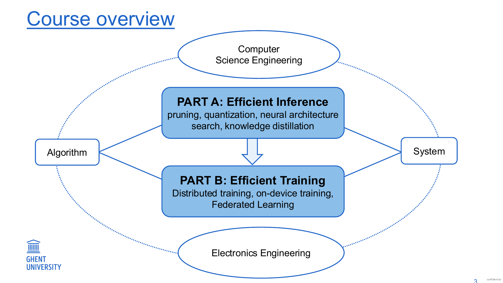

| Lecture | Onderwerp |
|---|---|
| 1 | Introduction |
| 2 | Overview of Embedded Systems en ML/DL Overflow |
| 3 | Pruning and Sparsity |
| 4 | Quantization |
| 5 | Lab Pruning and Quantization |
| 6 | Neural Architecture Search |
| 7 | Lab Pruning and Quantization op Nano 33 BLE |
| **8** | **Knowledge Distillation** ← dit college |
| 9 | Distributed training, on-device learning & Transfer Learning |
| 10 | Lab Knowledge Distillation & Federated Learning |

**Recap van vorige les (NAS):** primitive operations (linear, conv, grouped conv, depthwise conv), bottleneck-architectuur en ShuffleNet, neural architecture search, de network-level search space (depth, resolution, width, kernel size, topology), de search strategies (grid, random, reinforcement learning, gradient descent, evolutionary), en het idee om van algemene modellen naar gespecialiseerde modellen te gaan.

**Lecture Outline (de rode draad van dit college):**
1. **Wat is knowledge distillation** — het basisidee, de intuïtie van soft labels en temperatuur, de formele definitie
2. **What to match** — wat laat je de student precies naleren? output logits, intermediate weights, intermediate features, gradients/attention, sparsity patterns, relational information
3. **Self & online distillation** — wat als er geen vaste grote teacher is? Self-distillation (Born-Again), online distillation (Deep Mutual Learning), de combinatie (Be Your Own Teacher)
4. **Network augmentation** — een alternatief voor tiny modellen waar de gewone trucs (data augmentation, dropout) net averechts werken

---

# DEEL 1 — Waarom hebben we dit nodig?

## 1.1 Het probleem: tiny hardware

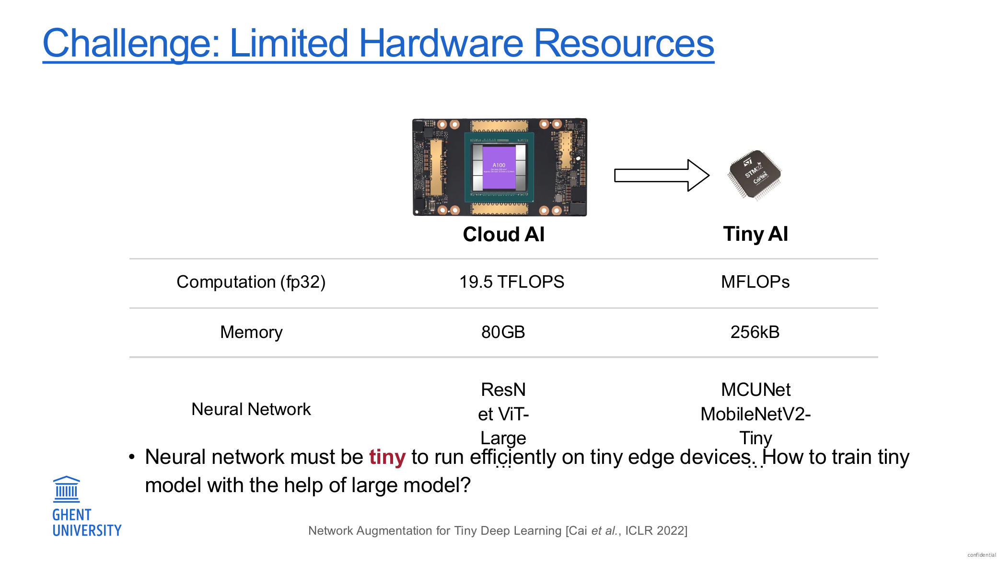

De motivatie is dezelfde als in heel het vak, nu nog eens scherp gezet. Een **cloud-GPU (A100)** levert ~19.5 TFLOPS en heeft 80 GB geheugen; een **microcontroller (STM32, Tiny AI)** zit in de orde van MFLOPs en ~256 kB geheugen. Dat is een kloof van **vele grootteordes**. De grote modellen (ResNet, ViT-Large) passen simpelweg niet; op de edge draai je MCUNet of MobileNetV2-Tiny.

De centrale vraag van het college staat onderaan de slide: *"Neural network must be **tiny** to run efficiently on tiny edge devices. How to train a tiny model with the help of a large model?"* — precies wat KD oplost.

## 1.2 Tiny modellen zijn moeilijk te trainen

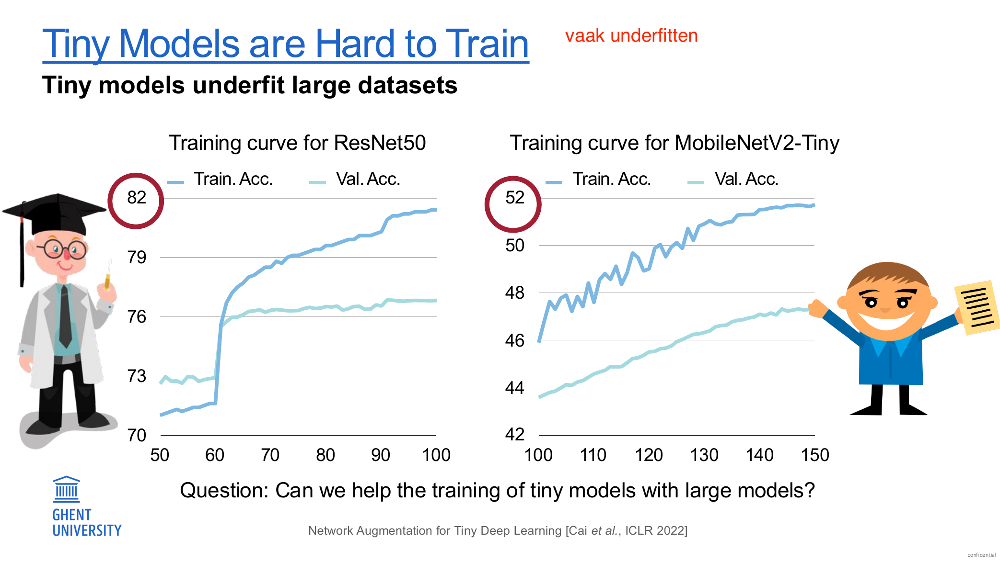

Hier zie je *waarom* tiny modellen extra hulp nodig hebben. Links de trainingscurve van **ResNet50** (groot): train- en validation-accuracy lopen mooi op, tot ~82 % / ~76 %. Rechts **MobileNetV2-Tiny** (klein): beide curves blijven veel lager hangen (~52 % / ~47 %), en — cruciaal — **ook de train-accuracy blijft laag**.

> 📝 **jouw notitie:** vaak underfitten

Dat is exact het punt. Bij grote modellen is overfitting het gevaar (train ≫ val); bij tiny modellen is het omgekeerde aan de hand: het model heeft **te weinig capaciteit om zelfs de trainingsset goed te passen** → **underfitting**. Meer regularisatie (dropout, augmentation) zou hier dus net schaden — daar komen we in DEEL 4 op terug. De vraag onderaan: *"Can we help the training of tiny models with large models?"*

---

# DEEL 2 — Wat is Knowledge Distillation?

## 2.1 Het basisidee: teacher → student

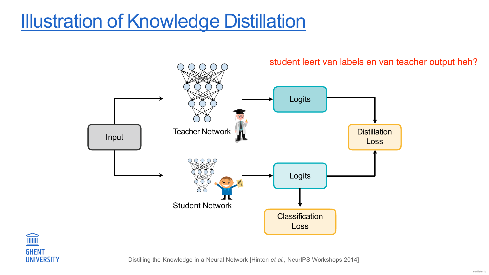

De opstelling van **knowledge distillation** (Hinton et al., NeurIPS Workshops 2014):

- Een grote, reeds getrainde **teacher** en een kleine **student** krijgen **dezelfde input**.
- Beide produceren **logits** (de ruwe output vóór de softmax).
- De student wordt op **twee** dingen getraind tegelijk:
  1. de **classification loss** — verschil tussen de student-output en het **echte label** (zoals altijd);
  2. de **distillation loss** — verschil tussen de student-output en de **teacher-output**.

> 📝 **jouw notitie:** student leert van labels en van teacher output heh?

Klopt precies. Dat is de hele kern: de student leert niet alleen *wat* het juiste antwoord is (het harde label), maar ook *hoe de teacher erover denkt* (de zachte verdeling over alle klassen). De teacher staat hier vast — die wordt niet meer bijgetraind.

## 2.2 De intuïtie: waarom is de teacher-output waardevoller dan het label?

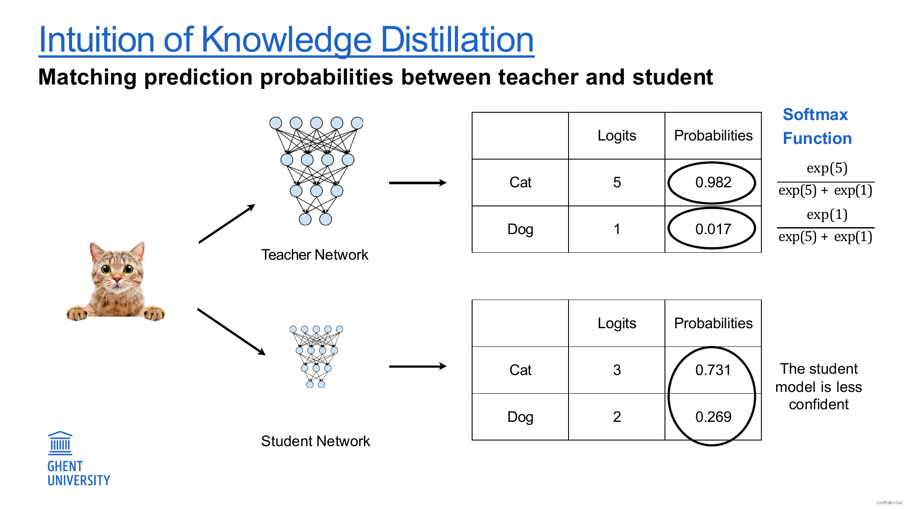

Bekijk een foto van een kat. Het **echte label** is keihard: kat = 1, alle andere = 0. Maar de teacher geeft via de **softmax** een hele verdeling:

$$\text{softmax}: \quad p_i = \frac{\exp(z_i)}{\sum_j \exp(z_j)}$$

In het voorbeeld: teacher-logits Cat = 5, Dog = 1 → kansen 0.982 en 0.017. De student is minder zelfzeker: logits Cat = 3, Dog = 2 → 0.731 en 0.269.

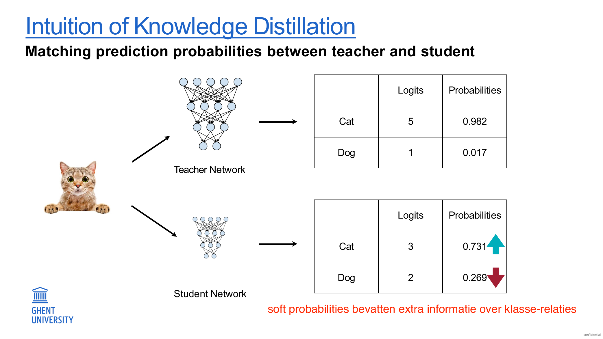

> 📝 **jouw notitie:** soft probabilities bevatten extra informatie over klasse-relaties

Dit is dé sleutel-intuïtie. Een hard label (kat = 1, hond = 0, auto = 0) zegt enkel "het is een kat". Maar de **soft probabilities** van de teacher (kat = 0.85, hond = 0.12, auto = 0.03) zeggen óók: "een kat lijkt een béétje op een hond, en helemaal niet op een auto". Die relatieve verhoudingen tussen de "foute" klassen zijn gratis extra informatie — vaak **dark knowledge** genoemd. De student die deze hele verdeling naleert, krijgt veel rijkere feedback dan uit één 0/1-label, en leert daardoor sneller en beter, zelfs met weinig capaciteit.

## 2.3 Temperatuur: de verdeling "uitsmeren"

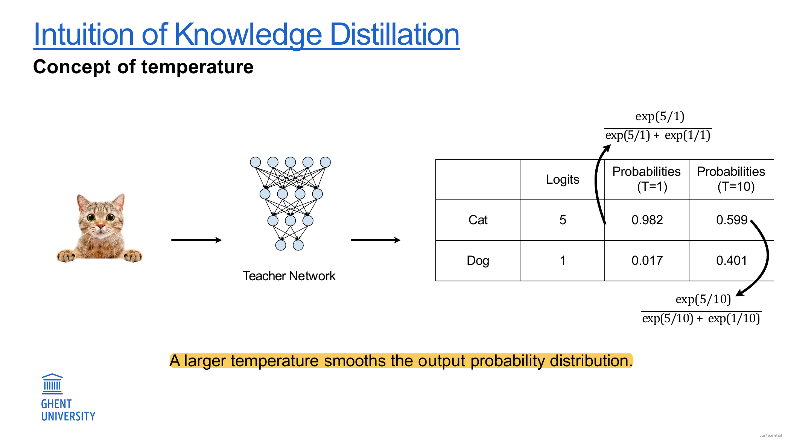

Er is één probleem: als de teacher heel zelfzeker is (0.982 vs 0.017), staat bijna alle informatie in één getal en zijn de relaties tussen de kleine kansen nauwelijks zichtbaar. De **temperatuur T** lost dat op door de logits te delen vóór de softmax:

$$p_i(T) = \frac{\exp(z_i / T)}{\sum_j \exp(z_j / T)}$$

- **T = 1**: gewone softmax (Cat 0.982, Dog 0.017) — scherp.
- **T = 10**: de logits worden door 10 gedeeld vóór de exp, waardoor de verschillen verkleinen → (Cat 0.599, Dog 0.401) — veel **vlakker**.

> Een grotere temperatuur **smoothet** de output-kansverdeling. *(deze zin stond op de slide geaccentueerd)*

Door bij distillatie een hogere T te gebruiken worden de kleine kansen (en dus de klasse-relaties) **uitvergroot**, zodat de student er meer signaal uit haalt. Bij inference zet je T terug op 1.

**Extra context — waarom dit werkt:** voor grote logits gaat de softmax richting een harde one-hot (winner takes all), waarbij alle "dark knowledge" in de bijna-nul-kansen verdwijnt. Delen door T trekt de logits naar elkaar toe, zodat de verhoudingen tussen de niet-winnende klassen weer meetelt in de loss.

## 2.4 Formele definitie

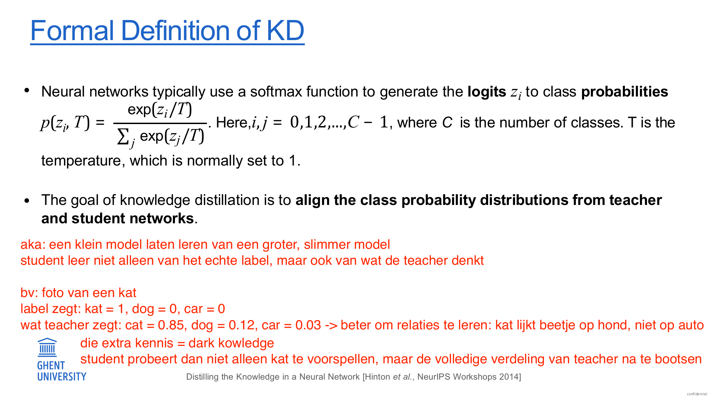

Samengevat in formule-vorm: een netwerk zet logits $z_i$ om naar klassekansen met

$$p(z_i, T) = \frac{\exp(z_i / T)}{\sum_j \exp(z_j / T)}, \qquad i,j = 0,1,\dots,C-1$$

met $C$ het aantal klassen en $T$ de temperatuur (normaal 1). Het **doel van KD** is om de **klassekansverdelingen van teacher en student op elkaar af te stemmen** (align).

> 📝 **jouw notitie:**
> - aka: een klein model laten leren van een groter, slimmer model
> - student leer niet alleen van het echte label, maar ook van wat de teacher denkt
>
> - bv: foto van een kat
> - label zegt: kat = 1, dog = 0, car = 0
> - wat teacher zegt: cat = 0.85, dog = 0.12, car = 0.03 -> beter om relaties te leren: kat lijkt beetje op hond, niet op auto
> - die extra kennis = dark kowledge
> - student probeert dan niet alleen kat te voorspellen, maar de volledige verdeling van teacher na te bootsen

Je notitie vat de hele eerste helft van het college perfect samen: het is niet de bedoeling dat de student alleen "kat" voorspelt, maar dat hij de **volledige zachte verdeling van de teacher reproduceert** — daar zit de dark knowledge.

---

# DEEL 3 — What to match?

Tot nu matchten we de **output-logits**. Maar een teacher bevat veel meer kennis dan alleen zijn eindoutput. Dit deel overloopt *welke* signalen je nog allemaal van teacher naar student kan overdragen.

## 3.1 Matching output logits (de standaard)

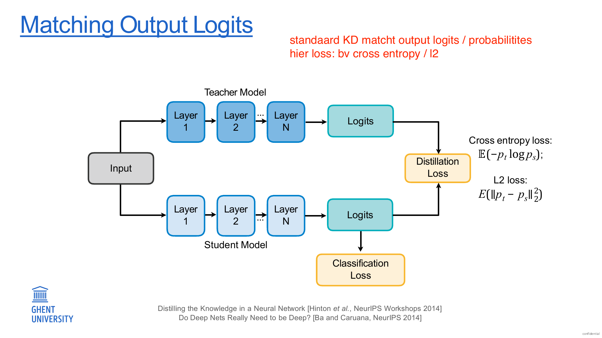

De klassieke variant: laat de student-logits de teacher-logits matchen via de **distillation loss**, naast de gewone **classification loss** op het echte label.

> 📝 **jouw notitie:** standaard KD matcht output logits / probabilities — hier loss: bv cross entropy / l2

De twee gangbare keuzes voor de distillation loss (met $p_t, p_s$ de teacher/student-kansen):

- **Cross-entropy loss:** $\mathbb{E}(-p_t \log p_s)$ — meet hoe goed de student-verdeling de teacher-verdeling reproduceert.
- **L2 loss:** $\mathbb{E}(\lVert p_t - p_s \rVert_2^2)$ — gewoon het kwadratische verschil tussen beide verdelingen.

(Referenties: Hinton et al. 2014; Ba & Caruana, *Do Deep Nets Really Need to be Deep?*, NeurIPS 2014.)

## 3.2 Matching intermediate weights (FitNets)

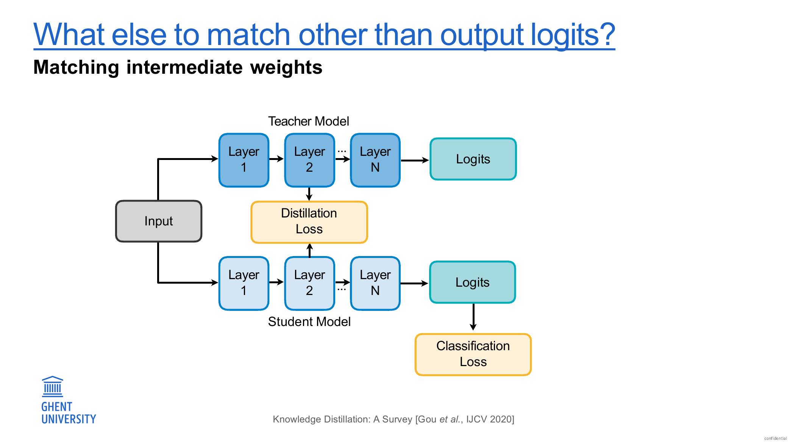

In plaats van (of naast) de output kun je een **tussenliggende laag** van de student laten lijken op een tussenlaag van de teacher. De distillation loss hangt dan in het *midden* van beide netwerken.

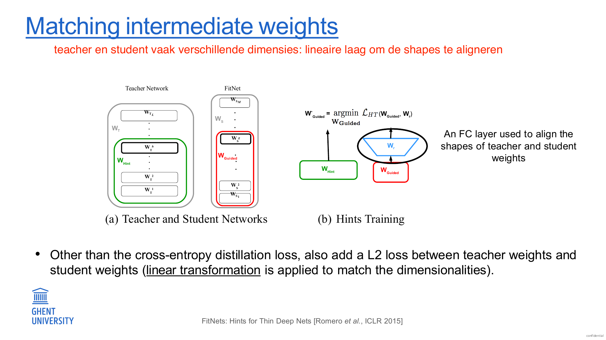

Dit is **FitNets** (Romero et al., ICLR 2015). De teacher heeft een **hint layer** ($W_{Hint}$), de student een **guided layer** ($W_{Guided}$). Je traint de student-laag zo dat hij de teacher-laag benadert.

> 📝 **jouw notitie:** teacher en student vaak verschillende dimensies: lineaire laag om de shapes te alignen

Exact het praktische probleem dat FitNets oplost. Teacher en student hebben meestal **verschillende dimensies** (de student is smaller), dus je kan de twee feature-tensoren niet zomaar vergelijken. De oplossing: een extra **FC-laag $W_r$** (een lineaire transformatie) die de student-output omvormt naar de vorm van de teacher, zodat de L2-loss tussen beide wél kan worden berekend. Bovenop de cross-entropy distillation loss komt er dus een **L2-loss tussen de (getransformeerde) gewichten/features**.

## 3.3 Matching intermediate features

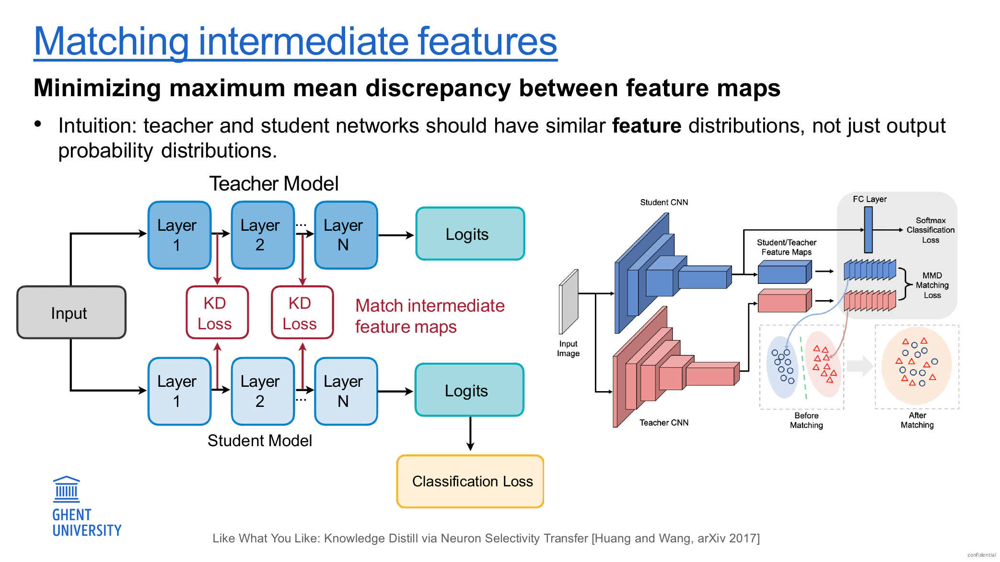

Variant op het vorige: niet de gewichten, maar de **feature maps** (de activaties) van tussenlagen op elkaar afstemmen. **Intuïtie:** als teacher en student dezelfde dingen "zien", zouden hun feature-verdelingen op elkaar moeten lijken, niet enkel hun eindoutput.

De gebruikte maat is **Maximum Mean Discrepancy (MMD)**: een afstandsmaat tussen twee verdelingen. Je minimaliseert de MMD tussen de feature maps van student en teacher op meerdere lagen (KD-loss per laag). Visueel (rechts): vóór matching liggen de student- en teacher-features uit elkaar, na matching overlappen ze. (Huang & Wang, *Like What You Like: Knowledge Distill via Neuron Selectivity Transfer*, arXiv 2017.)

## 3.4 Matching intermediate attention maps (gradients)

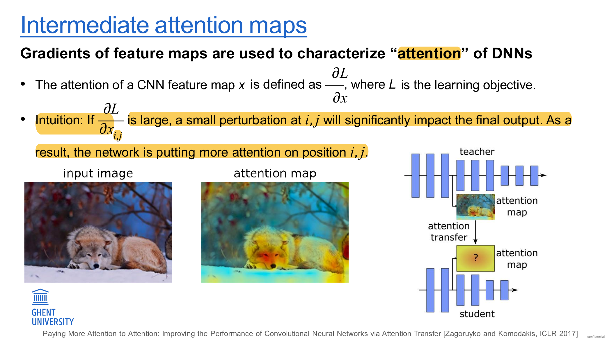

Een rijker signaal: de **attention** van het netwerk, gedefinieerd via de **gradiënt** van de leerobjective $L$ naar een feature map $x$:

$$\text{attention} = \frac{\partial L}{\partial x}$$

**Intuïtie:** als $\frac{\partial L}{\partial x_{i,j}}$ **groot** is, dan zou een kleine verandering op positie $(i,j)$ de output sterk beïnvloeden — het netwerk "let" daar dus sterk op. De attention map geeft visueel weer wáár in het beeld het netwerk naar kijkt (in het voorbeeld: de vorm van het dier licht op).

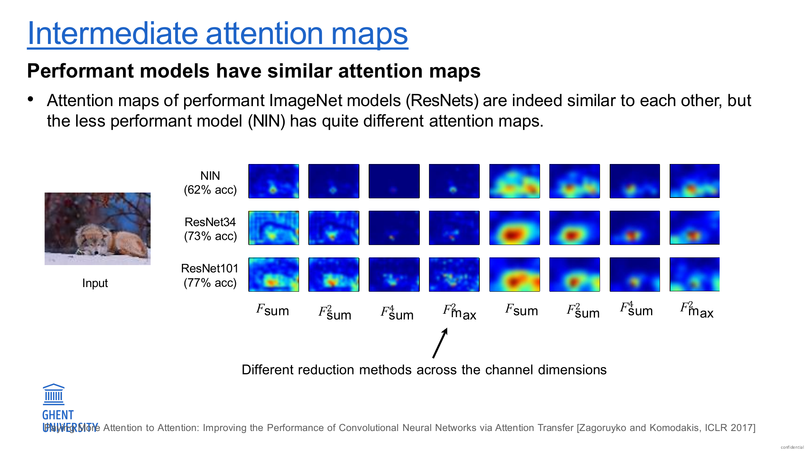

**Waarom is dit een nuttig distillatie-signaal?** Omdat sterke modellen op elkaar lijken in *waar ze naar kijken*. De attention maps van performante ImageNet-modellen (ResNet34 73 %, ResNet101 77 %) lijken sterk op elkaar, terwijl een zwak model (NIN, 62 %) heel andere maps heeft. Als je student de attention maps van een sterke teacher overneemt, duw je hem dus richting "kijken zoals een goed model". (De kolommen $F_{sum}$, $F^2_{sum}$, … zijn verschillende manieren om over de kanaal-dimensie te reduceren tot één 2D-map.)

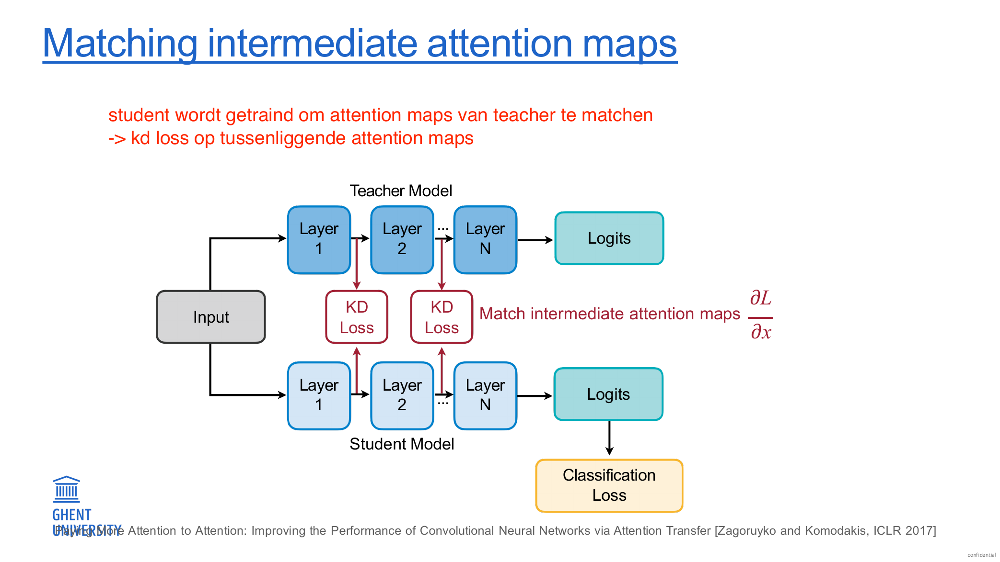

> 📝 **jouw notitie:** student wordt getraind om attention maps van teacher te matchen -> kd loss op tussenliggende attention maps

Precies: een KD-loss op de tussenliggende attention maps ($\partial L / \partial x$) op meerdere lagen, naast de gewone classification loss. (Zagoruyko & Komodakis, *Paying More Attention to Attention*, ICLR 2017.)

## 3.5 Matching sparsity patterns

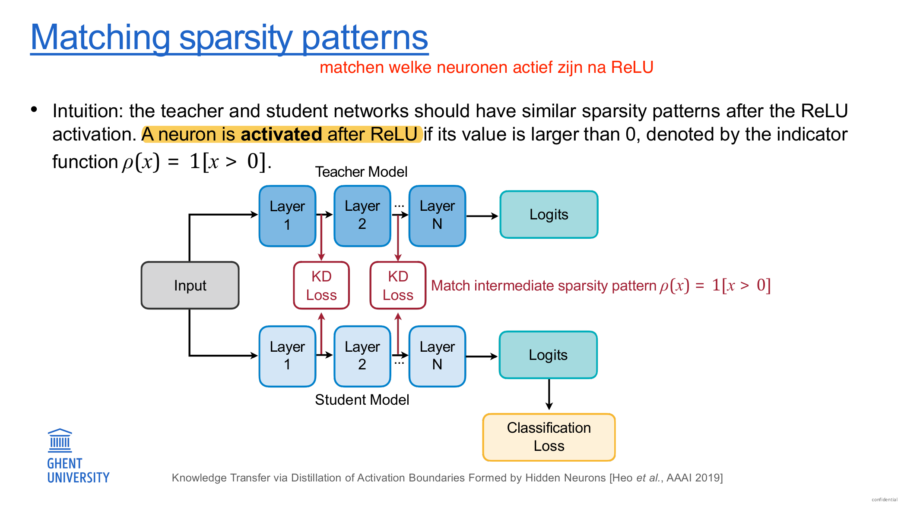

Nóg een signaal: welke **neuronen actief zijn** na de ReLU. Een neuron is "geactiveerd" als zijn waarde > 0, weergegeven door de indicator-functie:

$$\rho(x) = \mathbb{1}[x > 0]$$

**Intuïtie:** teacher en student zouden na de ReLU een gelijkaardig **sparsity-patroon** moeten hebben (dezelfde neuronen aan/uit).

> 📝 **jouw notitie:** matchen welke neuronen actief zijn na ReLU

Juist — je matcht niet de exacte waardes maar het binaire aan/uit-patroon $\rho(x)$ tussen teacher en student, via een KD-loss op de tussenlagen. (Heo et al., *Knowledge Transfer via Distillation of Activation Boundaries*, AAAI 2019.)

## 3.6 Matching relational information

Tot hier matchten we, per input, een grootheid van student en teacher. **Relational KD** gaat een niveau hoger: het matcht *relaties* — tussen lagen, of tussen verschillende samples.

### Relaties tussen lagen

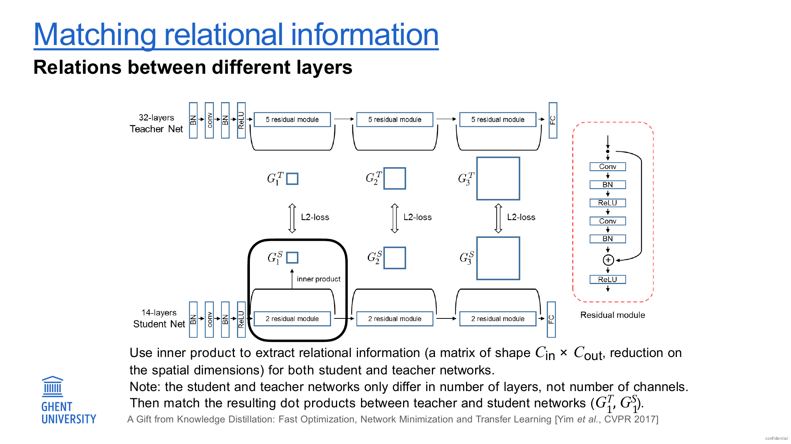

Hier neem je het **inner product** tussen feature maps van verschillende lagen (een matrix van vorm $C_{in} \times C_{out}$, met reductie over de spatiale dimensies — in feite een Gram-matrix die beschrijft *hoe de lagen onderling samenhangen*). Je berekent die relatie-matrix $G$ voor zowel teacher ($G^T$) als student ($G^S$) en matcht ze met een **L2-loss** ($G_1^T \leftrightarrow G_1^S$, enz.).

Belangrijk detail: hier verschillen teacher (32 lagen) en student (14 lagen) enkel in het **aantal lagen**, niet in het aantal kanalen — daardoor hebben de $G$-matrices dezelfde vorm en zijn ze vergelijkbaar. (Yim et al., *A Gift from Knowledge Distillation*, CVPR 2017.)

### Relaties tussen samples

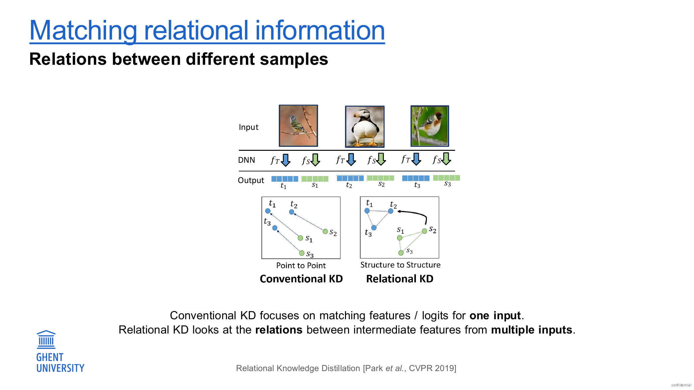

Het verschil mooi in beeld:
- **Conventional KD** = *point to point*: voor **één input** matcht de student het teacher-punt.
- **Relational KD** = *structure to structure*: kijk naar de **onderlinge relaties** tussen de features van **meerdere inputs** en match die structuur.

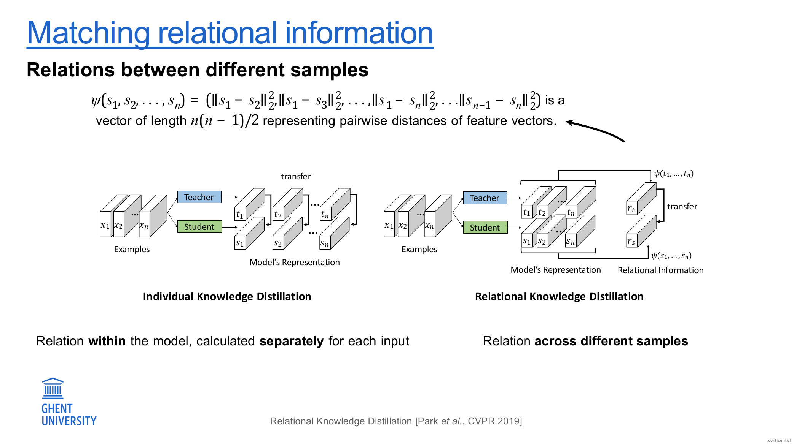

Concreet: voor $n$ samples bereken je de vector van alle **paarsgewijze afstanden** tussen de feature-vectoren:

$$\psi(s_1, \dots, s_n) = \big(\lVert s_1 - s_2\rVert_2^2,\ \lVert s_1 - s_3\rVert_2^2,\ \dots,\ \lVert s_{n-1} - s_n\rVert_2^2\big)$$

een vector van lengte $n(n-1)/2$. Je berekent $\psi$ voor teacher én student en matcht die. De student leert zo niet de absolute features, maar **hoe de samples zich tot elkaar verhouden** in de feature-ruimte. (Park et al., *Relational Knowledge Distillation*, CVPR 2019.)

---

# DEEL 4 — Self & online distillation

## 4.1 Het nadeel van een vaste grote teacher

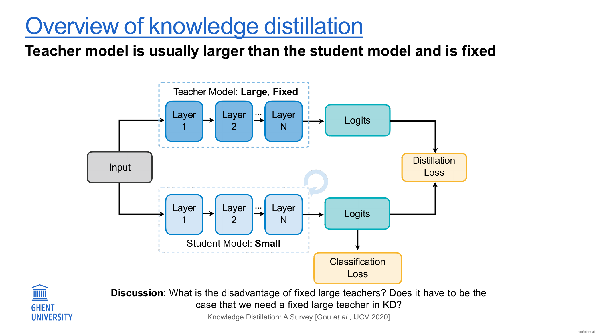

In alle vorige varianten was de teacher **groot en vast** (large, fixed). De discussievraag op de slide: *"What is the disadvantage of fixed large teachers? Does it have to be the case that we need a fixed large teacher in KD?"*

**Nadelen van een vaste grote teacher:** je moet eerst een groot model trainen (duur), je hebt het nodig tijdens elke student-training (geheugen/rekenkost), en je bent afhankelijk van zijn beschikbaarheid en kwaliteit. De volgende technieken laten zien dat het **anders kan**: zonder aparte grote teacher.

## 4.2 Self-distillation: Born-Again Networks

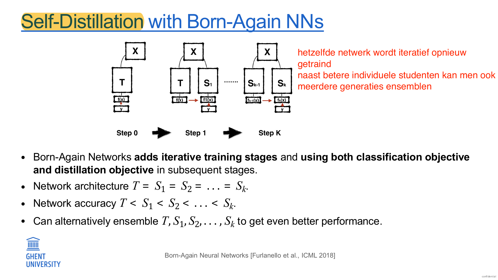

Bij **self-distillation** is er geen apart groot model: het netwerk distilleert in zichzelf.

> 📝 **jouw notitie:**
> - hetzelfde netwerk wordt iteratief opnieuw getraind
> - naast betere individuele studenten kan men ook meerdere generaties ensemblen

**Born-Again Networks** (Furlanello et al., ICML 2018) werkt zo: train eerst een model $T$ normaal (Step 0). Train dan een **identiek** model $S_1$ dat als teacher het zonet getrainde $T$ gebruikt (classification loss + distillation loss). Herhaal: $S_2$ leert van $S_1$, enz. Kenmerkend:

- **Architectuur:** $T = S_1 = S_2 = \dots = S_k$ (allemaal hetzelfde net).
- **Accuracy:** $T < S_1 < S_2 < \dots < S_k$ — elke generatie wordt een tikje beter, puur door zichzelf als teacher te gebruiken.

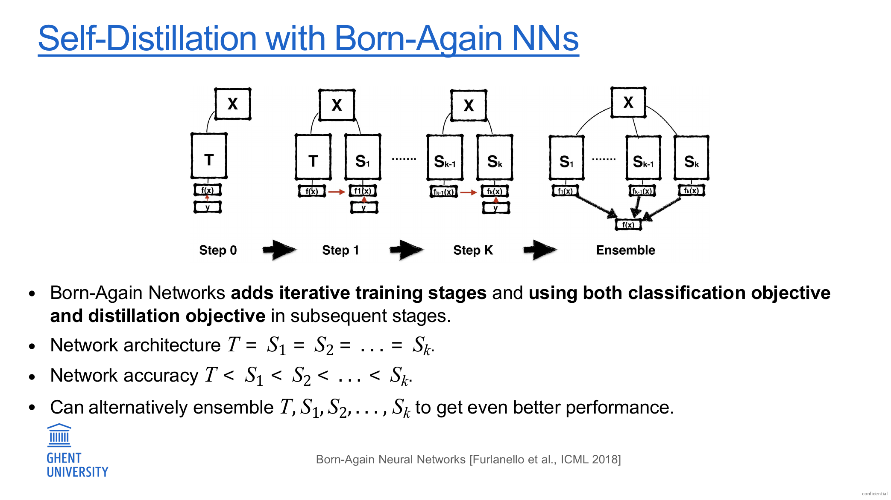

En, zoals je noteerde: je kan de generaties ook **ensemblen** ($T, S_1, \dots, S_k$ samen) voor nog betere prestaties.

## 4.3 Online distillation: Deep Mutual Learning

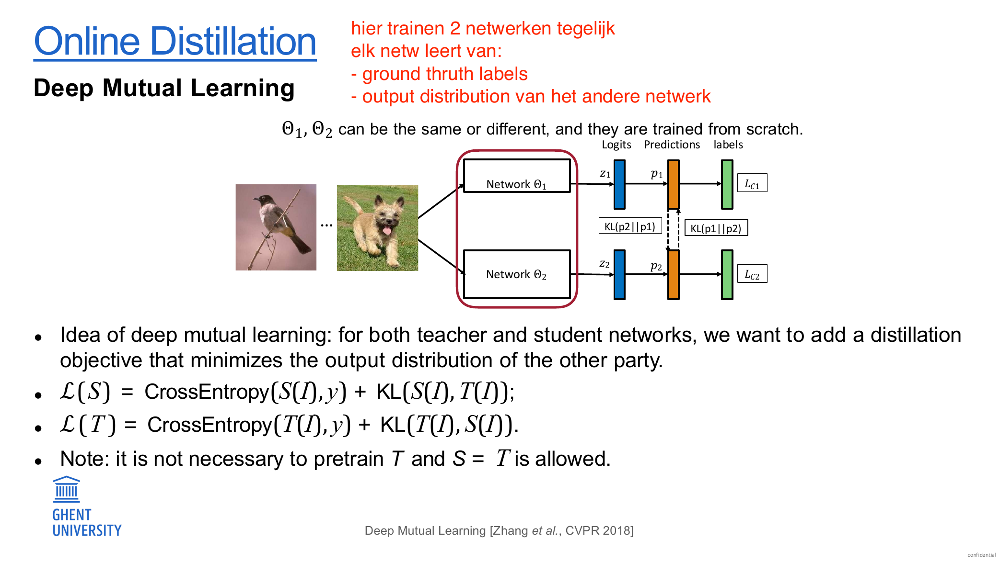

Bij **online distillation** train je niet eerst de teacher en daarna de student, maar **alles tegelijk**.

> 📝 **jouw notitie:**
> hier trainen 2 netwerken tegelijk. elk netw leert van:
> - ground thruth labels
> - output distribution van het andere netwerk

**Deep Mutual Learning** (Zhang et al., CVPR 2018): twee netwerken $\Theta_1$ en $\Theta_2$ worden **from scratch** samen getraind. Elk netwerk heeft twee loss-termen — de classification loss op het echte label, plus een distillation-term (KL-divergentie) die zijn output naar dat van het andere netwerk trekt:

$$\mathcal{L}(S) = \text{CrossEntropy}(S(I), y) + \text{KL}(S(I), T(I))$$
$$\mathcal{L}(T) = \text{CrossEntropy}(T(I), y) + \text{KL}(T(I), S(I))$$

De rollen zijn symmetrisch: er is geen "echte" teacher, beide netwerken zijn elkaars teacher én student. Geen voorgetraind model nodig, en zelfs $S = T$ (gelijke architectuur) mag.

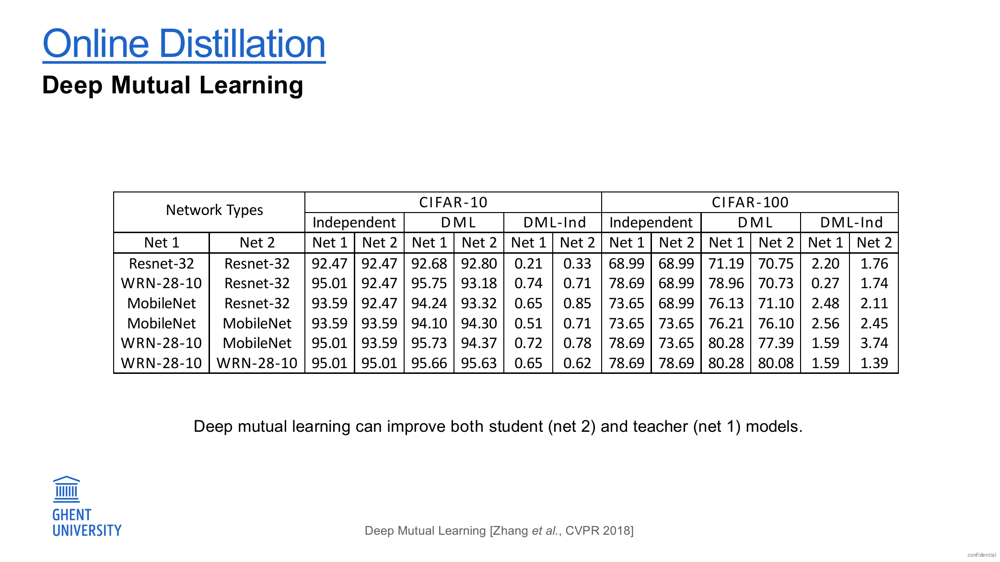

De resultatentabel toont het mooie: **deep mutual learning verbetert beide netwerken** (zowel "net 1" als "net 2") tegenover onafhankelijk trainen — ook als beide dezelfde architectuur hebben. Twee modellen die samen leren, doen het beter dan elk apart.

## 4.4 Combinatie: Be Your Own Teacher

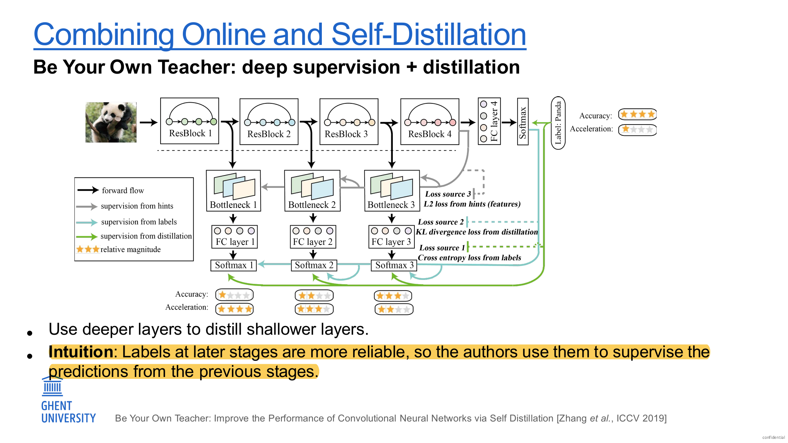

**Be Your Own Teacher** (Zhang et al., ICCV 2019) combineert self- en online distillation *binnen één netwerk*. Je hangt aan elke ResBlock een eigen tussen-classifier (met bottleneck + FC + softmax), en de **diepere lagen distilleren de ondiepere**. Er zijn drie loss-bronnen per tussen-classifier:
1. cross-entropy loss van de labels,
2. KL-divergentie loss van de distillatie (diepere → ondiepere),
3. L2-loss van de hints (features).

> **Intuïtie:** voorspellingen in latere stadia zijn betrouwbaarder, dus gebruikt men die om de voorspellingen van de vroegere stadia te superviseren. *(geaccentueerd op de slide)*

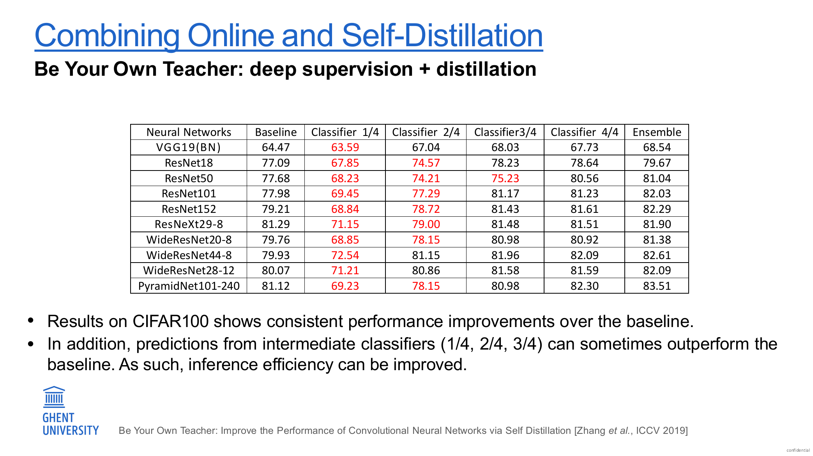

Resultaten op CIFAR100: consistente verbetering t.o.v. de baseline voor alle netwerken. Bonus: de tussen-classifiers (1/4, 2/4, 3/4 van het netwerk) kunnen soms al de baseline evenaren → je kan **vroeger stoppen met rekenen** (early exit) en zo de **inference-efficiëntie** verhogen.

---

# DEEL 5 — Network Augmentation

## 5.1 De conventionele aanpak: regularisatie tegen overfitting

De klassieke trucs om generalisatie te verbeteren, bestrijden allemaal **overfitting** — ze maken de trainingstaak *moeilijker* of het netwerk *minder zeker*, zodat een groot model niet de trainingsset vanbuiten leert.

**Data augmentation** — varieer de trainingsdata kunstmatig:

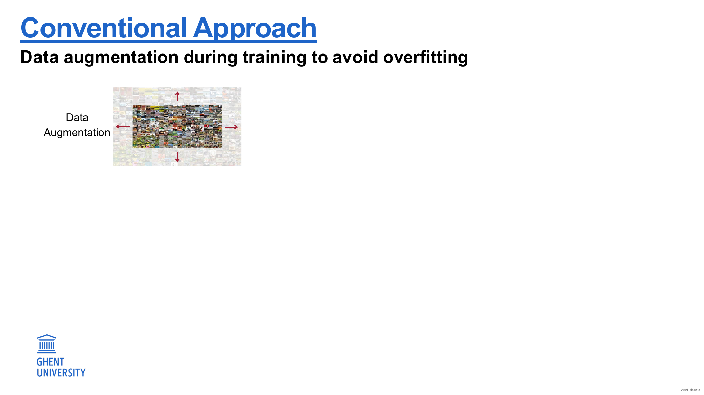

- **Cutout** — knip een blok uit de afbeelding weg (DeVries et al., 2017).

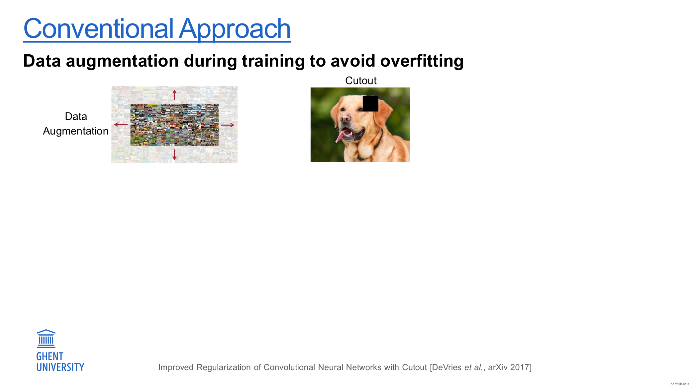

- **Mixup** — meng twee afbeeldingen (en hun labels) lineair, bv. λ = 0.5 → label [0.5, 0.5] (Zhang et al., ICLR 2018).

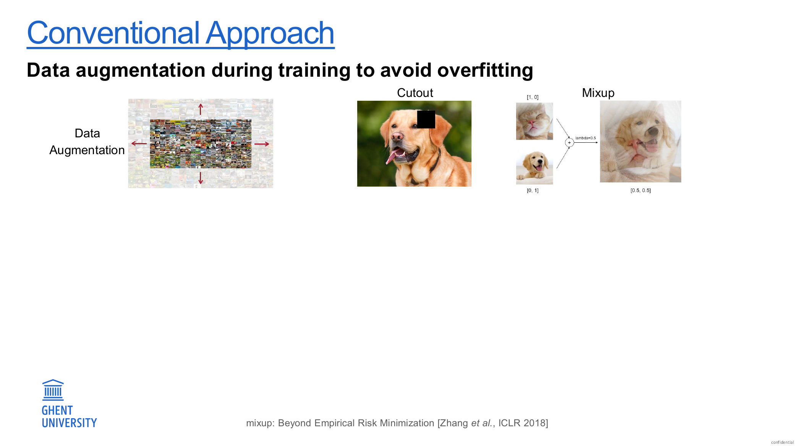

- **AutoAugment** — laat een algoritme de beste augmentatie-policies leren (Cubuk et al., CVPR 2019).

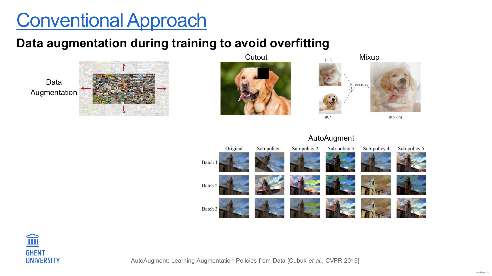

**Dropout** — zet tijdens training willekeurig neuronen uit, zodat het netwerk niet op enkele neuronen leunt:

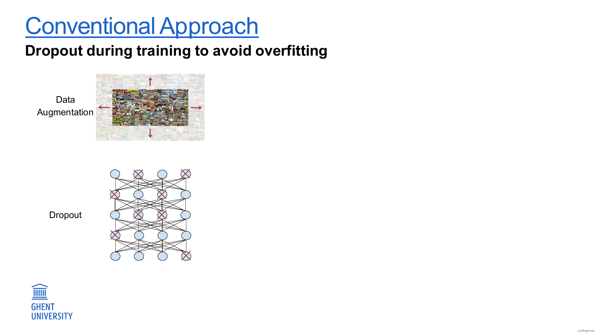

- **SpatialDropout** — drop hele feature-kanalen i.p.v. losse neuronen (Tompson et al., CVPR 2015).

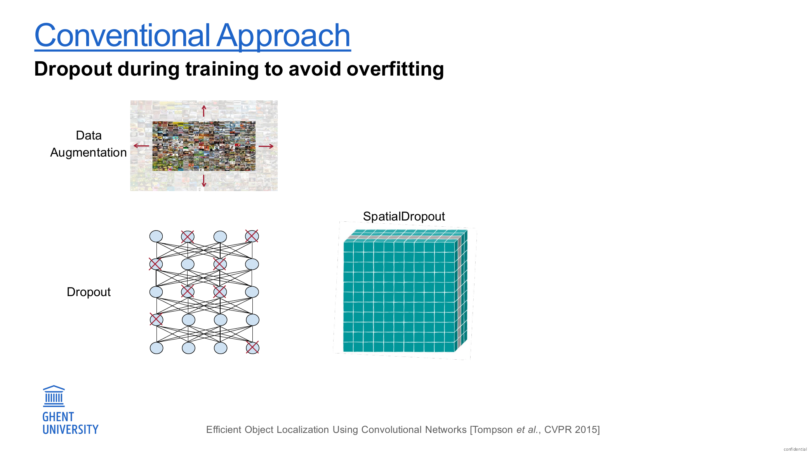

- **DropBlock** — drop aaneengesloten *blokken* in de feature map (Ghiasi et al., NeurIPS 2018).

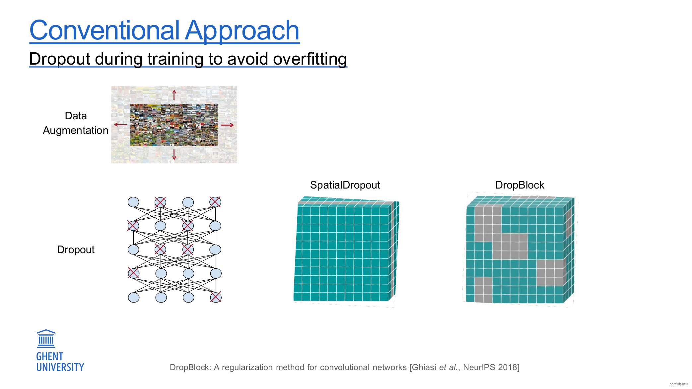

## 5.2 Het probleem: regularisatie schaadt tiny modellen

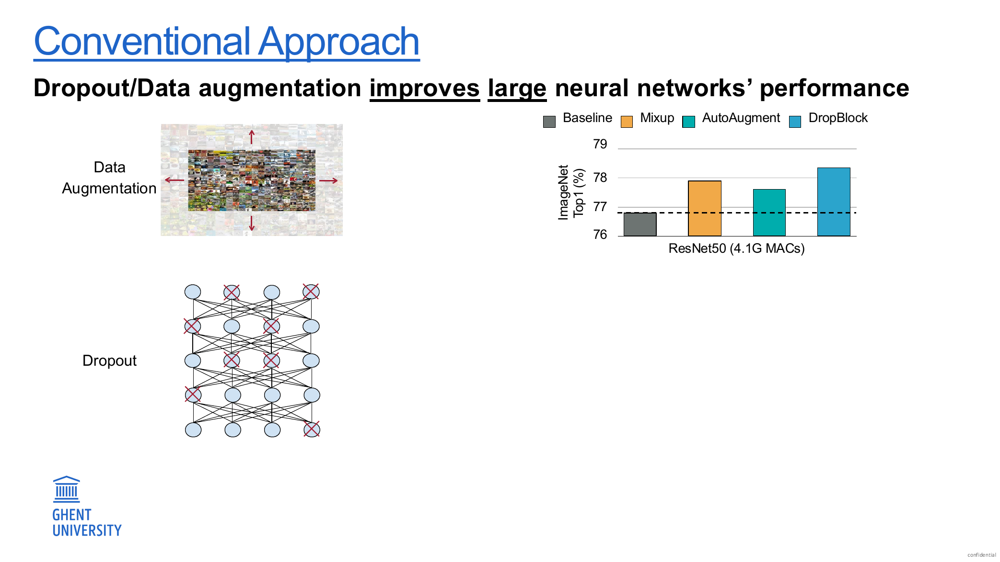

Voor een **groot** model (ResNet50, 4.1G MACs) werken al deze trucs prima: Mixup, AutoAugment en DropBlock liggen **boven** de baseline op ImageNet.

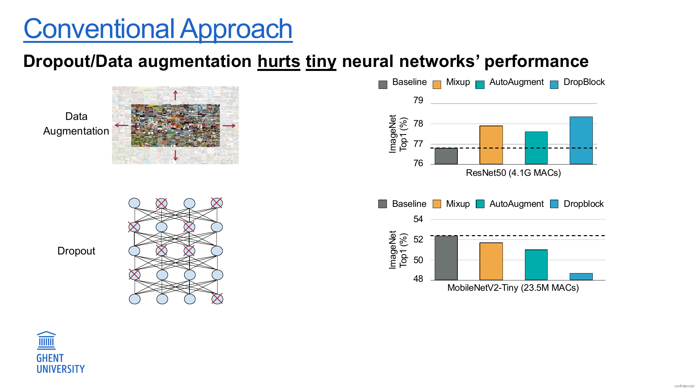

Maar voor een **tiny** model (MobileNetV2-Tiny, 23.5M MACs) gebeurt het omgekeerde: Mixup, AutoAugment en DropBlock liggen **onder** de baseline. Regularisatie **schaadt** hier.

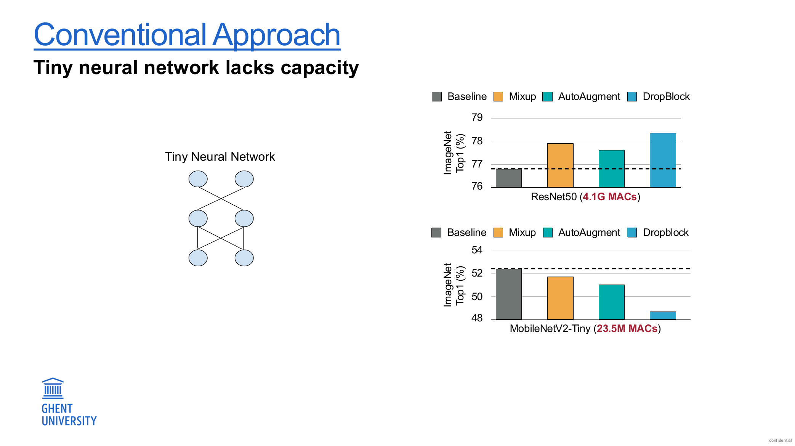

**Waarom?** Een tiny netwerk **mist capaciteit** — het underfit al (zie DEEL 1). Het probleem is *niet* overfitting, dus technieken die de taak nóg moeilijker maken (data augmentation) of het netwerk nóg minder zeker maken (dropout) duwen het verder de verkeerde richting uit. Tiny modellen hebben het **omgekeerde** nodig: méér signaal, niet minder.

## 5.3 De oplossing: Network Augmentation (NetAug)

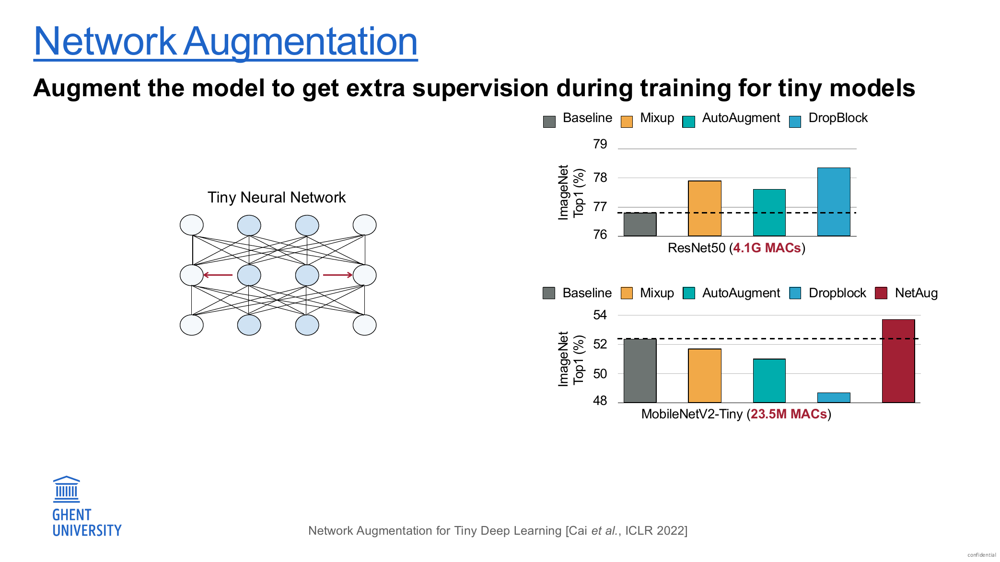

**Network Augmentation** (Cai et al., ICLR 2022) draait het idee om: in plaats van de **data** te augmenteren (om overfitting te bestrijden), augmenteer je het **model** (om underfitting te bestrijden). Het idee: geef het tiny model tijdens training **extra supervisie** door het tijdelijk in te bedden in een groter netwerk. Onderaan zie je dat NetAug (rode balk) als enige *boven* de baseline uitkomt voor MobileNetV2-Tiny.

### Hoe NetAug traint

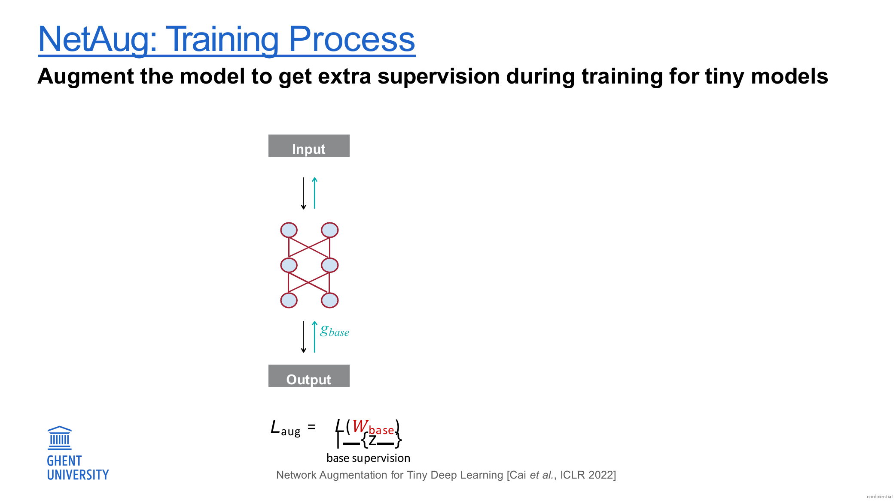

Start met het tiny model met gewichten $W_{base}$. De gewone loss is de **base supervision**:

$$L_{aug} = L(W_{base})$$

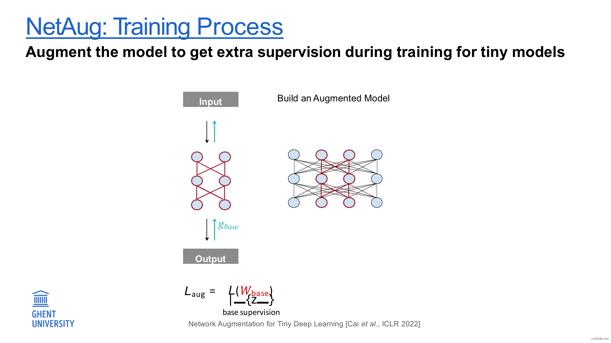

Nu bouw je rond dat tiny model een **augmented (breder) model**: het tiny model is een **subset** van een groter netwerk met extra gewichten $W_{aug}$. De kerngedachte: de tiny gewichten $W_{base}$ worden **gedeeld** — ze zitten zowel in het tiny model als ingebed in het brede model.

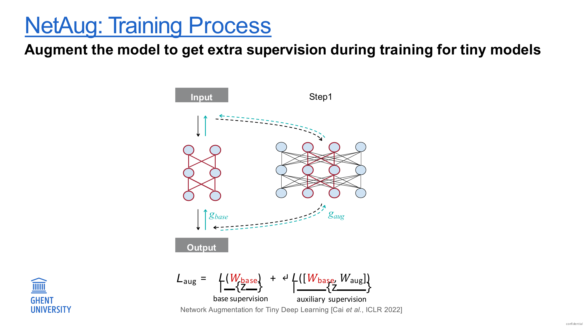

De totale loss krijgt er een **auxiliary supervision** term bij, berekend via het augmented model:

$$L_{aug} = \underbrace{L(W_{base})}_{\text{base supervision}} + \underbrace{L([W_{base}, W_{aug}])}_{\text{auxiliary supervision}}$$

Bij elke trainingsstap sample je een ander breder sub-netwerk (Step 1, 2, 3, …) rond het tiny model. De gradiënt van die brede modellen ($g_{aug}$) stroomt mee terug naar de **gedeelde** $W_{base}$, bovenop de gewone gradiënt ($g_{base}$). Het tiny model krijgt zo extra leersignaal van zijn bredere "begeleiders" — precies de extra capaciteit/supervisie die het mist. **Bij inference gebruik je enkel het tiny model** ($W_{base}$); het brede deel is alleen een trainings-hulpmiddel.

**Extra context — verschil met dropout/KD:** dropout *verwijdert* tijdens training capaciteit (slecht voor tiny), terwijl NetAug *toevoegt* via gedeelde gewichten. En anders dan KD heb je geen voorgetrainde teacher nodig — het bredere model wordt mee getraind en weggegooid.

### NetAug: resultaten

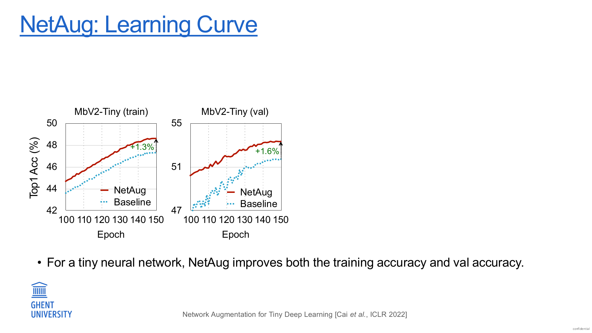

Voor een tiny netwerk (MobileNetV2-Tiny) verbetert NetAug **zowel de train- als de validation-accuracy** (+1.3 % / +1.6 %) — bevestiging dat het underfitting aanpakt (de train-accuracy gaat *omhoog*, het tegenovergestelde van regularisatie).

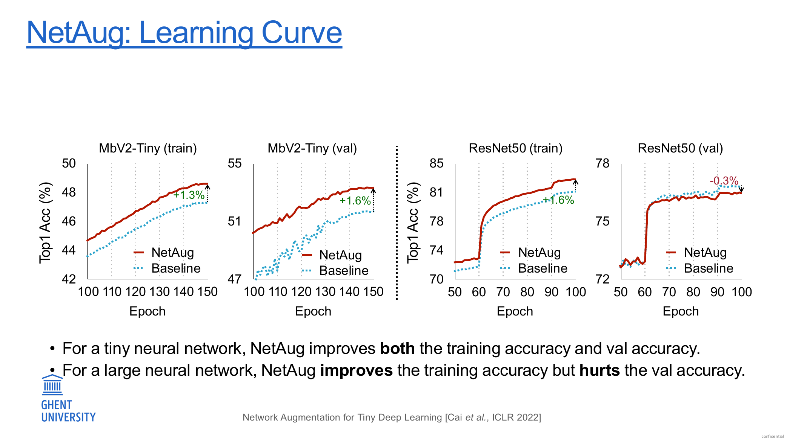

Voor een **groot** netwerk (ResNet50) verbetert NetAug de train-accuracy wel, maar **schaadt** het de val-accuracy (−0.3 %). Logisch: een groot model heeft geen extra capaciteit nodig en gaat dan juist overfitten. **NetAug is dus specifiek een techniek voor tiny modellen.**

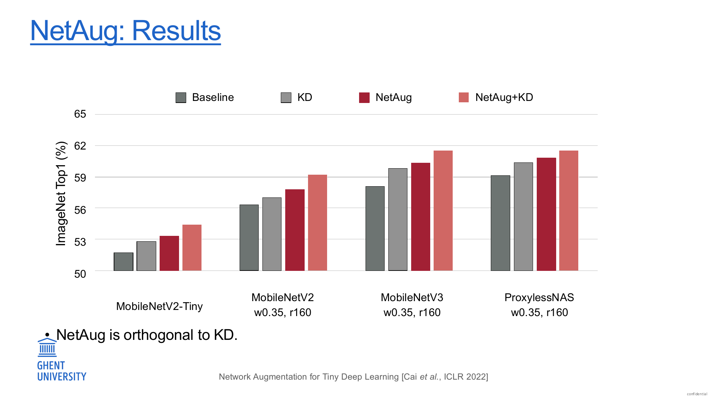

NetAug is **orthogonaal aan KD**: ze verbeteren onafhankelijk van elkaar, en **NetAug + KD samen** geeft het beste resultaat over MobileNetV2-Tiny, MobileNetV2, MobileNetV3 en ProxylessNAS. Je kan beide tegelijk inzetten.

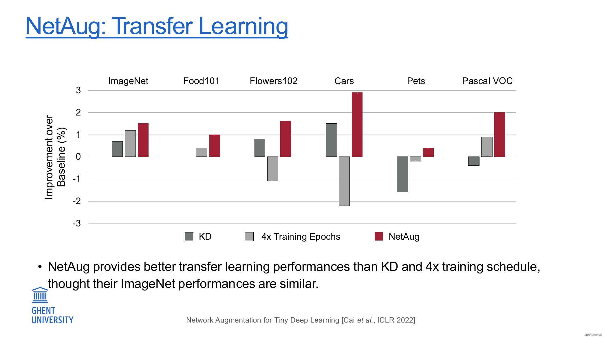

NetAug geeft ook **betere transfer learning** dan KD en dan simpelweg 4× langer trainen (Food101, Flowers102, Cars, Pets, Pascal VOC), ook al zijn de pure ImageNet-scores vergelijkbaar.

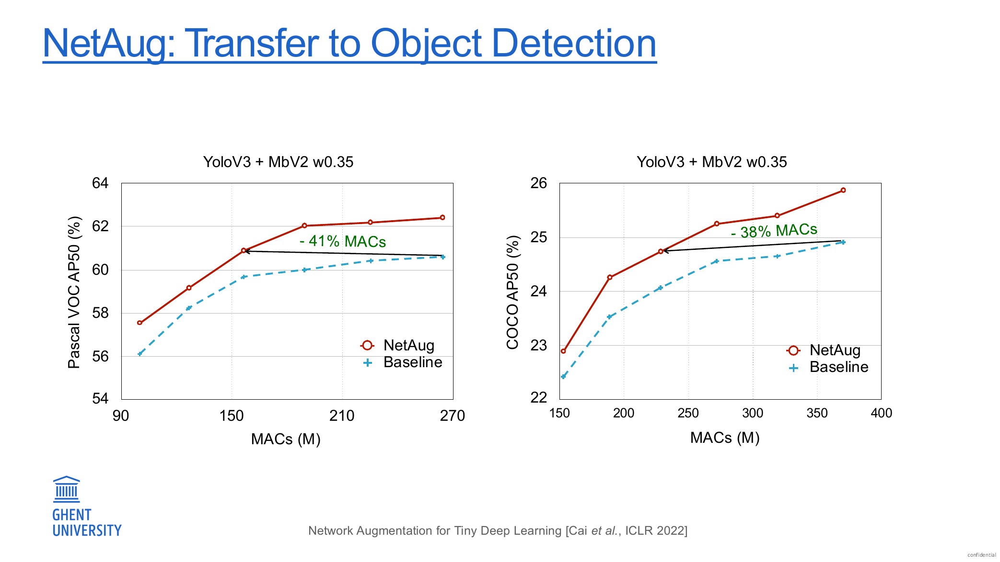

En het transfereert naar **object detection** (YoloV3 + MobileNetV2): bij gelijke accuracy bespaart NetAug **−41 % MACs** (Pascal VOC) en **−38 % MACs** (COCO) — een fors efficiëntievoordeel op de edge.

---

# 🔑 Kernpunten om te onthouden

1. **KD = trainingstechniek, geen compressietechniek**: de student-architectuur blijft gelijk; je traint hem beter door hem te laten meekijken met een teacher. KD is daarom de brug van *efficient inference* naar *efficient training*.
2. **Tiny modellen underfitten** (te weinig capaciteit) — niet overfitten. Daarom hebben ze méér signaal nodig, niet meer regularisatie.
3. **Dark knowledge**: de **soft probabilities** van de teacher bevatten extra info over **klasse-relaties** (kat lijkt op hond, niet op auto). De student leert die hele verdeling na, niet enkel het harde 0/1-label.
4. **Temperatuur T** in de softmax ($\exp(z_i/T)/\sum_j \exp(z_j/T)$) **smoothet** de verdeling: een grotere T vergroot de kleine kansen uit zodat de klasse-relaties beter zichtbaar zijn voor distillatie. Bij inference: T = 1.
5. **Twee losses bij standaard KD**: classification loss (op het echte label) + distillation loss (op de teacher-output), die laatste als **cross-entropy** $\mathbb{E}(-p_t\log p_s)$ of **L2** $\mathbb{E}(\lVert p_t-p_s\rVert_2^2)$.
6. **What to match** — je kan veel meer dan de output overdragen: output logits, intermediate weights (FitNets, met een **lineaire laag om verschillende shapes te aligneren**), intermediate features (MMD), attention maps (gradiënt $\partial L/\partial x$), sparsity patterns ($\rho(x)=\mathbb{1}[x>0]$), en relational information (paarsgewijze afstanden $\psi$ tussen samples).
7. **Relational KD** = structuur-tot-structuur i.p.v. punt-tot-punt: match de *relaties* tussen meerdere samples, niet de absolute features per sample.
8. **Self-distillation (Born-Again)**: hetzelfde netwerk iteratief hertrainen met zichzelf als teacher → elke generatie iets beter ($T < S_1 < S_2 < \dots$); generaties kunnen ge-ensembled worden.
9. **Online distillation (Deep Mutual Learning)**: twee netwerken from scratch samen trainen, elk leert van de labels én van elkaars output (KL) → beide verbeteren. Geen voorgetrainde teacher nodig.
10. **Be Your Own Teacher** combineert beide binnen één netwerk (deep supervision + distillation): diepere lagen superviseren ondiepere; tussen-classifiers laten early exit toe.
11. **Network Augmentation (NetAug)** bestrijdt **underfitting** door het **model** te augmenteren (i.p.v. de data): bed het tiny model in als gedeelde subset van bredere modellen en voeg een **auxiliary supervision**-term toe. Werkt enkel voor **tiny** modellen (schaadt grote), is **orthogonaal aan KD**, en bespaart fors MACs bij transfer.

---

# 📝 Oefenvragen

**V1.** Waarom is de zachte output van een teacher informatiever voor de student dan het harde label? Gebruik de term *dark knowledge*.

Antwoord

Een hard label (kat = 1, rest = 0) zegt enkel de juiste klasse. De zachte teacher-verdeling (kat = 0.85, hond = 0.12, auto = 0.03) bevat daarnaast de **relaties tussen de klassen** — een kat lijkt een beetje op een hond, niet op een auto. Die extra info in de niet-winnende kansen heet **dark knowledge**. De student die de volledige verdeling naleert, krijgt rijkere feedback per sample en leert sneller/beter, ook met weinig capaciteit.

**V2.** Wat doet de temperatuur T in $p_i = \exp(z_i/T)/\sum_j \exp(z_j/T)$, en waarom gebruik je T > 1 tijdens distillatie?

Antwoord

T deelt de logits vóór de softmax. Een grotere T trekt de logits naar elkaar toe en **smoothet** de verdeling (bv. 0.982/0.017 bij T=1 → 0.599/0.401 bij T=10). Daardoor worden de kleine kansen — en dus de klasse-relaties / dark knowledge — uitvergroot, zodat de student er meer leersignaal uit haalt. Bij inference zet je T terug op 1.

**V3.** Welke twee loss-termen krijgt de student bij standaard knowledge distillation, en wat meet elk?

Antwoord

(1) **Classification loss** — verschil tussen student-output en het **echte label** (gewone supervised loss). (2) **Distillation loss** — verschil tussen student-output en **teacher-output**, als cross-entropy $\mathbb{E}(-p_t\log p_s)$ of L2 $\mathbb{E}(\lVert p_t-p_s\rVert_2^2)$. De som van beide wordt geminimaliseerd.

**V4.** Bij FitNets (matching intermediate weights) heb je een extra lineaire (FC) laag nodig. Waarom?

Antwoord

Teacher en student hebben meestal **verschillende dimensies** (de student is smaller), dus hun tussenliggende feature-tensoren hebben niet dezelfde vorm en kunnen niet rechtstreeks vergeleken worden. Een extra **FC-laag $W_r$** (lineaire transformatie) vormt de student-features om naar de vorm van de teacher, zodat de L2-loss tussen beide berekend kan worden.

**V5.** Wat is het verschil tussen conventional KD en relational KD?

Antwoord

**Conventional KD** is *point-to-point*: voor één input matcht de student het teacher-punt (features/logits). **Relational KD** is *structure-to-structure*: het matcht de **onderlinge relaties** tussen features van **meerdere** samples (bv. de vector $\psi$ van alle paarsgewijze afstanden $\lVert s_i - s_j\rVert_2^2$). De student leert dan hoe samples zich tot elkaar verhouden, niet hun absolute features.

**V6.** Wat is het nadeel van een vaste grote teacher, en hoe lossen self- en online distillation dat op?

Antwoord

Een vaste grote teacher moet eerst (duur) getraind worden en is nodig tijdens elke student-training (geheugen/rekenkost + afhankelijkheid). **Self-distillation (Born-Again)** gebruikt geen apart model: hetzelfde netwerk wordt iteratief hertrainen met zichzelf (vorige generatie) als teacher. **Online distillation (Deep Mutual Learning)** traint twee netwerken from scratch tegelijk die elkaars teacher/student zijn — geen voorgetraind model nodig.

**V7.** In Deep Mutual Learning, schrijf de loss van netwerk S en leg uit waarom beide netwerken verbeteren.

Antwoord

$\mathcal{L}(S) = \text{CrossEntropy}(S(I), y) + \text{KL}(S(I), T(I))$ en symmetrisch $\mathcal{L}(T) = \text{CrossEntropy}(T(I), y) + \text{KL}(T(I), S(I))$. Elk netwerk leert van de **labels** én van de **outputverdeling van het andere** netwerk. Omdat de twee netwerken verschillende fouten maken, geven ze elkaar nuttig extra signaal → beide doen het beter dan onafhankelijk getraind (zie de DML-tabel).

**V8.** Waarom schaden data augmentation en dropout een tiny model, terwijl ze een groot model helpen?

Antwoord

Die technieken bestrijden **overfitting** — ze maken de taak moeilijker / het netwerk minder zeker. Een groot model heeft daar baat bij. Maar een tiny model **underfit** al (te weinig capaciteit): het probleem is net een tekort aan signaal/capaciteit. Regularisatie duwt het dan verder de verkeerde kant op → lagere accuracy.

**V9.** Hoe werkt Network Augmentation en waarom pakt het juist underfitting aan?

Antwoord

NetAug bedt het tiny model (gewichten $W_{base}$) in als **gedeelde subset** van een groter, breder model ($[W_{base}, W_{aug}]$) en voegt een **auxiliary supervision**-term toe: $L_{aug} = L(W_{base}) + L([W_{base}, W_{aug}])$. De gradiënt van het bredere model stroomt mee naar de gedeelde $W_{base}$, zodat het tiny model **extra leersignaal/capaciteit** krijgt tijdens training — precies wat een underfittend model mist. Bij inference gebruik je enkel het tiny model.

**V10.** Waarom werkt NetAug wél voor MobileNetV2-Tiny maar niet voor ResNet50?

Antwoord

Voor het tiny model verbetert NetAug zowel train- als val-accuracy (het bestrijdt underfitting). Een groot model zoals ResNet50 heeft geen extra capaciteit nodig; de extra supervisie verhoogt wel de train-accuracy maar leidt tot **overfitting** → de val-accuracy daalt (−0.3 %). NetAug is dus specifiek bedoeld voor tiny modellen.

**V11.** Wat betekent het dat "NetAug orthogonaal is aan KD", en wat is het praktische gevolg?

Antwoord

Orthogonaal = ze verbeteren langs onafhankelijke assen en kunnen **gecombineerd** worden. In de resultaten geeft **NetAug + KD** het hoogste resultaat (boven elk apart). Praktisch: je hoeft niet te kiezen — zet beide samen in voor je tiny model.

**V12.** Geef de definitie van de "attention" van een feature map in KD, en de intuïtie erachter.

Antwoord

Attention $= \partial L / \partial x$ (gradiënt van de loss naar de feature map). **Intuïtie:** als $\partial L/\partial x_{i,j}$ groot is, beïnvloedt een kleine verstoring op positie $(i,j)$ de output sterk → het netwerk "let" daar sterk op. Sterke modellen hebben gelijkaardige attention maps, dus een student die de teacher-attention overneemt, leert "kijken zoals een goed model".

---

# 📖 Begrippenlijst

| Term | Betekenis |
|---|---|
| **Knowledge distillation (KD)** | Trainingstechniek waarbij een kleine *student* leert van een grotere/sterkere *teacher* door diens output (of tussensignalen) na te bootsen, naast het echte label. |
| **Teacher** | Het (meestal grote, voorgetrainde) model dat als kennisbron dient. Bij standaard KD vast (fixed). |
| **Student** | Het kleine model dat getraind wordt; behoudt zijn architectuur, wordt enkel beter getraind. |
| **Soft probabilities / soft labels** | De volledige zachte kansverdeling die de teacher via softmax geeft (i.t.t. het harde 0/1-label). |
| **Dark knowledge** | De extra informatie in de niet-winnende soft probabilities: de onderlinge relaties tussen klassen. |
| **Logits** | De ruwe netwerk-outputs $z_i$ vóór de softmax. |
| **Softmax** | $p_i = \exp(z_i)/\sum_j \exp(z_j)$ — zet logits om in een kansverdeling. |
| **Temperatuur (T)** | Schaalfactor in de softmax ($z_i/T$); grotere T **smoothet** de verdeling en vergroot de klasse-relaties uit. Inference: T = 1. |
| **Classification loss** | Loss tussen student-output en het echte label (gewone supervised term). |
| **Distillation loss** | Loss tussen student-output en teacher-output; meestal cross-entropy $\mathbb{E}(-p_t\log p_s)$ of L2 $\mathbb{E}(\lVert p_t-p_s\rVert_2^2)$. |
| **What to match** | Het signaal dat je overdraagt: output logits, intermediate weights, features, attention, sparsity, relational info. |
| **FitNets** | KD op intermediate weights/features; gebruikt een lineaire (FC) laag om de verschillende teacher/student-dimensies te aligneren. |
| **Hint / guided layer** | De teacher-laag (hint) die de student-laag (guided) moet benaderen in FitNets. |
| **MMD (Maximum Mean Discrepancy)** | Afstandsmaat tussen twee verdelingen; gebruikt om feature maps van teacher en student te matchen. |
| **Attention map** | Visualisatie van waar een netwerk op let, gedefinieerd via $\partial L/\partial x$. |
| **Sparsity pattern** | Welke neuronen actief zijn na ReLU, indicator $\rho(x)=\mathbb{1}[x>0]$. |
| **Relational KD** | Match de onderlinge relaties (paarsgewijze afstanden $\psi$) tussen meerdere samples i.p.v. punt-per-punt. |
| **Gram-matrix / inner product** | Matrix die de relaties tussen lagen beschrijft (reductie over de spatiale dimensies); gematcht met L2-loss. |
| **Self-distillation** | Distillatie zonder apart model; een netwerk leert van zichzelf. |
| **Born-Again Networks** | Self-distillation: identiek netwerk iteratief hertrainen met de vorige generatie als teacher ($T<S_1<S_2<\dots$). |
| **Online distillation** | Teacher en student worden tegelijk (from scratch) getraind. |
| **Deep Mutual Learning** | Online distillatie: twee netwerken leren samen, elk van de labels én van elkaars output (KL). |
| **Be Your Own Teacher** | Self+online distillation binnen één netwerk: diepere lagen superviseren ondiepere (deep supervision + distillation). |
| **Deep supervision** | Tussen-classifiers aan tussenlagen toevoegen om die lagen direct te superviseren. |
| **Early exit** | Vroeg in het netwerk al een voorspelling nemen (via een tussen-classifier) om rekenkracht te sparen. |
| **Underfitting** | Te weinig capaciteit om zelfs de trainingsset goed te passen (typisch voor tiny modellen). |
| **Data augmentation** | Trainingsdata kunstmatig variëren (Cutout, Mixup, AutoAugment) om overfitting tegen te gaan. |
| **Cutout / Mixup / AutoAugment** | Vormen van data augmentation: blok wegknippen / twee beelden mengen / policies leren. |
| **Dropout / SpatialDropout / DropBlock** | Tijdens training neuronen / kanalen / blokken willekeurig uitzetten (regularisatie). |
| **Network Augmentation (NetAug)** | Augmenteer het **model** (niet de data): bed het tiny model in als gedeelde subset van bredere modellen + auxiliary supervision; bestrijdt underfitting. |
| **Base / auxiliary supervision** | De loss-termen in NetAug: $L(W_{base})$ (tiny model) + $L([W_{base},W_{aug}])$ (breder augmented model). |
| **Orthogonaal (aan KD)** | NetAug en KD verbeteren onafhankelijk en kunnen gecombineerd worden voor het beste resultaat. |
