# Hoofdstuk 9 — On-device Training & Transfer Learning

**Vak:** Embedded Machine Learning (E061380) — UGent / imec (IDLAB)
**College:** Lecture 09 — *On-device learning and Transfer Learning*
**Docent:** Prof. Adnan Shahid

> Deze samenvatting volgt de PDF **structureel, in volgorde van de slides**. Belangrijke zaken worden met een foto erbij uitgelegd. Waar jij iets in het rood op de slide had geschreven, staat dat als **📝 jouw notitie**. Bij de slides staat hier en daar wat **extra context** die je anders zou moeten opzoeken — maar zonder een loutere kopie van de slides te zijn: het *waarom* en *hoe* staan centraal.

---

## 0. Waar past dit college in het vak?

Heel **PART A — Efficient Inference** (pruning, quantization, NAS, knowledge distillation) ging over één vraag: hoe krijg ik een *reeds getraind* model klein en snel genoeg voor de edge? Dit college zet de stap naar **PART B — Efficient Training**: niet de inferentie, maar het **trainen zelf** moet op (of dicht bij) het toestel gebeuren.

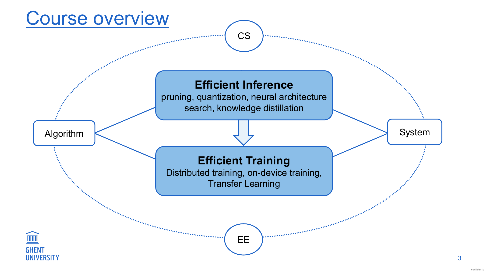

Waarom zou je überhaupt op het toestel willen trainen in plaats van in de cloud? Twee redenen die heel het college dragen:
1. **Customization** — een AI-systeem moet zich blijven aanpassen aan nieuwe data van zijn eigen sensoren (jouw stem, jouw omgeving), en die data komt continu binnen.
2. **Privacy** — gevoelige data (medisch, persoonlijk, bedrijfsdata) mag het toestel niet verlaten.

Maar on-device trainen botst op twee harde muren die dit college één voor één aanpakt: **(a)** is het wel *veilig* om in plaats van data de *gradiënten* te delen (federated learning)? En **(b)** trainen kost véél meer geheugen dan inferentie — past dat wel op een microcontroller? De technieken **TinyTL** en **sparse back-propagation** lossen die geheugenmuur op.

| Lecture | Onderwerp |
|---|---|
| 1 | Introduction |
| 2 | Overview of Embedded Systems en ML/DL Overflow |
| 3 | Pruning and Sparsity |
| 4 | Quantization |
| 5 | Lab Pruning and Quantization |
| 6 | Neural Architecture Search |
| 7 | Lab Pruning and Quantization op Nano 33 BLE |
| 8 | Knowledge Distillation |
| **9** | **On-device learning & Transfer Learning** ← dit college |
| 10 | Lab Knowledge Distillation & Federated Learning |

**Recap van vorige les (Knowledge Distillation):** knowledge distillation, *what to match* (output logits, intermediate weights, intermediate features, gradients, sparsity patterns, relational information), self-distillation met Born-Again NNs, online distillation (Deep Mutual Learning), het combineren van online en self-distillation, en network augmentation.

**Lecture Outline (de rode draad van dit college):**
1. **Basics** van on-device learning & federated learning (FedAvg)
2. **Use cases** — centralized en decentralized federated learning voor technology recognition
3. **Deep leakage from gradients** — waarom een gedeelde gradiënt tóch níet veilig is
4. **Memory bottleneck** van on-device training — waarom trainen zoveel geheugen kost
5. **Tiny transfer learning (TinyTL)** — geheugen-efficiënt fine-tunen
6. **Sparse back-propagation** — nog minder geheugen door selectief terug te propageren

---

# DEEL 1 — On-device learning & federated learning

## 1.1 Wat is on-device learning?

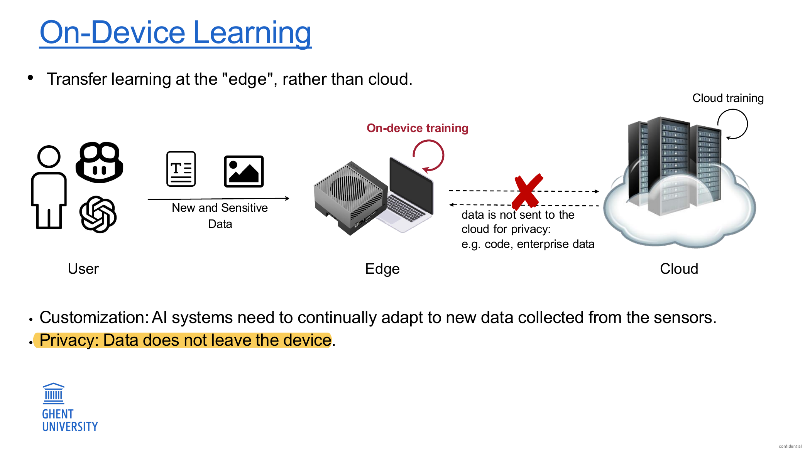

Het idee is **transfer learning aan de "edge" i.p.v. in de cloud**. De gebruiker genereert nieuwe, gevoelige data (tekst, beelden); die wordt gebruikt om het model **lokaal op het toestel** verder te trainen (*on-device training*) i.p.v. ze naar de cloud te sturen. De twee motivaties nog eens expliciet:
- **Customization:** het systeem past zich continu aan nieuwe sensordata aan.
- **Privacy:** *Data does not leave the device* — de data wordt **niet** naar de cloud gestuurd (denk aan code, bedrijfsdata). Op de slide staat dat de cloud-verbinding wordt doorkruist (rode X).

## 1.2 Federated learning: deel het model, niet de data

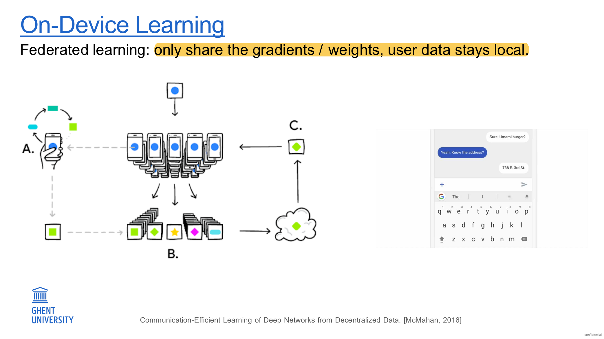

**Federated learning** (McMahan, 2016) is de gedistribueerde variant: in plaats van de ruwe data deel je enkel de **gradiënten / gewichten**, de gebruikersdata blijft lokaal. Veel toestellen trainen elk op hun eigen data en sturen alleen model-updates naar een server.

## 1.3 Het FedAvg-algoritme

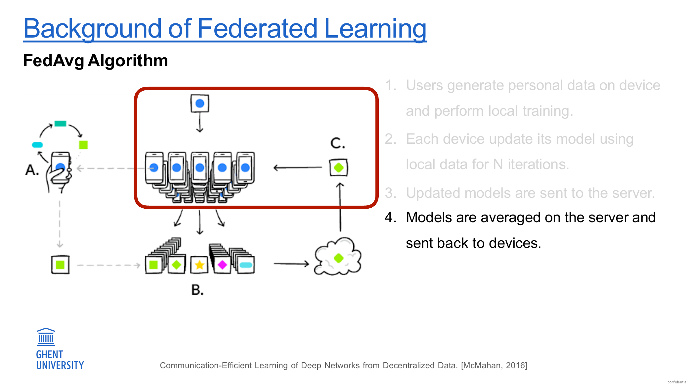

Het standaardalgoritme is **FedAvg** (Federated Averaging). De cyclus in vier stappen:

1. **Gebruikers genereren data op hun toestel** en doen lokale training.
2. **Elk toestel update zijn model** met de lokale data, gedurende N iteraties.
3. **De geüpdatete modellen worden naar de server gestuurd** (enkel de gewichten, niet de data).
4. **De server middelt de modellen** (vandaar "averaging") en stuurt het gemiddelde model terug naar alle toestellen.

Daarna begint de cyclus opnieuw. Het cruciale punt: **de belangrijke en private gebruikersdata verlaat NOOIT de lokale toestellen** — enkel modelgewichten reizen heen en weer.

**Extra context — waarom middelen werkt:** elk toestel ziet maar een stukje van de totale dataverdeling. Door de lokaal-getrainde modellen te middelen, combineer je de kennis van alle toestellen tot één globaal model, zonder ooit de onderliggende data te centraliseren.

---

# DEEL 2 — Use cases: federated learning voor technology recognition

## 2.1 Wireless technology recognition

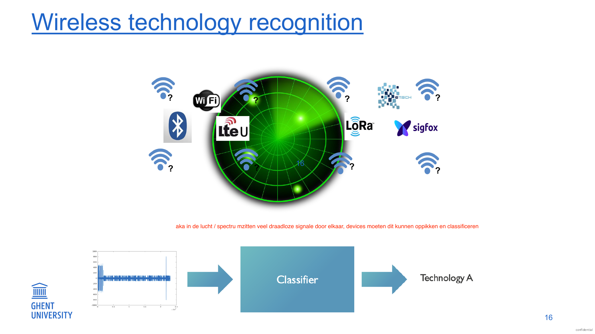

De concrete toepassing uit het onderzoek van de groep: in het radiospectrum zitten allerlei technologieën door elkaar (WiFi, Bluetooth, LTE-U, LoRa, Sigfox, 6TiSCH…). De taak is om uit een opgevangen signaal te **classificeren wélke technologie** het is.

> 📝 **jouw notitie:** aka in de lucht / spectru mzitten veel draadloze signale door elkaar, devices moeten dit kunnen oppikken en classificeren

Precies: een classifier krijgt het ruwe signaal binnen en geeft "Technology A/B/C…" terug. Dit is het probleem dat in de volgende slides federated wordt aangepakt.

## 2.2 Drie paradigma's: Centralized ML vs Centralized FL vs Decentralized FL

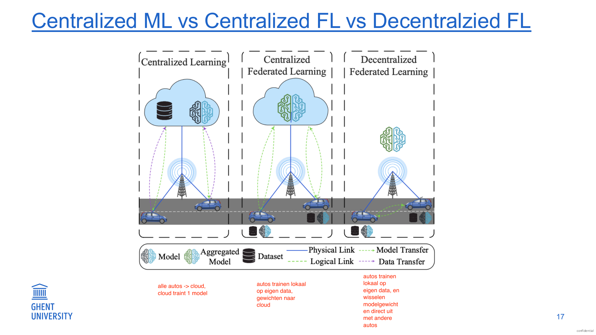

Drie manieren om dit te leren, geïllustreerd met auto's langs de weg:

> 📝 **jouw notitie:**
> - **(Centralized Learning)** alle autos -> cloud, cloud traint 1 model
> - **(Centralized Federated Learning)** autos trainen lokaal op eigen data, gewichten naar cloud
> - **(Decentralized Federated Learning)** autos trainen lokaal op eigen data, en wisselen modelgewicht en direct uit met andere autos

Je notitie vat het perfect samen. Het verschil:
- **Centralized Learning:** alle ruwe data gaat naar de cloud, die één model traint (privacy-onvriendelijk, veel data-transfer).
- **Centralized FL:** elk toestel traint lokaal, enkel de **gewichten** gaan naar een centrale server die middelt (FedAvg).
- **Decentralized FL:** geen centrale server — toestellen wisselen modelgewichten **rechtstreeks met elkaar** uit (bv. via roadside units en onderlinge links).

## 2.3 Centralized FL voor technology recognition — resultaten

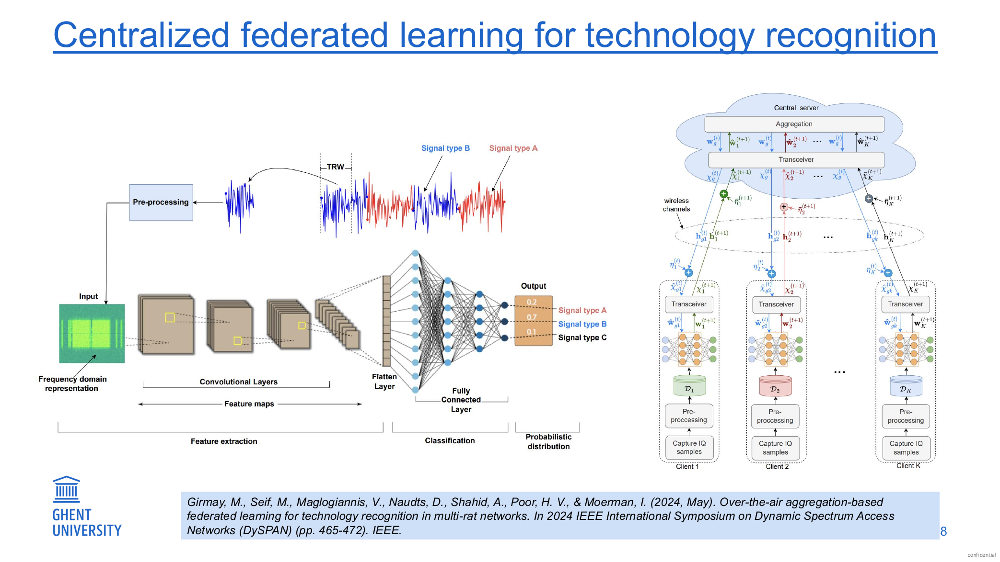

De architectuur: elk toestel (client) capteert IQ-samples, doet pre-processing naar een frequentie-domein-representatie, en traint lokaal een CNN-classifier. De gewichten worden via de draadloze kanalen geaggregeerd op een centrale server (over-the-air aggregation). (Girmay et al., DySPAN 2024.)

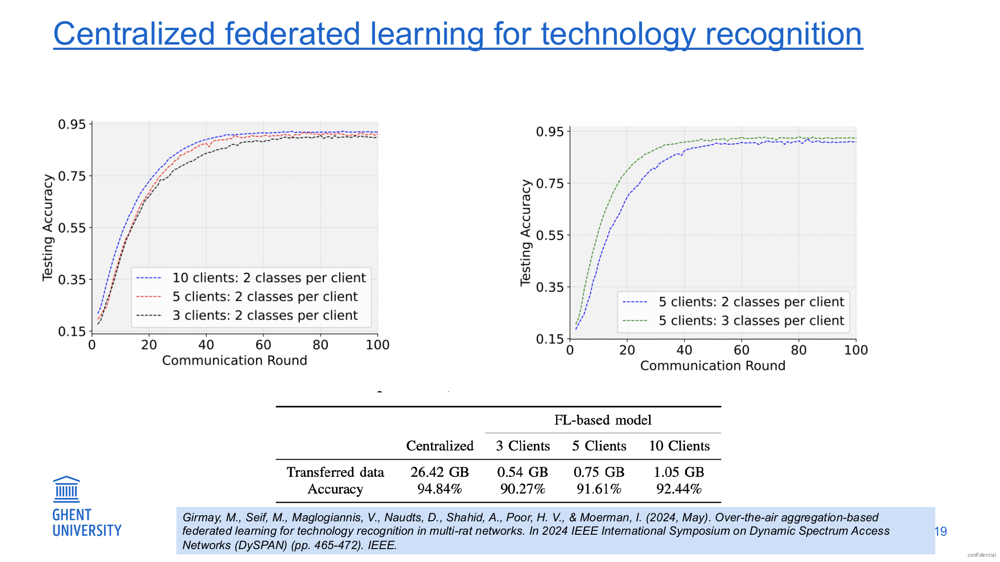

De kerntabel toont het hele *waarom* van FL:

| | Centralized | 3 Clients | 5 Clients | 10 Clients |
|---|---|---|---|---|
| **Transferred data** | 26.42 GB | 0.54 GB | 0.75 GB | 1.05 GB |
| **Accuracy** | 94.84 % | 90.27 % | 91.61 % | 92.44 % |

**Hoe lees je dit?** Centralized learning haalt de hoogste accuracy (94.84 %) maar moet **26.42 GB ruwe data** naar de cloud sturen. FL haalt bijna dezelfde accuracy (90–92 %) terwijl het **tot ~25–50× minder data** verstuurt (enkel modelgewichten). Je betaalt een kleine accuracy-prijs voor een enorme winst in privacy én communicatiekost — en hoe meer clients, hoe dichter FL de centralized-accuracy benadert.

## 2.4 Decentralized FL voor technology recognition

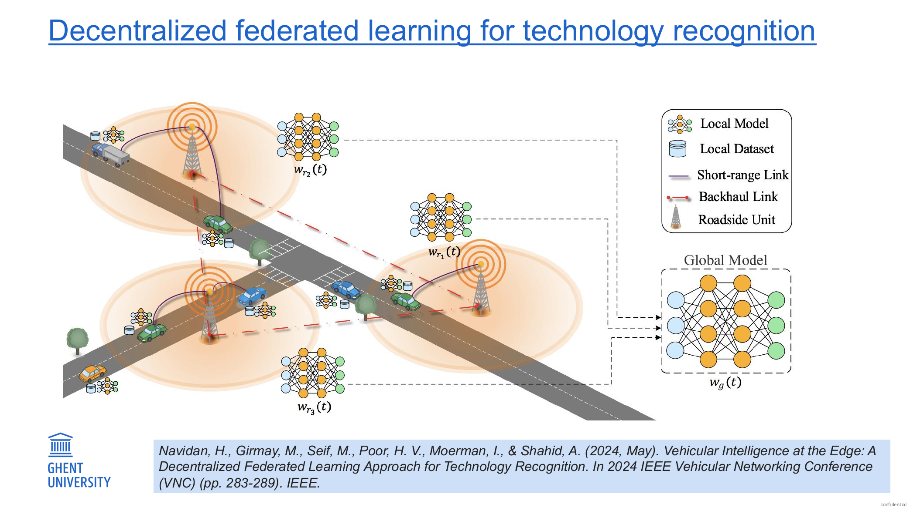

In de **decentralized** variant (Navidan et al., VNC 2024) is er geen centrale server: voertuigen trainen lokaal en delen hun modellen via short-range links en roadside units, tot een globaal model ontstaat.

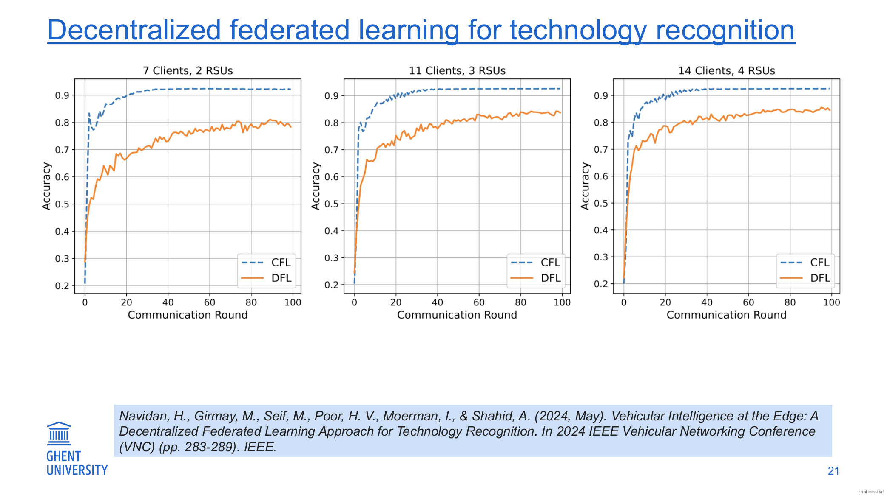

De vergelijking CFL (centralized) vs DFL (decentralized): **CFL convergeert sneller en hoger** (~0.92) dan DFL (~0.80–0.85). De decentralized aanpak is robuuster (geen single point of failure) maar betaalt daar een accuracy-/convergentieprijs voor, omdat er geen perfecte globale middeling is.

---

# DEEL 3 — Deep leakage from gradients: is een gradiënt wel veilig?

## 3.1 De aanname herbekeken

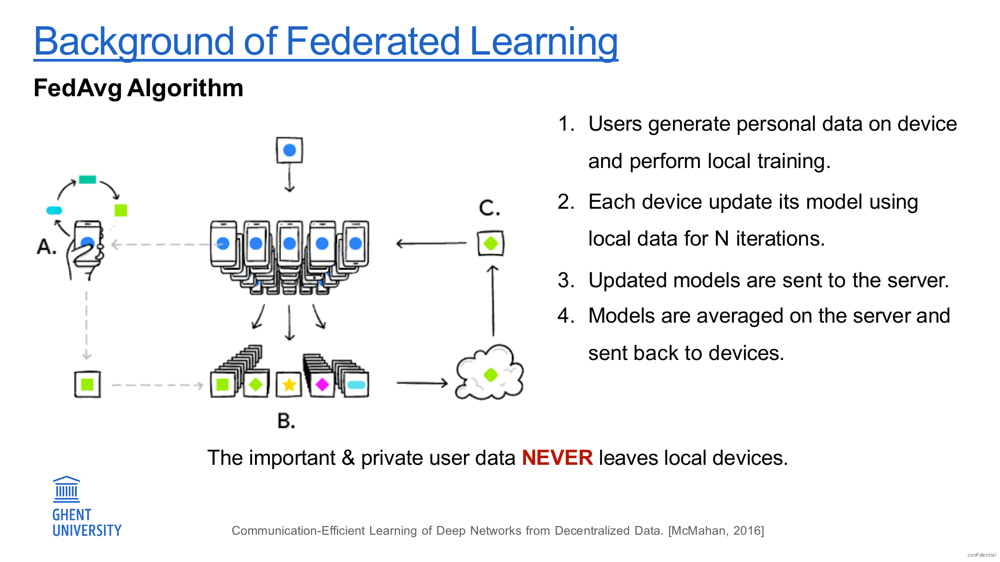

FedAvg beloofde: de private data verlaat **nooit** de lokale toestellen — enkel gradiënten/gewichten worden gedeeld. Maar…

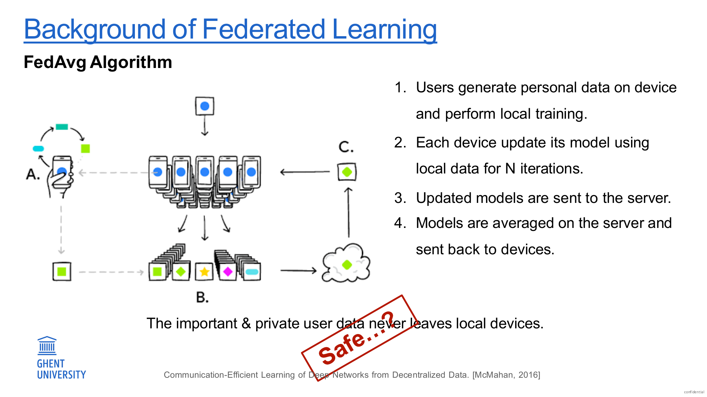

…de centrale vraag van dit deel: **"Safe…?"** Is het delen van gradiënten écht privacy-veilig?

## 3.2 Bevatten gradiënten informatie over de data?

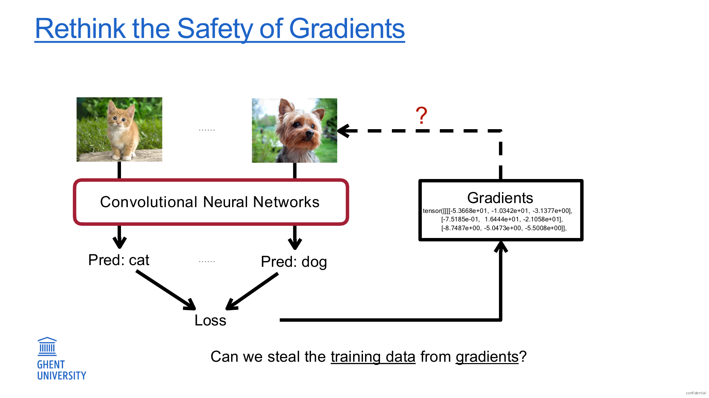

De redenering wordt stap voor stap opgebouwd. Een netwerk verwerkt input → predictie → loss, en uit die loss leid je de **gradiënten** af. Die gradiënten zijn dus berekend uit **het model én de trainingsdata**. De prikkelende vraag: *can we steal the training data from gradients?*

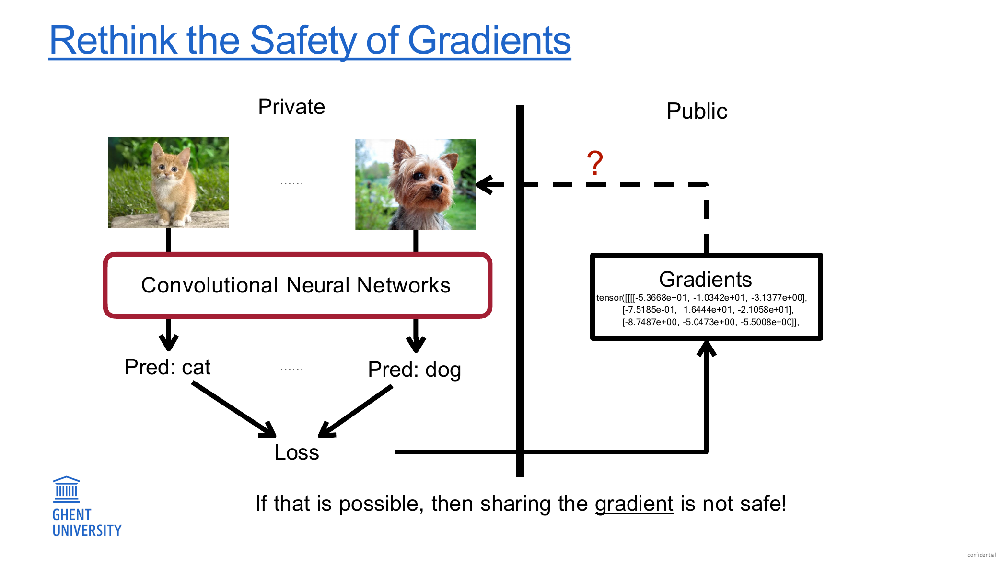

De data is "privé", de gedeelde gradiënt is "publiek". **Als** je de privédata kan terugrekenen uit de publieke gradiënt, dan is het delen van die gradiënt **niet veilig**.

## 3.3 Bestaande aanvallen: membership & property inference

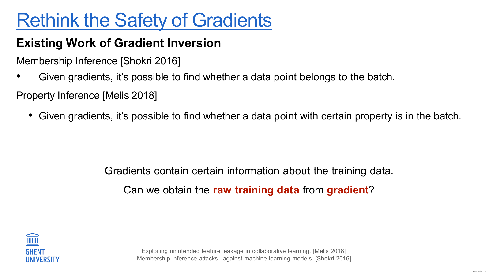

Er bestonden al "zwakkere" aanvallen die tonen dat gradiënten lekken:
- **Membership inference** (Shokri 2016): uit de gradiënten kan je afleiden óf een bepaald datapunt in de batch zat.
- **Property inference** (Melis 2018): je kan afleiden of een datapunt met een bep.aalde **eigenschap** in de batch zat.

> 📝 **jouw notitie:** bv: Bv. "zat er een vrouw in de batch?" zonder de exacte sample te kennen

Exact het onderscheid: property inference vertelt je iets over een *eigenschap* (was er een vrouw in de batch?) zonder dat je het exacte beeld kent. Conclusie van de slide: gradiënten bevatten dus **wel degelijk informatie** over de trainingsdata. De volgende stap zet de aanval op scherp: kunnen we de **rúwe** trainingsdata reconstrueren?

## 3.4 Deep Leakage from Gradients (DLG)

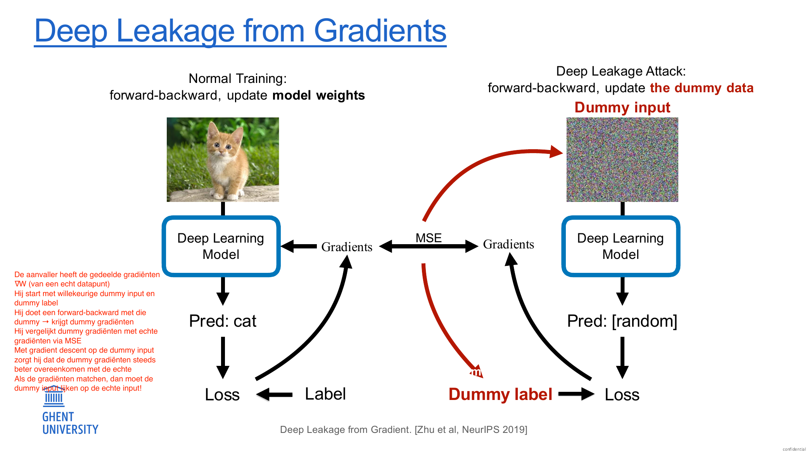

Dit is de kern-aanval (Zhu et al., NeurIPS 2019). Vergelijk:
- **Normaal trainen:** forward-backward, en je update de **modelgewichten**.
- **Deep Leakage Attack:** forward-backward, maar je update de **dummy data** (niet de gewichten).

> 📝 **jouw notitie:**
> - De aanvaller heeft de gedeelde gradiënten ∇W (van een echt datapunt)
> - Hij start met willekeurige dummy input en dummy label
> - Hij doet een forward-backward met die dummy → krijgt dummy gradiënten
> - Hij vergelijkt dummy gradiënten met echte gradiënten via MSE
> - Met gradient descent op de dummy input zorgt hij dat de dummy gradiënten steeds beter overeenkomen met de echte
> - Als de gradiënten matchen, dan moet de dummy input lijken op de echte input!

Je notitie is een perfecte stap-voor-stap beschrijving van het algoritme — beter dan de slide zelf. De clou: je optimaliseert niet de gewichten maar de **input**, met als loss de **afstand tussen dummy-gradiënt en echte gradiënt** (MSE). Omdat de gradiënt een bijna-unieke "vingerafdruk" van de input is, convergeert de dummy-input naar de echte input.

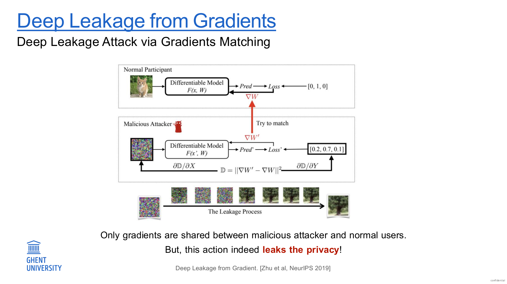

In formulevorm: de afstand $\mathbb{D} = \lVert \nabla W' - \nabla W \rVert^2$ tussen de gradiënt van de aanvaller ($\nabla W'$, van dummy input $x'$) en de echte gradiënt ($\nabla W$). De aanvaller doet gradient descent op zowel de dummy input $x'$ ($\partial \mathbb{D}/\partial X$) als het dummy label ($\partial \mathbb{D}/\partial Y$). Het "leakage process" toont hoe ruis stap voor stap verandert in de echte afbeelding (een boom). **Enkel gradiënten worden gedeeld — en toch lekt de privacy.**

## 3.5 De aanval werkt — op beeld én tekst

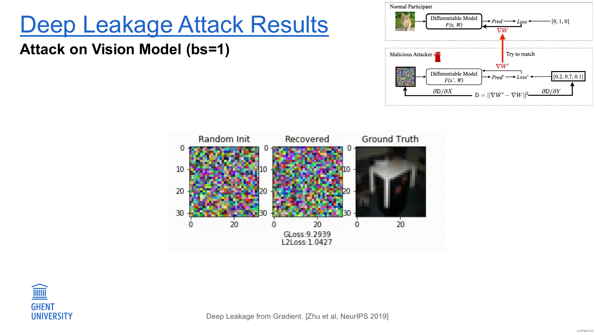

Op een vision-model (batch size = 1) wordt uit pure ruis ("Random Init") de "Recovered" afbeelding gereconstrueerd die nagenoeg gelijk is aan de "Ground Truth". De gradiënt alleen volstaat dus om het oorspronkelijke beeld terug te halen.

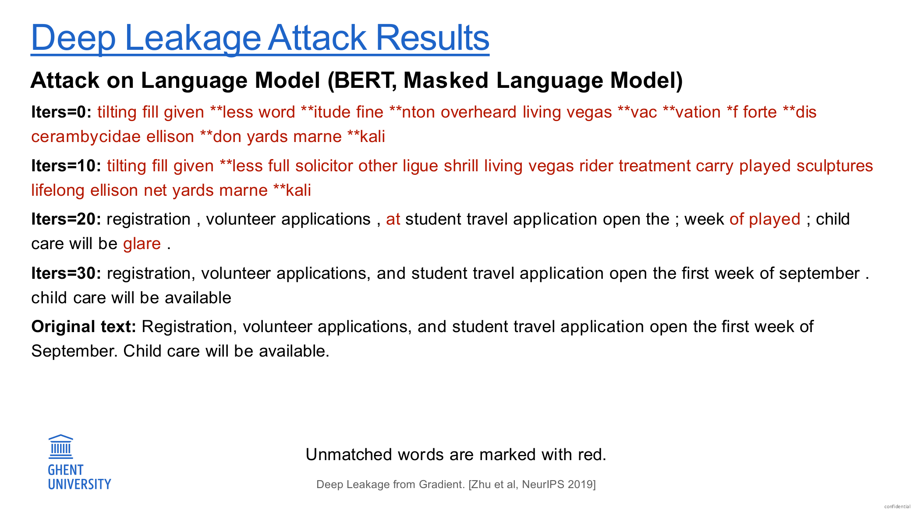

Ook op tekst (BERT, masked language model): bij iteratie 0 is de gereconstrueerde tekst nog wartaal (rode, "unmatched" woorden), maar bij iteratie 30 is de originele zin bijna perfect teruggehaald ("Registration, volunteer applications, … Child care will be available."). Conclusie: gradiënt-delen lekt ook tekstuele privédata.

## 3.6 Verdedigingen tegen deep leakage

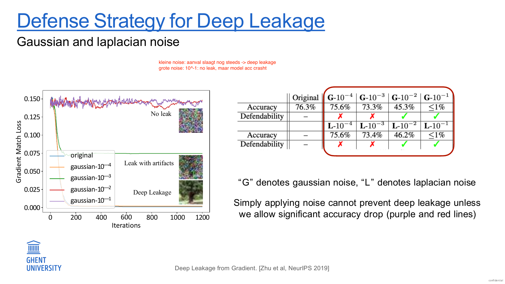

**Verdediging 1 — ruis toevoegen.** Voeg Gaussische of Laplaciaanse ruis toe aan de gradiënt vóór je hem deelt.

> 📝 **jouw notitie:** kleine noise: aanval slaagt nog steeds -> deep leakage / grote noise: 10⁻¹: no leak, maar model acc crasht

Precies de conclusie uit de tabel: bij **kleine** ruis (10⁻⁴, 10⁻³) lekt de data nog steeds (defendability ✗) en blijft de accuracy hoog; bij **grote** ruis (10⁻¹) lekt er niets meer (✓) maar **stort de accuracy in** (≤1 %). *Simpelweg ruis toevoegen werkt dus niet, tenzij je een grote accuracy-daling aanvaardt.*

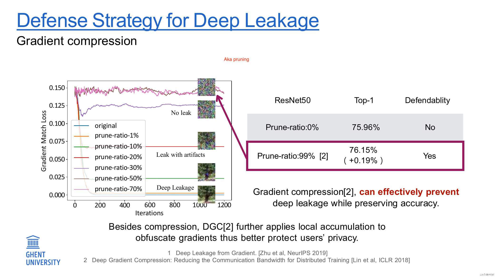

**Verdediging 2 — gradient compression.**

> 📝 **jouw notitie:** Aka pruning

Inderdaad — gradient compression is in essentie **pruning toegepast op de gradiënt**: je zet een groot deel van de gradiënt-waarden op nul vóór je hem deelt. De tabel toont dat bij een **prune-ratio van 99 %** de aanval effectief wordt geblokkeerd (defendability ✓) **terwijl de accuracy zelfs licht stijgt** (+0.19 %). Anders dan ruis bewaart compressie dus wél de accuracy. (DGC, Lin et al., ICLR 2018, voegt nog lokale accumulatie toe om gradiënten verder te obfusceren.)

---

# DEEL 4 — De geheugen-bottleneck van on-device training

## 4.1 Het geheugen is te klein

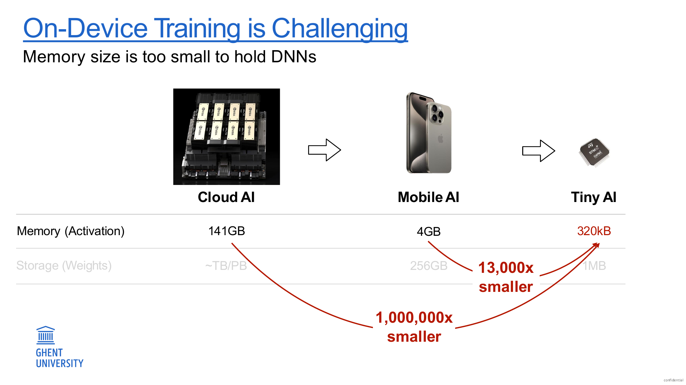

De tweede harde muur. Vergelijk het beschikbare geheugen:

| | Cloud AI | Mobile AI | Tiny AI |
|---|---|---|---|
| **Memory (Activation)** | 141 GB | 4 GB | 320 kB |
| **Storage (Weights)** | ~TB/PB | 256 GB | 1 MB |

Een microcontroller heeft **~13.000× minder** geheugen dan een telefoon en **~1.000.000× minder** dan een cloud-GPU. De DNN past gewoonweg niet.

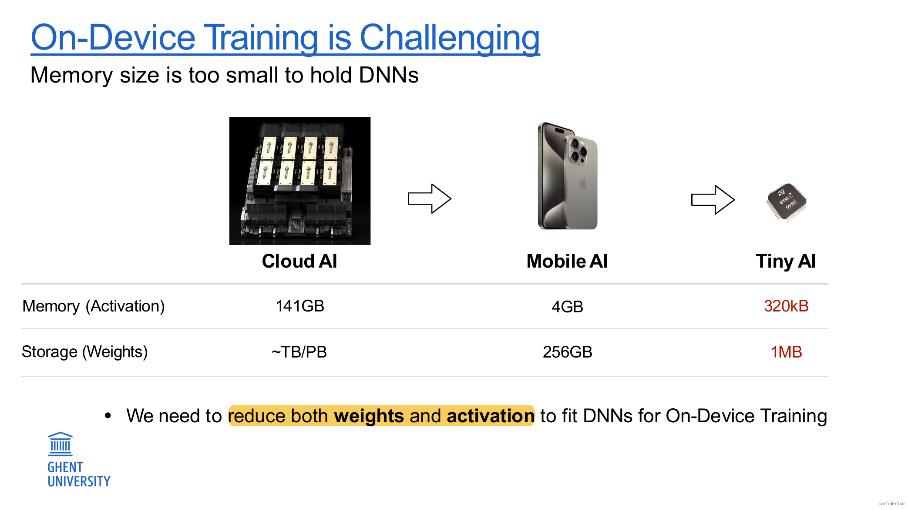

De conclusie: we moeten **zowel de weights als de activation reduceren** om DNN's geschikt te maken voor on-device training. (Weights → storage; activation → werkgeheugen tijdens training.)

## 4.2 Waarom kost training zoveel méér geheugen dan inferentie?

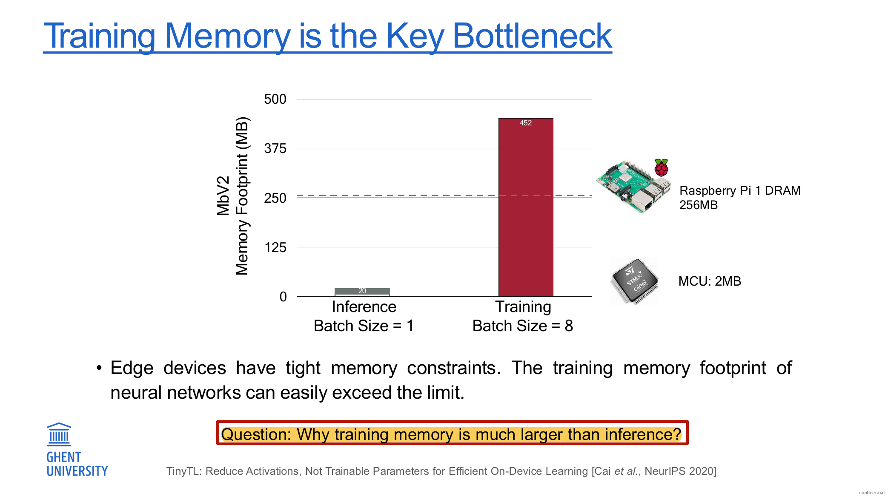

Het verschil is dramatisch: voor MobileNetV2 kost **inferentie** ~20 MB maar **training** ~452 MB — ruim boven de 256 MB van een Raspberry Pi 1 en de 2 MB van een MCU. Vraag: *waarom is training-geheugen zoveel groter dan inferentie?*

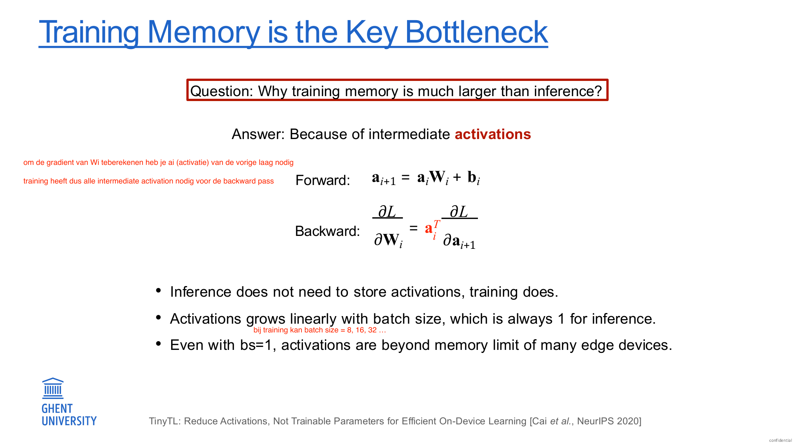

**Antwoord: door de intermediate activations.** Kijk naar de twee fasen voor een lineaire laag:

$$\text{Forward:} \quad a_{i+1} = a_i W_i + b_i$$
$$\text{Backward:} \quad \frac{\partial L}{\partial W_i} = a_i^T \frac{\partial L}{\partial a_{i+1}}$$

> 📝 **jouw notitie:**
> - om de gradient van Wi te berekenen heb je ai (activatie) van de vorige laag nodig
> - training heeft dus alle intermediate activation nodig voor de backward pass
> - *(bij "grows with batch size")* bij training kan batch size = 8, 16, 32 ...

Dit is dé sleutel. Kijk naar de backward-formule: om $\partial L/\partial W_i$ te berekenen heb je **$a_i$** nodig — de activatie van de vorige laag uit de forward pass. Dus:
- **Inferentie** hoeft geen activations te bewaren (je gooit ze meteen weg na elke laag).
- **Training** moet **alle** intermediate activations bewaren tot de backward pass ze gebruikt → dat is de grote geheugenkost.
- Erger nog: activations groeien **lineair met de batch size**. Inferentie heeft batch size 1, maar training gebruikt 8, 16, 32… → nog veel meer geheugen.
- Zelfs met batch size 1 zitten de activations al boven de geheugenlimiet van veel edge-toestellen.

## 4.3 Activation, niet parameters, is de bottleneck

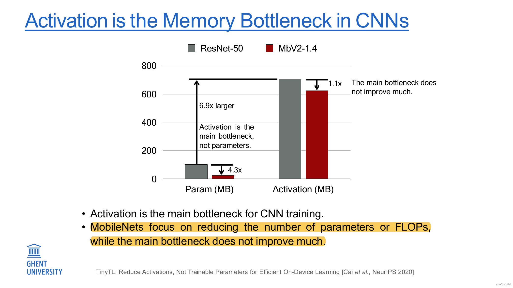

Een belangrijke nuance: voor ResNet-50 is de **activation ~6.9× groter** dan de parameters. Niet de gewichten, maar de **activations** zijn de bottleneck voor CNN-training.

> *(geaccentueerd op de slide)* MobileNets focussen op het reduceren van het aantal **parameters of FLOPs**, terwijl de echte bottleneck (de activation) nauwelijks verbetert.

Vergelijk ResNet-50 met MobileNetV2-1.4: de **parameters** zakken 4.3×, maar de **activation** slechts 1.1×. Dit is een waarschuwing: efficiënte architecturen die op parameters/FLOPs mikken, lossen het *trainings*geheugenprobleem niet op. Daarvoor moet je de **activations** aanpakken — precies wat TinyTL doet (DEEL 6).

---

# DEEL 5 — Transfer learning & parameter-efficient transfer learning

## 5.1 Korte herhaling transfer learning

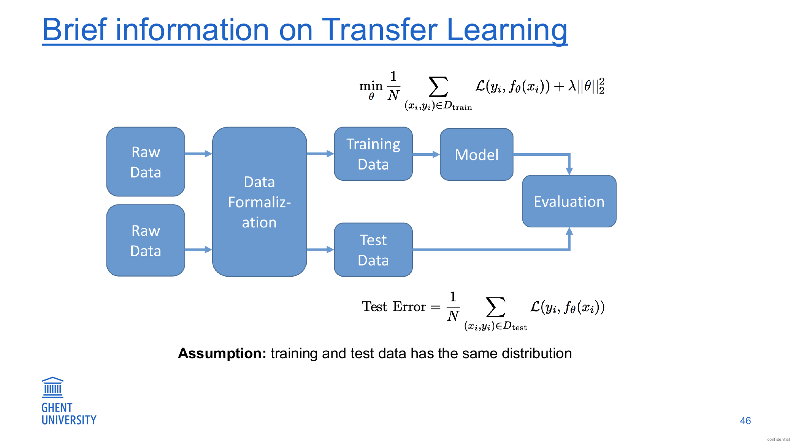

Klassieke supervised learning minimaliseert de loss over de trainingsset (met L2-regularisatie):
$$\min_\theta \frac{1}{N}\sum_{(x_i,y_i)\in D_{train}} \mathcal{L}(y_i, f_\theta(x_i)) + \lambda \lVert\theta\rVert_2^2$$
De stilzwijgende **aanname**: train- en testdata komen uit **dezelfde verdeling**.

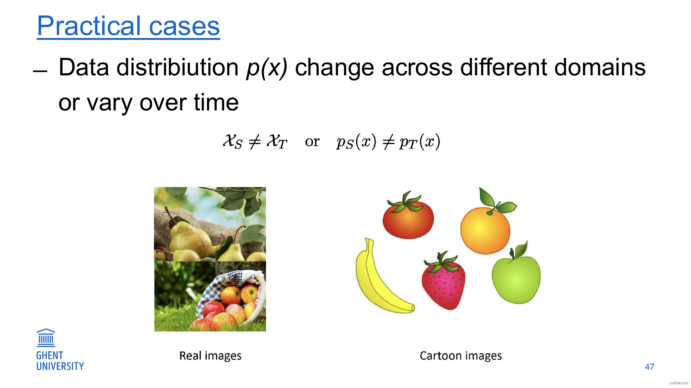
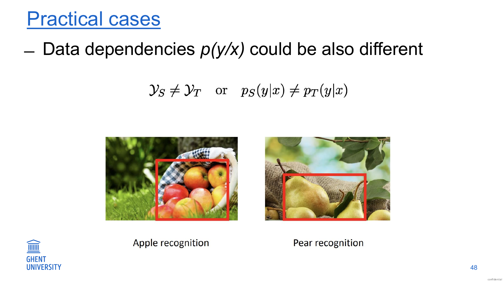

In de praktijk klopt die aanname vaak niet: de **data-distributie $p(x)$** verschilt tussen domeinen of verandert over tijd (echte foto's vs cartoons: $\mathcal{X}_S \neq \mathcal{X}_T$), en ook de **dependency $p(y|x)$** kan anders zijn (appel-herkenning vs peer-herkenning). Dat is precies waar transfer learning voor dient.

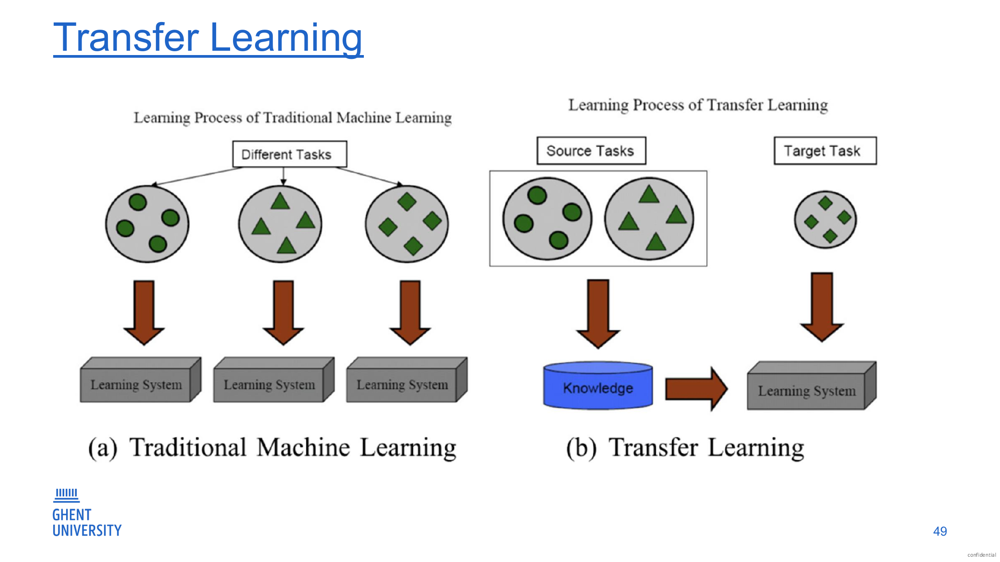

Het verschil: bij **traditionele ML** train je elk model van nul voor elke taak. Bij **transfer learning** gebruik je kennis uit een **source task** (bv. een op ImageNet voorgetraind model) om een **target task** met weinig data sneller en beter te leren. Voor on-device learning is dit ideaal: je vertrekt van een sterk basismodel en past het lokaal aan.

## 5.2 Parameter-efficient ≠ memory-efficient

Hoe fine-tune je dat voorgetrainde model op de edge? Drie strategieën:

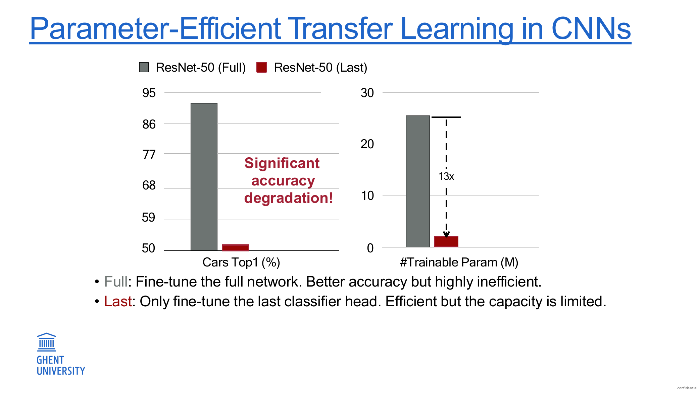

- **Full:** fine-tune het hele netwerk → beste accuracy, maar **highly inefficient** (alle gewichten trainbaar).
- **Last:** fine-tune enkel de laatste classifier-laag → efficiënt (13× minder trainbare params), maar **significante accuracy-degradatie** (te weinig capaciteit).

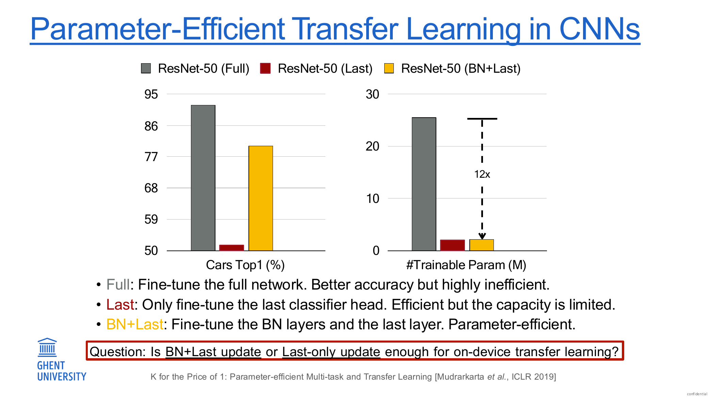

- **BN+Last:** fine-tune de BatchNorm-lagen + de laatste laag → **parameter-efficient** (12× minder params) met betere accuracy dan Last-only.

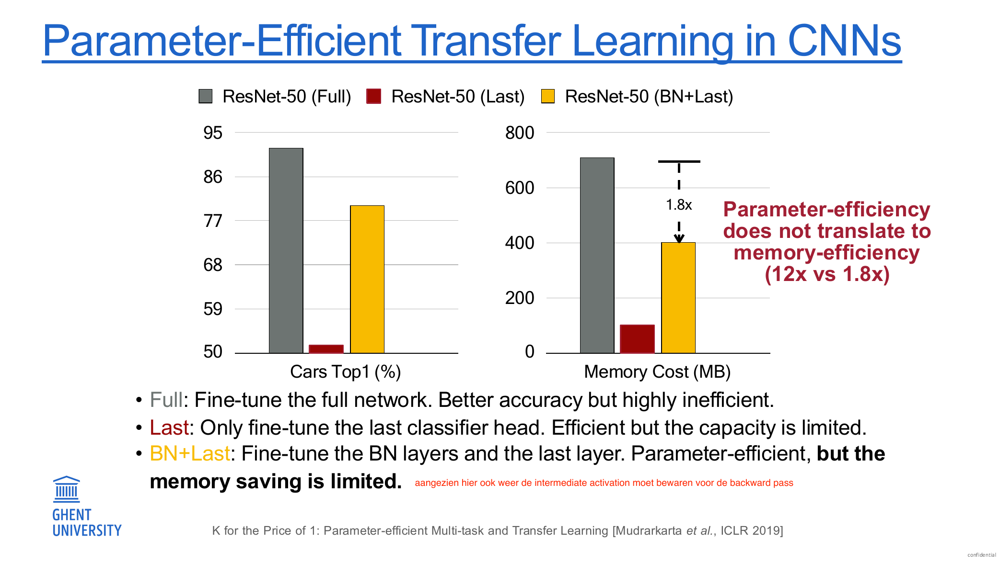

Maar nu de cruciale waarschuwing — en precies wat DEEL 4 voorspelde:

> 📝 **jouw notitie:** aangezien hier ook weer de intermediate activation moet bewaren voor de backward pass

De slide-conclusie: **parameter-efficiency vertaalt NIET naar memory-efficiency (12× vs 1.8×)**. BN+Last gebruikt 12× minder *parameters*, maar slechts 1.8× minder *geheugen*. Waarom? Jouw notitie: om de BN-lagen (die diep in het netwerk zitten) te updaten, moet je nog steeds de **intermediate activations bewaren voor de backward pass**. Het aantal trainbare parameters zegt dus weinig over het geheugengebruik — de activations bepalen dat.

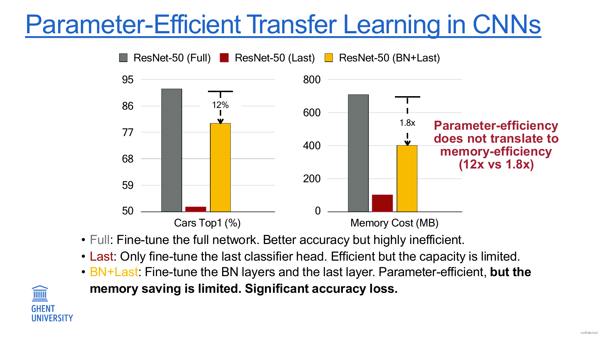

En bovendien: BN+Last heeft nog steeds een **accuracy-gat van ~12 %** t.o.v. full fine-tuning. We hebben dus iets nodig dat én geheugen bespaart (activations vermijdt) én de accuracy behoudt → **TinyTL**.

---

# DEEL 6 — TinyTL: Tiny Transfer Learning

## 6.1 Waarom gewichten updaten zoveel geheugen kost

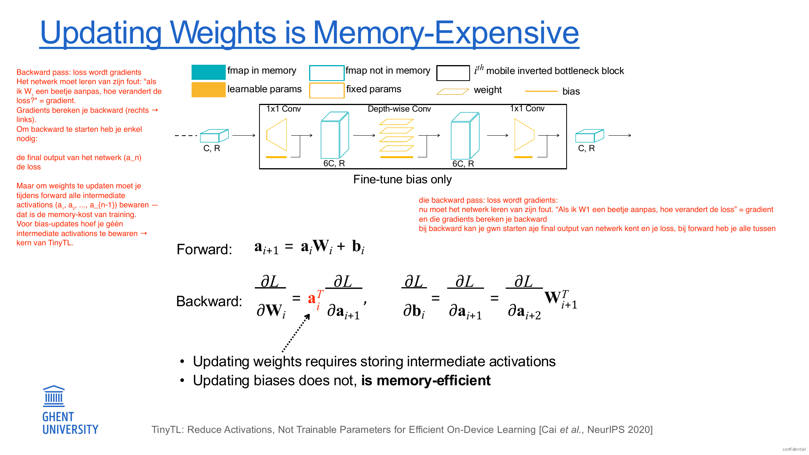

De kerninzicht van TinyTL (Cai et al., NeurIPS 2020) zit in de backward-formules. Voor een laag $a_{i+1} = a_i W_i + b_i$:

$$\frac{\partial L}{\partial W_i} = a_i^T \frac{\partial L}{\partial a_{i+1}}, \qquad \frac{\partial L}{\partial b_i} = \frac{\partial L}{\partial a_{i+1}}$$

> 📝 **jouw notitie:**
> - Backward pass: loss wordt gradients. Het netwerk moet leren van zijn fout: "als ik W₁ een beetje aanpas, hoe verandert de loss?" = gradient. Gradients bereken je backward (rechts → links).
> - Om backward te starten heb je enkel nodig: de final output van het netwerk (aₙ) en de loss.
> - Maar om weights te updaten moet je tijdens forward **alle intermediate activations** (a₁, a₂, …, a_{n-1}) bewaren — dat is de memory-kost van training.
> - Voor bias-updates hoef je **géén** intermediate activations te bewaren → kern van TinyTL.

Je notitie legt de essentie bloot. Vergelijk de twee gradiënten:
- $\partial L/\partial W_i = a_i^T \cdot \partial L/\partial a_{i+1}$ → bevat **$a_i$**, dus je **moet de activatie bewaren** om het gewicht te updaten. Duur.
- $\partial L/\partial b_i = \partial L/\partial a_{i+1}$ → hangt **níét** van $a_i$ af, enkel van de gradiënt die toch al terugstroomt. Je hoeft dus **geen activatie te bewaren** om de bias te updaten. **Memory-efficient!**

## 6.2 TinyTL stap 1: fine-tune bias only

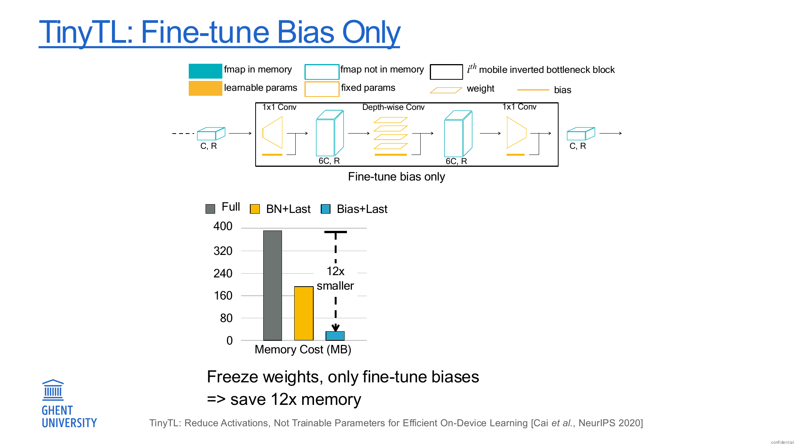

De eerste TinyTL-truc: **bevries alle gewichten, fine-tune enkel de biases**. Omdat bias-updates geen intermediate activations nodig hebben, bespaar je **12× geheugen**.

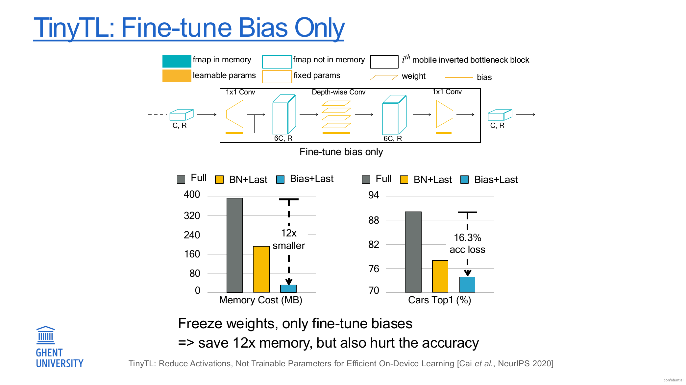

Maar bias-only alleen is niet genoeg: het bespaart 12× geheugen **maar kost ~16.3 % accuracy**. Bias-parameters hebben te weinig capaciteit om de target task goed te leren. We hebben extra capaciteit nodig — zonder de activations weer te laten groeien.

## 6.3 TinyTL stap 2: lite residual learning

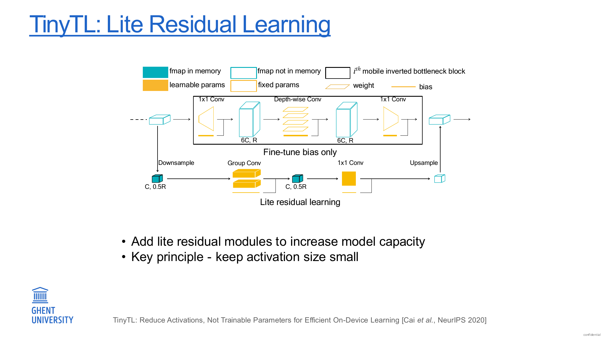

De tweede truc: voeg naast het bevroren hoofdnetwerk **lite residual modules** toe (een klein, trainbaar zijpad). Die geven het model **extra capaciteit** om de target task te leren, terwijl het hoofdnetwerk bevroren blijft (enkel biases).

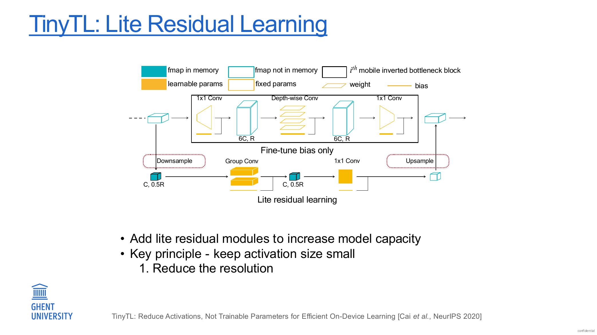
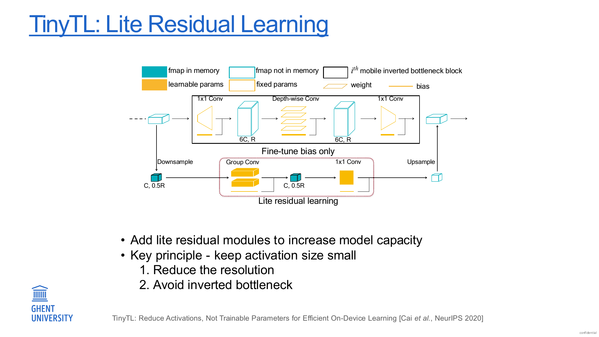

Het **sleutelprincipe is: houd de activation-grootte klein** (want activations zijn de bottleneck, zie DEEL 4). Twee ontwerpkeuzes daarvoor:
1. **Reduceer de resolutie** (het zijpad werkt op halve resolutie, `0.5R`).
2. **Vermijd de inverted bottleneck** (die net grote activations geeft, zie MobileNetV2 in Lect07) — gebruik een group conv die de kanalen smal houdt.

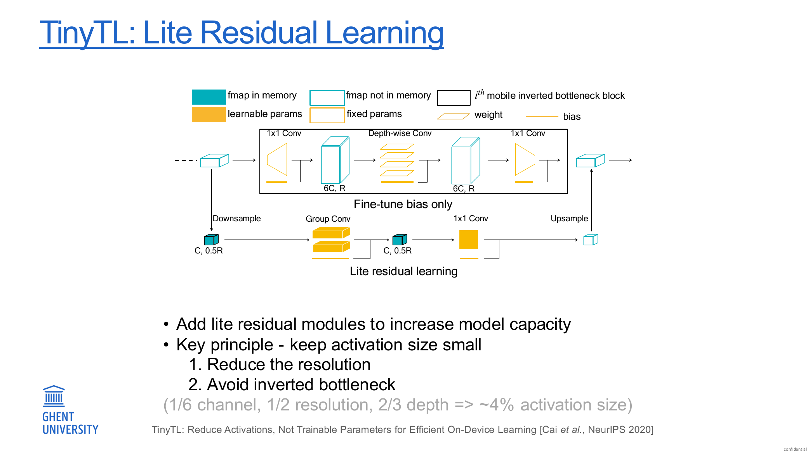

Het netto-effect: met 1/6 kanalen, 1/2 resolutie en 2/3 diepte gebruikt het lite-residual-pad slechts **~4 % van de oorspronkelijke activation-grootte** — verwaarloosbaar geheugen, maar wél extra capaciteit.

## 6.4 TinyTL: resultaten

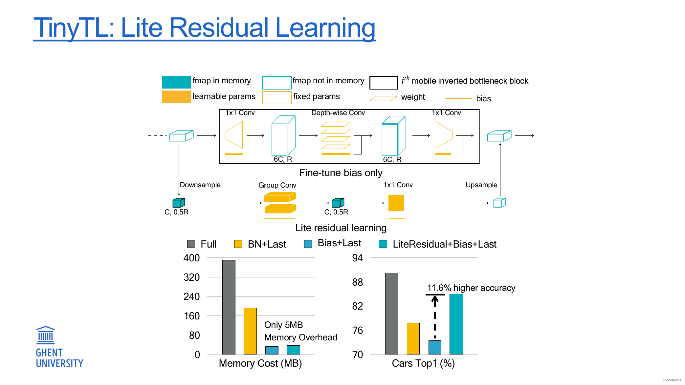

De combinatie **LiteResidual + Bias + Last** geeft **+11.6 % accuracy** t.o.v. bias-only, met slechts **5 MB extra geheugen-overhead**. Je herwint dus bijna het hele accuracy-gat voor een verwaarloosbare geheugenkost.

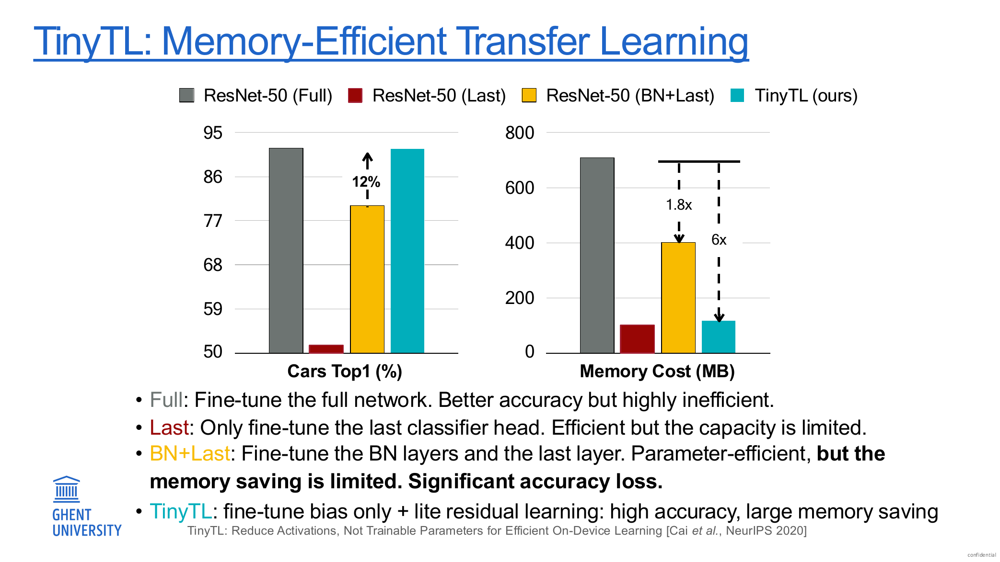

De volledige vergelijking op Cars: **TinyTL haalt de accuracy van full fine-tuning (~91 %)** maar gebruikt **~6× minder geheugen** — terwijl BN+Last (de beste parameter-efficient baseline) zowel accuracy verliest als nauwelijks geheugen bespaart.

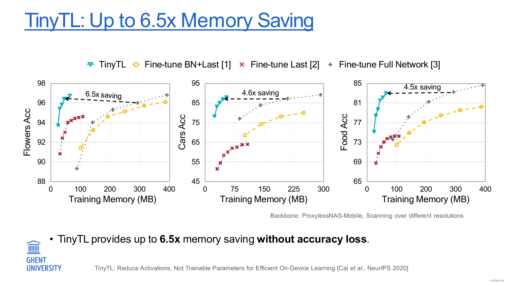

Over meerdere datasets (Flowers, Cars, Food) levert TinyTL **tot 6.5× geheugenbesparing zonder accuracy-verlies** t.o.v. full fine-tuning — en het ligt consistent ver boven de andere methodes op de accuracy-vs-geheugen-curve.

---

# DEEL 7 — Sparse back-propagation

## 7.1 Dense full back-propagation is te duur

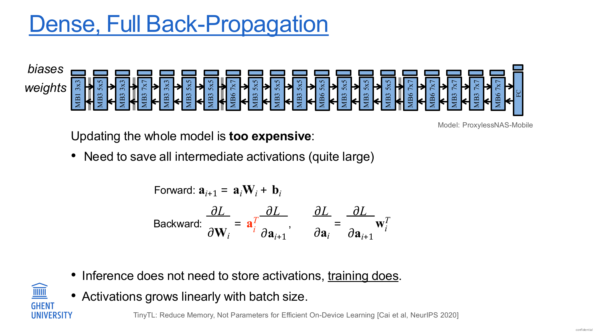

De laatste techniek. Bij **volledige** back-propagation door alle MobileNet-blokken moet je **alle** intermediate activations bewaren (`∂L/∂Wᵢ = aᵢᵀ ∂L/∂aᵢ₊₁`), wat — zoals we weten — lineair groeit met de batch size. Te duur voor de edge.

## 7.2 Inspiratie: het brein wordt sparser

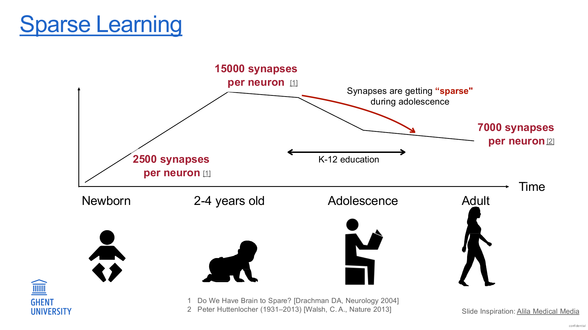

**Extra context — de biologische analogie.** Een mensenbrein gaat van ~2500 synapsen/neuron (newborn) naar een piek van ~15.000 (2-4 jaar), en snoeit dan terug naar ~7000 (volwassene). Leren betekent dus niet *alles* versterken, maar selectief **snoeien** — precies het idee achter sparse back-propagation.

## 7.3 Het spectrum: van last-only naar bias-only

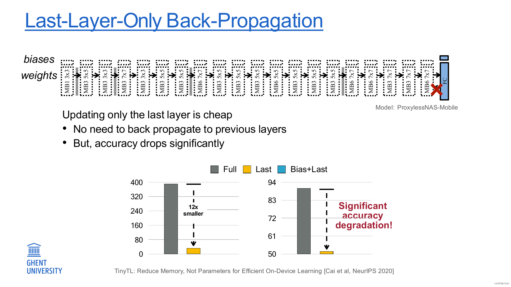

- **Last-layer-only:** enkel de laatste laag updaten → geen back-propagation naar vorige lagen nodig (goedkoop), **maar significante accuracy-daling**.

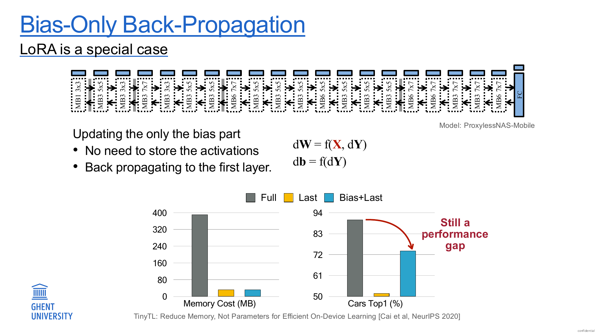

- **Bias-only:** enkel de bias updaten → geen activations bewaren ($d\mathbf{b} = f(d\mathbf{Y})$ hangt niet van de input af, terwijl $d\mathbf{W} = f(\mathbf{X}, d\mathbf{Y})$ dat wel doet), je kan tot de eerste laag terugpropageren. Toch blijft er **een performance gap**. (LoRA is hiervan een speciaal geval.)

## 7.4 Sparse back-propagation: drievoudige sparsiteit

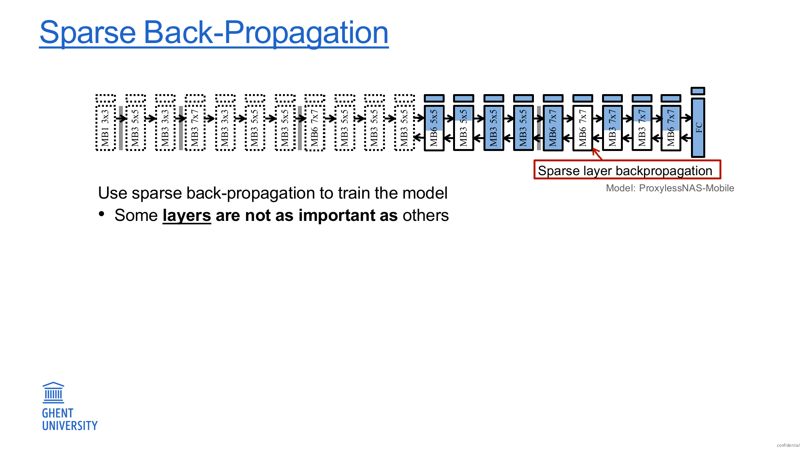
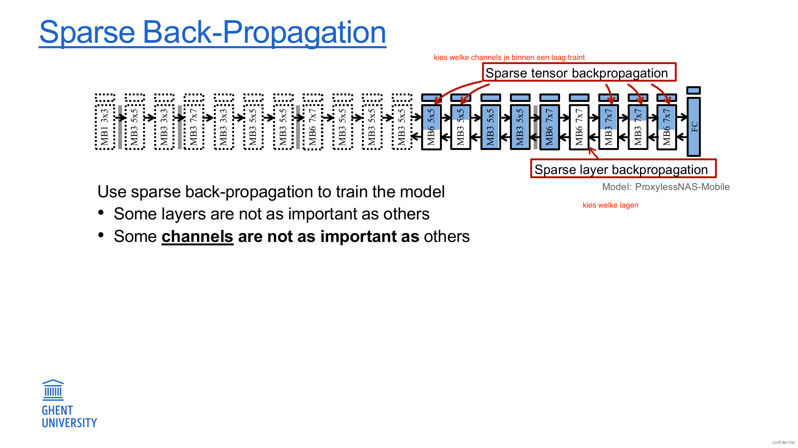

De kernidee: train **selectief** in plaats van alles of niets.

> 📝 **jouw notitie:** kies welke channels je binnen een laag traint · kies welke lagen

Precies de twee assen van sparsiteit op deze slides:
- **Sparse layer backpropagation:** sommige *lagen* zijn belangrijker dan andere → kies welke lagen je update.
- **Sparse tensor backpropagation:** sommige *channels* binnen een laag zijn belangrijker → kies welke channels je traint.

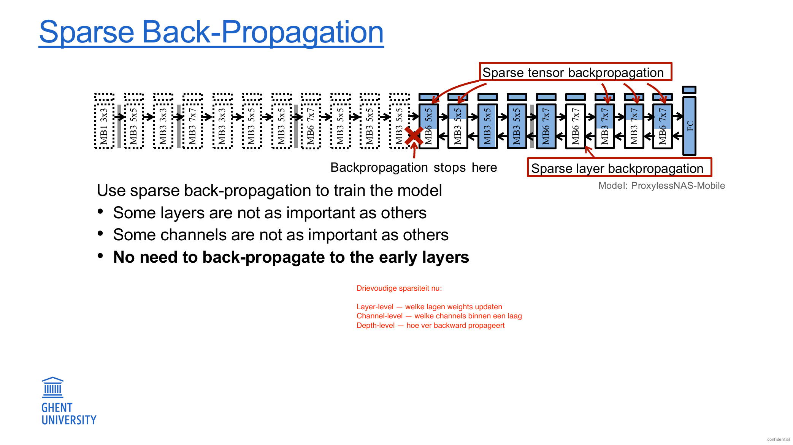

> 📝 **jouw notitie:**
> Drievoudige sparsiteit nu:
> - Layer-level — welke lagen weights updaten
> - Channel-level — welke channels binnen een laag
> - Depth-level — hoe ver backward propageert

Je notitie vat het mooi samen als **drie niveaus van sparsiteit**. De derde:
- **Depth-level:** je hoeft **niet tot de eerste lagen** terug te propageren — "backpropagation stops here". De vroege lagen (algemene features) blijven bevroren; je traint enkel de latere lagen.

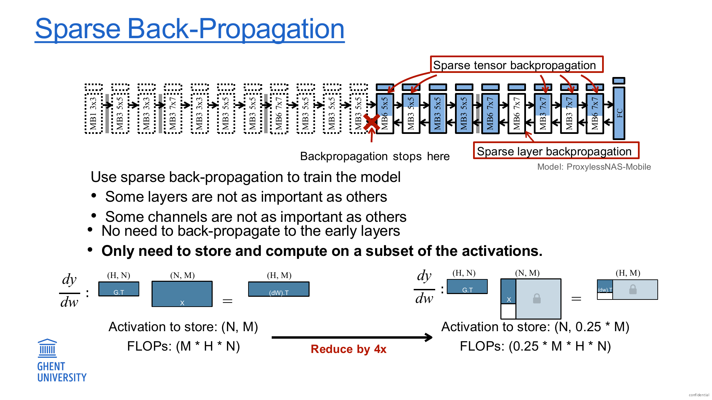

Het geheugen- én rekenvoordeel concreet: bij de gewichtsgradiënt $dy/dw$ moet je normaal de hele activatie $(N, M)$ opslaan en $(M \cdot H \cdot N)$ FLOPs doen. Door enkel op een **subset van de channels** te trainen (bv. 0.25·M), zak je naar activatie $(N, 0.25M)$ en $(0.25 \cdot M \cdot H \cdot N)$ FLOPs → **4× minder** geheugen én rekenwerk.

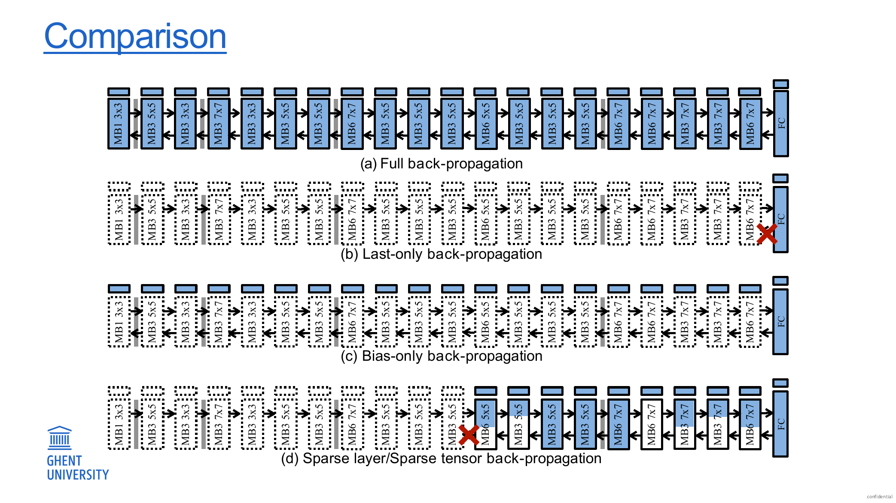

De samenvattende vergelijking van de vier varianten:
- **(a) Full back-propagation** — alle lagen, alle activations (duur).
- **(b) Last-only** — enkel de laatste laag (goedkoop, lage accuracy).
- **(c) Bias-only** — enkel de biases door het hele netwerk.
- **(d) Sparse layer/tensor** — selectief lagen + channels updaten, en de backward pass vroeg stoppen → het beste compromis tussen geheugen en accuracy.

## 7.5 Examen

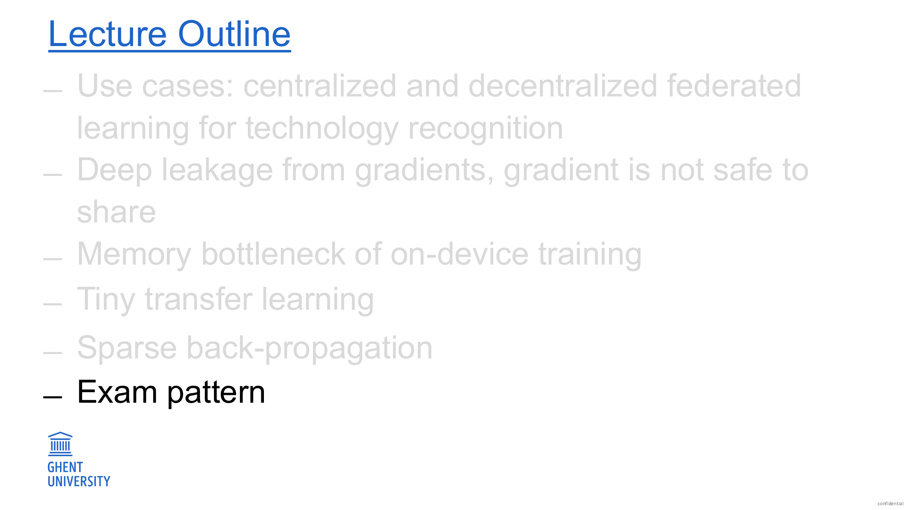

De laatste outline-slide kondigt "Exam pattern" aan; in dit slidedeck volgt daarna enkel nog de contactslide (geen verdere inhoudelijke slides over het examen). Vraag dit bij de lesgever na als je het exacte examenformat wil kennen.

---

# 🔑 Kernpunten om te onthouden

1. **On-device learning** traint het model lokaal op het toestel om twee redenen: **customization** (continu aanpassen aan nieuwe sensordata) en **privacy** (data verlaat het toestel niet).
2. **Federated learning** deelt enkel **gradiënten/gewichten**, niet de data. **FedAvg**: (1) lokaal trainen, (2) N iteraties updaten, (3) modellen naar server, (4) server middelt en stuurt terug. Bespaart enorm op data-transfer (GB's → honderden MB) tegen een kleine accuracy-prijs.
3. **Centralized vs decentralized FL**: centralized middelt op een server (sneller, hoger), decentralized wisselt modellen rechtstreeks tussen toestellen uit (robuuster, geen single point of failure, maar lagere accuracy/convergentie).
4. **Deep Leakage from Gradients**: een gedeelde gradiënt is **niet veilig**. De aanvaller optimaliseert een **dummy input** zodat zijn dummy-gradiënt de echte gradiënt matcht (MSE) → de dummy convergeert naar de echte trainingsdata. Werkt op beeld én tekst.
5. **Verdediging tegen leakage**: ruis toevoegen werkt enkel met grote ruis die de accuracy kapotmaakt; **gradient compression** (≈ pruning, 99 % prune-ratio) blokkeert de aanval **met behoud van accuracy**.
6. **Training kost veel meer geheugen dan inferentie** omdat je **alle intermediate activations** moet bewaren voor de backward pass (`∂L/∂Wᵢ = aᵢᵀ ∂L/∂aᵢ₊₁` bevat `aᵢ`). Activations groeien bovendien lineair met de batch size.
7. **Activation, niet parameters, is de bottleneck** voor CNN-training (~6.9× groter bij ResNet-50). MobileNets reduceren parameters/FLOPs maar niet de activation → lossen het trainingsgeheugen niet op.
8. **Parameter-efficient ≠ memory-efficient**: BN+Last gebruikt 12× minder params maar slechts 1.8× minder geheugen, want de BN-lagen vergen nog steeds de intermediate activations voor de backward pass.
9. **TinyTL**: (a) **fine-tune bias only** — bias-gradiënt `∂L/∂bᵢ = ∂L/∂aᵢ₊₁` heeft géén activatie nodig → memory-efficient (12×) maar verliest accuracy; (b) **lite residual learning** — klein zijpad met kleine activations (~4 %, lage resolutie + geen inverted bottleneck) herstelt de accuracy. Samen: **tot 6.5× geheugenbesparing zonder accuracy-verlies**.
10. **Sparse back-propagation** = drievoudige sparsiteit: **layer-level** (welke lagen), **channel-level / sparse tensor** (welke channels binnen een laag), **depth-level** (hoe ver terugpropageren — stop voor de vroege lagen). Bespaart geheugen én FLOPs (bv. 4× bij 0.25·M channels).

---

# 📝 Oefenvragen

**V1.** Wat zijn de twee hoofdredenen voor on-device learning, en wat is het kernidee van federated learning?

Antwoord

**Customization** (het model blijft zich aanpassen aan nieuwe data van de eigen sensoren) en **privacy** (gevoelige data verlaat het toestel niet). **Federated learning**: toestellen trainen lokaal op hun eigen data en delen enkel **gradiënten/gewichten** met een server (of met elkaar); de ruwe data blijft lokaal.

**V2.** Beschrijf de vier stappen van het FedAvg-algoritme.

Antwoord

(1) Gebruikers genereren data op het toestel en trainen lokaal. (2) Elk toestel update zijn model met de lokale data gedurende N iteraties. (3) De geüpdatete modellen (gewichten) worden naar de server gestuurd. (4) De server **middelt** de modellen en stuurt het gemiddelde terug naar de toestellen. Herhaal. De data verlaat nooit het toestel.

**V3.** Wat is het verschil tussen centralized en decentralized federated learning?

Antwoord

**Centralized FL**: een centrale server verzamelt de lokale gewichten en middelt ze (FedAvg). **Decentralized FL**: geen centrale server — toestellen wisselen modelgewichten rechtstreeks met elkaar uit. Centralized convergeert sneller en hoger; decentralized is robuuster (geen single point of failure) maar haalt doorgaans lagere accuracy.

**V4.** Leg de Deep-Leakage-from-Gradients-aanval uit. Waarom faalt de privacybelofte van federated learning hierdoor?

Antwoord

De aanvaller kent de gedeelde gradiënt $\nabla W$ van een echt datapunt. Hij start met een **willekeurige dummy input + dummy label**, doet forward-backward om een dummy-gradiënt $\nabla W'$ te krijgen, en minimaliseert de afstand $\lVert \nabla W' - \nabla W \rVert^2$ door **gradient descent op de dummy input** (niet op de gewichten). Omdat de gradiënt een bijna-unieke functie van de input is, convergeert de dummy input naar de **echte trainingsdata**. FL deelt dus wel geen data, maar de gedeelde gradiënt volstaat om de data te reconstrueren → niet veilig.

**V5.** Twee verdedigingen tegen deep leakage zijn ruis en gradient compression. Wat is het verschil in effectiviteit?

Antwoord

**Ruis** (Gaussisch/Laplaciaans): kleine ruis blokkeert de aanval niet, grote ruis (10⁻¹) blokkeert wel maar laat de accuracy instorten (≤1 %). **Gradient compression** (≈ pruning, bv. 99 % prune-ratio): blokkeert de aanval effectief **met behoud (zelfs lichte stijging) van accuracy**. Compression is dus de betere verdediging.

**V6.** Waarom kost trainen veel meer geheugen dan inferentie? Gebruik de forward- en backward-formules.

Antwoord

Forward: $a_{i+1} = a_i W_i + b_i$. Backward: $\partial L/\partial W_i = a_i^T\,\partial L/\partial a_{i+1}$. Om de gewichtsgradiënt te berekenen heb je de **activatie $a_i$** uit de forward pass nodig. Inferentie kan elke activatie meteen weggooien; training moet **alle** intermediate activations bewaren tot de backward pass. Bovendien groeien activations lineair met de batch size (1 bij inferentie, 8/16/32 bij training).

**V7.** "Parameter-efficiency vertaalt niet naar memory-efficiency." Leg uit aan de hand van BN+Last.

Antwoord

BN+Last traint 12× minder **parameters** maar bespaart slechts 1.8× **geheugen**. Reden: de BatchNorm-lagen zitten diep in het netwerk, en om ze te updaten moet je nog steeds de **intermediate activations bewaren voor de backward pass**. Het aantal trainbare parameters bepaalt dus niet het geheugengebruik — de activations doen dat.

**V8.** Waarom is fine-tunen van enkel de bias memory-efficient, en waarom is het op zichzelf niet genoeg?

Antwoord

De bias-gradiënt $\partial L/\partial b_i = \partial L/\partial a_{i+1}$ hangt **niet** van de activatie $a_i$ af (i.t.t. de gewichtsgradiënt). Je hoeft dus **geen intermediate activations te bewaren** → memory-efficient (12×). Maar bias-parameters hebben te weinig capaciteit: bias-only verliest ~16.3 % accuracy. Daarom voegt TinyTL **lite residual modules** toe voor extra capaciteit.

**V9.** Wat doet lite residual learning in TinyTL, en hoe houdt het de activations klein?

Antwoord

Het voegt een klein, trainbaar **zijpad** toe naast het bevroren hoofdnetwerk om extra capaciteit te geven. Het houdt de activation-grootte klein door (1) de **resolutie te reduceren** (0.5R) en (2) de **inverted bottleneck te vermijden** (die net grote activations geeft). Resultaat: ~4 % van de oorspronkelijke activation-grootte, terwijl het accuracy-gat grotendeels gedicht wordt (+11.6 %, slechts 5 MB overhead).

**V10.** Wat zijn de drie niveaus van sparsiteit in sparse back-propagation?

Antwoord

**Layer-level** (kies welke lagen je weights update — sommige lagen zijn belangrijker), **channel-level / sparse tensor** (kies welke channels binnen een laag je traint), en **depth-level** (hoe ver je terugpropageert — je hoeft niet tot de eerste lagen, "backpropagation stops here"). Door op een subset van de channels te trainen bespaar je zowel geheugen als FLOPs (bv. 4× bij 0.25·M).

**V11.** TinyTL haalt "tot 6.5× geheugenbesparing zonder accuracy-verlies". Tegenover welke baseline, en waarom is dat opmerkelijk?

Antwoord

Tegenover **full fine-tuning** (de accuraatste maar duurste baseline). Opmerkelijk omdat de andere zuinige methodes (Last, BN+Last) ofwel veel accuracy verliezen ofwel nauwelijks geheugen besparen. TinyTL combineert bias-only (geen activations) met lite residual (kleine activations) en bereikt zo de full-fine-tuning-accuracy aan een fractie van het geheugen.

---

# 📖 Begrippenlijst

| Term | Betekenis |
|---|---|
| **On-device learning** | Het model lokaal op het toestel (verder) trainen i.p.v. in de cloud. |
| **Customization** | Reden voor on-device learning: het model blijft zich aanpassen aan nieuwe sensordata. |
| **Privacy (data does not leave the device)** | Reden voor on-device learning: gevoelige data wordt niet naar de cloud gestuurd. |
| **Federated learning (FL)** | Gedistribueerd leren waarbij enkel gradiënten/gewichten gedeeld worden, niet de data. |
| **FedAvg** | Federated Averaging: lokaal trainen → updates naar server → server middelt → terugsturen. |
| **Centralized FL** | FL met een centrale server die de lokale modellen aggregeert (middelt). |
| **Decentralized FL** | FL zonder centrale server; toestellen wisselen modellen rechtstreeks uit. |
| **Technology recognition** | De use-case: classificeren welke draadloze technologie (WiFi, LoRa…) in het spectrum zit. |
| **Communication round** | Eén volledige FL-cyclus (lokaal trainen + aggregeren). |
| **Deep Leakage from Gradients (DLG)** | Aanval die de trainingsdata reconstrueert door een dummy input te optimaliseren tot zijn gradiënt de gedeelde gradiënt matcht. |
| **Gradient matching** | De kern van DLG: minimaliseer $\lVert \nabla W' - \nabla W\rVert^2$ door gradient descent op de dummy input/label. |
| **Membership inference** | Uit gradiënten afleiden óf een datapunt in de batch zat. |
| **Property inference** | Uit gradiënten afleiden of een datapunt met een bepaalde eigenschap in de batch zat. |
| **Gradient compression** | Verdediging tegen leakage: gradiënt-waarden op nul zetten (≈ pruning) vóór delen; bewaart accuracy. |
| **Differential noise (Gaussian/Laplacian)** | Verdediging: ruis op de gradiënt; werkt enkel met grote ruis die de accuracy schaadt. |
| **Intermediate activations** | De tussenresultaten $a_i$ van de forward pass; nodig voor de backward pass → grote geheugenkost bij training. |
| **Forward / Backward pass** | Forward: $a_{i+1}=a_iW_i+b_i$. Backward: $\partial L/\partial W_i = a_i^T \partial L/\partial a_{i+1}$. |
| **Memory bottleneck** | Bij on-device training is het werkgeheugen (vnl. activations) de beperkende factor, niet de parameters. |
| **Transfer learning** | Kennis uit een source task hergebruiken om een target task met weinig data te leren. |
| **Source / target task** | De taak waarvan je kennis hergebruikt resp. de taak die je wil leren. |
| **Full / Last / BN+Last fine-tuning** | Het hele netwerk / enkel de laatste laag / de BN-lagen + laatste laag trainen. |
| **Parameter-efficient ≠ memory-efficient** | Weinig trainbare params betekent niet weinig geheugen: de activations bepalen het geheugen. |
| **TinyTL (Tiny Transfer Learning)** | Geheugen-efficiënt fine-tunen: bias-only + lite residual learning. |
| **Bias-only fine-tuning** | Enkel de biases trainen; $\partial L/\partial b_i$ heeft geen activatie nodig → memory-efficient. |
| **Lite residual learning** | Klein trainbaar zijpad met kleine activations (lage resolutie, geen inverted bottleneck) voor extra capaciteit. |
| **Inverted bottleneck** | MobileNetV2-blok dat eerst expandt; geeft grote activations en wordt daarom in TinyTL vermeden. |
| **Sparse back-propagation** | Selectief terugpropageren om geheugen/FLOPs te sparen, op drie niveaus. |
| **Sparse layer backpropagation** | Enkel een subset van de lagen updaten (layer-level sparsiteit). |
| **Sparse tensor backpropagation** | Enkel een subset van de channels binnen een laag updaten (channel-level sparsiteit). |
| **Depth-level sparsity** | Niet tot de eerste lagen terugpropageren ("backpropagation stops here"). |
| **LoRA** | Low-Rank Adaptation; volgens de slides een speciaal geval van bias-only back-propagation. |
